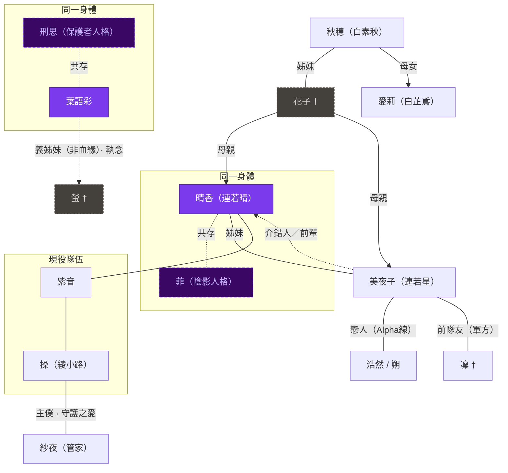

# 奇蹟魔法少女晴香 — Story Brief

> 本文件為全劇透內部 brief，供開發者 / AI 快速建立全局認知。
> 詳細規格請見：[Series Bible](canon/00_series_bible.md) | [Story Outline](canon/05_story_outline_canon.md) | [Character Index](canon/03_character_index.md) | [Gameplay Bible](canon/10_gameplay_bible.md)

---

## 這是什麼故事？

**類型**：黑暗魔法少女 × 心理驚悚 × 存在主義成長劇

**媒介**：電子遊戲。玩家操控晴香，透過以下五條核心軌道體驗故事：

| 軌道 | 內容 | 主題承載 |
|---|---|---|
| **主線戰鬥** | 對抗魔法屍骸與帝國勢力；靈魂抽離儀式 vs 暴力清除的選擇 | 痛苦的轉移 vs 真正的面對 |
| **日常互動** | 據點對話、IG Chronicle、便利店小確幸 | 在高壓中保有人性的微小時刻 |
| **社會風評系統** | 任務來源與道德品質隨幕次質變（救人→鎮壓→公審）| 「正義」的幻象如何被系統利用 |
| **Side Quest** | 副角色完整弧光、世界灰色地帶、道德兩難選擇 | 誰值得被拯救？拯救者有沒有資格決定？ |
| **態度選擇** | 關鍵時刻以什麼方式面對不可改變的結果 | 「態度」的具體重量 |

玩家的選擇不會創造完美快樂結局，但會影響角色如何理解自己、他人如何記憶死者、以及晴香最終能否以清醒姿態承擔代價。遊戲機制完整規格請見 [Gameplay Bible](canon/10_gameplay_bible.md)。

**為什麼叫「奇蹟魔法少女晴香」？**

在這個故事的世界裡，「奇蹟」是一個有特定含義的詞：它指的是用強大的情緒力量強行改寫現實的行為——讓本來發生的事情，變成另一個樣子。晴香五歲時做的那件事，就是一次「奇蹟」。

這個標題有兩層意思，頭尾截然不同：

- **你第一次看到標題時**：「奇蹟魔法少女」聽起來是靠著奇蹟帶來希望的少女英雄。市民也是這樣理解的——晴香每次爆發力量，大家讚嘆「奇蹟出現了」。
- **你看完故事後**：這個標題的真正意思是「那個用奇蹟改變了現實的魔法少女晴香」——不是她帶來了奇蹟，而是她就是改變了整個世界的奇蹟的源頭。她引以為傲的詞，最終成為刺穿她的那把刀。

> 帝國情緒管理局對「奇蹟」有另一個名字：「奇蹟反應」——是需要即時出動武力清除的現實結構危機。市民眼中的奇蹟，官方文件裡是緊急事態。同一件事，兩種截然不同的定性。


**調性**：黑暗治癒（Dark Healing）/ 心理寓言

> 用「魔法少女」的外殼，包裝一個關於「創傷、解離、自我整合」的心理寓言。這不是「打敗壞人拯救世界」的故事，而是「接納自己的黑暗面，學會在痛苦中找到繼續前行的態度」的故事。

**Logline**：
> 魔法少女晴香（故事開始時 16 歲，主線中踏入 17 歲）發現：她小時候為了逃避姊姊的死，不小心創造了整個世界——一個會把少女榨乾、變成怪物的世界。現在她必須選擇：繼續用力量「修正」一切但可能毀掉更多人，還是接受「自己就是災難的源頭」、永遠承受所有人的痛苦。

**這個故事 IS**：
- 解構魔法少女類型的存在主義寓言——以甜美包裝殘酷，再反覆刺穿
- 心理學的具現化：變身＝逃避/心理疾病，鏡子＝被壓抑的陰影
- 最終訊息：「即使命運無法改變，選擇用什麼態度面對，是你唯一的自由」

**這個故事 IS NOT**：
- 傳統熱血魔法少女（變身→打怪→勝利）
- 單純的黑暗獵奇（為虐而虐）
- 虛無主義（一切無意義）
- 靠「打倒大反派」解決根本問題的故事

> 閱讀提示：本文會先用情感與世界直覺建立理解，再逐步解釋 Alpha / Beta 線、魔法少女系統、角色關係與結局。第一次閱讀時，不需要先記住所有術語；每個關鍵概念會在首次出現時即場解釋。

---

## 為何創作這個故事？

這個故事服務於一個核心情感必要性：讓玩家透過見證角色在絕望中選擇態度，獲得「我也可以這樣面對困境」的力量。

**黑暗治癒（Dark Healing）的精確定義**：
- 治癒不是「問題被消除」，也不是「角色被修好」
- 真正的治癒，是角色在被看見、被承認之後，仍然願意靠自己踏出下一步
- 嘗試依賴別人、接受別人的火種，並不等於脆弱

**與同類黑暗作品的差異**：
- **黑暗系**：呈現苦難，止步於苦難
- **本作**：呈現苦難 → 穿越苦難 → 在苦難中提取「態度」的自由

**假甜 vs 真暖**：

這個故事最核心的情感矛盾。

- **假甜**：魔法、情緒商品、偶像光環、都市繁華——令人想依賴，但阻止人真正面對痛苦。它是一種甜美的延緩，一種有代價的逃避。
- **真暖**：非常小、非常日常——一塊膠布、一粒糖、一句真正承認對方痛苦的話。它不立即改變世界，但讓人明白自己不是完全孤立的。

**真暖在故事中的具體時刻**：操臨終前選擇說「我選擇停留在我想停留的位置」而非求救——那不是英雄台詞，是她唯一能誠實的時刻；美夜子用黑貓的形態默默陪伴晴香多年，從不說破身份；愛莉在精神世界對崩潰的晴香展示「相同的創傷可以有不同的選擇」。真暖往往發生在大戰之間，在角色以為沒人在看的瞬間——正因它渺小，所以它真實。

這個故事要讓角色與玩家，慢慢學會不再只靠假糖活下去，而是靠真實的連結與自己的內心繼續前行。

**心理學的具現化——令複雜概念變成可見的力量**：

故事的另一項核心創作意圖，是將心理學理論不當作抽象知識，而是透過遊戲機制、世界規則、視覺語言將其「活生生地演出來」——讓沒有接觸過榮格心理學、解離理論、或創傷心理的玩家，也能直觀地感受這些概念：
- 變身系統本身 = Persona（創傷後的防衛面具）的運作方式
- 鏡子與菲 = 陰影（Shadow）與被壓抑的真實自我
- 魔法屍骸 = 未整合的情感創傷如何扭曲人格
- Alpha 線 × Beta 線 = 創傷事件（改變不了）與態度選擇（仍有自由）的關係

---

## 主題

**主題句**：「面對不可控的命運時，『態度』是唯一的自由。」

**「態度」的精確定義**：在本作中，「態度」不是樂觀口號，而是面對不可改變的痛苦時，一個人選擇逃避、控制、轉嫁，還是承認、承擔、繼續活下去的方式。它不保證好結果，但它是痛苦中僅存的主體性。

**四大子主題**：

| 子主題 | 核心命題 | 代表角色 |
|-------|---------|---------|
| A：力量的代價 | 任何超凡力量都伴隨對人性的侵蝕 | 所有魔法少女 |
| B：完美的幻象 | 追求「無痛苦、無瑕疵」的非人道本質 | 操、刑思 |
| C：身份的本質 | 內在態度比外在形態更能定義存在 | 紫音、美夜子 |
| D：連結的價值 | 共情與守望是抵抗絕望的終極力量 | 晴香、朔 |

**故事真正方向**：不是以「打敗敵人」為終點，而是讓角色學會分辨——什麼是逃避性的甜，什麼是真實的暖；什麼是被推著活，什麼是仍然保有面對痛苦的主體性。

> 注：每個角色可能同時體現多個子主題；上表為最核心的主題聯繫，角色詳細功能分組見下方「角色閱讀導引」。

---

## 世界觀速覽

要理解這個主題如何變成故事，首先要理解本作的世界不是單純的舞台，而是晴香創傷的外化結果。

### 地理設定：維多利亞城
- 類似老香港的中西交匯城市，分為「日區」和「夜區」
- **日區「無鏡之城」**：帝國領土，人造太陽 24 小時照耀，富裕但情緒被壓抑。建築排斥一切反光面——因為鏡子揭示真實，而帝國最怕真實。體現「修正」意識形態：用完美幻象掩蓋痛苦。
- **夜區「鏡像之城」**：原名靈樹谷，被帝國侵佔。天空被廢氣籠罩，潮濕街道永遠積著水窪，老舊玻璃幕牆處處映照真實。居民被剝削但更真實、堅韌。體現「接納」態度：面對真實之城。

*設計說明：香港是本作視覺設計的參考元素之一，而非整體美學風格的標籤。故事融合多種視覺影響，以老舊唐樓後巷作為「集體潛意識」的視覺語言基礎。*

### 政治設定

帝國由刑思（以皇帝身份）暗中統治。夜區本名**靈樹谷 / 夢離谷**，是以靈樹信仰為核心的獨立地區——靈樹是現實世界與集體潛意識之間的能量樞紐，正負情感在此流通保持平衡。

帝國為奪取靈樹的情緒能量，發動**靈樹戰爭**，大肆屠殺夜區原居民，將此地並吞為帝國版圖。靈樹戰爭是所有後續悲劇的制度源頭——捕獲實驗對象、研究情緒機制、建造維多利亞之淚、最終量產魔法少女，皆由此而起。

- **維多利亞之淚**：巨大人造太陽，官方說詞是無限能源，真實功能是情緒抽水泵——將日區負面情緒強行抽走壓入夜區，並即時監控全城情緒數據。Alpha 線因缺乏高魔能量而停滯為廢棄金屬結構；Beta 線晴香創世後靈樹能量爆發，帝國才將其活化為完整情緒監控中樞。
- **魔法少女計劃（潘朵拉協議）**：帝國以「命運偶遇」假象篩選具特定創傷特質的少女，讓她們在不知情的情況下「自願」成為消耗品，在公開直播的戰鬥中為帝國收割情緒能量，用完即棄。

### 情緒管理局

帝國直屬的情緒監控與管理機構，是帝國對市民情緒實施全面控制的執行手臂。

| 職能 | 表面說法 | 實際作用 |
|---|---|---|
| **情緒監控** | 透過維多利亞之淚「維持社會秩序」 | 監控全城情緒波動，鎮壓威脅帝國統治的激烈情感 |
| **屍骸管理** | 「清除危及市民安全的怪物」 | 追蹤、圍捕、處理魔法屍骸，同時防止外界了解屍骸的真正成因 |
| **魔法少女管理** | 「監督英雄確保市民安全」 | 實施「衛生行動」——對失控或知情太多的魔法少女執行物理清除 |
| **輿論控制** | 「推廣魔法少女正面形象」 | 操縱社會風評，按需要製造「維多利亞天使」崇拜或「魔女狩獵」輿論 |

管理局將「奇蹟」記錄為「奇蹟反應（Reality Overwrite Event）」——需即時收容並授權物理清除的現實結構危機。民間讚頌的希望，官方文件裡是緊急事態。故事中，白銀朔是管理局內的雙面特工；凜被刑思重組後，成為管理局公務員。

---

## Alpha 線與 Beta 線：事件真相 vs 態度真相

在讀 Alpha / Beta 之前，先不要把它們理解成「真世界」與「假世界」。

想像一個孩子目睹了一場殺戮，在極度恐懼中閉上眼睛，用盡全部意志許下一個願——然後，現實真的改變了。她睜開眼睛，世界已經是另一個樣子：有魔法、有帝國、有不同的歷史和人物命運，全部從她那個願望長出來。

這就是 Alpha 線與 Beta 線的關係：

- **Alpha 線**：那場殺戮真正發生的現實。它不是「過去的記憶」，而是像一塊被埋在地底的石頭——Beta 線覆蓋在它上面，但它依然存在，會不斷從裂縫中滲出。
- **Beta 線**：晴香用意志力改造出來的「新現實」。它有自己的物理規則、自己的城市、自己的人——但這個現實的源代碼，是由一個五歲孩子的恐懼與逃避寫成的。

**重要**：Beta 線不只是「不同的心態詮釋」，而是一個真實存在的平行世界。Alpha 線與 Beta 線的關係，是「無法抹去的事件真相」與「從那個創傷長出來的整個現實」之間的關係——兩者互相滲漏，不是互斥。

**Beta 線的回填歷史**：Beta 線不是從帝歷 102 年才「開始運行」的世界，而是在晴香改變現實的一刻，被整體生成出來的新現實。它包含一段被回填的歷史：帝歷 79 年刑思的童年創傷、帝歷 98 年帝國政變、情緒毒品與魔法少女制度的建立，都是 Beta 線被創造時一併長出的歷史結構。換言之，帝歷 102 年是「創造點」，不是 Beta 世界歷史的第一天。部分回填歷史是 Alpha 線創傷的扭曲回響，部分則是新世界結構的獨立後果——這不是時間線連續性錯誤，而是 Beta 線作為「整體生成的現實」本身的性質。

**Alpha 線（命運層）**：
- 沒有魔法的低魔世界
- 晴香 5 歲時目睹母親花子與姊姊美夜子在意外中同時遇難
- Alpha 線不是「過去」，而是「被壓抑但依然存在的平行真相」，會不斷滲漏進 Beta 線

**Beta 線（態度層 / 故事舞台）**：
- 晴香情緒崩潰時「無中生有」創造的新世界——由晴香的原罪所長出的文明
- 她改寫了集體潛意識（所有人類靈魂共同流動的情緒層，Beta 世界的底層基礎），創造了魔法少女系統、魔法屍骸、情緒毒品（帝國販賣的人工情緒商品，代價是讓人無法再感受真實情感）
- **大部分人對 Alpha 線沒有記憶**，只知道 Beta 世界
- **只有少數人擁有 Alpha 線的清醒記憶**：菲（晴香的影子人格）、刑思、愛莉。其他魔法少女因接觸集體潛意識，偶爾能感知到「命運印記」——一種「某些事情本應不同」的模糊直覺，但她們無法理解或描述這些感知，不算真正「知道」Alpha 線。

**兩條線的本質關係**：不是「真 vs 假」，而是「事件真相 vs 意義真相」的互補。Alpha 線是發生過的殘酷現實（不可改變），Beta 線是面對那份現實的態度（可以選擇）。

**「改變現實」為何失敗**：
- 晴香的能力確實能改變外在規則，但改變不了「失去」本身
- 故事共發生兩次：5 歲晴香創造 Beta 世界（第一次）、菲奪取晴香身體嘗試修正（第二次）——兩次都以更大的代價失敗
- **核心諷刺**：改變現實只是「用更大的膠布貼住更大的傷口」，傷口依然在底下發炎

---

> 每一個在 Beta 世界中受苦的人，都是晴香那一刻的回聲。認識各角色之後，見下方「晴香的原罪對照表」，列出每個人在兩條線中命運的具體分別。

---

## 核心術語速查（閱讀前先建立概念）

> 以下是理解本文件所需的最低限度術語，每個概念在後文首次出現時會結合具體情節再次說明。詳細技術定義請見文末附錄 A。

| 術語 | 一句話解釋 |
|---|---|
| **心之器** | 一個人靈魂的核心——定義「我是誰」的最深信念與渴望；受損時人開始失去自我定義能力 |
| **集體潛意識** | 所有人類共享的情緒海洋，魔法能量的源頭，晴香創造的 Beta 世界建立在此之上 |
| **情緒守恆** | 痛苦不會消失，只會轉移；魔法每次「解決問題」，都是把痛苦推到別處 |
| **魔法少女** | 被帝國系統利用的消耗品；使用力量的代價是逐漸耗盡自己的情感 |
| **魔法屍骸** | 心之器徹底破碎後的悲劇存在；任何人都可能成為屍骸——情感耗損路徑（人類→魔法少女→屍骸）或情緒病毒直接攻擊普通人；靈魂仍被困在肉體但被單一負面情緒佔據，只剩 1% 控制力 |
| **緋潮** | 集體潛意識爆倉後湧入現實的紅色情緒洪水，是世界對被轉嫁痛苦的強制清算 |
| **奇蹟（改變現實）** | 用情緒能量對集體潛意識底層代碼進行永久性強行覆寫；三項硬限制：不能真正復活死者、因果債必須歸還、不能抹除原始情感記憶 |
| **鏡像法則** | 鏡子是唯一不受 Beta 線覆寫影響的物質——任何反光面（鏡、水、拋光金屬）都能揭示底層真實與內在主導自我；日區「無鏡之城」拒絕真實，夜區「鏡像之城」接納真實 |

---

## 世界如何運作：七個核心法則

*這一節不是完整技術設定，而是理解後文所需的最低限度世界規則。完整版本見文末附錄 A。*

### 1. 心之器：一個人「我是誰」的核心

心之器是一個人靈魂最深處的核心，包含最根本的信念、恐懼與渴望。當心之器受傷，人不只是「心情差」，而是開始失去定義自己的能力。魔法少女、情緒病毒、魔法屍骸，都與心之器受損有直接關係。

### 2. 情緒守恆定律：痛苦不會消失，只會轉移

痛苦不能被消除，只能被轉移到別人身上、別的地方、或別的時間。魔法少女每次使用能力，本質上都是在把**情緒廢料**（被壓抑、轉嫁但未被理解的負面情緒，在集體潛意識中沉積成污染）推向別處。這條法則解釋了為何任何「幫助他人」的能力，最終都有代價。

### 3. 集體潛意識：所有情緒的共同源頭

全人類共享一個情緒海洋，視覺上呈現為老舊唐樓後巷的深夜景象。所有魔法能力、情緒結晶（高度壓縮的情緒物質）、情緒病毒（可傳染的扭曲情緒體），都從這裡流出。Beta 線世界就建立在這個集體情緒層之上。

### 4. 緋潮：世界的自我清算

當集體潛意識中積累的情緒廢料超過臨界點，現實會強制「清算」。緋潮以紅色洪流的方式爆發，像免疫系統清除毒素。它不分善惡：只要廢料存在，清算就會到來。緋潮的紅光中隱約可見無數扭曲的人形輪廓——那是 Alpha 線中「本該存在但被晴香抹除」的靈魂殘影。

### 5. 鏡像法則：鏡子是唯一不受 Beta 覆寫影響的物質

在 Beta 線中，絕大部分現實都可被覆寫或麻醉。唯獨反光面例外：**任何完整反光面（鏡子、靜止水面、拋光金屬）都能繞過 Beta 覆寫，回傳未被修飾的底層真實**。

**鏡子揭示雙重真實：**
- **客觀真相**：虛假意圖創造的魔法在鏡中缺席；屍骸在鏡中映回生前人形；只有真心創造的力量才能在鏡中顯形
- **反向映照**：鏡子映照出個體被壓抑、或在潛意識佔據主導的自我形態——晴香在極度憤怒時可能在鏡中看見刑思的眼睛，是鏡面對「距離成為自己所恨之物有多近」的誠實警告

**鏡子還會揭示另一種東西：一個人內心最黑暗的那部分自己。**

有些角色表面上很平靜，但其實她們選擇了「沉溺在痛苦裡、不讓自己好轉」。鏡子看穿這件事——在現實中，她們只有極細小的動作；但在鏡中，她們那部分「不想好起來的自己」會以極端、激烈的方式把這種心理演出來。現實越克制，鏡中越瘋狂。

> **凜**：現實中只是用指甲輕輕碰一下頸上的縫合線；但鏡中，她的影子瘋狂把那條線挑開直到血流不止，又把冰冷的金屬扣一顆一顆嵌進肉裡。她在痛苦中找存在感，卻也用這份痛苦說服自己「我已經這麼慘了，我沒有辦法」——讓自己永遠不用面對改變。
>
> **操**：現實中只是面無表情跪下、用手死按胸口；但鏡中，她的影子用絲線瘋狂縫合胸口一個巨大的血洞，越縫越爛也不停手。她把所有崩潰都縫進那個完美的外殼裡，不讓任何人看見她其實已經碎了。

**城市設計對應**：
- 日區「無鏡之城」：建築排斥一切反光面，刻意拒絕映照真實，體現「修正」意識形態
- 夜區「鏡像之城」：潮濕街道積水、老舊玻璃幕牆，處處揭示底層真實，體現「接納」態度

*變身契約與鏡子的關係，詳見§魔法少女設定。*

### 6. 奇蹟：力量的終極形態，也是原罪的根源

「奇蹟」是情緒投射光譜的最高等級——以天文數字級情緒力量，對集體潛意識底層代碼進行永久性強行覆寫。五歲晴香創造 Beta 線，正是奇蹟發生的瞬間。故事中共發生兩次奇蹟，兩次都以更大的代價失敗。

**三項不可違反的硬限制：**
- 不能真正復活死者——意識已完全消散的靈魂不可逆，任何「復活」只是複製外殼
- 因果債必須歸還——改變越大，反噬越強；被消除的痛苦將在時間軸其他節點等量回歸
- 不能覆寫原始情感記憶——痛苦不會消失，只會轉移；無法透過覆寫抹除真正經歷過的情感創傷

民間讚頌「奇蹟」為希望象徵；統治局將同一現象記錄為「奇蹟反應（Reality Overwrite Event）」——需即時收容的現實結構危機。同一件事，兩種截然相反的意義——這是整個故事的縮影。

### 7. 三位一體光譜：人類 → 魔法少女 → 魔法屍骸

這三個狀態不是三種不同的存在，而是同一個人在情感耗損之路上的不同階段。魔法少女使用能力越多、壓抑越深，就越接近魔法屍骸。

**面對魔法屍骸時，玩家並非只是在「殺怪」。** 部分屍骸可以透過遺物、記憶線索與戰鬥中的情緒削弱，短暫恢復選擇能力；有些則無法真正拯救，只能由角色作出介錯（在隊友即將完全失去人格時，親手給予其保留人類尊嚴的死亡），讓對方以最後的人類尊嚴離開。每個魔法屍骸靈魂深處仍保有生前未完成的心願——他們不是敵人，是被系統榨乾的人。

---

## 情緒世界的隱藏機制

現實中解釋不了的現象，故事用情緒系統來解釋。

### 既視感：另一個你在呼喚

走進陌生地方卻覺得「好像來過」。其實係你的靈魂短暫接收到另一條時間線的你留下的記憶碎片。那不是記憶錯亂，而是兩個平行現實的你在交疊。

### 記憶模糊 / 冇印象：兩條時間線搶奪

有時突然忘記，又突然想起。因為 Alpha 線版本的你記得一個版本，Beta 線版本的你記得另一個版本。兩個版本同時搶住你的意識，所以你會感到「記得又好似記唔得」。

知道秘密後，才明白呢個唔係健忘症，而係兩個真實的自己在競爭同一份記憶。

### 夢境：進入另一個世界的通道

睡著時靈魂進入「集體潛意識」——由所有人的情緒匯聚而成的後巷世界。你接觸到的夢境事件係真實的，只係由情緒而非文字組成，所以難以記清。

### 永動機幻象：情緒能源詐騙

日區人相信維多利亞之淚無限製造快樂。實際係「情緒抽水機」——抽取人民所有情緒（崇拜、信任、希望、痛苦）作為能源。帝國靠著人民的情緒不斷運作，同時把日區痛苦轉移到夜區。永動機根本不存在，帝國只需要你信它存在。

### 情感共鳴症：集體情緒的侵入

任何強烈情緒發生時，無數人的情感在集體潛意識形成洪流。敏感的人會被衝擊，短暫接收到陌生人的情緒——不只是悲劇，任何激烈的情感都會侵入。這不是同情心太強，而是透過靈魂層面真正接觸到世界的情感。

### 晨間人格解體：身份不實感

每朝起床的 0.5-2 秒，靈魂還未完全「載入」Beta 線。感覺自己不實在、不屬於此刻，懷疑「現在係邊個我」。

晴香和隊友都經歷呢種現象，因為被衝擊波波及，靈魂層面有兩個版本的自己同時存在。有人發展出私密確認儀式——扯線、浸冷水、摸頸——用身體的感覺去重新確認自己。

---

## 名字系統：Beta 線的動漫濾鏡

**核心命題**：晴香 5 歲時以「日系魔法少女動漫」為藍本創造 Beta 線，因此 Beta 線整個文化語言系統都是幼童的動漫投影。

- **日文名字** = Beta 線的「動漫濾鏡」，掩蓋 Alpha 線血肉模糊的真相
- **中文真名** = Alpha 線的原初現實——無魔法、無帝國、只有殘酷與痛楚
- **帝國強推日系文化** = 維持晴香幼年逃避幻象的國家級膠布

**幾個關鍵例子**：

| 常用名（Beta 線） | 真實名字（Alpha 線） | 說明 |
|---|---|---|
| 春日井晴香 | 連若晴 | 「若晴」卻承受最黑暗創傷 |
| 水無月美夜子 | 連若星 | 帝國代號切斷她與過去的連結 |
| 白銀朔（帝國代號）| 莫浩然 | 中文真名代表夜區影子身份 |
| 刑思（自稱）| 葉語彩 | 廣東話「思螢」——保護者人格的自命名，非帝國賜號 |

**Act IV 敘事機制（名字測謊機）**：菲試圖重建「完美 Alpha 線」，卻在幻象中讓角色仍然使用日文名字。晴香識破的方式：「她不叫美夜子。她叫連若星。」——名字成為唯一武器，直視真實的勇氣比任何魔法更根本。

> 完整角色名字對照表請見文末附錄 B，完整系統定義請見 [Naming System](canon/05_naming_and_psychology_system.md)。

---

## 魔法少女設定

### 魔法少女的起源

晴香五歲時改變現實，在集體潛意識上撕裂了一道永久性的裂口，大量原始魔法能量從此不斷流出。帝國發現了這道裂口，意識到其中的能量可以被提取和利用——然後花了幾十年時間，建立起一整套榨取這股能量的機器。

帝國的研究鏈：發動靈樹戰爭奪取能量節點、捕獲刑思作為活體研究對象、委托秋穗開發情緒力量裝置、建造維多利亞之淚作為中央監控系統、刑思篡位後將所有技術軍事化、最終以「潘朵拉協議」大規模量產魔法少女。

也就是說：晴香製造了裂口，帝國建造了榨取裂口的機器。魔法少女是帝國的制度性產物，而她們能夠存在的前提條件，是晴香的原罪。

### 誰可以成為魔法少女？

**不是任何人都可以成為魔法少女——只有晴香許願「許到」的那些人。**

晴香五歲那年改變現實，她的願望具體改寫了身邊一些人的命運：救回了姊姊、重塑了某些人的人生軌跡、讓某些人進入了這個新的世界。正是這些被晴香的願望直接觸及、命運因此被改寫的人，靈魂裡留下了一條與集體潛意識裂縫之間的連結。帝國的改造技術只能在有這條連結的人身上生效。

沒有這條連結的人，即使帝國用同樣的方式強制改造，也只會死亡。帝國始終不知道資格的根本來源是晴香，更不知道那條連結無法後天人工偽造。

> **這個事實的諷刺之處**：每一個魔法少女，都是因為被晴香的五歲願望親自改寫過命運才具備資格。她們成為魔法少女的能力本身，就是晴香原罪留在她們靈魂裡的烙印。

### 如何成為魔法少女？

絕大多數少女都不知道自己被選中的過程。

帝國大數據監控鎖定具有特定心理創傷的少女，暗中將變身裝置「遺棄」在她們某天必定路過的地方。少女撿到裝置，以為是命運——實際上是帝國的主動篩選。裝置內置後門，即時向帝國傳輸她的情緒數據。

撿到裝置後，真正的入門儀式幾乎總在少女最崩潰的一刻發生：她照進鏡子，看見鏡中的自己變得冷靜而強大，向她說「把痛苦交給我，我來替你承受」。少女觸碰鏡面，協議成立——她把自己最痛苦、最脆弱的那一部分切割出去，換取力量。鏡中那個「更強的自己」，是從她身上分裂出來的創傷性面具，不是真正的她。

少數人沒有選擇的機會。美夜子和凜是被軍方強制改造為兵器，從來沒有觸碰過那面鏡子。

### 魔法少女是什麼？（本質定義）

**表面**：獲得超自然力量、保護城市的少女英雄。

**真實**：與自己鏡中倒影簽訂浮士德式協議的悲劇少女。並非天選幸運兒，而是精神創傷的活體隱喻。成為魔法少女的契約儀式本質是**人格解離**——那個冷酷高效的「魔法少女」是從主人格分裂出去的創傷性面具。每次變身都在消耗自己的情感，像吸毒，越用越依賴，越用越空虛。

### 情緒力量裝置：使用 = 逃避

絕大多數魔法少女依賴**情緒力量裝置**（心匣）來變身。這個裝置的本質是「靈魂的旁路手術工具」——它*繞過*內心提煉創傷的過程，讓少女把痛苦切割出去直接換取力量。她並沒有真正面對或整合自己的創傷，只是把它切除了。這就是為什麼使用裝置本質上是一種逃避。

菲對此一針見血：**「妳又要穿上這層假皮去逃避了嗎？」**

**自然覺醒 vs 裝置強制：**

| | 自然覺醒（不使用裝置）| 裝置強制 |
|---|---|---|
| **代表角色** | 晴香、美夜子 | 凜、紫音 |
| **方式** | 透過「鏡中的承諾」儀式，真正面對並整合創傷，力量從真實自我中生長 | 裝置從心之器裂痕強行收割情緒結晶鑄成速成工具 |
| **心匣外觀** | 金繼效果——裂縫以金色修復，裂縫本身成為光源，比原來更完整 | 焊接痕——灰色填縫，每次使用後裂縫繼續擴大 |

**使用裝置的具體壞處：**

1. **燃燒未來靈魂**：裝置讓少女預支未來靈魂換取現在力量——代價急速累積至不可逆
2. **燃盡（殘響）——比屍骸更慘的終局**：當裝置中所有預支的情緒結晶耗盡，心之器不是破碎而是被徹底「燃盡」——靈魂完全消散，肉體成為永遠機械重複生前最後動作的空殼。屍骸至少還有靈魂被困其中
3. **帝國監控後門**：裝置內置後門，即時向帝國傳輸使用者的情緒數據；少女毫不知情
4. **間接喂養刑思**：使用裝置 = 排放逃避能量，而刑思就是靠收集這股逃避能量獲得力量——每次使用裝置都在間接為刑思充電
5. **越來越沉重**：隨情感耗損加劇，變身越來越令人感到「勒緊」與「沉重」——光環從神聖金光逐漸變成刑具感

> Act IV 晴香主動打碎變身裝置：放棄「逃避痛苦的能力」換取「以肉身承接世界痛苦的資格」，同時切斷了刑思以逃避能量為基礎的力量來源。

### 燈塔效應：為何被迫不斷戰鬥

持有心匣的少女在集體潛意識中如黑暗中的燈塔——魔法屍骸會本能地被吸引、主動獵殺她們。為了生存她們被迫不斷戰鬥，陷入無法回頭的死循環。她們並非為了保護城市而戰，而是為了生存本能。「魔法少女保護城市」的公眾形象，是帝國精心維持的謊言。

### 五大類型顛覆

| 類型期望 | 本作設計 | 主題意義 |
|--------|---------|---------|
| 變身 = 力量授予 | 變身 = 浮士德契約（靈魂的又一次代價支付） | 力量的代價——沒有免費的強大 |
| 最近的人 = 最強支持 | 最近者 = 最深的敵人（刑思/彩、菲/晴香） | 愛本身不能免除傷害 |
| 最終戰鬥 = 英雄勝利 | 最終戰鬥 = 必然失去某些東西 | 態度的自由 ≠ 結局的完美 |
| 犧牲 = 有意義的轉折 | 犧牲不保證意義（意義由存活者如何記憶來定義） | 敘事不替角色的痛苦蓋章「有用」 |
| 愛 = 治癒與拯救的動力 | 愛導致瘋狂（紫音愛小光→屍骸首領；刑思愛螢→情緒結算儀式） | 未授權的救贖——愛不賦予改變他人的權利 |

### 變身的代價

| 階段 | 狀態 | 代價 |
|-----|------|-----|
| **初期** | 力量來自正面情緒（希望、愛） | 代價細到可以自欺：失眠、鏡中的菲變清晰、喉嚨偶爾有血腥味 |
| **中期** | 開始依賴負面情緒 | 味覺喪失、入口只嚐到血腥味；牙齦出血；枷鎖紋浮現（關節/鎖骨/手腕的發亮烙印暗紋，每次高強度使用後加深）；情緒視覺詛咒出現——開始無屏障地感知他人真實情緒 |
| **晚期** | 靈魂多處破裂 | 頸部出現「光環」——死亡倒數（**限帝國裝置使用者**）；牙齒鬆動甚至脫落；長期高輸出導致慢性頸椎傷 |
| **終點** | 三種結局 | 變成怪物 / 被光環處決（**帝國裝置使用者**）/ 超越（只有晴香達成） |

**全階段共通症狀**：血糖驟降（甜甜圈/煉乳是日常必需品）、戰後低溫症（即使夏天穿羽絨/抱暖水袋，嘴唇長期發紫）、手抖、視覺模糊、耳鳴、嘔吐、失聲。

**身體延遲（最關鍵的設計原則）**：代價不在當下爆出，而是被迫延後。戰鬥中沒事——落台之後才嘔吐；先處理現場、照顧隊友——之後才掉牙、失聲。她們連崩潰都沒有權利即刻崩。「先做功能，再做自己」是所有魔法少女的宿命節奏。

**靈魂延遲（Soul Lag）**：高強度變身後靈魂不即時歸位——先是麻痺期（肉體感覺麻木，不屬於自己），然後針刺期（靈魂歸位時所有被屏蔽的感官如電流一次湧回，痛覺加倍奉還）。葉語彩每次自殘性變身都會產生劇烈靈魂延遲。

### 光環——死亡的倒數計時

> ⚠️ 光環**只出現於使用帝國情緒力量裝置變身的魔法少女**。自主覺醒或以其他方式取得力量者不受光環機制約束。

- 使用帝國裝置的魔法少女，情緒耗損到臨界時，頸部出現發光的「光環」
- 這是帝國設計內置於裝置的「安全閥」——光環完全形成時強制扭斷佩戴者的脖子，立即處決；少女無法拆除、無法停用
- **諷刺**：天使的象徵，變成帝國的遠端處決工具

### 魔法的隱喻本質

所有魔法現象都是心理狀態的物理具現化——這不是比喻，而是真實發生的物理現象。整個魔法系統建立在榮格心理學上：變身＝Persona（創傷性面具），失去感官＝情感麻木的具現，變成怪物＝Shadow 完全主導，晴香的旅程＝個體化過程（Individuation）。

---

## 魔法少女類型描寫：敘事手法

> 本節記錄故事用什麼方式呈現各類魔法少女類型元素——不只是「顛覆什麼」，而是「怎樣具體描寫」。

### 1. 日常描寫（IG 敘事線 / 非戰鬥場景）

**IG Chronicle 四階段演變**（詳見遊戲章節）：

| 階段 | 帳號狀態 | 閱讀方式 |
|---|---|---|
| 強行營業期 | 晴香高頻更新，其他人幾乎靜默 | 語言過度正面是警報，不是真實 |
| 閃耀日常期 | 集體活躍，刻意迴避魔法話題 | 細節洩露身體狀況（「今天有點疲倦🌸」的底下是戰後低溫症） |
| 數位墓碑期 | 帳號逐一停更，每個最後貼文都有意味 | 停更的時間點本身是敘事信息 |
| 結局迴響期 | 倖存者重新開始；死者帳號成數位墓碑 | 舊貼文被截圖傳播，死去的選擇繼續存在 |

**非戰鬥日常場景**（K 房、便利店、隊伍據點）：
- 甜甜圈和煉乳是醫療必需品（血糖驟降），但畫面上跟少女享受甜食看起來一樣——「假甜」的視覺偽裝
- 猜拳搶最後一個布丁、深夜便利店的熱湯——微小的執著讓後來的失去更重
- 日常場景和戰鬥場景的切換刻意縮短緩衝——沒有喘息，沒有「英雄的休息時刻」

### 2. 變身描寫

變身不是「蛻變時刻」，是「支付時刻」。

**視覺語言**：
- 序列結尾：最後一格臉上出現短暫空洞的「沒有表情」——靈魂延遲的瞬間，不是勝利感
- 重複變身後：光芒效果逐漸暗淡，顏色出現細微偏色（desaturation），服裝顯現速度變慢
- 變身前後對比：變身前有細微真實感（凌亂髮絲、黑眼圈）；變身後外表完美，但眼神某個角度「不完全在場」

**敘事語言**：
- 從不強調「我變得更強了」，而是「我又花掉了一些」
- 隊友問候語的演變：「你還好嗎」→「你血糖夠嗎」→（沉默）——人際語言的逐漸醫療化，是關係被消耗的指標

### 3. 戀愛描寫

三條戀愛路線互為對比，呈現愛的不同面貌：

**Alpha 線遺留之愛（美夜子 ↔ 浩然）**：
- 幾乎沒有正常戀愛場景。描寫全是「想起」「辨認」「確認」
- 最親密的時刻：浩然確認 Unit 01 眼神的瞬間——「那是她的眼睛」
- 愛被剝奪了「當下性」，只剩下「連續性」；守護不依賴形態的穩定，而依賴對主體性的承認

**代償性投射（紫音 → 小光）**：
- 表面是照顧孩子的溫柔，底層是用小光填補弟弟空洞的自欺
- 描寫刻意保留甜度——真實的溫柔和危險的依賴結構同時可見
- 小光死亡：手中握著要給紫音的波板糖，未給出的糖 = 斷裂的連結

**執念式的佔有（葉語彩 → 螢）**：
- 幾乎沒有「愛情場景」。有的是刑思所有行動的底層邏輯——整個帝國是「為了換回螢」的副產品
- 螢以記憶碎片形式出現，不是完整回憶，是刑思功能性壓抑後的滲漏

### 4. 偶像描寫

晴香的偶像形象是「假甜」的最大載體：

- **演唱會**：光幕濾鏡把她的身體狀況美化後才呈現給觀眾；歌詞全部是「希望」「守護」「一起走下去」——和她真實的崩潰狀態構成直接對比
- **直播事件**：光幕濾鏡被菲摧毀的瞬間，觀眾直接看到化形的黑爪和屍骸光芒的眼神——「假甜」系統的公開崩潰
- **後期**：帝國把直播片段製成情緒商品，讓晴香的崩潰變成可消費的奇觀——剝削的第二層

### 5. 戰鬥描寫

戰鬥不是「誰更強」的問題，是「情緒廢料流向」的問題：

- 打敗屍骸 = 把屍骸內的情緒廢料推回集體潛意識，問題被延後而非解決
- **戰鬥後場景永遠比戰鬥中場景有更多描寫**：血糖崩潰、嘔吐、失聲、手抖——身體延遲設計讓代價在戰鬥結束後才爆出
- 勝利後的隊伍狀態：沒有慶祝，只有清點損耗。醫療包代替獎盃。

---

## 角色閱讀導引

> 第一次閱讀時，可以先用「功能」理解角色，而非逐一記憶所有人的背景。

**主線真相軸**（直接牽動 Alpha/Beta、創世原罪與最終抉擇）：
晴香、菲、美夜子、刑思 / 葉語彩

**魔法少女系統代價的三種案例**（分別呈現罪惡感、身份剝奪與情感麻木）：
紫音、操、凜

**世界規則與情感承接軸**（負責展示愛如何扭曲、記憶如何保留、連結如何延續）：
秋穗、愛莉、朔、小光、紗夜

---

## 主要角色

### 主角

#### 春日井晴香 / 連若晴（故事開始時 16 歲，主線中踏入 17 歲）

- **表面身份**：人氣偶像魔法少女。
- **真相**：Beta 線世界的創造者，也是所有角色悲劇命運最終必須回到的中心。
- **核心傷口**：五歲時在 Alpha 線目睹母親與姊姊被殺；無法承受創傷，無意識改寫了整個現實。她以為自己是拯救者，實則是災難源頭。
- **核心缺陷**：以拯救他人逃避自身罪責。她的溫柔並非純粹的善良，而是帶有贖罪意味的傲慢控制慾——習慣隨身帶糖果、死記所有人的生日、瘋狂地替人「補位」。她天生是極不穩定的「情緒增幅器」：情緒在極限崩潰時，心之器釋放的能量被體質無限放大，達到足以改寫集體潛意識的規模。
- **特殊能力**：「絕對共感視界」——看穿他人情緒強度與心理弱點。她誤以為這是同理心，實際上是創世者的管理員權限。這份能力讓她能看穿所有人，卻永遠無法與人建立真正平等的連結，令她陷入極度的孤獨。
- **主題關聯**：子主題 A（力量的代價）+ 子主題 D（連結的價值）。她的旅程是整個故事的主題具現：從「用力量修正一切」到「以承擔代替逃避」。
- **敘事功能**：由「救世主幻象」走向「承擔原罪」。
- **最終角色**：與影子人格菲完成整合，被世界守恆機制「強制索回」，化身為**靜止搖籃**（不是建築，而是晴香最終成為的存在狀態：一個承接世界情緒廢料、使 Beta 世界不再崩潰的靈魂容器）。這不是英雄式犧牲，而是選擇以尊嚴承受無法逃脫的命運——終結魔法少女系統，讓倖存者回歸正常人生。

---

### 核心軸心角色（直接影響主線走向）

#### 菲

- **表面身份**：鏡中的陰影；偶爾奪取晴香身體的「另一個聲音」。
- **真相**：晴香被切割出去的潛意識陰影人格。五歲晴香創造 Beta 線時，Alpha 線的血淋淋記憶從意識中被強行暴力剝離，凝聚成「菲」。她停留在五歲的模樣，獨自承載殘酷真相。
- **核心傷口**：存在本身是一種否認——她是晴香拒絕接受的那部分自我，不屬於任何現實層面，不配擁有帝國名。
- **主題關聯**：子主題 C（身份的本質）。她代表晴香迴避接受的真實自我——整合菲，就是接受「我也是問題的一部分」。
- **敘事功能**：不斷干預、短暫奪取身體、策劃社會性死亡事件，強迫晴香直面自己是災難源頭的真相。
- **最終角色**：與晴香完成人格整合。

#### 葉語彩 / 刑思（雙重人格）

- **表面身份**：刑思以皇帝身份統治帝國；葉語彩以轉校生身份接近晴香。
- **真相**：共用同一身體的雙重人格。主人格「葉語彩」在六歲時目睹無血緣姊姊「螢」被殺，因無法承受創傷而分裂出保護者人格「刑思」。其後被帝國皇帝發現魔法天賦，直接把她當實驗品養在宮廷裡進行殘酷對待。長大後的刑思篡奪了帝國皇位成為獨裁者。
- **核心傷口**：刑思建立帝國、發動「情緒結算儀式」的所有瘋狂行為，底層動機只有一個：積累情感貨幣向集體潛意識換回螢的靈魂。
- **刑思的矛盾邏輯**：「情緒結算儀式」強制所有人感受彼此的痛苦，令社會陷入集體麻木——她向世界宣稱的是「消滅痛苦」，骨子裡運作的是大規模收集高濃度情感能量的系統。消滅的是別人感受情感的自由，留下的是情感本身供她提取。
- **主題關聯**：子主題 B（完美的幻象）。刑思是「控制一切以消除痛苦」的意識形態的最極端具現，也是晴香「接納」路線的鏡像反論。
- **敘事功能**：晴香的鏡像對立——兩人都因童年創傷而「改變現實」，晴香選接納，刑思選控制。刑思是「晴香可能成為的另一個自己」。
- **最終角色**：在故事結局，彩奪回身體主導權，主動承擔失去螢的痛苦，對刑思說出「愛不是佔有，是讓她自由」。彩不再需要刑思代為承受痛苦時，刑思作為保護人格的功能自然終止，回歸為彩靈魂中那份原初的、笨拙的保護之愛。

#### 水無月美夜子 / 連若星

> **身份說明**：美夜子的靈魂源自 Alpha 線中 26 歲死去的姊姊連若星——晴香五歲時目睹她與媽媽在 Alpha 線中同時死去，這份雙重失去觸發了晴香無意識創世。之後秋穗秘密以集體潛意識技術，提取殘留其中的美夜子靈魂，注入人造軀殼使其復活。但在 Beta 線中，她以 15 歲少女兵器的形態重新存在，外表停留在約 16 歲，並因「避難所詛咒」退化為黑貓。她同時是帝國軍方改造的魔法少女兵器 Unit 01、以及以黑貓形態陪伴晴香的「前輩」。

- **表面身份**：一隻黑貓前輩。
- **真相**：晴香的親姊姊，在 Alpha 線中死去（晴香五歲時目睹此事，觸發創世）。秋穗秘密利用殘留於集體潛意識中的美夜子靈魂將她復活，成為 Beta 線最早的魔法少女系統受害者之一。她的存在本身，就是 Alpha 線與 Beta 線互相撕裂的證據。
- **核心傷口**：因晴香創世時許下「變成貓就不會受傷」的願望，她在 Beta 線背負了無法光榮戰死的「避難所詛咒」。她曾被軍方冰封多年（Beta 線誕生後不久即遭冰封），帝歷 108 年解凍後被改造成 Unit 01。在目睹戰友「凜」被光環處決後，她對系統徹底絕望，退化為黑貓。
- **主題關聯**：子主題 C（身份的本質）+ 子主題 D（連結的價值）。她以黑貓身份無法以真實姿態被愛，卻仍在連結中保有連續性——「形態改變，連結不斷」是她整條弧線的主題。
- **敘事功能**：晴香的姊妹情感炸彈（「互不以真實姿態相見」在揭露時牽動整個故事收束）；以「介錯人」身份體現「有些傷口永遠無法癒合」的主題。
- **最終角色**：失去魔法，回歸為普通人；唯一仍能「見到」晴香的人——愛的連結沒有完全斷裂。

---

### 主線悲劇角色（各自承載核心悲劇線）

#### 不知火紫音 / 方曉彤

- **表面身份**：夜區的戰鬥型魔法少女。
- **真相**：被罪惡感和戰鬥成癮吞噬的少女。出身夜區貧民窟，十四歲起為養活弟弟淪為黑幫打手；私藏情緒結晶導致弟弟誤食慘死，此後以戰鬥麻醉罪惡感。她將補償心理投射在夜區小學生「小光」身上。
- **核心傷口**：弟弟的死；以及小光被屍骸殺死並轉化為怪物後，精神徹底崩潰，墮落成「屍骸首領」，建立屍骸樂園將怪物當作孩子般餵養。
- **主題關聯**：子主題 A（力量的代價）+ 子主題 C（身份的本質）。她的墮落是「以戰鬥麻醉罪惡感」的代價鏈——情感越迴避，代價越重。
- **敘事功能**：晴香「如果選擇放棄自我」的警示鏡像。她的墮落不是因為她不夠好，而是沒有得到足夠的支撐。
- **最終角色**：在帝國廣場主動過載自爆，化成最後的防線。她的死是「治癒失敗但態度自主」的完整示範。

#### 綾小路操

- **表面身份**：綾小路家族的完美繼承人。
- **真相**：生理為女性，卻被父親強行進行性別重置手術並以男性身份養育。她透過魔法短暫奪回「絕對女性」的肉體，因此對變身嚴重上癮。管家「紗夜」從黑市為她買來變身裝置。
- **核心傷口**：被剝奪的性別身份；以及在「完美人偶」的偽裝下，對被拋棄的極度恐懼。
- **主題關聯**：子主題 B（完美的幻象）+ 子主題 C（身份的本質）。她用一生偽裝「完美繼承人」的外殼，以此保護被剝奪的真實自我；臨終的最後句子，是她第一次真正選擇自己的位置。
- **敘事功能**：「追求完美幻象」的主題承載者。
- **最終角色**：帝國軍隊攻入大宅，紗夜為保護她而犧牲並揭露其女性真相。操打碎完美偽裝，以殘缺的半屍骸狀態，用自己的絲線將身體縫入廢墟，以「人偶牆」封印通道。臨終前說：「我選擇停留在我想停留的位置。」這不是被迫，而是她自己選擇的位置。

#### 綾瀨凜 / 凌心怡

- **表面身份**：美夜子最深羈絆的戰友。
- **真相**：原本走在偶像歌手道路上的少女，被帝國強制徵召，夢想被掐斷，偶像位置被晴香取代。
- **核心傷口**：被奪走的夢想；以及犧牲後被刑思以靈魂碎片重組為公務員，記憶抹除，只能透過「痛覺」確認自己的存在。
- **主題關聯**：子主題 A（力量的代價）。她的命運是「被系統抹除主體性後，以拒絕被治癒的方式奪回主體性」——殘酷的態度自由，在極端形式下的具現。
- **敘事功能**：魔法少女系統剝削的直接受害者；美夜子終身 PTSD 的源頭（凜為掩護美夜子撤退而過度透支力量，觸發光環處決）。
- **最終角色**：記憶逐漸恢復時，拒絕被治癒，自願接受徹底切除情感的手術成為殺戮機器（Unit 00），最終由美夜子親手介錯。她的選擇是「有些傷口永遠無法癒合，但可以選擇如何結束」。

#### 莫浩然（帝國代號：白銀朔）

- **表面身份**：情緒管理局的雙面特工、屍骸獵人。
- **真相**：夜區最年輕的靈樹守護者，與美夜子青梅竹馬一起長大的戀人。美夜子死亡時，他親手參加了愛人的葬禮——但死因可疑，他無法釋懷。為了調查真相，他成為夜區屍骸獵人，其後加入帝國情緒管理局成為雙面特工，表面執行清剿任務，實際暗中收集情報、尋找美夜子的下落。帝歷 103–108 年間，他在戰場上遇到 Unit 01——那張臉是美夜子的臉。
- **弧光**：復仇者（調查真相）→ 解放者（確認魔法屍骸仍保有作為人的主體性）→ 守護者（接受她已改變但仍連續）。遇到 Unit 01 的那一刻，是他對魔法屍骸根本態度的轉捩點——從「需要清除的威脅」到「靈魂仍在、主體性仍有殘留的悲劇存在」。
- **主題關聯**：子主題 D（連結的價值）的最純粹承載者。他用多年時間確認「那就是她，但已改變」——愛與連結不依賴形態的穩定性，而依賴對主體性的承認。
- **敘事功能**：「連結不被死亡終結」的最有力示範；子主題 D（連結的價值）的承載者。
- **最終角色**：美夜子回歸正常人後，這段跨越形態與時間的守護終於有機會以真實姿態延續。

---

### 支線與世界觀關鍵角色

#### 小光

夜區貧困小學生。紫音在殘酷世界中唯一感受到純真善意的錨點，填補了她害死弟弟的巨大空洞。在屍骸襲擊中慘死並轉化為廢鐵型魔法屍骸，手中仍握著要分給紫音的波板糖。他的死徹底擊碎紫音的理智防線。

#### 東雲秋穗 / 白素秋

- **表面身份**：頂尖生命機械學家，晴香的阿姨；研究情緒病毒、魔法少女結構與變身機制，製造晴香團隊所需的一切設備。
- **真相**：她恨晴香，不是因為晴香做了什麼，而是因為晴香的母親花子為了生下她而難產死亡，秋穗因此失去了永遠無法超越的身影。她因科學實驗意外令親生女兒愛莉成為第一具魔法屍骸石像，陷入瘋狂的結果論，為復活女兒與刑思簽約開發情緒毒品。
- **敘事功能**：「愛如何變成傷害」的鏡像——她為救愛莉製造毒品，晴香為救姊姊創造了悲劇世界，兩人面對同一個道德難題。

#### 東雲愛莉 / 白芷鳶

- **表面身份**：秋穗的女兒，意外接觸實驗裝置後成為第一具人造魔法屍骸——現實中是一座真實的石像（半透明橙色水晶質感，雙手交疊，靈魂被困其中，肉身無法動彈）。
- **母女關係**：成為石像之前，因秋穗長年沉溺研究而疏離，母女關係緊張。成為石像後，秋穗不斷以溫度計、振動儀器測試石像，想確認愛莉是否聽得見；又與刑思交易換取復原技術，卻始終無法將她喚醒。愛莉在精神深處聽得到母親每一句懺悔，卻因身為石像無法開口。
- **精神世界**：以「紙皮騎士」的姿態在集體潛意識中默默斬斷情緒毒品的侵蝕，作為「活體黑盒」保留所有 Alpha 線的真相記憶。
- **敘事功能**：她的魔法少女（聖女騎士）形態由晴香發動奇蹟（第二次改變現實的願望）所觸發，從石像具現為魔法少女；當晴香最終接受「改變現實是錯的」，願望消失，她的形態隨之化為光點消散。

#### 綾小路紗夜

操的真正守護者。知曉操的真實性別，用一生陪伴代償無法說出口的真相，並用畢生積蓄為操買來魔法裝置。最終以肉身擋槍掩護操逃走，臨死前說：「妳根本不是少爺……妳是我最美的女兒。」

---

## 晴香的原罪：一個孩子創造了整個地獄

晴香不是一個「選擇了做壞事」的人。她只是一個五歲的小孩，在極度恐懼中說了一句話、哭了一場——然後整個世界改變了。但這份無意識的改寫，讓世界裡每一個人的命運都為此付出了代價。你剛認識了他們每一個人——現在請看看，晴香的那一刻，如何改變了他們所有人的一生。

**晴香改變了什麼：**

| 角色 | Alpha 線（原初現實） | Beta 線（晴香創造的世界） |
|------|----------------|---------------------|
| **[晴香](#春日井晴香--連若晴故事開始時-16-歲主線中踏入-17-歲)** | 5歲親眼目睹母親和姊姊被殺，留下無法消除的創傷 | 在「正常」世界長大，以為母親難產死，不知道自己是災難的根源 |
| **[美夜子](#水無月美夜子--連若星)** | 26歲被殺，至少死得完整 | 15歲被冰封，被復活為失憶兵器，被詛咒為黑貓，失去以人的姿態光榮死去的權利 |
| **[菲](#菲)** | 不存在 | 存在——是晴香被剝離的Alpha記憶碎片，被困在潛意識中無法自由 |
| **[操](#綾小路操)** | 綾小路家族破產，操隨父親行乞 | 財富與名門回歸；但代價是父親強制將操在小時候被性別重置改造成男性繼承人 |
| **[凜](#綾瀨凜--凌心怡)** | 可以追求歌手夢想，不被魔法少女系統捲入 | Beta世界的帝國強制徵召她，奪走她的夢想，讓她成為消耗品 |
| **[紫音](#不知火紫音--方曉彤)** | 弟弟不會因情緒結晶死亡（低魔世界無此物） | Beta世界的情緒結晶導致弟弟死亡——紫音悲劇的根源，是晴香創造的世界 |
| **[浩然](#莫浩然帝國代號白銀朔)** | 與美夜子是青梅竹馬，有機會好好陪她 | 美夜子死因可疑，朔參加葬禮但無法釋懷，成為屍骸獵人調查真相，後在戰場上遇到長著愛人臉的兵器 |
| **[秋穗](#東雲秋穗--白素秋)** | 妹妹花子在意外中遇難——真相清晰 | 花子死因被改寫，秋穗失去了與妹妹真正道別的機會；背負扭曲的愛去填補這份空白 |

晴香最終必須面對的，不只是她自己的童年創傷，而是：她無意識的一個決定，讓多少人的一生從此不同了。這是比任何敵人都更難面對的真相。你無法懲罰一個五歲的孩子。但你也無法抹掉那些代價。

---

## 核心人物關係

> 先看整體地圖，再讀個別關係細節。



### 情感核心關係

**晴香 ↔ 美夜子**（不知情的骨肉——全作最核心情感炸彈）
晴香以為姊姊早已死去，美夜子以「前輩和夥伴」身份陪伴成長，暗中守護。這份「互不以真實姿態相見」的關係，在揭露時牽動整個故事收束。

**美夜子 ↔ 浩然**（Alpha 線遺留的愛，子主題 D 最純粹呈現）
朔因美夜子死因可疑而無法釋懷，成為屍骸獵人調查真相，其後在戰場上遇到長著愛人臉的兵器 Unit 01——他花了多年確認「那就是她，但已改變」。這段跨越形態與時間的守護，是全作「連結不被死亡終結」的最有力示範。

### 鏡像對立關係

**晴香 ↔ 刑思**（主題辯證的最終戰場）
兩人都因童年創傷而「改變現實」——晴香選接納，刑思選控制。刑思是「晴香可能成為的另一個自己」。

**晴香 ↔ 葉語彩**（意外的救贖，非對等的犧牲）
彩以轉校生身份偽裝接近晴香，刑思借機收割情緒能量。最終彩選擇犧牲填補世界裂痕——這份犧牲不是因為晴香「值得」，而是彩選擇了她認為正確的事。

**晴香 ↔ 菲**（本體與陰影——全作最核心的內在戰）
同一個身體，相互對立又相互依存。菲是晴香切割出去的創傷面，代表晴香拒絕接受的真實自我。整合菲 = 接納自己是問題的一部分。

### 負擔與連鎖關係

**晴香 ↔ 秋穗**（愛如何變成傷害的鏡像）
兩人都因愛而造成傷害——秋穗為救愛莉製造毒品，晴香為救姊姊創造了悲劇世界。「愛能否賦予改變他人命運的權利」是兩人共同面對的道德難題。

**紫音 ↔ 晴香**（警示鏡像）
紫音是晴香「如果選擇放棄自我」的結果。紫音的墮落不是因為她不夠好，而是沒有得到足夠的支撐。

**美夜子 ↔ 凜**（戰友的枷鎖與痛覺的信徒）
凜為掩護美夜子而死，令美夜子產生極深的倖存者內疚。凜最終拒絕被治癒、自願切除情感，而美夜子只能親手介錯，學會接受「有些傷口永遠無法癒合」。

**刑思 ↔ 螢**（極端執念的起源）
螢是彩在夜區唯一感受到愛與保護的無血緣姊姊。螢的犧牲直接催生了刑思這個保護者人格，也是整個帝國災難的起點。

**紫音 ↔ 小光**（出於愛的墮落）
小光是夜區唯一對紫音展現純真善意的孩子，填補了紫音害死弟弟的空洞。小光被殺並屍骸化，直接導致紫音世界觀崩塌。

**操 ↔ 紗夜**（虛假世界中的真實之愛）
在操被父親強行改造性別、剝奪身份的絕望中，紗夜是唯一給予無條件愛的人。紗夜為保護操而擋子彈犧牲，臨終說出「妳是我最美的女兒」，徹底擊碎操維持多年的完美偽裝。

**秋穗 ↔ 愛莉**（母愛的扭曲與原諒）
秋穗因科學實驗意外令親生女兒成為第一具魔法屍骸石像，為救愛莉與刑思交易出賣晴香。愛莉在精神世界中成為吸收全城痛苦的「濾心」，默默承受著母親所發明的一切帶來的折磨。

---

## 故事：六個階段

### 第一階段：虛假的英雄起點與日常裂痕

故事由看似光鮮的魔法少女日常開始。美夜子將變身裝置交給晴香，幾個背負著不同過去的少女組成隊伍對抗怪物。但很快，她們發現獲得力量的代價極為恐怖：每次戰鬥後，她們會出現手震、嘔吐、甚至短暫失去感官。更令人不安的是，校園與日常生活中開始出現幻覺——普通的教室邊緣會疊上廢墟的影像，無緣無故聞到血腥氣味。晴香開始懷疑，所謂「保護世界」，究竟是不是在一步步把她們推向死亡。

在陰影中，晴香的阿姨**秋穗**以頂尖生命機械學家的身份為隊伍提供技術支援——研發道具、調配藥物、分析魔法屍骸結構。晴香視她為少數可信任的後盾。但秋穗的動機從來不純粹：她的女兒**愛莉**早在帝歷 108 年意外成為第一具人造魔法屍骸，至今以石像形態被困。為了換回愛莉，秋穗早已悄悄與刑思建立了不可告人的交易——她以「科學服務拯救愛莉」說服自己，卻一步步走向背叛。

### 第二階段：社會性抹殺與隊友墮落

打敗怪物並沒有解決問題，反而令絕望持續加劇。隊友紫音眼睜睜看著自己最珍視的小學生死去並變成怪物，精神徹底崩潰，轉而去保護怪物，最終被隊伍放逐。同時，晴香體內一直潛伏著充滿憤怒的陰影人格「菲」，在一場直播表演中突然奪取了晴香的身體，失控吸食在場觀眾的情緒，並物理摧毀了保護晴香偶像形象的光幕濾鏡。直播鏡頭無法刪除地記錄下一切——晴香化形的黑爪、屍骸般閃爍的眼神——即時在全城社交媒體上爆炸式傳播。晴香由全城景仰的國民天使，瞬間變成被全社會唾棄、恐懼、甚至圍攻的「情緒吸血鬼」。經理人更出賣她，將她的形象製成令人上癮的商品。

此時期，秋穗製造的情緒毒品在帝國的推波助瀾下愈演愈烈，危機蔓延全城。她以「研究換回愛莉」的目的說服自己繼續。而被困為石像的愛莉，卻在集體潛意識的精神網絡中以「紙皮騎士」的姿態無聲運作——默默斬斷情緒毒品的侵蝕鏈，用自己承受的苦難，抵消母親發明帶來的折磨。母親在地上製造傷害，女兒在地底吸收後果；她們從未對話，卻以最殘忍的方式相互連結。

### 第三階段：恐怖的校園與殘酷真相

統治世界的暴君刑思（實際上與晴香的同班同學葉語彩共用一個身體），為了折磨晴香，強迫主角群回到學校繼續「扮演正常同學」。在這長達兩週的「恐怖扮家家」期間，每時每刻都充滿死亡威脅。刑思同時開始推行她的極端計劃：強制將全人類的神經連結在一起，令任何人只要傷害別人，自己也會感受到同等的痛楚。她認為只要所有人都「怕痛」，世界就會和平——即使代價是剝奪所有人的隱私與選擇自由。

秋穗的合謀在此期間走向臨界點。刑思要求更直接的回報：提供晴香的能力數據與致命弱點。秋穗在「救愛莉」的執念下做出了選擇——出賣晴香。這不是一個惡人的惡意，而是一個母親在愛與代價之間徹底失衡的墜落。

### 第四階段：終極反轉——救世主即是創世者

在維多利亞廣場的決戰中，刑思向晴香和全世界揭露了最令人絕望的真相：這個充滿魔法、怪物與悲劇的世界，其實是晴香五歲那年，為了逃避親人被殺的極度恐懼，無意中用強大的力量「強行扭曲現實」而創造出來的。晴香以為自己是拯救世界的英雄，但原來她才是這個地獄的源頭。而那股正要吞噬城市的紅色洪流（緋潮），就是當年被晴香強行抹去、無數本應存在的靈魂的哀鳴與反撲。

### 第五階段：慘烈犧牲與二十年沉睡

得知真相後，晴香精神徹底崩潰。菲完全奪取了身體的控制權，企圖再次強行重置世界來洗清晴香的罪孽，結果導致世界進一步撕裂。隊友紫音和操在絕境中先後選擇了犧牲——紫音在帝國廣場主動過載自爆，化成最後的防線；操被敵人的空間封鎖機制逼至死角，冷靜地用自己的絲線將身體縫入廢墟，以「人偶牆」封印通道，換取隊友逃生的六十秒。操臨終前的話是「我選擇停留在我想停留的位置」——這不是被迫的犧牲，而是她自己選擇的位置。

就在世界因菲的失敗重置而進一步撕裂之際，晴香內心最深處「渴望有人來拯救她」的願望，觸發了一個意想不到的反應：**愛莉**從被動的精神錨點轉變為主動的參與者，以魔法少女（聖女騎士）的形態正式現身。她向崩潰邊緣的晴香展示了「相同的創傷，可以有不同的態度選擇」——她自己就是證明。這是點燃晴香最終希望的關鍵火種，卻也是愛莉走向最後對決的開始。

災難過後，晴香的意識沉入最深層的靈魂空間沉睡，而菲則控制著晴香的肉體，在廢墟中孤獨地守護這個破碎的世界長達二十年。

### 第六階段：覺醒與最終的承擔

二十年後，晴香帶著二十年裡所有殘酷的記憶醒來。她終於明白，不斷用力量去「修正」和逃避，只會製造更多悲劇。

覺醒後的最終決戰中，愛莉與葉語彩正面交鋒——兩個同樣被創傷塑造、同樣因摯愛之人的選擇而承受一切的靈魂，用各自的答案對撞。彩選擇以犧牲填補世界裂縫，保護了晴香走向最終承擔的那條路。

最終，世界守恆機制將晴香「強制索回」，化身為永恆靜止的情緒容器——靜止搖籃。這個命運徹底終結了剝削人的魔法系統。倖存下來的人（包括一直守護她的美夜子）失去了魔法，回歸為普通人。他們終於要學會，在一個沒有魔法、充滿傷痕的真實世界裡，靠著自己與身邊人的連繫，繼續勇敢地活下去。

---

## 結局的「黑暗治癒」解讀

**結局氣質**：殘酷，但仍相信有些東西值得守住。哀傷，但溫柔。

**命運與態度的精確分界**：命運層面上，晴香無法逃避被世界索回；態度層面上，她唯一能選擇的是抗拒、崩潰、轉嫁，或清醒地承認並承受。她不是選擇代價本身，而是選擇面對代價的姿態。這正是本作主題的最終具現——命運不可改變，但態度是唯一的自由。

**晴香贏了什麼**：
- 停止了「痛苦的生產管線」——不再有新的魔法少女、屍骸、情緒毒品
- 將 Beta 線固化為唯一現實——在此之前，Beta 線始終是一個「有裂縫」的覆寫，隨時可能被撕回 Alpha 線；晴香的承擔讓這個世界徹底紮根，不再是一個可以被撤銷的逃避
- 讓美夜子和其他倖存者回歸正常人生
- 證明了「態度」可以超越「命運」

**痛苦去了哪裡（情緒守恆的真相）**：
- 晴香成為「最終沉澱池」——Beta 世界累積的所有情緒廢料轉移到她身上
- 不是「消滅」系統，而是「承接」系統產生的所有痛苦
- 這是「接納」的極致實踐：不逃避、不轉嫁，選擇自己承受

**晴香失去了什麼**：
- 永遠失去正常生活，成為「靜止搖籃 / 永恆守護者」
- 保留所有記憶，但選擇放下——她記得二十年裡每一個人的痛苦，但不讓過去困住自己
- 美夜子是唯一仍能「見到」晴香的人——愛的連結沒有完全斷裂

**何為「黑暗治癒」**：
- 不是「她死了」，而是「她選擇了」
- 不是「被懲罰」，而是「承擔責任」
- 晴香無法擁有好結局，但她可以擁有：「即使在痛苦之中，她仍在做她認為正確的事」——那不是幸福，是一種悲傷、扎心、但有重量的贖罪

> **核心訊息**：治癒不是「傷口消失」，而是「學會帶著傷口活下去，並找到活下去的意義」。

---

## 作為遊戲，這個故事如何承載

### 為何遊戲媒介特別重要

本作的核心主題——「態度是唯一的自由」——需要玩家以第一身體驗「選擇」的重量。遊戲讓玩家成為晴香的同行者，與她一起見證、一起積累、一起因選擇而改變（或不改變）結果。電影告訴你一個故事；遊戲讓你成為故事的參與者。

### 主線承載

主線負責：創世原罪的層層揭示、Alpha/Beta 真相鏈的展開、四幕核心大事件、晴香與菲的內在整合、最終態度選擇的重量。

### 非戰鬥 Gameplay Section 承載

「她們背負太多，但仍是十幾歲的少女。」

日常場景（K 房、便利店、據點）承載：少女心理的具體呈現——在高壓環境中對微不足道小事的執著（猜拳搶最後一個布丁）；小確幸的存在讓後來的失去更有重量。

**IG 敘事線**（Instagram Chronicle）四階段演變：
- **強行營業期**（第一幕）：晴香高頻更新，其他人帳號幾乎無更新
- **閃耀日常期**（第一至二幕）：集體活躍但刻意迴避魔法少女話題，隱藏細節暗示異常
- **數位墓碑期**（第二至三幕）：隊友帳號逐一停更，各自發出「意味深長的最後貼文」
- **結局迴響期**（第四幕後）：倖存者重新發文，死去角色帳號成為數位墓碑

### 社會風評系統與 Side Quest 承載

三階段社會風評（維多利亞天使期 → 裂痕期 → 魔女狩獵期）透過任務來源的質變具現化主題：
- **第一階段**：王道任務（救人、護送）——玩家享受「被需要」的錯覺
- **第二階段**：任務變質，委託人並非全是善良的——「正義」的輪廓開始模糊
- **第三階段**：任務崩壞（鎮壓平民暴動），晴香演唱會變成公審大會

Side quest 承載：副角色的完整弧光、世界觀的灰色倫理層、「三位一體道德困境」（誰值得被拯救？）。

### Text Prop / 書信 / 道具文字承載

- **書信與遺物**：角色死後留下的物件（美夜子保存的斷吉他、操的速寫本、凜的吊墜碎片）讓死去的選擇在世界中繼續存在
- **IG 貼文文字**：深夜「好累」背後是毒癮發作；全黑照片背後是剛從噩夢驚醒——角色最接近真實的時刻
- **遊戲內 text prop**（帝國公告、廢棄工廠標語、舊報章）：制度暴力的歷史語境，使世界觀有質地

---

## 故事時間線

| 時期 | 關鍵事件 |
|-----|---------|
| **帝歷 79 年** | 刑思（6 歲）親眼看著螢被殺，精神分裂；帝國皇帝發現刑思有魔法天賦，把她當實驗品養在宮廷裡（此為 Beta 線回填歷史的一部分） |
| **帝歷 98 年** | 長大的刑思殺死皇帝，奪取帝國；她開始製造情緒毒品、建立控制人民情感的系統（此為 Beta 線回填歷史的一部分） |
| **帝歷 102 年** | 5 歲的晴香親眼看著刑思殺死自己的母親和姊姊；晴香在極端恐懼之中改變了整個世界——此刻是 Beta 線的「創造點」，Beta 線在這一刻被整體生成，包括帝歷 79 年與 98 年在內的完整回填歷史同時長出 |
| **帝歷 108 年** | 凜在戰場犧牲（第一次死亡）；美夜子變成黑貓逃亡；愛莉變成了第一個被怪物化的受害者；刑思把凜的屍體復活，讓她成為沒有記憶、沒有靈魂的帝國官員 |
| **帝歷 113 年** | **故事開始**（晴香 16 歲）：黑貓美夜子把變身裝置給晴香；晴香第一次變身；操和紫音陸續加入晴香的隊伍 |
| **帝歷 113 年中** | 小光變成怪物死了；紫音精神徹底崩潰，變成了怪物之王，帶領一支怪物軍隊造成災難；帝國的情緒毒品危機越來越嚴重 |
| **帝歷 113–114 年** | 晴香踏入 17 歲；晴香越來越常聽到來自內心深處的另一個聲音（菲）；刑思故意把晴香描繪成恐怖份子、威脅帝國的敵人，引導全世界反對她；晴香的生活徹底破裂（社死）；秋穗繼續製造更多毒品，帝國對魔法少女的控制變得更嚴厲 |
| **帝歷 114 年初** | 晴香的隊伍攻擊維多利亞之淚（帝國那個控制所有人情感的人工太陽）；刑思站在帝國廣場上，向所有人揭露真相：晴香就是那個 5 歲時改變世界的人 |
| **帝歷 114 年中** | 晴香精神崩潰；菲完全接管了她的身體；菲試圖再次改變世界來「修正」一切，但失敗了；晴香的意識沉入靈魂空間沉睡 20 年；紫音在帝國廣場自爆犧牲；操在廢棄學校廢墟以人偶牆封印通道犧牲 |
| **帝歷 114 年末** | 菲控制著晴香的身體，和朔一起戰鬥；美夜子親自讓凜安靜地死去（她稱之為最後的慈悲）；緋潮危機序幕揭開，菲以晴香之名主導最後的防線——但這不是終局，而是二十年守護的開始 |
| **帝歷 114–134 年** | 菲獨自守護這個世界 20 年，一直等待晴香醒來 |
| **帝歷 134 年** | 晴香醒來（帶著二十年完整記憶）；愛莉和彩進行最後的對決；彩為了保護晴香而死；刑思和晴香進行終極戰鬥；晴香做出最後的選擇：把這個世界固定下來，不再逃避，承認現實——成為靜止搖籃 |

> 完整時間線請見 [Timeline Canon](canon/04_timeline_canon.md)。

---

## 附錄 A：情緒世界系統（技術完整版）

> 這個世界的一切運作——魔法、怪物、帝國、毀滅——都建立在以下幾個核心概念的層級關係上。

```
=== 基礎層 ===================================================

  集體潛意識
  · 所有靈魂流動的空間 · 情緒在此傳染擴散
  · 三層：回聲層（所有人）> 留存海（魔法少女）> 冥河（極少數）

        |  靈魂在此流動
        |  死後慢慢消散（有執念則不消散）
        v

=== 本體層 ===================================================

  靈魂 ————————————————————————— 肉體（靈魂的容器）
    |                             生理代價在此體現
    |  ※ 靈魂越接近集體潛意識，越遠離肉體
    v
  心之器
  · 定義「我是誰」的核心
  · 存在性錨點

        |                                |
        | 邊界受損外溢                    | 情緒病毒攻擊心之器
        v                                v

=== 魔法系統層 ====================  === 武器製造鏈（刑思）========

  靈魂滲漏（邊界外溢）              晴香情緒失控
    |                                    |
    v                                    v
  情緒結晶（心之器裂痕碎片）          心之器大出血（廣域靈魂滲漏）
    |                                    |
    v                                    v  刑思收集武器化
  魔法少女                           情緒病毒
    |                                    |
    v                                    v
  情緒廢料 ——————> 回到集體潛意識    魔法屍骸（悲劇，非怪物）
    |
    | 超過臨界值
    v

=== 終局 =====================

  緋潮
  · 世界免疫系統強制清算
  · 魔法壓抑越多，反撲越猛

=============================================================
```

### 靈魂

每個人只有一個靈魂，天生完整，不會自然分裂。靈魂包含一個**心之器**——定義「我是誰」的核心，即一個人最深的信念、恐懼與渴望。

靈魂不是固定在肉體裡的東西。它同時與肉體和集體潛意識相連，形成一條光譜：**靈魂越接近集體潛意識，就越遠離肉身**，也越難控制自己的行為。

死亡不是心跳停止，而是靈魂與肉體的連結完全斷裂。死去的靈魂不會立即消失，而是慢慢流入集體潛意識。若靈魂帶著未解開的心結或執念，它不會消散——會繼續留在世界裡。

靈魂可以因極端創傷或魔法暴力而分裂，分裂出來的碎片會發展成獨立的人格，與原本的靈魂爭奪同一具身體的控制權。

### 肉體

靈魂的容器。可以被獨立改造或控制。

使用魔法時，肉體承受直接的生理代價：血糖驟降、手震、視覺模糊、戰後低溫症。這些不是虛弱的表現，而是靈魂能量在透支時的物理反應。

### 集體潛意識

世界的伺服器，也是世界的免疫系統。

無數靈魂在這裡流動——死去的、被壓抑的、分裂的。情緒也在這裡流動，因此**情緒具有傳染性**：一個人的恐懼可以擴散給周圍的人，悲傷可以像病毒一樣蔓延。

它同時承載著 Alpha 線的原始數據與 Beta 線的覆寫補丁——兩者在此不斷衝突，形成能量風暴。

它有三層深度：
- **回聲層**——所有人做夢都會觸及，殘留著情緒碎片
- **留存海**——魔法少女可以潛入，保存著較完整的記憶與意志
- **冥河**——最深處，只有少數人能到達（晴香、刑思、菲）

**記憶錨定**：Beta 線改寫現實後，原有的情緒記憶依然錨定在這裡，不會被修改。魔法少女在深度接觸集體潛意識時，能感知到「命運印記」——一種「某些事情本應不同」的模糊直覺或影像碎片。這不等同於對 Alpha 線擁有清醒記憶；她們感知到印記，但無法理解或描述其具體含義。真正擁有 Alpha 線清醒記憶的，只有菲、刑思和愛莉。

**意識滯留**：有強烈執念的死者意識停留在此，無法消散，能透過夢境與活人接觸。

「改變現實」的能力，本質上是從冥河深處拉回仍在流動的靈魂，重新錨定它們與現實的連結。

### 心之器大出血（廣域靈魂滲漏）

任何人在極端崩潰時，心之器都可能破裂，令靈魂能量向外溢出。但通常規模有限。

兩個人例外——因為她們的**體質**，令出血量達到災難級別：

**晴香**（情緒增幅器體質）：晴香天生是極不穩定的情緒增幅器。她崩潰時，心之器破裂流出的能量會被她的體質無限放大，造成毀天滅地的災難級輻射——整個現實都會感受到震動。

**彩**（靈魂撕裂體質）：彩與刑思共用一具身體，靈魂本身處於永久分裂狀態。每次強行變身都是自殘，產生嚴重的靈魂延遲與排斥反應。當彩因承受不住這份痛楚而崩潰時，兩個對立靈魂撕扯所產生的摩擦力，令心之器能量以極端狂暴的方式溢出。

刑思就是在這些大出血的瞬間，收集這些未被引導、充滿極致痛苦的高濃度能量，將其煉製成**情緒病毒**。

### 情緒病毒

刑思製造的生物兵器——以收集自心之器大出血的高濃度原始能量煉製而成，本質上是「強行抹除傷口」這種思路的極端具現：用暴力將人的靈魂核心「格式化」。

精準鎖定並攻擊人類靈魂的心之器——那個定義「我是誰」的核心信念。

心之器一旦在攻擊下徹底破碎，Alpha 線的死亡法則就會強行入侵身體。但靈魂深處殘存的執念仍在抵抗死亡。兩者撕扯的結果，是**魔法屍骸**。

### 魔法屍骸

不是怪物。是心之器徹底破碎後，無法挽回的悲劇存在。

**任何人都可能成為魔法屍骸，不限於魔法少女。** 兩條路徑：

1. **情感耗損路徑**（漸進）：人類 → 魔法少女 → 魔法屍骸。情感逐漸耗盡，心之器慢性崩潰，是「被系統榨乾」的過程。
2. **情緒病毒路徑**（即時）：刑思以心之器大出血的能量煉製情緒病毒，可直接攻擊並摧毀普通人的心之器，令其立即屍骸化，無需任何魔法少女階段。

三者（人類、魔法少女、魔法屍骸）是同一條光譜的不同位置，不是不同物種。

**失去的東西**：靈魂被單一負面情緒（恐懼、憎恨、扭曲的愛）完全佔據，所有理性判斷被排擠，被鎖死在一個死循環裡，**再也無法選擇自己的態度**。

**隱藏的遺願**：每個屍骸在被負面情緒淹沒的靈魂深處，仍然保有生前未完成的心願。這些殘存的意志碎片，是他們即使在最糟糕的狀態下，依然保有的最後一絲人性。

### 魔法

魔法是**世界的出血**。

晴香在五歲時撕裂了現實，留下了裂口。集體潛意識的原始能量從那道裂縫流出。魔法少女站在傷口上，利用這些流出的「血」來戰鬥、改變現實。

每一次使用魔法，本質上是一次小型的「改變現實」——用情緒能量短暫對抗 Alpha 線的物理法則。但每次使用，都在再次撕裂傷口。魔法越強大，傷口越深，世界的排斥反應就越強。

### 情緒守恆定律

**痛苦不會消失，只會轉移。**

Alpha 線是債權人。所有在 Beta 線被「魔法」消除的痛苦，都變成了情緒債務。魔法少女每次戰鬥，並非消滅了威脅，而是將債務推進集體潛意識的深處——看不見，但持續累積。

每一次變身都是向集體潛意識傾倒廢料。每一次「解決問題」，都是把本應面對的痛苦轉嫁給未來、轉嫁給世界。債務不斷累積，這解釋了為何無論魔法少女多努力，世界卻越來越絕望。

### 靈魂滲漏

集體潛意識的邊界受損時，靈魂能量向現實世界外溢。這是整個魔法系統誕生的根源。魔法少女、情緒結晶、心匣裝置——全部由此而來。

### 緋潮

魔法的本質是把負面情緒排放進集體潛意識。每一次使用魔法「解決問題」，都在深處累積情緒廢料。

當累積超過臨界值，世界的免疫系統會強制清算——這就是緋潮。它不是天災，而是世界對謊言的過敏反應：魔法壓抑越多，緋潮反撲越猛。

緋潮的紅光中隱約可見**無數扭曲的人形輪廓**——那是 Alpha 線中「本該存在但被晴香抹除」的靈魂殘影。每一張臉都代表著一個在原初現實中擁有不同命運的靈魂。伴隨緋潮的不是尖叫，而是低沉疊加的哀鳴——那是被抹殺的原初現實的哭號。

### 情緒資本主義

帝國把情緒視為可以抽取、封裝、交易的商品。這是一個零和遊戲。

日區的富人享受的極樂，是從夜區窮人身上抽取而來的。窮人為了維持基本生存，只能把快樂、希望等正面情緒賣給帝國，換取食物和資源。長期如此，他們的心之器因為持續失去正面情緒而永久萎縮——生理上喪失了感受快樂的能力，淪為帝國的「情緒化糞池」。

維多利亞之淚是這個系統的中央監控台：表面是提供能源的人造太陽，實際上監控全城情緒數據，壓抑可能威脅帝國秩序的激烈情感，並將收集的情緒能量輸送給刑思的計劃。

---

## 附錄 B：全角色真實名字對照表

| 常用名（帝國 / Beta 線） | 真實名字（Alpha 線） | 象徵 |
|---|---|---|
| 春日井晴香 | **連若晴** | 「若晴」卻承受最黑暗創傷；名字越光明，心洞越深 |
| 水無月美夜子 | **連若星** | 帝國代號切斷她與過去的連結；夜區人只識她叫連若星 |
| 菲 (Fei) | 無 | 被壓抑、被否認的自我碎片；不屬於任何現實層面，不配擁有帝國名 |
| 綾瀨凜 | **凌心怡** | 從「心怡」（暖心偶像）到「凜」（冷漠刀片）；唯一完全喪失中文名身份的主要角色 |
| 不知火紫音 | **方曉彤** | 夜區底層出身；Alpha 線名字方曉彤從未被帝國化，純中文名是最無濾鏡的血肉真實 |
| 綾小路操 | **（唯一真名，無中文名）** | 不是帝國強加，而是被祖先封建傳統永久綁定 |
| 葉語彩 | **葉語彩** | 純中文名，從未被帝國化；被困在「當年夜區小女孩」的狀態 |
| 刑思（自稱）| **葉語彩** | 讀音 Keishi，實為廣東話「思螢」——以自命名取代主人格葉語彩；保護者人格的自我命名，非帝國賜號 |
| 東雲花子 | **白素柔** | 已不存在 Beta 線中（Alpha 線早逝） |
| 東雲秋穗 | **白素秋** | 主動改日系名，代表選擇投靠帝國 |
| 東雲愛莉 | **白芷鳶** | 跟隨秋穗，白氏血統漸被帝國名義吞沒 |
| 白銀朔（帝國代號）| **莫浩然** | 雙重身份：中文真名代表夜區影子；帝國情緒管理局代號「白銀朔」 |

> 完整系統定義請見 [Naming System](canon/05_naming_and_psychology_system.md)

---

> 完整設定請見 [World Rules](canon/01_world_rules_and_costs.md) | [Glossary](canon/02_glossary.md)

---

## 修改日誌

1. **名字清理**：將文件中所有「刑思」替換為正確的設定名稱「刑思」；葉語彩奪回主導權一段依指示重寫，說明刑思作為保護人格的功能自然終止，回歸為彩靈魂中原初的保護之愛。

2. **Beta 線歷史回填說明**：在 Alpha/Beta 章節新增「Beta 線的回填歷史」段落，明確說明帝歷 102 年是「創造點」而非世界歷史的第一天，帝歷 79 年與 98 年是 Beta 線被創造時一併長出的回填結構。時間線表格的帝歷 102 年條目亦加入對應說明，防止讀者誤認為時間線矛盾。

3. **晴香年齡一致性**：Logline 及角色章節由「17 歲」改為「故事開始時 16 歲，主線中踏入 17 歲」；時間線帝歷 113 年條目加入「晴香 16 歲」標記；113–114 年條目加入「踏入 17 歲」。

4. **美夜子身份層說明**：在美夜子角色章節開頭新增引言框，清楚列出 Alpha 線身份（26 歲連若星）、Beta 線身份（15 歲少女兵器、視覺年齡約 16 歲）、詛咒狀態（黑貓）與軍事代號（Unit 01），讓讀者在進入細節前先建立完整的身份圖像。

5. **重複解釋壓縮**：核心術語速查精簡為 6 個最低限度術語，附注「詳細技術定義見附錄 A」；「世界如何運作」一節保留，「核心世界法則」獨立節刪除（內容已整合至對應位置）；「緋潮」、「情緒廢料」、「靜止搖籃」三個關鍵概念各在首次出現處附加一句直接定義。

6. **角色章節結構重整**：主要角色改為一致的功能性檔案格式（表面身份 / 真相 / 核心傷口 / 敘事功能 / 最終角色）；在角色列表前新增「角色閱讀導引」，依功能分組說明角色定位，幫助第一次閱讀的讀者先建立結構性認知。

7. **遊戲媒介說明加強**：在「這是什麼故事？」章節新增「玩家實際在做什麼」段落；在「三位一體光譜」法則中新增魔法屍骸的遊戲道德兩難具體說明（遺物線索、介錯選擇）。

8. **結局主題釐清**：在「結局的黑暗治癒解讀」章節新增「命運與態度的精確分界」段落，說明晴香不是選擇代價本身，而是選擇面對代價的姿態——對應主題句「態度是唯一的自由」的最終具現。

9. **名字系統簡化**：主文只保留核心原則與 4 個關鍵例子（晴香、美夜子、朔、刑思），完整對照表移至附錄 B，主文附索引連結。

10. **態度定義明確化**：在主題章節新增「態度的精確定義」段落，以直白語言說明「態度」在本作的具體含義，避免讀者將其誤解為泛泛的「積極心態」口號。

---

**2026-06-03（第二輪修訂）**

11. **刑思確認清除**：Grep 驗證文件正文中無任何「刑思」殘留（修改日誌第1條除外）。

12. **世界法則章節編號修正**：「世界如何運作」章節中節次編號由原本亂序（1,2,3,4,7,6,5）修正為文件內實際順序（1,2,3,4,5,6,7），消除讀者混淆。具體：「鏡像法則」由 §7 改為 §5，「三位一體光譜」由 §5 改為 §7，「奇蹟」標題簡化。

13. **鏡像法則節縮短**：從「世界如何運作 §5」中移除「鏡中的承諾」整段（與§魔法少女設定內容重複），改以一行索引句代替。主節濃縮至三項核心：定義、雙重真實、城市設計對應。

14. **遊戲媒介開頭擴充**：將「媒介」段落擴充為包含五條軌道的表格（主線戰鬥、日常互動、社會風評系統、Side Quest、態度選擇），每條軌道列出內容與主題承載。移除了之後重複的「玩家實際在做什麼」段落，改在表格後附一句結語，說明選擇不產生完美結局。

15. **角色主題關聯欄位新增**：為七個主要角色（晴香、菲、刑思/葉語彩、美夜子、紫音、操、凜、朔）各新增「主題關聯」一行，明確列出每個角色連接的子主題（A/B/C/D）及其具體連接方式，讓第一次閱讀的讀者能快速建立角色與主題之間的結構關係。
