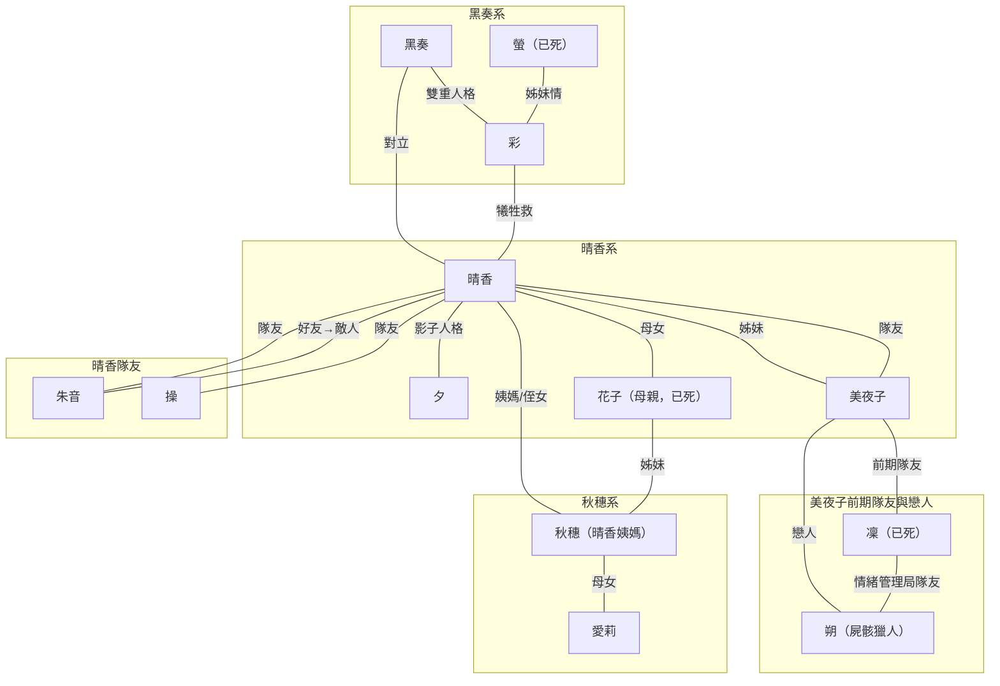

# 來源重寫：`backup/screenwriter/00_Story_Brief.md`

> 讀者導讀：此文件是 backup 單一來源的重寫收納稿。
> 用途：保證段落級零遺漏，並提供可追溯錨點。
> 任何 Canon 決策以 `../canon/99_decision_log.md` 為準。

## 來源概覽
- Source: `backup/screenwriter/00_Story_Brief.md`
- Coverage Units: 125

## 魔法少女晴香物語 — 5 分鐘 Story Brief

### 00_Story_Brief::H魔法少女晴香物語 — 5 分鐘 Story Brief::U001
- 類型：`heading`
- CU_HASH：`57f06ea11eca`

**重寫內容（保留語意）**

# 魔法少女晴香物語 — 5 分鐘 Story Brief

<!-- Sources: backup/screenwriter/00_Story_Brief.md::CU_ID=00_Story_Brief::H魔法少女晴香物語 — 5 分鐘 Story Brief::U001 -->

### 00_Story_Brief::H魔法少女晴香物語 — 5 分鐘 Story Brief::U002
- 類型：`paragraph`
- CU_HASH：`58b63e273b96`

**重寫內容（保留語意）**

---

<!-- Sources: backup/screenwriter/00_Story_Brief.md::CU_ID=00_Story_Brief::H魔法少女晴香物語 — 5 分鐘 Story Brief::U002 -->

## 魔法少女晴香物語 — 5 分鐘 Story Brief/Logline

### 00_Story_Brief::H魔法少女晴香物語 — 5 分鐘 Story Brief/Logline::U014
- 類型：`heading`
- CU_HASH：`7502197c3ccd`

**重寫內容（保留語意）**

## Logline

<!-- Sources: backup/screenwriter/00_Story_Brief.md::CU_ID=00_Story_Brief::H魔法少女晴香物語 — 5 分鐘 Story Brief/Logline::U014 -->

### 00_Story_Brief::H魔法少女晴香物語 — 5 分鐘 Story Brief/Logline::U015
- 類型：`paragraph`
- CU_HASH：`a01047832729`

**重寫內容（保留語意）**

> 魔法少女晴香（17歲）發現：她小時候為了逃避姊姊的死，不小心創造了整個世界——一個會把少女榨乾、變成怪物的世界。現在她必須選擇：繼續用力量「修正」一切但可能毁掉更多人，還是接受「自己就是災難的源頭」、永遠承受所有人的痛苦。

<!-- Sources: backup/screenwriter/00_Story_Brief.md::CU_ID=00_Story_Brief::H魔法少女晴香物語 — 5 分鐘 Story Brief/Logline::U015 -->

### 00_Story_Brief::H魔法少女晴香物語 — 5 分鐘 Story Brief/Logline::U016
- 類型：`paragraph`
- CU_HASH：`58b63e273b96`

**重寫內容（保留語意）**

---

<!-- Sources: backup/screenwriter/00_Story_Brief.md::CU_ID=00_Story_Brief::H魔法少女晴香物語 — 5 分鐘 Story Brief/Logline::U016 -->

## 魔法少女晴香物語 — 5 分鐘 Story Brief/世界觀速覽

### 00_Story_Brief::H魔法少女晴香物語 — 5 分鐘 Story Brief/世界觀速覽::U023
- 類型：`heading`
- CU_HASH：`a34e538c639b`

**重寫內容（保留語意）**

## 世界觀速覽

<!-- Sources: backup/screenwriter/00_Story_Brief.md::CU_ID=00_Story_Brief::H魔法少女晴香物語 — 5 分鐘 Story Brief/世界觀速覽::U023 -->

## 魔法少女晴香物語 — 5 分鐘 Story Brief/世界觀速覽/兩個世界

### 00_Story_Brief::H魔法少女晴香物語 — 5 分鐘 Story Brief/世界觀速覽/兩個世界::U028
- 類型：`heading`
- CU_HASH：`62ea97b54d4a`

**重寫內容（保留語意）**

### 兩個世界

<!-- Sources: backup/screenwriter/00_Story_Brief.md::CU_ID=00_Story_Brief::H魔法少女晴香物語 — 5 分鐘 Story Brief/世界觀速覽/兩個世界::U028 -->

### 00_Story_Brief::H魔法少女晴香物語 — 5 分鐘 Story Brief/世界觀速覽/兩個世界::U029
- 類型：`paragraph`
- CU_HASH：`1ea67edd89fe`

**重寫內容（保留語意）**

**原初世界 (Alpha 線)**：

<!-- Sources: backup/screenwriter/00_Story_Brief.md::CU_ID=00_Story_Brief::H魔法少女晴香物語 — 5 分鐘 Story Brief/世界觀速覽/兩個世界::U029 -->

### 00_Story_Brief::H魔法少女晴香物語 — 5 分鐘 Story Brief/世界觀速覽/兩個世界::U030
- 類型：`list`
- CU_HASH：`8000eafbfaec`

**重寫內容（保留語意）**

- 沒有魔法的普通世界
- 晴香 5 歲時目睹姊姊美夜子被黑奏殺害

<!-- Sources: backup/screenwriter/00_Story_Brief.md::CU_ID=00_Story_Brief::H魔法少女晴香物語 — 5 分鐘 Story Brief/世界觀速覽/兩個世界::U030 -->

### 00_Story_Brief::H魔法少女晴香物語 — 5 分鐘 Story Brief/世界觀速覽/兩個世界::U031
- 類型：`paragraph`
- CU_HASH：`36b9b049d0c7`

**重寫內容（保留語意）**

**現在的世界 (Beta 線 / 故事舞台)**：

<!-- Sources: backup/screenwriter/00_Story_Brief.md::CU_ID=00_Story_Brief::H魔法少女晴香物語 — 5 分鐘 Story Brief/世界觀速覽/兩個世界::U031 -->

### 00_Story_Brief::H魔法少女晴香物語 — 5 分鐘 Story Brief/世界觀速覽/兩個世界::U032
- 類型：`list`
- CU_HASH：`a5308be6cf49`

**重寫內容（保留語意）**

- 晴香情緒崩潰時「無中生有」創造的新世界
- 她改寫了集體潛意識,創造了魔法少女系統、魔法屍骸、情緒毒品
- **大部分人對 Alpha 線沒有記憶**,他們只知道 Beta 世界
- **只有少數記得 Alpha 線真相**:夕(晴香的影子人格)、黑奏、愛莉

<!-- Sources: backup/screenwriter/00_Story_Brief.md::CU_ID=00_Story_Brief::H魔法少女晴香物語 — 5 分鐘 Story Brief/世界觀速覽/兩個世界::U032 -->

### 00_Story_Brief::H魔法少女晴香物語 — 5 分鐘 Story Brief/世界觀速覽/兩個世界::U033
- 類型：`paragraph`
- CU_HASH：`20e70e6f0021`

**重寫內容（保留語意）**

**晴香的「改變現實」為何失敗？**

<!-- Sources: backup/screenwriter/00_Story_Brief.md::CU_ID=00_Story_Brief::H魔法少女晴香物語 — 5 分鐘 Story Brief/世界觀速覽/兩個世界::U033 -->

### 00_Story_Brief::H魔法少女晴香物語 — 5 分鐘 Story Brief/世界觀速覽/兩個世界::U034
- 類型：`list`
- CU_HASH：`2fea30c7eafb`

**重寫內容（保留語意）**

- 5 歲的晴香想讓姊姊「不要死」,所以創造了 Beta 世界
- 但她只能改變外在規則(加入魔法),**無法改變「失去」本身**
- 結果:Beta 世界裡美夜子沒有立即死去,但後來(108 年)觸發因為晴香改變現實時願望令她變成黑貓

<!-- Sources: backup/screenwriter/00_Story_Brief.md::CU_ID=00_Story_Brief::H魔法少女晴香物語 — 5 分鐘 Story Brief/世界觀速覽/兩個世界::U034 -->

### 00_Story_Brief::H魔法少女晴香物語 — 5 分鐘 Story Brief/世界觀速覽/兩個世界::U035
- 類型：`list`
- CU_HASH：`588cae75d4cf`

**重寫內容（保留語意）**

- **晴香不知道黑貓就是姊姊**,一直活在「姊姊已死」的痛苦中
- 這就是「改變現實無法治癒內心創傷」的核心諷刺

<!-- Sources: backup/screenwriter/00_Story_Brief.md::CU_ID=00_Story_Brief::H魔法少女晴香物語 — 5 分鐘 Story Brief/世界觀速覽/兩個世界::U035 -->

### 00_Story_Brief::H魔法少女晴香物語 — 5 分鐘 Story Brief/世界觀速覽/兩個世界::U036
- 類型：`paragraph`
- CU_HASH：`58b63e273b96`

**重寫內容（保留語意）**

---

<!-- Sources: backup/screenwriter/00_Story_Brief.md::CU_ID=00_Story_Brief::H魔法少女晴香物語 — 5 分鐘 Story Brief/世界觀速覽/兩個世界::U036 -->

## 魔法少女晴香物語 — 5 分鐘 Story Brief/世界觀速覽/地理設定：維多利亞城

### 00_Story_Brief::H魔法少女晴香物語 — 5 分鐘 Story Brief/世界觀速覽/地理設定：維多利亞城::U024
- 類型：`heading`
- CU_HASH：`0e2aeb05a88d`

**重寫內容（保留語意）**

### 地理設定：維多利亞城

<!-- Sources: backup/screenwriter/00_Story_Brief.md::CU_ID=00_Story_Brief::H魔法少女晴香物語 — 5 分鐘 Story Brief/世界觀速覽/地理設定：維多利亞城::U024 -->

### 00_Story_Brief::H魔法少女晴香物語 — 5 分鐘 Story Brief/世界觀速覽/地理設定：維多利亞城::U025
- 類型：`list`
- CU_HASH：`f4d964c7b87b`

**重寫內容（保留語意）**

- 類似老香港的中西交匯城市，分為「日區」和「夜區」
- **日區**：帝國領土，人造太陽 24 小時照耀，富裕但情緒被壓抑的「無鏡之城」
- **夜區**：被工業廢氣籠罩的貧民區，長期不見天日，但居民更真實、堅韌

<!-- Sources: backup/screenwriter/00_Story_Brief.md::CU_ID=00_Story_Brief::H魔法少女晴香物語 — 5 分鐘 Story Brief/世界觀速覽/地理設定：維多利亞城::U025 -->

## 魔法少女晴香物語 — 5 分鐘 Story Brief/世界觀速覽/政治設定

### 00_Story_Brief::H魔法少女晴香物語 — 5 分鐘 Story Brief/世界觀速覽/政治設定::U026
- 類型：`heading`
- CU_HASH：`582f84ee5e18`

**重寫內容（保留語意）**

### 政治設定

<!-- Sources: backup/screenwriter/00_Story_Brief.md::CU_ID=00_Story_Brief::H魔法少女晴香物語 — 5 分鐘 Story Brief/世界觀速覽/政治設定::U026 -->

### 00_Story_Brief::H魔法少女晴香物語 — 5 分鐘 Story Brief/世界觀速覽/政治設定::U027
- 類型：`list`
- CU_HASH：`6789c3573d76`

**重寫內容（保留語意）**

- 帝國由黑奏（以皇帝身份）暗中統治
- **維多利亞之淚**：巨大人造太陽，表面提供能源，實際監控全城情緒
- **魔法少女計劃**：帝國把少女當成消耗品——吸收戰鬥產生的負面能量，用完即棄

<!-- Sources: backup/screenwriter/00_Story_Brief.md::CU_ID=00_Story_Brief::H魔法少女晴香物語 — 5 分鐘 Story Brief/世界觀速覽/政治設定::U027 -->

## 魔法少女晴香物語 — 5 分鐘 Story Brief/主要事件節拍

### 00_Story_Brief::H魔法少女晴香物語 — 5 分鐘 Story Brief/主要事件節拍::U092
- 類型：`heading`
- CU_HASH：`14806f063836`

**重寫內容（保留語意）**

## 主要事件節拍

<!-- Sources: backup/screenwriter/00_Story_Brief.md::CU_ID=00_Story_Brief::H魔法少女晴香物語 — 5 分鐘 Story Brief/主要事件節拍::U092 -->

### 00_Story_Brief::H魔法少女晴香物語 — 5 分鐘 Story Brief/主要事件節拍::U093
- 類型：`table`
- CU_HASH：`bf56d5ce922c`

**重寫內容（保留語意）**

| 節拍 | 事件 |
|-----|------|
| **引爆** | 5 歲晴香目睹姊姊美夜子被殺，情緒崩潰之下創造了現在這個世界——她是災難的創造者 |
| **代價浮現** | 每次變身流失情緒；隊友朱音墮落變成怪物；夕洩漏影片，晴香社會性死亡 |
| **中段翻轉** | 黑奏揭露真相：晴香不是救世主，是讓這個悲劇世界存在的「原罪」 |
| **不可逆** | 夕接管身體嘗試改寫世界失敗；晴香意識被困 20 年 |
| **結局** | 晴香選擇「接納」而非「修正」，**將 Beta 線固化為唯一現實**；彩犧牲填補世界裂痕；晴香成為「靜止的搖籃」——孤獨但自由 |

<!-- Sources: backup/screenwriter/00_Story_Brief.md::CU_ID=00_Story_Brief::H魔法少女晴香物語 — 5 分鐘 Story Brief/主要事件節拍::U093 -->

### 00_Story_Brief::H魔法少女晴香物語 — 5 分鐘 Story Brief/主要事件節拍::U094
- 類型：`paragraph`
- CU_HASH：`58b63e273b96`

**重寫內容（保留語意）**

---

<!-- Sources: backup/screenwriter/00_Story_Brief.md::CU_ID=00_Story_Brief::H魔法少女晴香物語 — 5 分鐘 Story Brief/主要事件節拍::U094 -->

## 魔法少女晴香物語 — 5 分鐘 Story Brief/主要角色

### 00_Story_Brief::H魔法少女晴香物語 — 5 分鐘 Story Brief/主要角色::U082
- 類型：`heading`
- CU_HASH：`8b78a02e17a0`

**重寫內容（保留語意）**

## 主要角色

<!-- Sources: backup/screenwriter/00_Story_Brief.md::CU_ID=00_Story_Brief::H魔法少女晴香物語 — 5 分鐘 Story Brief/主要角色::U082 -->

### 00_Story_Brief::H魔法少女晴香物語 — 5 分鐘 Story Brief/主要角色::U083
- 類型：`table`
- CU_HASH：`e839271d4434`

**重寫內容（保留語意）**

| 角色 | 表面想要 | 真正需要 | 主題立場 |
|-----|---------|---------|---------|
| **雨宮晴香** (17歲) | 成為散播希望的英雄偶像 | 接納自己是「災難創造者」 | 從「刪除痛苦」到「擁抱痛苦」 |
| **夕** | 證明晴香的邏輯是錯的 | 被承認為「真實的一部分」 | 被切割的創傷會變成怪物 |
| **澄川黑奏** (外表14-16歲,實際41歲) | 建立無痛苦的世界 | 無（拒絕改變）| 修正主義的極端 |
| **澄川彩** | 停止以自己名義造成的傷害 | 學會自己承受痛苦 | 愛的救贖 |
| **水無月美夜子** (外表黑貓,實際22歲) | 恢復人形、報復制度 | 允許自己軟弱 | 即使被剝奪死亡權利，仍選擇守護 |

<!-- Sources: backup/screenwriter/00_Story_Brief.md::CU_ID=00_Story_Brief::H魔法少女晴香物語 — 5 分鐘 Story Brief/主要角色::U083 -->

### 00_Story_Brief::H魔法少女晴香物語 — 5 分鐘 Story Brief/主要角色::U084
- 類型：`paragraph`
- CU_HASH：`639f18b94609`

**重寫內容（保留語意）**

**角色身份補充**：

<!-- Sources: backup/screenwriter/00_Story_Brief.md::CU_ID=00_Story_Brief::H魔法少女晴香物語 — 5 分鐘 Story Brief/主要角色::U084 -->

### 00_Story_Brief::H魔法少女晴香物語 — 5 分鐘 Story Brief/主要角色::U085
- 類型：`list`
- CU_HASH：`8401d1bb04b5`

**重寫內容（保留語意）**

- **夕**：晴香的「影子人格」——5 歲時晴香把所有痛苦記憶切割出去，形成了另一個獨立意識，住在鏡子裡
- **黑奏/彩**：同一個身體的兩個人格。彩是原本的孩子，黑奏是童年創傷後分裂出來的「保護者」，現在反過來控制了身體，成為帝國皇帝。**外表凍齡在 14-16 歲左右**，與晴香形成「兩個受傷少女」的鏡像對比

<!-- Sources: backup/screenwriter/00_Story_Brief.md::CU_ID=00_Story_Brief::H魔法少女晴香物語 — 5 分鐘 Story Brief/主要角色::U085 -->

### 00_Story_Brief::H魔法少女晴香物語 — 5 分鐘 Story Brief/主要角色::U086
- 類型：`paragraph`
- CU_HASH：`58b63e273b96`

**重寫內容（保留語意）**

---

<!-- Sources: backup/screenwriter/00_Story_Brief.md::CU_ID=00_Story_Brief::H魔法少女晴香物語 — 5 分鐘 Story Brief/主要角色::U086 -->

## 魔法少女晴香物語 — 5 分鐘 Story Brief/主題

### 00_Story_Brief::H魔法少女晴香物語 — 5 分鐘 Story Brief/主題::U017
- 類型：`heading`
- CU_HASH：`0507eda53101`

**重寫內容（保留語意）**

## 主題

<!-- Sources: backup/screenwriter/00_Story_Brief.md::CU_ID=00_Story_Brief::H魔法少女晴香物語 — 5 分鐘 Story Brief/主題::U017 -->

### 00_Story_Brief::H魔法少女晴香物語 — 5 分鐘 Story Brief/主題::U018
- 類型：`paragraph`
- CU_HASH：`6ce11ae5dbee`

**重寫內容（保留語意）**

**主題句：「面對不可控的命運時，『態度』是唯一的自由。」**

<!-- Sources: backup/screenwriter/00_Story_Brief.md::CU_ID=00_Story_Brief::H魔法少女晴香物語 — 5 分鐘 Story Brief/主題::U018 -->

### 00_Story_Brief::H魔法少女晴香物語 — 5 分鐘 Story Brief/主題::U019
- 類型：`paragraph`
- CU_HASH：`719fbceecc4e`

**重寫內容（保留語意）**

**辯證核心**：接納 vs 修正

<!-- Sources: backup/screenwriter/00_Story_Brief.md::CU_ID=00_Story_Brief::H魔法少女晴香物語 — 5 分鐘 Story Brief/主題::U019 -->

### 00_Story_Brief::H魔法少女晴香物語 — 5 分鐘 Story Brief/主題::U020
- 類型：`list`
- CU_HASH：`c1d5d15fcd61`

**重寫內容（保留語意）**

- **晴香方**：創傷是需要被理解的歷史，擁抱痛苦才能超越
- **黑奏方**：痛苦是必須被根除的 Bug，控制即是解脫

<!-- Sources: backup/screenwriter/00_Story_Brief.md::CU_ID=00_Story_Brief::H魔法少女晴香物語 — 5 分鐘 Story Brief/主題::U020 -->

### 00_Story_Brief::H魔法少女晴香物語 — 5 分鐘 Story Brief/主題::U021
- 類型：`paragraph`
- CU_HASH：`ddd4669ff8e6`

**重寫內容（保留語意）**

**故事如何拷問**：每個角色都在「逃避/控制痛苦」與「接納/共存痛苦」之間掙扎。最終證明：即使變成怪物，「曾經做過的選擇」仍然有意義。

<!-- Sources: backup/screenwriter/00_Story_Brief.md::CU_ID=00_Story_Brief::H魔法少女晴香物語 — 5 分鐘 Story Brief/主題::U021 -->

### 00_Story_Brief::H魔法少女晴香物語 — 5 分鐘 Story Brief/主題::U022
- 類型：`paragraph`
- CU_HASH：`58b63e273b96`

**重寫內容（保留語意）**

---

<!-- Sources: backup/screenwriter/00_Story_Brief.md::CU_ID=00_Story_Brief::H魔法少女晴香物語 — 5 分鐘 Story Brief/主題::U022 -->

## 魔法少女晴香物語 — 5 分鐘 Story Brief/故事結構的「詭計」

### 00_Story_Brief::H魔法少女晴香物語 — 5 分鐘 Story Brief/故事結構的「詭計」::U098
- 類型：`heading`
- CU_HASH：`02d2a4fcec2c`

**重寫內容（保留語意）**

## 故事結構的「詭計」

<!-- Sources: backup/screenwriter/00_Story_Brief.md::CU_ID=00_Story_Brief::H魔法少女晴香物語 — 5 分鐘 Story Brief/故事結構的「詭計」::U098 -->

### 00_Story_Brief::H魔法少女晴香物語 — 5 分鐘 Story Brief/故事結構的「詭計」::U099
- 類型：`paragraph`
- CU_HASH：`f77afd3e49a8`

**重寫內容（保留語意）**

**表面結構**：英雄誕生 → 試煉 → 決戰勝利

<!-- Sources: backup/screenwriter/00_Story_Brief.md::CU_ID=00_Story_Brief::H魔法少女晴香物語 — 5 分鐘 Story Brief/故事結構的「詭計」::U099 -->

### 00_Story_Brief::H魔法少女晴香物語 — 5 分鐘 Story Brief/故事結構的「詭計」::U100
- 類型：`paragraph`
- CU_HASH：`1938565a375e`

**重寫內容（保留語意）**

**實際結構**：內在戰爭 → 世界試煉 → **「勝利」其實是失敗** → 態度的重生

<!-- Sources: backup/screenwriter/00_Story_Brief.md::CU_ID=00_Story_Brief::H魔法少女晴香物語 — 5 分鐘 Story Brief/故事結構的「詭計」::U100 -->

### 00_Story_Brief::H魔法少女晴香物語 — 5 分鐘 Story Brief/故事結構的「詭計」::U101
- 類型：`paragraph`
- CU_HASH：`e3584694f2cf`

**重寫內容（保留語意）**

**第三幕的「詭計」**：

<!-- Sources: backup/screenwriter/00_Story_Brief.md::CU_ID=00_Story_Brief::H魔法少女晴香物語 — 5 分鐘 Story Brief/故事結構的「詭計」::U101 -->

### 00_Story_Brief::H魔法少女晴香物語 — 5 分鐘 Story Brief/故事結構的「詭計」::U102
- 類型：`list`
- CU_HASH：`b0c18dc99f42`

**重寫內容（保留語意）**

- 觀眾以為晴香會在決戰中勝利
- 實際上她失敗了，夕接管身體嘗試「改變現實」失敗
- 晴香意識被困在集體潛意識深處，時間跳躍 20 年

<!-- Sources: backup/screenwriter/00_Story_Brief.md::CU_ID=00_Story_Brief::H魔法少女晴香物語 — 5 分鐘 Story Brief/故事結構的「詭計」::U102 -->

### 00_Story_Brief::H魔法少女晴香物語 — 5 分鐘 Story Brief/故事結構的「詭計」::U103
- 類型：`paragraph`
- CU_HASH：`d0391e7a37a8`

**重寫內容（保留語意）**

**那 20 年發生了什麼？（帝歷 114-134）**

<!-- Sources: backup/screenwriter/00_Story_Brief.md::CU_ID=00_Story_Brief::H魔法少女晴香物語 — 5 分鐘 Story Brief/故事結構的「詭計」::U103 -->

### 00_Story_Brief::H魔法少女晴香物語 — 5 分鐘 Story Brief/故事結構的「詭計」::U104
- 類型：`list`
- CU_HASH：`243f1e16fd5c`

**重寫內容（保留語意）**

- **夕用晴香的身體守護世界 20 年**，獨自對抗屍骸和帝國
- **晴香意識沉睡在集體潛意識中**，與過去的記憶、創傷對話
- 世界陷入緩慢崩壞，但夕拼命維持著不讓一切崩潰

<!-- Sources: backup/screenwriter/00_Story_Brief.md::CU_ID=00_Story_Brief::H魔法少女晴香物語 — 5 分鐘 Story Brief/故事結構的「詭計」::U104 -->

### 00_Story_Brief::H魔法少女晴香物語 — 5 分鐘 Story Brief/故事結構的「詭計」::U105
- 類型：`paragraph`
- CU_HASH：`e421c9a04748`

**重寫內容（保留語意）**

**時間折返與 Beta 線固化（帝歷 134 年後）**

<!-- Sources: backup/screenwriter/00_Story_Brief.md::CU_ID=00_Story_Brief::H魔法少女晴香物語 — 5 分鐘 Story Brief/故事結構的「詭計」::U105 -->

### 00_Story_Brief::H魔法少女晴香物語 — 5 分鐘 Story Brief/故事結構的「詭計」::U106
- 類型：`list`
- CU_HASH：`c69006cb8f6e`

**重寫內容（保留語意）**

- 夕的 20 年守護最終觸發了「改變現實」的反向效應，造成一次**時間折返**與記憶重構
- 折返讓世界回到「晴香意識被困」的起點，但**仍發生在 Beta 線內部**，並未回到 Alpha 線
- **只有晴香保留這 20 年的記憶**；其他人回到 114 年的狀態
- **夕融合回晴香，失去獨立存在**——她的 20 年犧牲只有晴香記得
- 最終，晴香選擇**將 Beta 線固化為唯一現實**，停止再一次折返的可能

<!-- Sources: backup/screenwriter/00_Story_Brief.md::CU_ID=00_Story_Brief::H魔法少女晴香物語 — 5 分鐘 Story Brief/故事結構的「詭計」::U106 -->

### 00_Story_Brief::H魔法少女晴香物語 — 5 分鐘 Story Brief/故事結構的「詭計」::U107
- 類型：`paragraph`
- CU_HASH：`eb7687e92acb`

**重寫內容（保留語意）**

**第四幕的意義**：

<!-- Sources: backup/screenwriter/00_Story_Brief.md::CU_ID=00_Story_Brief::H魔法少女晴香物語 — 5 分鐘 Story Brief/故事結構的「詭計」::U107 -->

### 00_Story_Brief::H魔法少女晴香物語 — 5 分鐘 Story Brief/故事結構的「詭計」::U108
- 類型：`list`
- CU_HASH：`ecfac5521cc7`

**重寫內容（保留語意）**

- 不是「打敗黑奏」，而是「接納自己也是問題的一部分」
- 最終勝利不靠力量，靠「態度的轉變」
- 晴香選擇**固化 Beta 線**並成為「靜止的搖籃 / 永恆守護者」——不是被懲罰，而是主動承擔責任

<!-- Sources: backup/screenwriter/00_Story_Brief.md::CU_ID=00_Story_Brief::H魔法少女晴香物語 — 5 分鐘 Story Brief/故事結構的「詭計」::U108 -->

### 00_Story_Brief::H魔法少女晴香物語 — 5 分鐘 Story Brief/故事結構的「詭計」::U109
- 類型：`paragraph`
- CU_HASH：`58b63e273b96`

**重寫內容（保留語意）**

---

<!-- Sources: backup/screenwriter/00_Story_Brief.md::CU_ID=00_Story_Brief::H魔法少女晴香物語 — 5 分鐘 Story Brief/故事結構的「詭計」::U109 -->

## 魔法少女晴香物語 — 5 分鐘 Story Brief/核心設定

### 00_Story_Brief::H魔法少女晴香物語 — 5 分鐘 Story Brief/核心設定::U058
- 類型：`heading`
- CU_HASH：`de902287bdc0`

**重寫內容（保留語意）**

## 核心設定

<!-- Sources: backup/screenwriter/00_Story_Brief.md::CU_ID=00_Story_Brief::H魔法少女晴香物語 — 5 分鐘 Story Brief/核心設定::U058 -->

## 魔法少女晴香物語 — 5 分鐘 Story Brief/核心設定/「改變現實」——故事最重要的能力

### 00_Story_Brief::H魔法少女晴香物語 — 5 分鐘 Story Brief/核心設定/「改變現實」——故事最重要的能力::U059
- 類型：`heading`
- CU_HASH：`f732f31f826f`

**重寫內容（保留語意）**

### 「改變現實」——故事最重要的能力

<!-- Sources: backup/screenwriter/00_Story_Brief.md::CU_ID=00_Story_Brief::H魔法少女晴香物語 — 5 分鐘 Story Brief/核心設定/「改變現實」——故事最重要的能力::U059 -->

### 00_Story_Brief::H魔法少女晴香物語 — 5 分鐘 Story Brief/核心設定/「改變現實」——故事最重要的能力::U060
- 類型：`paragraph`
- CU_HASH：`8e87c6168184`

**重寫內容（保留語意）**

晴香擁有一種極端的力量：當她情緒崩潰到極點時，可以直接「改寫」世界的規則。

<!-- Sources: backup/screenwriter/00_Story_Brief.md::CU_ID=00_Story_Brief::H魔法少女晴香物語 — 5 分鐘 Story Brief/核心設定/「改變現實」——故事最重要的能力::U060 -->

### 00_Story_Brief::H魔法少女晴香物語 — 5 分鐘 Story Brief/核心設定/「改變現實」——故事最重要的能力::U061
- 類型：`paragraph`
- CU_HASH：`127f61632dfd`

**重寫內容（保留語意）**

**故事中發生過兩次**：

<!-- Sources: backup/screenwriter/00_Story_Brief.md::CU_ID=00_Story_Brief::H魔法少女晴香物語 — 5 分鐘 Story Brief/核心設定/「改變現實」——故事最重要的能力::U061 -->

### 00_Story_Brief::H魔法少女晴香物語 — 5 分鐘 Story Brief/核心設定/「改變現實」——故事最重要的能力::U062
- 類型：`table`
- CU_HASH：`8be7a7164885`

**重寫內容（保留語意）**

| 時間 | 發生咩事 | 後果 |
|-----|---------|------|
| **5 歲** | 晴香目睹姊姊被殺，無法接受，用這股力量創造了一個「新世界」 | 這個新世界就是故事的舞台——所有悲劇（魔法少女制度、怪物、毒品）都因此誕生 |
| **17 歲** | 夕（晴香的影子人格）嘗試「修正」世界，想讓死去的人復活 | 失敗，反而造成更大災難；晴香意識被困 20 年 |

<!-- Sources: backup/screenwriter/00_Story_Brief.md::CU_ID=00_Story_Brief::H魔法少女晴香物語 — 5 分鐘 Story Brief/核心設定/「改變現實」——故事最重要的能力::U062 -->

### 00_Story_Brief::H魔法少女晴香物語 — 5 分鐘 Story Brief/核心設定/「改變現實」——故事最重要的能力::U063
- 類型：`paragraph`
- CU_HASH：`1b39f71f55f5`

**重寫內容（保留語意）**

**核心諷刺**：這股力量確實能改變現實，但改變不了內心的創傷。晴香創造了新世界，但痛苦依然存在；夕想復活媽媽，但復活的只是「沒有溫度的影像」。**外在的修正無法治癒內在的傷口。**

<!-- Sources: backup/screenwriter/00_Story_Brief.md::CU_ID=00_Story_Brief::H魔法少女晴香物語 — 5 分鐘 Story Brief/核心設定/「改變現實」——故事最重要的能力::U063 -->

### 00_Story_Brief::H魔法少女晴香物語 — 5 分鐘 Story Brief/核心設定/「改變現實」——故事最重要的能力::U064
- 類型：`paragraph`
- CU_HASH：`518a4d44b099`

**重寫內容（保留語意）**

**「改變現實」的三個硬限制**：

<!-- Sources: backup/screenwriter/00_Story_Brief.md::CU_ID=00_Story_Brief::H魔法少女晴香物語 — 5 分鐘 Story Brief/核心設定/「改變現實」——故事最重要的能力::U064 -->

### 00_Story_Brief::H魔法少女晴香物語 — 5 分鐘 Story Brief/核心設定/「改變現實」——故事最重要的能力::U065
- 類型：`list`
- CU_HASH：`690f235799f2`

**重寫內容（保留語意）**

1. **無法真正復活死者**
   - 晴香創造 Beta 世界後，美夜子沒有立即死去，但仍在 108 年變成黑貓
   - 夕嘗試「復活」花子和美夜子，但復活的只是「沒有溫度的影像」
   - 死亡的本質無法改變，只能延遲或改變形式

<!-- Sources: backup/screenwriter/00_Story_Brief.md::CU_ID=00_Story_Brief::H魔法少女晴香物語 — 5 分鐘 Story Brief/核心設定/「改變現實」——故事最重要的能力::U065 -->

### 00_Story_Brief::H魔法少女晴香物語 — 5 分鐘 Story Brief/核心設定/「改變現實」——故事最重要的能力::U066
- 類型：`list`
- CU_HASH：`f7bbddf65690`

**重寫內容（保留語意）**

2. **必須支付因果債（情緒守恆）**
   - 晴香創造 Beta 世界 → 魔法少女系統、屍骸、情緒毒品隨之誕生、緋潮爆發
   - 夕的「改變現實」失敗 → 時間線撕裂
   - 改變越大，反噬越強；痛苦不會消失，只會轉移

<!-- Sources: backup/screenwriter/00_Story_Brief.md::CU_ID=00_Story_Brief::H魔法少女晴香物語 — 5 分鐘 Story Brief/核心設定/「改變現實」——故事最重要的能力::U066 -->

### 00_Story_Brief::H魔法少女晴香物語 — 5 分鐘 Story Brief/核心設定/「改變現實」——故事最重要的能力::U067
- 類型：`list`
- CU_HASH：`0165b0564bcb`

**重寫內容（保留語意）**

3. **無法覆寫原初的情緒記憶**
   - Alpha 線的記憶被錨定在集體潛意識深處（愛莉成為緋潮錨點）
   - 夕、黑奏、愛莉都保留了 Alpha 線記憶
   - 「被抹除的現實」會在集體潛意識中累積，最終反噬

<!-- Sources: backup/screenwriter/00_Story_Brief.md::CU_ID=00_Story_Brief::H魔法少女晴香物語 — 5 分鐘 Story Brief/核心設定/「改變現實」——故事最重要的能力::U067 -->

### 00_Story_Brief::H魔法少女晴香物語 — 5 分鐘 Story Brief/核心設定/「改變現實」——故事最重要的能力::U068
- 類型：`paragraph`
- CU_HASH：`bedda61ee71e`

**重寫內容（保留語意）**

這三個限制確保「改變現實」不是萬能的——它只是「用更大的問題掩蓋舊問題」的逃避機制。

<!-- Sources: backup/screenwriter/00_Story_Brief.md::CU_ID=00_Story_Brief::H魔法少女晴香物語 — 5 分鐘 Story Brief/核心設定/「改變現實」——故事最重要的能力::U068 -->

## 魔法少女晴香物語 — 5 分鐘 Story Brief/核心設定/人類、魔法少女、怪物——其實是同一種存在

### 00_Story_Brief::H魔法少女晴香物語 — 5 分鐘 Story Brief/核心設定/人類、魔法少女、怪物——其實是同一種存在::U072
- 類型：`heading`
- CU_HASH：`1fc404f20321`

**重寫內容（保留語意）**

### 人類、魔法少女、怪物——其實是同一種存在

<!-- Sources: backup/screenwriter/00_Story_Brief.md::CU_ID=00_Story_Brief::H魔法少女晴香物語 — 5 分鐘 Story Brief/核心設定/人類、魔法少女、怪物——其實是同一種存在::U072 -->

### 00_Story_Brief::H魔法少女晴香物語 — 5 分鐘 Story Brief/核心設定/人類、魔法少女、怪物——其實是同一種存在::U073
- 類型：`paragraph`
- CU_HASH：`707bc2495fb7`

**重寫內容（保留語意）**

不是三種生物，是同一條「情感耗損」光譜的不同狀態：

<!-- Sources: backup/screenwriter/00_Story_Brief.md::CU_ID=00_Story_Brief::H魔法少女晴香物語 — 5 分鐘 Story Brief/核心設定/人類、魔法少女、怪物——其實是同一種存在::U073 -->

### 00_Story_Brief::H魔法少女晴香物語 — 5 分鐘 Story Brief/核心設定/人類、魔法少女、怪物——其實是同一種存在::U074
- 類型：`list`
- CU_HASH：`419ebd715e83`

**重寫內容（保留語意）**

- **人類**：情感完整，但力量微弱
- **魔法少女**：消耗情感換取力量，正在「非人化」的過程中
- **怪物（魔法屍骸）**：情感徹底耗損，失去了選擇的自由

<!-- Sources: backup/screenwriter/00_Story_Brief.md::CU_ID=00_Story_Brief::H魔法少女晴香物語 — 5 分鐘 Story Brief/核心設定/人類、魔法少女、怪物——其實是同一種存在::U074 -->

### 00_Story_Brief::H魔法少女晴香物語 — 5 分鐘 Story Brief/核心設定/人類、魔法少女、怪物——其實是同一種存在::U075
- 類型：`paragraph`
- CU_HASH：`751edfda6d09`

**重寫內容（保留語意）**

**敘事意義**：打敗怪物不是「消滅敵人」，而是「幫助曾經是人的他們重新選擇」。

<!-- Sources: backup/screenwriter/00_Story_Brief.md::CU_ID=00_Story_Brief::H魔法少女晴香物語 — 5 分鐘 Story Brief/核心設定/人類、魔法少女、怪物——其實是同一種存在::U075 -->

## 魔法少女晴香物語 — 5 分鐘 Story Brief/核心設定/痛苦不會消失，只會轉移

### 00_Story_Brief::H魔法少女晴香物語 — 5 分鐘 Story Brief/核心設定/痛苦不會消失，只會轉移::U069
- 類型：`heading`
- CU_HASH：`a2ca5ae17c0c`

**重寫內容（保留語意）**

### 痛苦不會消失，只會轉移

<!-- Sources: backup/screenwriter/00_Story_Brief.md::CU_ID=00_Story_Brief::H魔法少女晴香物語 — 5 分鐘 Story Brief/核心設定/痛苦不會消失，只會轉移::U069 -->

### 00_Story_Brief::H魔法少女晴香物語 — 5 分鐘 Story Brief/核心設定/痛苦不會消失，只會轉移::U070
- 類型：`paragraph`
- CU_HASH：`cb11a7d5d671`

**重寫內容（保留語意）**

這個世界的基本法則：你不能「消滅」痛苦，只能把它搬到別處。

<!-- Sources: backup/screenwriter/00_Story_Brief.md::CU_ID=00_Story_Brief::H魔法少女晴香物語 — 5 分鐘 Story Brief/核心設定/痛苦不會消失，只會轉移::U070 -->

### 00_Story_Brief::H魔法少女晴香物語 — 5 分鐘 Story Brief/核心設定/痛苦不會消失，只會轉移::U071
- 類型：`list`
- CU_HASH：`1895e351fe8f`

**重寫內容（保留語意）**

- 魔法少女每次「打敗」怪物，其實是把負面情緒「排放」到別處
- 日區（富人區）的快樂，必須由夜區（貧民區）的痛苦來「支付」
- **主題意義**：「治好傷口」是不可能的，只能「學會帶著傷口活下去」

<!-- Sources: backup/screenwriter/00_Story_Brief.md::CU_ID=00_Story_Brief::H魔法少女晴香物語 — 5 分鐘 Story Brief/核心設定/痛苦不會消失，只會轉移::U071 -->

## 魔法少女晴香物語 — 5 分鐘 Story Brief/核心設定/集體潛意識——所有魔法的源頭

### 00_Story_Brief::H魔法少女晴香物語 — 5 分鐘 Story Brief/核心設定/集體潛意識——所有魔法的源頭::U076
- 類型：`heading`
- CU_HASH：`32dd87a7f866`

**重寫內容（保留語意）**

### 集體潛意識——所有魔法的源頭

<!-- Sources: backup/screenwriter/00_Story_Brief.md::CU_ID=00_Story_Brief::H魔法少女晴香物語 — 5 分鐘 Story Brief/核心設定/集體潛意識——所有魔法的源頭::U076 -->

### 00_Story_Brief::H魔法少女晴香物語 — 5 分鐘 Story Brief/核心設定/集體潛意識——所有魔法的源頭::U077
- 類型：`paragraph`
- CU_HASH：`3b64bce19fa4`

**重寫內容（保留語意）**

**是什麼**：所有人類共享的深層意識空間，是情緒能量流動的「海洋」。

<!-- Sources: backup/screenwriter/00_Story_Brief.md::CU_ID=00_Story_Brief::H魔法少女晴香物語 — 5 分鐘 Story Brief/核心設定/集體潛意識——所有魔法的源頭::U077 -->

### 00_Story_Brief::H魔法少女晴香物語 — 5 分鐘 Story Brief/核心設定/集體潛意識——所有魔法的源頭::U078
- 類型：`paragraph`
- CU_HASH：`8b8cb42d1a05`

**重寫內容（保留語意）**

**視覺呈現**：無盡的後巷與唐樓——超現實的香港景象。

<!-- Sources: backup/screenwriter/00_Story_Brief.md::CU_ID=00_Story_Brief::H魔法少女晴香物語 — 5 分鐘 Story Brief/核心設定/集體潛意識——所有魔法的源頭::U078 -->

### 00_Story_Brief::H魔法少女晴香物語 — 5 分鐘 Story Brief/核心設定/集體潛意識——所有魔法的源頭::U079
- 類型：`paragraph`
- CU_HASH：`500000b16bb7`

**重寫內容（保留語意）**

**劇情功能**：

<!-- Sources: backup/screenwriter/00_Story_Brief.md::CU_ID=00_Story_Brief::H魔法少女晴香物語 — 5 分鐘 Story Brief/核心設定/集體潛意識——所有魔法的源頭::U079 -->

### 00_Story_Brief::H魔法少女晴香物語 — 5 分鐘 Story Brief/核心設定/集體潛意識——所有魔法的源頭::U080
- 類型：`list`
- CU_HASH：`ebd55883c7c1`

**重寫內容（保留語意）**

- 夕住在晴香的集體潛意識深處（所以晴香照鏡時會看到她）
- 「改變現實」的原理：直接改寫集體潛意識的「源代碼」，從而改變物理世界
- 最終決戰發生在集體潛意識中
- 晴香最終成為集體潛意識的「永恆守護者」——孤獨地守護所有人共享的深層意識

<!-- Sources: backup/screenwriter/00_Story_Brief.md::CU_ID=00_Story_Brief::H魔法少女晴香物語 — 5 分鐘 Story Brief/核心設定/集體潛意識——所有魔法的源頭::U080 -->

### 00_Story_Brief::H魔法少女晴香物語 — 5 分鐘 Story Brief/核心設定/集體潛意識——所有魔法的源頭::U081
- 類型：`paragraph`
- CU_HASH：`58b63e273b96`

**重寫內容（保留語意）**

---

<!-- Sources: backup/screenwriter/00_Story_Brief.md::CU_ID=00_Story_Brief::H魔法少女晴香物語 — 5 分鐘 Story Brief/核心設定/集體潛意識——所有魔法的源頭::U081 -->

## 魔法少女晴香物語 — 5 分鐘 Story Brief/簡化時間線

### 00_Story_Brief::H魔法少女晴香物語 — 5 分鐘 Story Brief/簡化時間線::U124
- 類型：`heading`
- CU_HASH：`26ae7d795dcf`

**重寫內容（保留語意）**

## 簡化時間線

<!-- Sources: backup/screenwriter/00_Story_Brief.md::CU_ID=00_Story_Brief::H魔法少女晴香物語 — 5 分鐘 Story Brief/簡化時間線::U124 -->

### 00_Story_Brief::H魔法少女晴香物語 — 5 分鐘 Story Brief/簡化時間線::U125
- 類型：`table`
- CU_HASH：`722274a1cc6d`

**重寫內容（保留語意）**

| 時期 | 關鍵事件 |
|-----|---------|
| **帝歷 79 年** | 黑奏（6 歲）目睹姊姊螢被殺，分裂出保護者人格 |
| **帝歷 98 年** | 黑奏殺死皇帝奪權 |
| **帝歷 102 年** | 晴香（5 歲）目睹姊姊被殺，用極端力量創造了現在的世界 |
| **帝歷 108 年** | 凜犧牲，美夜子變成黑貓逃亡 |
| **帝歷 113 年** | **故事開始**：貓型美夜子把變身裝置交給晴香 |
| **帝歷 113-114 年** | 朱音墮落→晴香社死→晴香與夕整合 |
| **帝歷 114 年** | 黑奏揭露真相→夕嘗試改寫世界失敗→晴香意識被困 20 年 |
| **帝歷 134 年** | 最終決戰→彩犧牲→晴香固化 Beta 線並成為「靜止的搖籃」 |

<!-- Sources: backup/screenwriter/00_Story_Brief.md::CU_ID=00_Story_Brief::H魔法少女晴香物語 — 5 分鐘 Story Brief/簡化時間線::U125 -->

## 魔法少女晴香物語 — 5 分鐘 Story Brief/結局的「黑暗治癒」解讀

### 00_Story_Brief::H魔法少女晴香物語 — 5 分鐘 Story Brief/結局的「黑暗治癒」解讀::U113
- 類型：`heading`
- CU_HASH：`8aa21235fc0c`

**重寫內容（保留語意）**

## 結局的「黑暗治癒」解讀

<!-- Sources: backup/screenwriter/00_Story_Brief.md::CU_ID=00_Story_Brief::H魔法少女晴香物語 — 5 分鐘 Story Brief/結局的「黑暗治癒」解讀::U113 -->

### 00_Story_Brief::H魔法少女晴香物語 — 5 分鐘 Story Brief/結局的「黑暗治癒」解讀::U114
- 類型：`paragraph`
- CU_HASH：`14220a26d130`

**重寫內容（保留語意）**

**晴香贏咗咩？**

<!-- Sources: backup/screenwriter/00_Story_Brief.md::CU_ID=00_Story_Brief::H魔法少女晴香物語 — 5 分鐘 Story Brief/結局的「黑暗治癒」解讀::U114 -->

### 00_Story_Brief::H魔法少女晴香物語 — 5 分鐘 Story Brief/結局的「黑暗治癒」解讀::U115
- 類型：`list`
- CU_HASH：`a9dbe77b5648`

**重寫內容（保留語意）**

- **停止了「痛苦的生產管線」**——不再有新的魔法少女、屍骸、情緒毒品
- **將 Beta 線固化為唯一現實**——不再逃回 Alpha 線的「正確答案」
- 讓美夜子和其他倖存者回歸正常人生
- 證明了「態度」可以超越「命運」

<!-- Sources: backup/screenwriter/00_Story_Brief.md::CU_ID=00_Story_Brief::H魔法少女晴香物語 — 5 分鐘 Story Brief/結局的「黑暗治癒」解讀::U115 -->

### 00_Story_Brief::H魔法少女晴香物語 — 5 分鐘 Story Brief/結局的「黑暗治癒」解讀::U116
- 類型：`paragraph`
- CU_HASH：`0f9e940784af`

**重寫內容（保留語意）**

**但痛苦去了哪裡？（情緒守恆的真相）**

<!-- Sources: backup/screenwriter/00_Story_Brief.md::CU_ID=00_Story_Brief::H魔法少女晴香物語 — 5 分鐘 Story Brief/結局的「黑暗治癒」解讀::U116 -->

### 00_Story_Brief::H魔法少女晴香物語 — 5 分鐘 Story Brief/結局的「黑暗治癒」解讀::U117
- 類型：`list`
- CU_HASH：`73460fbfc28d`

**重寫內容（保留語意）**

- **晴香成為「最終沉澱池」**——Beta 世界累積的所有負面情緒轉移到她身上
- 不是「消滅」系統，而是「承接」系統產生的所有痛苦
- 她永恆守護集體潛意識，獨自消化這些無處可去的情緒
- **這是「接納」的極致實踐**：不逃避、不轉嫁，選擇自己承受

<!-- Sources: backup/screenwriter/00_Story_Brief.md::CU_ID=00_Story_Brief::H魔法少女晴香物語 — 5 分鐘 Story Brief/結局的「黑暗治癒」解讀::U117 -->

### 00_Story_Brief::H魔法少女晴香物語 — 5 分鐘 Story Brief/結局的「黑暗治癒」解讀::U118
- 類型：`paragraph`
- CU_HASH：`28372fc42dd8`

**重寫內容（保留語意）**

**晴香輸咗咩？**

<!-- Sources: backup/screenwriter/00_Story_Brief.md::CU_ID=00_Story_Brief::H魔法少女晴香物語 — 5 分鐘 Story Brief/結局的「黑暗治癒」解讀::U118 -->

### 00_Story_Brief::H魔法少女晴香物語 — 5 分鐘 Story Brief/結局的「黑暗治癒」解讀::U119
- 類型：`list`
- CU_HASH：`51dc8648d7f3`

**重寫內容（保留語意）**

- 永遠失去正常生活，成為「靜止的搖籃 / 永恆守護者」
- 獨自守護所有人共享的深層意識空間，永恆孤獨

<!-- Sources: backup/screenwriter/00_Story_Brief.md::CU_ID=00_Story_Brief::H魔法少女晴香物語 — 5 分鐘 Story Brief/結局的「黑暗治癒」解讀::U119 -->

### 00_Story_Brief::H魔法少女晴香物語 — 5 分鐘 Story Brief/結局的「黑暗治癒」解讀::U120
- 類型：`paragraph`
- CU_HASH：`a8f24d243605`

**重寫內容（保留語意）**

**點解係「黑暗治癒」？**

<!-- Sources: backup/screenwriter/00_Story_Brief.md::CU_ID=00_Story_Brief::H魔法少女晴香物語 — 5 分鐘 Story Brief/結局的「黑暗治癒」解讀::U120 -->

### 00_Story_Brief::H魔法少女晴香物語 — 5 分鐘 Story Brief/結局的「黑暗治癒」解讀::U121
- 類型：`list`
- CU_HASH：`7075704d3686`

**重寫內容（保留語意）**

- 不是「她死了」，而是「她選擇了」
- 不是「被懲罰」，而是「承擔責任」
- 美夜子是唯一仍能「見到」晴香的人——愛的連結沒有完全斷裂

<!-- Sources: backup/screenwriter/00_Story_Brief.md::CU_ID=00_Story_Brief::H魔法少女晴香物語 — 5 分鐘 Story Brief/結局的「黑暗治癒」解讀::U121 -->

### 00_Story_Brief::H魔法少女晴香物語 — 5 分鐘 Story Brief/結局的「黑暗治癒」解讀::U122
- 類型：`paragraph`
- CU_HASH：`4720f7914c3b`

**重寫內容（保留語意）**

> **核心訊息**：治癒不是「傷口消失」，而是「學會帶著傷口活下去，並找到活下去的意義」。

<!-- Sources: backup/screenwriter/00_Story_Brief.md::CU_ID=00_Story_Brief::H魔法少女晴香物語 — 5 分鐘 Story Brief/結局的「黑暗治癒」解讀::U122 -->

### 00_Story_Brief::H魔法少女晴香物語 — 5 分鐘 Story Brief/結局的「黑暗治癒」解讀::U123
- 類型：`paragraph`
- CU_HASH：`58b63e273b96`

**重寫內容（保留語意）**

---

<!-- Sources: backup/screenwriter/00_Story_Brief.md::CU_ID=00_Story_Brief::H魔法少女晴香物語 — 5 分鐘 Story Brief/結局的「黑暗治癒」解讀::U123 -->

## 魔法少女晴香物語 — 5 分鐘 Story Brief/視覺象徵系統

### 00_Story_Brief::H魔法少女晴香物語 — 5 分鐘 Story Brief/視覺象徵系統::U110
- 類型：`heading`
- CU_HASH：`b8cd94e4ebc4`

**重寫內容（保留語意）**

## 視覺象徵系統

<!-- Sources: backup/screenwriter/00_Story_Brief.md::CU_ID=00_Story_Brief::H魔法少女晴香物語 — 5 分鐘 Story Brief/視覺象徵系統::U110 -->

### 00_Story_Brief::H魔法少女晴香物語 — 5 分鐘 Story Brief/視覺象徵系統::U111
- 類型：`table`
- CU_HASH：`20d0be959c16`

**重寫內容（保留語意）**

| 符號 | 意義 |
|-----|------|
| **鏡子** | 真實自我的載體；夕住在鏡中；照鏡＝面對真相 |
| **膠布** | 晴香的習慣——貼住問題但不解決，象徵「修正」哲學 |
| **可樂** | 快樂與連結的象徵；晴香逐漸失去味覺＝失去感受快樂的能力 |
| **光環** | 死亡宣告；諷刺「魔法少女＝天使」 |
| **黑貓** | 美夜子被詛咒後的形態 |
| **熊公仔** | 黑奏/彩靈魂的容器——童年創傷的載體 |

<!-- Sources: backup/screenwriter/00_Story_Brief.md::CU_ID=00_Story_Brief::H魔法少女晴香物語 — 5 分鐘 Story Brief/視覺象徵系統::U111 -->

### 00_Story_Brief::H魔法少女晴香物語 — 5 分鐘 Story Brief/視覺象徵系統::U112
- 類型：`paragraph`
- CU_HASH：`58b63e273b96`

**重寫內容（保留語意）**

---

<!-- Sources: backup/screenwriter/00_Story_Brief.md::CU_ID=00_Story_Brief::H魔法少女晴香物語 — 5 分鐘 Story Brief/視覺象徵系統::U112 -->

## 魔法少女晴香物語 — 5 分鐘 Story Brief/角色關係

### 00_Story_Brief::H魔法少女晴香物語 — 5 分鐘 Story Brief/角色關係::U087
- 類型：`heading`
- CU_HASH：`754becdb502a`

**重寫內容（保留語意）**

## 角色關係

<!-- Sources: backup/screenwriter/00_Story_Brief.md::CU_ID=00_Story_Brief::H魔法少女晴香物語 — 5 分鐘 Story Brief/角色關係::U087 -->

### 00_Story_Brief::H魔法少女晴香物語 — 5 分鐘 Story Brief/角色關係::U088
- 類型：`code`
- CU_HASH：`bb5f9cdb2f79`

**重寫內容（保留語意）**

<!-- Sources: backup/screenwriter/00_Story_Brief.md::CU_ID=00_Story_Brief::H魔法少女晴香物語 — 5 分鐘 Story Brief/角色關係::U088 -->

### 00_Story_Brief::H魔法少女晴香物語 — 5 分鐘 Story Brief/角色關係::U089
- 類型：`paragraph`
- CU_HASH：`73e063bc9717`

**重寫內容（保留語意）**

**關係說明**：

<!-- Sources: backup/screenwriter/00_Story_Brief.md::CU_ID=00_Story_Brief::H魔法少女晴香物語 — 5 分鐘 Story Brief/角色關係::U089 -->

### 00_Story_Brief::H魔法少女晴香物語 — 5 分鐘 Story Brief/角色關係::U090
- 類型：`list`
- CU_HASH：`520443dedfcc`

**重寫內容（保留語意）**

- **晴香 ↔ 夕**：同一個身體的兩個人格。夕是 5 歲晴香切割出去的「痛苦記憶」，住在鏡子裡
- **晴香 ↔ 美夜子**：親姊妹。晴香以為姊姊已死，不知黑貓就是美夜子。美夜子變成黑貓後以「隊友」身份引導晴香成為魔法少女
- **晴香 ↔ 花子**：母女關係。花子在 Alpha 線已死，夕嘗試「改變現實」時想復活她但失敗
- **晴香 ↔ 秋穗**：姨媽與侄女。秋穗為救女兒愛莉而製造情緒毒品，與晴香形成鏡像
- **美夜子 ↔ 朔**：青梅竹馬戀人。朔親眼目睹美夜子「死亡」並參加葬禮，後來發現她變成黑貓，成為她的守護者
- **美夜子 ↔ 凜**：前期戰友。凜被光環處決，成為美夜子最大創傷，觸發避難所詛咒的導火線
- **凜 ↔ 朔**：情緒管理局隊友。兩人在同一機構工作
- **花子 ↔ 秋穗**：親姊妹。兩人都因愛而造成傷害（花子的死觸發晴香創世，秋穗製造毒品害愛莉）
- **黑奏 ↔ 彩**：同一個身體的兩個人格。彩是原本的孩子，黑奏是分裂出來的「保護者」
- **晴香 ↔ 黑奏**：主要對立。兩人都因童年創傷改寫了世界，一個選接納，一個選控制
- **朱音 ↔ 晴香**：由好友變成敵人。朱音墮落變成怪物，是「放棄自我」的警示
- **彩 → 晴香**：最終彩犧牲自己填補世界裂痕，救贖晴香

<!-- Sources: backup/screenwriter/00_Story_Brief.md::CU_ID=00_Story_Brief::H魔法少女晴香物語 — 5 分鐘 Story Brief/角色關係::U090 -->

### 00_Story_Brief::H魔法少女晴香物語 — 5 分鐘 Story Brief/角色關係::U091
- 類型：`paragraph`
- CU_HASH：`58b63e273b96`

**重寫內容（保留語意）**

---

<!-- Sources: backup/screenwriter/00_Story_Brief.md::CU_ID=00_Story_Brief::H魔法少女晴香物語 — 5 分鐘 Story Brief/角色關係::U091 -->

## 魔法少女晴香物語 — 5 分鐘 Story Brief/這是什麼故事？

### 00_Story_Brief::H魔法少女晴香物語 — 5 分鐘 Story Brief/這是什麼故事？::U003
- 類型：`heading`
- CU_HASH：`085c266776e5`

**重寫內容（保留語意）**

## 這是什麼故事？

<!-- Sources: backup/screenwriter/00_Story_Brief.md::CU_ID=00_Story_Brief::H魔法少女晴香物語 — 5 分鐘 Story Brief/這是什麼故事？::U003 -->

### 00_Story_Brief::H魔法少女晴香物語 — 5 分鐘 Story Brief/這是什麼故事？::U004
- 類型：`paragraph`
- CU_HASH：`b328090db5ab`

**重寫內容（保留語意）**

**類型**：黑暗魔法少女 × 心理驚悚 × 存在主義成長劇

<!-- Sources: backup/screenwriter/00_Story_Brief.md::CU_ID=00_Story_Brief::H魔法少女晴香物語 — 5 分鐘 Story Brief/這是什麼故事？::U004 -->

### 00_Story_Brief::H魔法少女晴香物語 — 5 分鐘 Story Brief/這是什麼故事？::U005
- 類型：`paragraph`
- CU_HASH：`9e099a9af80f`

**重寫內容（保留語意）**

**調性**：黑暗治癒 / 心理寓言

<!-- Sources: backup/screenwriter/00_Story_Brief.md::CU_ID=00_Story_Brief::H魔法少女晴香物語 — 5 分鐘 Story Brief/這是什麼故事？::U005 -->

### 00_Story_Brief::H魔法少女晴香物語 — 5 分鐘 Story Brief/這是什麼故事？::U006
- 類型：`paragraph`
- CU_HASH：`0f892005c997`

**重寫內容（保留語意）**

> 用「魔法少女」的外殼，包裝一個關於「創傷、解離、自我整合」的心理治療寓言。這不是「打敗壞人拯救世界」的故事，而是「接納自己的黑暗面，學會與痛苦共存」的故事。

<!-- Sources: backup/screenwriter/00_Story_Brief.md::CU_ID=00_Story_Brief::H魔法少女晴香物語 — 5 分鐘 Story Brief/這是什麼故事？::U006 -->

### 00_Story_Brief::H魔法少女晴香物語 — 5 分鐘 Story Brief/這是什麼故事？::U007
- 類型：`paragraph`
- CU_HASH：`3e7f509f80e0`

**重寫內容（保留語意）**

**「黑暗治癒」的定義**：

<!-- Sources: backup/screenwriter/00_Story_Brief.md::CU_ID=00_Story_Brief::H魔法少女晴香物語 — 5 分鐘 Story Brief/這是什麼故事？::U007 -->

### 00_Story_Brief::H魔法少女晴香物語 — 5 分鐘 Story Brief/這是什麼故事？::U008
- 類型：`list`
- CU_HASH：`c3b45e02f888`

**重寫內容（保留語意）**

- 不是「治好了傷口」，而是「學會帶著傷口活下去」
- 不是「消滅敵人」，而是「理解敵人也曾經是受傷的孩子」
- 不是 Happy Ending，而是 Bittersweet Ending——失去了很多，但找到了態度

<!-- Sources: backup/screenwriter/00_Story_Brief.md::CU_ID=00_Story_Brief::H魔法少女晴香物語 — 5 分鐘 Story Brief/這是什麼故事？::U008 -->

### 00_Story_Brief::H魔法少女晴香物語 — 5 分鐘 Story Brief/這是什麼故事？::U009
- 類型：`paragraph`
- CU_HASH：`55429e0f8626`

**重寫內容（保留語意）**

**這個故事 IS**：

<!-- Sources: backup/screenwriter/00_Story_Brief.md::CU_ID=00_Story_Brief::H魔法少女晴香物語 — 5 分鐘 Story Brief/這是什麼故事？::U009 -->

### 00_Story_Brief::H魔法少女晴香物語 — 5 分鐘 Story Brief/這是什麼故事？::U010
- 類型：`list`
- CU_HASH：`95d960061b1b`

**重寫內容（保留語意）**

- 解構魔法少女類型的存在主義寓言
- 用「變身＝病發」「鏡子＝真實自我」重新定義魔法
- 最終訊息：「即使命運無法改變，選擇用什麼態度面對，是你唯一的自由」

<!-- Sources: backup/screenwriter/00_Story_Brief.md::CU_ID=00_Story_Brief::H魔法少女晴香物語 — 5 分鐘 Story Brief/這是什麼故事？::U010 -->

### 00_Story_Brief::H魔法少女晴香物語 — 5 分鐘 Story Brief/這是什麼故事？::U011
- 類型：`paragraph`
- CU_HASH：`ab76eeb7e0ba`

**重寫內容（保留語意）**

**這個故事 NOT 是**：

<!-- Sources: backup/screenwriter/00_Story_Brief.md::CU_ID=00_Story_Brief::H魔法少女晴香物語 — 5 分鐘 Story Brief/這是什麼故事？::U011 -->

### 00_Story_Brief::H魔法少女晴香物語 — 5 分鐘 Story Brief/這是什麼故事？::U012
- 類型：`list`
- CU_HASH：`5d4c124fe39e`

**重寫內容（保留語意）**

- 傳統熱血魔法少女（變身→打怪→勝利）
- 單純的黑暗獵奇（為虐而虐）
- 虛無主義（一切無意義）

<!-- Sources: backup/screenwriter/00_Story_Brief.md::CU_ID=00_Story_Brief::H魔法少女晴香物語 — 5 分鐘 Story Brief/這是什麼故事？::U012 -->

### 00_Story_Brief::H魔法少女晴香物語 — 5 分鐘 Story Brief/這是什麼故事？::U013
- 類型：`paragraph`
- CU_HASH：`58b63e273b96`

**重寫內容（保留語意）**

---

<!-- Sources: backup/screenwriter/00_Story_Brief.md::CU_ID=00_Story_Brief::H魔法少女晴香物語 — 5 分鐘 Story Brief/這是什麼故事？::U013 -->

## 魔法少女晴香物語 — 5 分鐘 Story Brief/配角簡介

### 00_Story_Brief::H魔法少女晴香物語 — 5 分鐘 Story Brief/配角簡介::U095
- 類型：`heading`
- CU_HASH：`ae3920de2709`

**重寫內容（保留語意）**

## 配角簡介

<!-- Sources: backup/screenwriter/00_Story_Brief.md::CU_ID=00_Story_Brief::H魔法少女晴香物語 — 5 分鐘 Story Brief/配角簡介::U095 -->

### 00_Story_Brief::H魔法少女晴香物語 — 5 分鐘 Story Brief/配角簡介::U096
- 類型：`table`
- CU_HASH：`ca83e250c9c7`

**重寫內容（保留語意）**

| 角色 | 身份 | 故事功能 |
|-----|------|---------|
| **岩倉朱音** | 晴香隊友 | 因過度使用力量而墮落成怪物，展示「放棄自我」的後果 |
| **綾小路操** | 晴香隊友 | 被父親當成「完美作品」製造出來的人造人，後來背叛團隊 |
| **東雲秋穗** | 晴香阿姨、愛莉母親 | 為救女兒愛莉而製造情緒毒品，展示「愛」如何變成傷害 |
| **東雲愛莉** | 秋穗的女兒 | 意外接觸母親實驗裝置，成為第一個人造怪物 |
| **綾瀨凜** | 美夜子前期隊友 | 戰鬥中被光環扭斷脖子犧牲，觸發美夜子變貓逃亡 |
| **白銀朔** | 美夜子青梅竹馬戀人、屍骸獵人 | 親眼目睹美夜子「死亡」後發現她變成黑貓，成為守護者 |
| **螢** | 彩視為姊姊的人（無血緣） | 童年被殺，導致彩分裂出黑奏人格 |

<!-- Sources: backup/screenwriter/00_Story_Brief.md::CU_ID=00_Story_Brief::H魔法少女晴香物語 — 5 分鐘 Story Brief/配角簡介::U096 -->

### 00_Story_Brief::H魔法少女晴香物語 — 5 分鐘 Story Brief/配角簡介::U097
- 類型：`paragraph`
- CU_HASH：`58b63e273b96`

**重寫內容（保留語意）**

---

<!-- Sources: backup/screenwriter/00_Story_Brief.md::CU_ID=00_Story_Brief::H魔法少女晴香物語 — 5 分鐘 Story Brief/配角簡介::U097 -->

## 魔法少女晴香物語 — 5 分鐘 Story Brief/魔法少女設定

### 00_Story_Brief::H魔法少女晴香物語 — 5 分鐘 Story Brief/魔法少女設定::U037
- 類型：`heading`
- CU_HASH：`d5a340ecc0b0`

**重寫內容（保留語意）**

## 魔法少女設定

<!-- Sources: backup/screenwriter/00_Story_Brief.md::CU_ID=00_Story_Brief::H魔法少女晴香物語 — 5 分鐘 Story Brief/魔法少女設定::U037 -->

## 魔法少女晴香物語 — 5 分鐘 Story Brief/魔法少女設定/光環——死亡的倒數計時

### 00_Story_Brief::H魔法少女晴香物語 — 5 分鐘 Story Brief/魔法少女設定/光環——死亡的倒數計時::U044
- 類型：`heading`
- CU_HASH：`4edf522e2015`

**重寫內容（保留語意）**

### 光環——死亡的倒數計時

<!-- Sources: backup/screenwriter/00_Story_Brief.md::CU_ID=00_Story_Brief::H魔法少女晴香物語 — 5 分鐘 Story Brief/魔法少女設定/光環——死亡的倒數計時::U044 -->

### 00_Story_Brief::H魔法少女晴香物語 — 5 分鐘 Story Brief/魔法少女設定/光環——死亡的倒數計時::U045
- 類型：`paragraph`
- CU_HASH：`5cca541d17e8`

**重寫內容（保留語意）**

**機制**：

<!-- Sources: backup/screenwriter/00_Story_Brief.md::CU_ID=00_Story_Brief::H魔法少女晴香物語 — 5 分鐘 Story Brief/魔法少女設定/光環——死亡的倒數計時::U045 -->

### 00_Story_Brief::H魔法少女晴香物語 — 5 分鐘 Story Brief/魔法少女設定/光環——死亡的倒數計時::U046
- 類型：`list`
- CU_HASH：`09f7c71986c9`

**重寫內容（保留語意）**

- 魔法少女情緒耗損到臨界時，頸部會出現發光的「光環」
- 這是帝國設計的「安全閥」——**防止魔法少女變成怪物**
- 光環完全形成時會強制扭斷佩戴者的脖子，立即處決

<!-- Sources: backup/screenwriter/00_Story_Brief.md::CU_ID=00_Story_Brief::H魔法少女晴香物語 — 5 分鐘 Story Brief/魔法少女設定/光環——死亡的倒數計時::U046 -->

### 00_Story_Brief::H魔法少女晴香物語 — 5 分鐘 Story Brief/魔法少女設定/光環——死亡的倒數計時::U047
- 類型：`paragraph`
- CU_HASH：`744dc21276c3`

**重寫內容（保留語意）**

**三種結局的順序邏輯**：

<!-- Sources: backup/screenwriter/00_Story_Brief.md::CU_ID=00_Story_Brief::H魔法少女晴香物語 — 5 分鐘 Story Brief/魔法少女設定/光環——死亡的倒數計時::U047 -->

### 00_Story_Brief::H魔法少女晴香物語 — 5 分鐘 Story Brief/魔法少女設定/光環——死亡的倒數計時::U048
- 類型：`list`
- CU_HASH：`e7523f2adc89`

**重寫內容（保留語意）**

1. **正常路徑**：光環成功啟動 → 被處決而死（例如：凜）
2. **失控路徑**：光環失效/來不及啟動 → 直接變成怪物（例如：朱音破壞了自己的光環）
3. **超越路徑**：接納所有破裂，主動轉化（只有晴香達成）

<!-- Sources: backup/screenwriter/00_Story_Brief.md::CU_ID=00_Story_Brief::H魔法少女晴香物語 — 5 分鐘 Story Brief/魔法少女設定/光環——死亡的倒數計時::U048 -->

### 00_Story_Brief::H魔法少女晴香物語 — 5 分鐘 Story Brief/魔法少女設定/光環——死亡的倒數計時::U049
- 類型：`paragraph`
- CU_HASH：`01986a02dd1a`

**重寫內容（保留語意）**

**諷刺**：天使的象徵（光環）變成死亡宣告

<!-- Sources: backup/screenwriter/00_Story_Brief.md::CU_ID=00_Story_Brief::H魔法少女晴香物語 — 5 分鐘 Story Brief/魔法少女設定/光環——死亡的倒數計時::U049 -->

## 魔法少女晴香物語 — 5 分鐘 Story Brief/魔法少女設定/變身的代價

### 00_Story_Brief::H魔法少女晴香物語 — 5 分鐘 Story Brief/魔法少女設定/變身的代價::U042
- 類型：`heading`
- CU_HASH：`27d8a91ac6d4`

**重寫內容（保留語意）**

### 變身的代價

<!-- Sources: backup/screenwriter/00_Story_Brief.md::CU_ID=00_Story_Brief::H魔法少女晴香物語 — 5 分鐘 Story Brief/魔法少女設定/變身的代價::U042 -->

### 00_Story_Brief::H魔法少女晴香物語 — 5 分鐘 Story Brief/魔法少女設定/變身的代價::U043
- 類型：`table`
- CU_HASH：`8769da34e984`

**重寫內容（保留語意）**

| 階段 | 狀態 | 代價 |
|-----|------|-----|
| **初期** | 力量來自正面情緒（希望、愛） | 代價細到可以自欺（變身後短暫情緒空洞、失眠、鏡中的夕變清晰） |
| **中期** | 開始依賴負面情緒更有效率 | 開始失去感官或情緒（例如：味覺、聽力、感受快樂的能力） |
| **晚期** | 靈魂多處破裂 | 頸部出現「光環」——死亡倒數 |
| **終點** | 三種結局：變成怪物 / 被系統處決 / 超越（只有晴香達成） |

<!-- Sources: backup/screenwriter/00_Story_Brief.md::CU_ID=00_Story_Brief::H魔法少女晴香物語 — 5 分鐘 Story Brief/魔法少女設定/變身的代價::U043 -->

## 魔法少女晴香物語 — 5 分鐘 Story Brief/魔法少女設定/魔法少女是什麼？

### 00_Story_Brief::H魔法少女晴香物語 — 5 分鐘 Story Brief/魔法少女設定/魔法少女是什麼？::U038
- 類型：`heading`
- CU_HASH：`ae53e2f87e5f`

**重寫內容（保留語意）**

### 魔法少女是什麼？

<!-- Sources: backup/screenwriter/00_Story_Brief.md::CU_ID=00_Story_Brief::H魔法少女晴香物語 — 5 分鐘 Story Brief/魔法少女設定/魔法少女是什麼？::U038 -->

### 00_Story_Brief::H魔法少女晴香物語 — 5 分鐘 Story Brief/魔法少女設定/魔法少女是什麼？::U039
- 類型：`paragraph`
- CU_HASH：`7f79534528be`

**重寫內容（保留語意）**

**表面**：獲得超自然力量、保護城市的少女英雄。

<!-- Sources: backup/screenwriter/00_Story_Brief.md::CU_ID=00_Story_Brief::H魔法少女晴香物語 — 5 分鐘 Story Brief/魔法少女設定/魔法少女是什麼？::U039 -->

### 00_Story_Brief::H魔法少女晴香物語 — 5 分鐘 Story Brief/魔法少女設定/魔法少女是什麼？::U040
- 類型：`paragraph`
- CU_HASH：`654ba965e82b`

**重寫內容（保留語意）**

**真實**：

<!-- Sources: backup/screenwriter/00_Story_Brief.md::CU_ID=00_Story_Brief::H魔法少女晴香物語 — 5 分鐘 Story Brief/魔法少女設定/魔法少女是什麼？::U040 -->

### 00_Story_Brief::H魔法少女晴香物語 — 5 分鐘 Story Brief/魔法少女設定/魔法少女是什麼？::U041
- 類型：`list`
- CU_HASH：`c09bd6f84e10`

**重寫內容（保留語意）**

- 不是「被賦予力量的英雄」，而是「被系統利用的消耗品」
- 每次變身都在消耗自己的情感——像吸毒一樣，越用越依賴，越用越空虛

<!-- Sources: backup/screenwriter/00_Story_Brief.md::CU_ID=00_Story_Brief::H魔法少女晴香物語 — 5 分鐘 Story Brief/魔法少女設定/魔法少女是什麼？::U041 -->

## 魔法少女晴香物語 — 5 分鐘 Story Brief/魔法少女設定/魔法少女設定的隱喻意義

### 00_Story_Brief::H魔法少女晴香物語 — 5 分鐘 Story Brief/魔法少女設定/魔法少女設定的隱喻意義::U050
- 類型：`heading`
- CU_HASH：`f9d31d8949cb`

**重寫內容（保留語意）**

### 魔法少女設定的隱喻意義

<!-- Sources: backup/screenwriter/00_Story_Brief.md::CU_ID=00_Story_Brief::H魔法少女晴香物語 — 5 分鐘 Story Brief/魔法少女設定/魔法少女設定的隱喻意義::U050 -->

### 00_Story_Brief::H魔法少女晴香物語 — 5 分鐘 Story Brief/魔法少女設定/魔法少女設定的隱喻意義::U051
- 類型：`paragraph`
- CU_HASH：`5fcdd2bfaf89`

**重寫內容（保留語意）**

**核心概念：心理學的具體化**

<!-- Sources: backup/screenwriter/00_Story_Brief.md::CU_ID=00_Story_Brief::H魔法少女晴香物語 — 5 分鐘 Story Brief/魔法少女設定/魔法少女設定的隱喻意義::U051 -->

### 00_Story_Brief::H魔法少女晴香物語 — 5 分鐘 Story Brief/魔法少女設定/魔法少女設定的隱喻意義::U052
- 類型：`paragraph`
- CU_HASH：`6c52473da723`

**重寫內容（保留語意）**

這個故事最重要的設定邏輯是：**所有魔法現象都是心理狀態的具體化（物理顯現）**。

<!-- Sources: backup/screenwriter/00_Story_Brief.md::CU_ID=00_Story_Brief::H魔法少女晴香物語 — 5 分鐘 Story Brief/魔法少女設定/魔法少女設定的隱喻意義::U052 -->

### 00_Story_Brief::H魔法少女晴香物語 — 5 分鐘 Story Brief/魔法少女設定/魔法少女設定的隱喻意義::U053
- 類型：`paragraph`
- CU_HASH：`26b33ededa2f`

**重寫內容（保留語意）**

**榮格心理學框架**：整個魔法系統建立在榮格心理學的核心概念上：

<!-- Sources: backup/screenwriter/00_Story_Brief.md::CU_ID=00_Story_Brief::H魔法少女晴香物語 — 5 分鐘 Story Brief/魔法少女設定/魔法少女設定的隱喻意義::U053 -->

### 00_Story_Brief::H魔法少女晴香物語 — 5 分鐘 Story Brief/魔法少女設定/魔法少女設定的隱喻意義::U054
- 類型：`list`
- CU_HASH：`0e56da05d893`

**重寫內容（保留語意）**

- **Persona（面具）**：魔法少女的「理想我」形態——她們渴望成為的完美自我
- **Shadow（陰影）**：被壓抑的真實自我——住在鏡中的倒影、被切割的創傷記憶（如夕）
- **Collective Unconscious（集體潛意識）**：所有魔法的源頭，共享的深層意識空間
- **Individuation（個體化）**：晴香的成長旅程——接納並整合自己的陰影（夕），成為完整的自我

<!-- Sources: backup/screenwriter/00_Story_Brief.md::CU_ID=00_Story_Brief::H魔法少女晴香物語 — 5 分鐘 Story Brief/魔法少女設定/魔法少女設定的隱喻意義::U054 -->

### 00_Story_Brief::H魔法少女晴香物語 — 5 分鐘 Story Brief/魔法少女設定/魔法少女設定的隱喻意義::U055
- 類型：`table`
- CU_HASH：`e03677d1a7b5`

**重寫內容（保留語意）**

| 魔法少女元素 | 榮格心理學概念 | 對應的心理狀態 | 具體化表現 |
|------------|--------------|--------------|----------|
| **變身** | Persona（創傷性面具） | 人格分裂（創傷時的自我保護） | 外貌真的改變，變成「理想自我」 |
| **鏡中倒影** | Shadow（內在陰影） | 被壓抑的真實情緒與記憶 | 鏡子映照出「真實自我」；夕住在鏡中 |
| **代價（失去情感）** | Persona 吞噬 Self | 長期壓抑後的情感麻木 | 物理上失去味覺、聽力等感官 |
| **變成怪物** | Shadow 完全主導 | 徹底失去自我認同 | 靈魂真的扭曲成怪物形態 |
| **集體潛意識** | Collective Unconscious | 共享的情緒能量海洋 | 無盡後巷與唐樓的超現實空間 |

<!-- Sources: backup/screenwriter/00_Story_Brief.md::CU_ID=00_Story_Brief::H魔法少女晴香物語 — 5 分鐘 Story Brief/魔法少女設定/魔法少女設定的隱喻意義::U055 -->

### 00_Story_Brief::H魔法少女晴香物語 — 5 分鐘 Story Brief/魔法少女設定/魔法少女設定的隱喻意義::U056
- 類型：`paragraph`
- CU_HASH：`d20b8b24faac`

**重寫內容（保留語意）**

**這不是比喻，是真實發生的物理現象。**內在的心理創傷會直接改變外在的現實——這就是為什麼「改變現實」無法治癒創傷，因為你只是把內在問題投射到外在世界，問題本身沒有被解決。**晴香的整個旅程，就是榮格所說的「個體化過程」——接納陰影、整合人格，成為完整的自我。**

<!-- Sources: backup/screenwriter/00_Story_Brief.md::CU_ID=00_Story_Brief::H魔法少女晴香物語 — 5 分鐘 Story Brief/魔法少女設定/魔法少女設定的隱喻意義::U056 -->

### 00_Story_Brief::H魔法少女晴香物語 — 5 分鐘 Story Brief/魔法少女設定/魔法少女設定的隱喻意義::U057
- 類型：`paragraph`
- CU_HASH：`58b63e273b96`

**重寫內容（保留語意）**

---

<!-- Sources: backup/screenwriter/00_Story_Brief.md::CU_ID=00_Story_Brief::H魔法少女晴香物語 — 5 分鐘 Story Brief/魔法少女設定/魔法少女設定的隱喻意義::U057 -->
