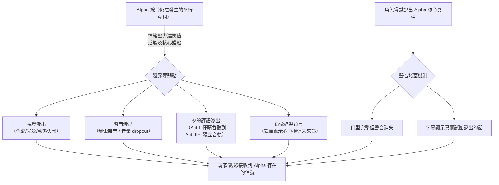

# World Rules & Costs（世界規則與代價）

> **讀者指引**：本文件定義故事世界的所有核心規則。每條規則按「定義→觸發→代價→不可逆→例子」結構書寫。
> 首次閱讀建議從 [§ 三位一體光譜](#rule-trinity-spectrum) 開始，這是理解整個世界的基石。
> 相關文件：[Glossary](02_glossary.md) | [Series Bible](00_series_bible.md) | [Timeline](04_timeline_canon.md)

<!-- Sources: backup/screenwriter/03_Worldview_Setting.md, backup/screenwriter/14_Alpha_Beta_Narrative_Mechanics.md, backup/screenwriter/Magical_Girl_Setting_Detailed_Heart_Container_Device_Destiny.md, backup/screenwriter/08_Emotion_Setting_Overview.md, backup/director/02_Alpha_Line_Integration_Guide.md, backup/director/Worldview_Scene_Analysis.md -->

---

## 文件職責邊界

- 本文件只負責其對應 Canon 範圍，不重寫其他文件的完整內容。
- 術語完整定義只放在 [Glossary](02_glossary.md)。
- 世界規則完整定義只放在 [World Rules](01_world_rules_and_costs.md)。
- 事件時間與因果完整定義只放在 [Timeline](04_timeline_canon.md)。

---
## Worldview Core（世界觀核心）

### 第一公理：唯識宇宙（Consciousness-Centric Universe）（CDL-248）

<!-- Source: AC 2026-04-20 Q-027-01~05 Author Confirmed -->

> **本故事世界的形而上學底層**：靈魂與意志是第一性的，物理世界是第二性的。

**定義**：在這個宇宙中，現實世界並非客觀自存的死物，而是由億萬個靈魂的「共同觀測」與「集體意志」所撐起的**脆弱共識**。集體潛意識並非預設存在的空間，而是由所有靈魂的存在本身「具現化」出來的維度——**集體潛意識的出現，本身即是靈魂存在的終極體現。**

**核心因果鏈**：
> 靈魂（第一性）→ 產生情緒（具物理質量，見[質化法則](#rule-materialization-law)）→ 情感能量匯聚為[集體潛意識](#section-collective-unconscious)（靈魂意志的具現化空間）→ 集體意志共識撐起物理現實（世界的地基）

**物理法則層級**：此為客觀物理事實，非角色哲學詮釋。一切魔法代價、屍骸化、以及世界災難，均是此法則的物理後果。

**靈魂損耗與世界穩定度的三層連動**：

| 損耗層 | 成因 | 現實崩潰表現 | 觸發節點 |
|--------|------|-------------|----------|
| **L1 回聲層損耗（輕度）** | 帝國日常 Emo-Visor 抽取大眾表層情緒 | 城市褪色、植物無法生長、建築加速破敗 | Act I–III 持續積累 |
| **L2 留存海損耗（中度）** | 魔法少女大量屍骸化，[心之器](02_glossary.md#term-heart-vessel)嚴重碎裂 | [現實縫合](02_glossary.md#term-reality-stitching)機制頻繁失效、集體記憶跳幀、空間短暫錯位 / 重力異常 | Act II 後期開始出現 |
| **L3 冥河失衡（重度）** | Alpha 線被抹殺靈魂怨念積累 + 黑奏情緒結算儀式強行抽取深層能量 | [靈魂滲漏](02_glossary.md#term-soul-leakage)與[緋潮](02_glossary.md#term-scarlet-tide)全面爆發；天空出現實體裂縫；集體潛意識（後巷/唐樓）從裂縫上浮侵蝕現實層 | Act IV 決戰期全面引爆 |

**緋潮 vs 現實塌陷（機制區分）**：

| 災難 | 成因 | 本質 |
|------|------|------|
| [緋潮](02_glossary.md#term-scarlet-tide) | 情緒債務（痛苦）超負荷 | 世界免疫系統的**排斥反應** |
| 現實塌陷 | 靈魂地基（意志）大量消失 | 世界承重結構的**物理崩潰** |

**終局錨點（靜止搖籃）**：當世界地基嚴重流失達到閾值，必須有一個擁有極強意志的靈魂主動化身為「終極錨點」——以自身的靈魂質量代替斷裂的地基，否則 Beta 線將在物理上徹底湮滅。晴香最終化身「靜止搖籃（The Static Cradle）」的結構必然性，即源於此物理法則。

**情緒設定在唯識宇宙中的角色定位**：

| 設定 | 在唯識宇宙的本質 |
|------|----------------|
| 質化法則 / 情緒燃料 | 靈魂建構現實的「實體建材」 |
| 調律 / 現實覆寫 | 靈魂間的「現實定義權爭奪戰」 |
| 鏡像法則 | 無靈魂之造物，不配擁有「物理存在」 |
| 情緒守恆 / 緋潮 | 被抹除靈魂的「集體抗議」 |
| 情緒資本主義 | 對世界底層地基的「工業化剝削」 |

**See also**: [集體潛意識](#section-collective-unconscious) | [Soul Mechanics](#section-soul-mechanics) | [緋潮](02_glossary.md#term-scarlet-tide) | [Series Bible: Ontological Premise](00_series_bible.md#section-logline)

---

### 三位一體光譜（Trinity Spectrum）

**定義**：人類、魔法少女、魔法屍骸本質相同，只是處於同一條「情感耗損」光譜上的不同狀態。

| 形態                                         | 光譜位置 | 情緒狀態         | 主題意義                   |
| ------------------------------------------ | ---- | ------------ | ---------------------- |
| 人類                                         | 原點   | 多樣完整         | 連結的價值——即使沒有魔法，態度仍能帶來改變 |
| [魔法少女](02_glossary.md#term-magical-girl)   | 耗損過程 | 與單一情緒諧振，其他萎縮 | 力量的代價——強大即非人化的證明       |
| [魔法屍骸](02_glossary.md#term-magical-corpse) | 最終狀態 | 鎖定於單一負面情緒    | 失去選擇的人——放棄態度自由的代價      |

- **觸發條件**：長期高強度情緒投射、情緒單一化與心匣耗損累積。
- **代價**：個體在光譜上向單一情緒端滑移，社會側形成「人/怪」誤判與獵巫循環。
- **不可逆**：一旦進入屍骸端，僅可改變其面對方式，不能回到未耗損原點。
- **例子**：
  - 體制表層敘事把屍骸定義為「失去意識的空殼」
  - 深層事實顯示屍骸仍存殘餘選擇能力（態度層自由）

**民眾認知演變**：

| 階段 | 對魔法少女 | 對魔法屍骸 | 真相距離 |
|-----|----------|----------|---------|
| 英雄期 | 守護天使、偶像 | 純粹怪物 | 最遠 |
| 質疑期 | 她們是否危險？ | 行為很奇怪… | 開始縮短 |
| 敵視期 | 另一種屍骸 | 也許沒那麼不同？ | 接近 |
| 覺醒期 | 她們與我們，與屍骸… | 他們曾經也是人 | 抵達 |

**See also**: [Glossary: Trinity Spectrum](02_glossary.md#term-trinity-spectrum) | [Gameplay: Social Reputation](10_gameplay_bible.md#section-social-reputation)

---

### 地理與政治

#### 維多利亞城（帝國首都）

帝國的行政與軍事中心。類似老香港的中西文化交匯城市，分為[日區](02_glossary.md#term-sun-district)和[夜區](02_glossary.md#term-night-district)兩個意識形態對立的區域：

- **日區**：人造太陽 24 小時照耀，信奉黑奏為神。建築排斥反光面（無鏡之城），體現「修正」意識形態
- **夜區**：原名靈樹谷/夢離谷。天空被廢氣籠罩，潮濕街道永遠積著水窪（鏡像之城），體現「接納」態度。帝國的「情緒化糞池」

#### 帝國（The Empire）

- **統治者**：帝國皇帝（後期為黑奏）
- **歷史**：為取得夜區[靈樹](02_glossary.md#term-spirit-tree)發動「靈樹戰爭」，大肆屠殺夜區原居民

**實驗鏈演進**（帝國如何從掠奪到「量產魔法少女」的歷史階段）：

1. **基礎研究期**：發動「靈樹戰爭」；捕獲黑奏作為活體樣本
2. **宏觀設施**：建造[維多利亞之淚](02_glossary.md#term-tears-of-victoria)作為中央監控系統
3. **核心技術突破期**：秋穗主導「改變心之器」研究，研發[情緒力量裝置](02_glossary.md#term-emotional-power-device)原型，導致愛莉事故
4. **項目易主期**：黑奏篡位，繼承並扭曲所有實驗成果
5. **技術應用期**：軍方在黑奏主導下大規模「生產」魔法少女

**魔法少女計劃世代**（Unit 編號 = 軍方對復活/改造少女的兵器代號，見 [04_timeline_canon §Unit 01](04_timeline_canon.md#event-unit01)）：

| 階段 | 代表人物 | 體制 | 結果 |
|-----|---------|-----|------|
| 零：原型體 | 黑奏 | — | 所有技術的源頭——被活體解剖逆向工程 |
| 一：徵召兵器（廢棄） | 美夜子 (Unit 01) | 軍事化管理 | 人性不可控導致廢止 |
| 二：放養實驗體（當前） | 晴香、朱音、操 | [潘朵拉協議](02_glossary.md#term-pandora-protocol) | 當前主線階段 |

**See also**: [Timeline](04_timeline_canon.md) | [Entities: Organizations](07_entities_and_devices.md#section-organizations)

#### 魔法少女資質：Alpha 線因果牽連原則

**定義**：成為魔法少女（或被成功改造為兵器）的底層必要條件，是擁有「Alpha 線因果牽連」——靈魂曾被晴香帝國歷 102 年「[改變現實](02_glossary.md#term-reality-override)」的衝擊波所波及。

**帝國的根本盲點**：軍方的「強制提取技術（洗滌式調律、心之器裂解）」只是表面手段。帝國始終不明白為何只有特定少女才能被成功改造——真相是，具有 Alpha 線因果牽連的靈魂，其[心之器](02_glossary.md#term-heart-vessel)本身已對集體潛意識的裂縫產生感應與共振，強制技術才能有效運作。無此連結的人接受同等手段，結果只有死亡或失敗。

**不可逆**：Alpha 線因果牽連無法後天賦予或人工偽造，軍方無法憑技術「製造」具資質的少女，只能從已有資質者身上強制提取。

**美夜子的極端案例**：作為 Alpha 線唯一真正死者、亦是「改變現實」的核心原點，美夜子的 Alpha 線因果烙印是所有魔法少女中最深、最完整的。復活後心之器已徹底碎裂，軍方無需額外強制手段即可完成 Unit 01 鑄造——她是這條規則運作至極端的活體示範。

**See also**: [Alpha 線分歧事件](04_timeline_canon.md#event-alpha-divergence) | [美夜子 Unit 01](03_characters/miyako.md#section-background) | [改變現實](02_glossary.md#term-reality-override)

---

## Soul Mechanics（靈魂本體論）

> **核心前提**：靈魂是先存在的實體，不由腦部產生。這是理解魔法系統、屍骸化、以及晴香「改變現實」能力的基礎。

### 靈魂本體論：單一靈魂原則（Soul Unity Principle）

**定義**：每個人天生只有一個完整的靈魂——一個統一的整體，其中包含理性意識、情感衝動、壓抑記憶等面向，平時高度整合、互相協調。

**分裂的前提**：
- 靈魂**不會自然分裂**，也**不會天生分裂**
- 只有在**極端心理創傷**（例：晴香五歲失親）或**魔法暴力介入**（例：軍方強制改造）下，靈魂才會發生自保性撕裂
- 分裂後產生的獨立意識體（例：夕、黑奏）並非「原本就存在的第二個靈魂」，而是創傷將同一個靈魂撕裂出來的碎片

**See also**: [靈魂分裂機制](01_world_rules_and_costs.md#rule-soul-fragmentation) | [Timeline: 夕の誕生](04_timeline_canon.md#event-yu-birth) | [Haruka](03_characters/haruka.md#section-wnlt)

### 靈魂分裂機制（Soul Fragmentation）

**定義**：在極端情感或魔法介入下，靈魂可以自主或被迫分裂成多個獨立意識體。

**觸發條件**：
1. **創傷觸發**：極端心理創傷引發靈魂自保性分裂（例：晴香的夕）
2. **魔法介入**：強行切割靈魂本體（例：軍方改造、黑奏的操控）
3. **情緒同步失敗**：長期無法整合的衝突欲望導致硬分裂（例：Aya 與黑奏）

**代價**：
- 短期：個體出現「自我對話」、「控制權搏鬥」的主觀感受
- 長期：分裂越久，各靈魂越會發展出獨立的目標與價值觀
- 最終：分裂的靈魂可能成為完全獨立的人格（控制同一個身體，但意識卻有衝突）

**不可逆**：靈魂一旦分裂，無法通過意志強行融合。只可透過[共情連結](02_glossary.md#term-empathy-connection)與心理整合逐漸修復（見 [Haruka 第四幕弧光](03_characters/haruka.md#section-four-act-arc)）。

**保護者人格的自解條件（Protective Alter Dissolution）**：分裂後的意識碎片若以「保護者人格」形式誕生——即核心功能係代主人格承受痛苦、執行主人格不敢做的事——其存在邏輯完全依附於一個前提：「主人格需要被保護」。一旦主人格的創傷被治癒，或主人格選擇自己承擔痛苦，保護者人格即失去繼續存在的底層邏輯，最終自行崩塌或消散。此條件與「不可逆」規則不矛盾——「不可逆」指無法以外力強行消滅分裂；保護者自解是因為存在前提從內部被主人格的選擇移除，而非被外力打敗。**例**：晴香主動面對痛苦後夕的消散；彩選擇自己承擔後黑奏的崩塌（CDL-185 死穴A；見 [彩/黑奏角色檔](03_characters/aya.md#section-backstory-kurokane)）。

**例子**：
- 彩（原靈魂）vs. 黑奏（分裂碎片）：身體相同，目標對立
- 晴香 vs. 夕：最終的融合與共存，而非消滅

### 靈魂抽離與死亡（Soul Extraction = Death）

**定義**：靈魂抽離身體等同死亡。肉身可以被強行保留（屍骸），但靈魂一旦離體，該個體的「自我」即永久消散。

**抽離機制**：
- **主動抽離**：個體自願集中靈魂能量，將之從肉身分離（例：最終決戰中的靈魂共鳴機制）
- **被迫抽離**：強行切割靈魂與肉身的連結（例：某些魔法屍骸的「靈魂榨取」）
- **自然抽離**：心之器完全燃盡或崩潰時，靈魂無法再錨定於肉身

**死亡的確定標記**：
- 不是心跳停止
- 不是腦死亡
- **而是：靈魂與肉身的連結完全斷裂**

**不可逆**：靈魂抽離後，即使用魔法修復肉身，該靈魂也無法被復原。任何「恢復」都是填入一個新的靈魂，而非原個體的重生。

**例子**：
- 屍骸：肉身被保留，但原靈魂已離體，現有的「意識」是被魔法重新填入的新靈魂
- 朱音的犧牲：不是「被打敗」，而是「靈魂主動抽離」，因此無法被任何形式的魔法復活（見 [不可逆規則 #8](01_world_rules_and_costs.md#rule-overload-dispersion-death)）

**See also**: [Glossary: 靈魂](02_glossary.md#term-soul) | [Gameplay: 靈魂抽取](10_gameplay_bible.md#section-soul-extraction)

---

## Magic System（魔法系統）

### 心匣裝置（Heart Container Device）

**定義**：[心匣](02_glossary.md#term-heart-container)並非外部道具，而是魔法少女[心之器](02_glossary.md#term-heart-vessel)在現實世界中的物理延伸。

當少女與力量建立連結時，一部分靈魂本質在現實世界「結晶化」，形成獨一無二的小盒子/墜飾。材質、雕花、紋路直接反映少女靈魂特質。

#### 兩種道路

**A. 自然之道：[鏡中的承諾](02_glossary.md#term-mirror-promise)**
- 使用者：極少數擁有強大意志與天賦者
- 本質：與「理想化的自我倒影」的浮士德式協議——自我對自我的放逐
- 開鎖儀式三部曲：獻祭（情感信物） → 諧振（心匣開啟） → 耗損（留下物理傷痕）

**B. 科技捷徑：[裝置的鑰匙](02_glossary.md#term-emotional-power-device)**
- 使用者：軍方改造的「人型兵器」
- 鑄造過程：將少女精神推至極限 → 心之器產生裂痕 → 收割[情緒結晶](02_glossary.md#term-emotion-crystal)碎片 → 鑄造專屬裝置
- 代價加劇：暴力破解造成不可逆物理損傷，極大加速[情感耗損](02_glossary.md#term-emotional-erosion)

#### 變身的現實縫合機制

**定義**：變身屬局部現實覆寫，而非單純外觀切換。
- **觸發條件**：心匣開鎖並完成最小諧振閾值。
- **代價**：旁觀者產生邏輯補完與記憶植入，事件可見性被扭曲。
- **不可逆**：當次觀測記憶一經補完，無法用主觀意志回溯「變身前畫面」。
- **例子**：聽覺跳幀、視線失焦、短暫停頓。

**See also**: [Glossary: Reality Stitching](02_glossary.md#term-reality-stitching) | [Entities](07_entities_and_devices.md#section-heart-container)

---

### 魔法代價（四層代價體系）

> 統一口徑：情感耗損為主體機制，代謝反應為生理副作用。見 [Decision Log：CF-001](99_decision_log.md#decision-cf001)。

| 層級 | 內容 | 不可逆？ |
|-----|------|---------|
| **即時代價** | 每次開鎖消耗情感信物，心匣留下物理傷痕 | 是（傷痕永存） |
| **累積代價** | 與單一情緒諧振越深，其他情緒感知能力萎縮 | 是 |
| **長期代價** | 情感耗損加速 → 魔法屍骸（心之器破碎）或殘響（心之器燃盡） | 是 |
| **隱藏代價** | 每次使用魔法將負面情緒「轉移」至集體潛意識，累積情緒債務 → [緋潮](02_glossary.md#term-scarlet-tide)反噬 | 是 |

**生理表現**（代謝副作用）：
- 血糖驟降（戰鬥中需高熱量補給：甜甜圈、煉乳；MP系統 = 血糖值 mg/dL，CDL-114）
- 戰後低溫症（熱量榨乾後，即使夏天穿羽絨褸/抱暖水袋，嘴唇長期凍到發紫）
- 手抖、視覺模糊
- 味覺喪失/PTSD感官閃回（入口只嚐到血腥味，CDL-034守恆代價Layer 1延伸）

**魔法器官具體設計（CDL-187）**：
- **光環（Halo）**：魔法輸出增壓閥，非神聖象徵。通過高速旋轉榨取體內情緒能量；輸出過大時像扳手夾緊脖子（光環處決機制前置）；正常戰鬥有輕微持續壓迫感（習慣後不自覺）；長期高輸出=慢性頸椎傷
- **枷鎖紋（Shackle Mark）**：高壓能量流經身體時，關節、鎖骨、手腕等高壓位置浮現發亮烙印暗紋；不是裝飾，是代價刻入肉體的身體提示；每次高強度魔法使用後紋路加深/擴張；濃度積累=屍骸化程度的側面指標；長袖/蕾絲手套偽裝的目標之一（CDL-189）

**情緒視覺詛咒（CDL-188）**：
- **機制**：魔法少女與集體情緒能量長期共振後，發展出「看見他人真實情緒」的感知能力；初期間歇性（誤以為幻覺），後期持續
- **詛咒性質**：毫無屏障地感知他人情緒輻射——衣冠楚楚的慈善家在眼中可能是由貪婪構成的爛肉；笑著的鄰居背後可能具現出想殺人的黑色觸手
- **各角色防禦策略**：朱音=毒品麻醉（最直接）；美夜子=情緒冷漠切斷（隔離法）；操=完美面具/形式主義外殼（表演法）；晴香=天真過濾（誤以為係「強烈同理心」，遊戲UI層呈現CDL-111）

**See also**: [Glossary: Emotional Erosion](02_glossary.md#term-emotional-erosion) | [Glossary: Echo](02_glossary.md#term-echo)

#### 生理排斥法則（Physiological Rejection）
- **定義**：靈魂與肉身對外來高能情緒流的防禦性排斥，常呈現「先狂喜、後反噬」。
- **觸發條件**：高強度情緒投射、反覆超限變身、長時間停留情緒污染區。
- **代價**：[靈魂延遲](02_glossary.md#term-soul-lag)、嘔吐、感官錯位、短暫解離。
- **不可逆**：反覆發作會放大心匣微裂紋，最終推進不可逆崩壞。
- **可視化呈現建議**：先以[諧振的狂喜](02_glossary.md#term-ecstasy-of-resonance)表現誘因，再切入神經性反噬與控制權喪失。
- **例子**：[彩](03_characters/aya.md)在自殘性變身後出現劇烈排斥連鎖反應。
- **See also**：[Visual Bible](06_visual_bible.md#section-law-rejection) | [Decision Log：CF-001](99_decision_log.md#decision-cf001)

**三段症狀鏈（臨床觀察）**：

| 階段 | 視窗 | 主要表徵 | 規則判讀 |
|-----|------|---------|---------|
| 前驅期 | 變身後 0-3 分鐘 | 情緒高揚、痛覺鈍化、判斷過度樂觀 | 屬於「狂喜誘因」，常被誤判為狀態提升 |
| 反噬期 | 3-20 分鐘 | 手抖、嘔吐、視聽錯位、動作延遲 | 進入排斥核心，戰術決策誤差急升 |
| 失配期 | 20 分鐘後或高壓收束時 | 短暫解離、記憶跳段、語意錯置 | 靈魂/肉身同步掉拍，需強制降載 |

**降載規則**：
- 同一作戰窗口若出現兩次以上「失配期」，必須進入低輸出模式。
- 低輸出模式只允許偵查、掩護、撤離，不允許高強度情緒投射。
- 忽略降載規則會提高屍骸化風險，並縮短下一次排斥發作間隔。

---

## Alpha/Beta 雙線敘事機制

> **名詞速查**（首次閱讀必看）：
> - **[Alpha 線](02_glossary.md#term-alpha-line)**：晴香改變現實「之前」的原初世界。美夜子與花子已死，魔法極稀少。這是「事件層面的真相」——What actually happened?
> - **[Beta 線](02_glossary.md#term-beta-line)**：晴香幼年「改變現實」後誕生的新世界。魔法系統、情緒科技、魔法屍骸全從這裡來。這是「態度層面的真相」——我點樣活？
>
> 兩條線不是「真 vs 假」，而是同一現實的兩個切面。完整定義見 [Glossary](02_glossary.md#term-alpha-line)。

### 哲學框架

| 維度 | Alpha 線 | Beta 線 | 關係 |
|------|----------|----------|------|
| 本質定位 | 事件層面的真相 | 態度/意義層面的真相 | 互補而非對立 |
| 回答的問題 | What actually happened? | What it meant? / 我點樣活？ | 事實 vs 詮釋 |
| 時間性質 | 命運層面（已發生） | 態度層面（可選擇） | 不可改變 vs 可以選擇 |
| 真實性 | 事件的真實 | 意義的真實 | 兩者都是「真相」 |

- **定義**：Alpha/Beta 不是真假對立，而是事實層與意義層的雙軌真相系統。
- **觸發條件**：角色進入高壓同步、重大創傷回流或共享印證場景時，雙軌同時被讀取。
- **代價**：若跳過印證直接下結論，會把片段當全貌，導致決策偏差。
- **不可逆**：Alpha 事件事實不可回滾；可調整者僅為 Beta 態度與行動策略。

### Alpha線共存滲透定義（設計者必讀）

**Alpha 線不是「過去」、不是「記憶」、不是「閃回」。**

Alpha 線是一條被壓制但**仍然同時存在**的平行真相，與 Beta 線在同一時空中共存，並主動向 Beta 線滲透。這一定義性規則是理解所有 Alpha 線視覺「出血」效果（Alpha bleed-through）的根本依據。

| 錯誤框架（禁用）| 正確框架 |
|---|---|
| Alpha 是「發生在以前的事情」| Alpha 是「仍在發生的平行真相」|
| Alpha 場景是角色「回憶過去」| Alpha 場景是平行現實滲入當下 |
| Alpha 現象是「創傷閃回」| Alpha 現象是兩條平行現實之間的邊界薄弱點 |
| Beta 覆蓋了 Alpha | Beta 是 Alpha 之上的疊加層；Alpha 仍在 Beta 之下流動 |

**主動滲透機制**：當 Beta 線角色的情緒壓力達到特定閾值，或觸及 Alpha 線的核心錨點（關係、地點、物件）時，Alpha 線會主動向 Beta 線滲透——以視覺重疊、聲音入侵、行為印記等形式顯化。這種滲透不是角色主觀選擇，而是兩條現實之間邊界壓力的被動釋放。**See also**: [§section-alpha-personal-visual](06_visual_bible.md#section-alpha-personal-visual)
- **例子**：
  1. **魔法同步**：快但危險，伴隨感官衝擊
  2. **多人共振驗證**：慢但穩定，透過多路徑印證收斂結論

> 見 [Decision Log：CF-004c](99_decision_log.md#decision-cf004c)

### Alpha線真相「聲音堵塞」機制

當角色嘗試**說出與 Alpha 線相連的核心真相**時，聲音會「堵塞」——物理動作正確（口型、呼吸準備），但聲音無法發出，或以靜電雜音替代。此機制表現規格：

- 說話者的嘴做出完整口型動作，但聲音消失（畫面靜音）
- 或：聲音被低頻靜電雜音取代，字句無法辨識
- 字幕（若有）顯示說話者**實際試圖說出的內容**——聲音消失但字幕顯示真相
- 說話者感覺到自己的聲音「被堵住」，但無法確定是否真的沒有發出聲音
- 例：操試圖對他人說出「我係被爸爸遺棄喺街邊嘅人」時，只發出「我……我……（沉默）」——聲音在最關鍵的詞語上消失 `[BD-06 2026-03-26]`

**觸發條件**：非所有與 Alpha 相關的話語均觸發。只有**對 Beta 線角色直接說出的 Alpha 線核心認知**（通常是角色自身身份、已死之人的存在、或打破 Beta 現實框架的事實陳述）才觸發此機制。

**世界規則解釋**：Beta 線的現實結構對某類「現實裂縫言語」有自動抑制反應——不是敵方力量，而是 Beta 線維持自身現實穩定性的被動機制。堵塞強度與 Beta 線現實穩定性成正比：Beta 線越脆弱，堵塞越少；接近 Act IV 時幾乎不再堵塞。

### Alpha/Beta 入侵機制流程圖

> 各信號的視覺/音頻操作規格見 [§section-alpha-beta-grammar-table](06_visual_bible.md#section-alpha-beta-grammar-table)。夕的聲音三階段規格見 [夕：§section-voice-stage-spec](03_characters/yu.md#section-voice-stage-spec)。

### 同步機制（三階段模型）

> 統一口徑：見 [Decision Log：CF-004a](99_decision_log.md#decision-cf004a)

| 階段 | 描述 | 強度 |
|-----|------|------|
| **啟動**（變身時） | 靈魂被迫接觸原初記憶，同步啟動 | 中 |
| **持續**（戰鬥中） | 魔法使用越多，同步越強烈 | 遞增 |
| **回流**（解除變身時） | 防護罩卸除，殘餘記憶回流衝擊——此時最為強烈 | 最強 |

不同角色的高峰時刻因心理創傷類型而異。

**觸發規律**：
- 初期：偶爾發生（角色以為是身體不適）
- 中期：頻率增加（影響日常生活）
- 後期：持續存在（Alpha/Beta 線同時感知的精神分裂狀態）

**同步交錯觸發矩陣**：

| 場景條件 | 交錯風險 | 常見誤判 | 規則處置 |
|---------|---------|---------|---------|
| 高情緒密度戰區 + 連續開鎖 | 極高 | 把 Alpha 記憶湧入當成戰術直覺 | 立即縮短輸出節奏，改為共享印證 |
| 單人長時追擊 + 低睡眠 | 高 | 把 Beta 意義投射當成客觀事實 | 強制加入第二觀察者交叉確認 |
| 解除變身後立即復戰 | 極高 | 忽略回流期，把失配當「可硬扛」 | 設置冷卻窗口，禁止即時再變身 |
| 社會壓力峰值日（風評崩盤） | 中高 | 把外部敵意內化為 Alpha 必然命運 | 優先執行命名與情緒標定程序 |

**與共享印證的邊界**：
- 同步給的是「高壓原始片段」，不是最終結論。
- 結論層必須經 [共享印證機制](#rule-shared-validation) 收斂，才可進入行動決策。
- 任何未印證同步片段，只能作為「待驗線索」。

### 命名機制

將「唔舒服」的模糊感受轉化為「我係怕 X / 我係羞恥 X」的具體認知。命名即掌控——體現「態度」的力量。

### 共享印證機制

Alpha 線的「可信度」建立在**共享印證**上：
- 多人多路徑印證（不同角色各自見到的內容可能不同，但描述/錨點一致）
- 物件一致、地標一致、短句一致作為輔助
- 避免「用魔法才知道真相」的單一通道

### 全員 Alpha 原傷五步通用模板（CF-T19）

每位核心角色的人物弧光遵循以下五步模板，對應「情緒守恆定律」的個人體現：

| 步驟 | 名稱 | 定義 |
|------|------|------|
| 1 | **Alpha 原傷** | 在 Alpha 線中受到的核心創傷（命定的痛苦） |
| 2 | **童願** | 因創傷在幼年許下的意念（「如果我能…就好了」） |
| 3 | **Beta 修正** | 晴香的大願在 Beta 線「修正」了童願——給予了對應的能力或改變 |
| 4 | **守恆反噬** | Beta 修正的代價——痛苦沒有消失，只是轉移到另一個地方 |
| 5 | **態度缺口** | 角色面對守恆反噬時的認知空白——治癒之路的起點 |

**設計原則**：Beta 修正不是「解決」Alpha 原傷，而是「改變了痛苦的形狀」。守恆反噬揭示了這一點。角色的弧光完成 = 在態度缺口中找到自己的答案。

**See also**: [情緒守恆定律](#rule-emotion-conservation) | [Glossary: 態度 vs. 命運](02_glossary.md#term-attitude-vs-fate)

### 晴香創世事件（規則影響）

**關鍵事件摘要**（事件年份與順序見 [Timeline](04_timeline_canon.md#event-alpha-divergence)；口徑見 [Decision Log：CF-002](99_decision_log.md#decision-cf002)）：
- 幼年晴香目睹不明攻擊者攻擊家園
- 母親花子和姊姊美夜子同時在她面前被殺
- 晴香的「潛力之種」被極端創傷激活，向[集體潛意識](02_glossary.md#term-collective-unconscious)發出願望
- 創造了 Beta 線——一個「她們沒有死」的平行現實

**Beta 線的詛咒遺產**：
1. 魔法少女系統的誕生
2. [Emo-Visor](02_glossary.md#term-emo-visor) 的出現
3. 魔法屍骸的蔓延
4. 角色的個人詛咒

**最殘酷的諷刺**：晴香不知道自己創造了 Beta 線。

### 因果逆流與黑奏的借來神力（Causal Backflow）

<!-- Sources: backup/screenwriter/14_Alpha_Beta_Narrative_Mechanics.md -->

**定義**：黑奏的神力並非源自黑奏本身，而是源自晴香**未來**施展「改變現實」的時間因果逆流。

**運作機制**：
1. **未來的原因**：晴香在最終決戰中施展「改變現實」，將情緒能量逆流穿越集體潛意識
2. **過去的結果**：這股逆流能量穿越時間軸，附著在幼年黑奏身上
3. **時間悖論**：黑奏的力量來自晴香的未來；晴香改變現實的能力來自靈魂覺醒；但靈魂覺醒本身又被黑奏的出現所觸發——完美的自洽閉環

**詛咒循環**：
- 黑奏必須持續收割晴香的情緒能量以維持借來的神力
- 黑奏的神力本身就來自晴香的未來改變現實
- 因此黑奏無法殺死晴香，只能「囚禁」晴香，確保未來的改變現實會如期發生
- 這形成時間層面的「互相囚禁」：黑奏被綁在晴香的宿命上，晴香被綁在黑奏的存在上

**代價與限制**：
- 黑奏的力量會隨晴香成長而消耗（借來的能量在「被使用」時會回流向未來的施展源）
- Aya 的必要性：Aya 需要貼近晴香，才能維持靈魂本體與集體潛意識的連結，進而維持能量供給通道
- 力量失效時刻：當晴香決定「不改變現實」（第四幕覺悟）時，整個因果鏈條斷裂，黑奏的力量瞬間消失

**See also**: [Timeline: 黑奏創傷事件](04_timeline_canon.md#event-kurokanae-trauma) | [Antagonist](03_characters/aya.md#section-kurokane)

### Beta 線詛咒遺產第四類（Personal Curses）

<!-- Sources: backup/screenwriter/14_Alpha_Beta_Narrative_Mechanics.md -->

**延伸定義**：「角色的個人詛咒」（Beta 線詛咒遺產第 4 項）是晴香幼年願望的直接後果。

**三個關鍵案例**：

| 受詛咒者 | 詛咒起源 | 詛咒內容 | 弧光 |
|--------|--------|--------|------|
| **[美夜子](03_characters/miyako.md)** | 晴香 5 歲的願望「如果姊姊變成貓仔就唔會受傷」 | [避難所詛咒](02_glossary.md#term-shelter-curse)：被困在黑貓形態 11 年，直到破碎詛咒才能恢復人形 | 從「被保護者」成為「保護者」；詛咒破碎後獲得正常死亡的權利 |
| **[夕](03_characters/yu.md)** | 晴香幼年無法承認的 Alpha 線真相 | 潛意識人格分裂：被迫承載所有被壓抑的記憶與情緒，無法融合 | 從「對立人格」成為「共存夥伴」 |
| **[晴香的情緒增幅器](03_characters/haruka.md)** | 晴香 5 歲的悲痛與無力感 | 情緒倍增詛咒：周圍人的感受會被她放大至失控程度，害怕傷害他人 | 從「逃避增幅」成為「承擔濾網」；最終成為世界的情緒容器 |

**不可逆**：詛咒無法消除，只能被接納與轉化。美夜子破碎詛咒後獲得「正常死亡」，本質上是「用新的方式存活著詛咒」。

**See also**: [Timeline: Alpha 線分歧事件](04_timeline_canon.md#event-alpha-divergence) | 各角色檔案

---

## Emotion System（情緒系統）

### 情緒守恆定律

**定義**：痛苦不會消失，只會轉移。情緒是遵循守恆原理的能量形式。

**核心機制**：
- Alpha 線是「債權人」——Beta 線被魔法消除的痛苦都變成情緒債務
- 魔法少女戰鬥時，並非消滅敵人，而是將債務推進集體潛意識深處
- 累積的負面情緒超過臨界值 → [緋潮](02_glossary.md#term-scarlet-tide)（強制破產/清算）

**與魔法少女系統的關聯**：
- 裝置並非「淨化」負面情緒，而是「排放」到集體潛意識
- 核電廠隱喻：能產生巨大能量（奇蹟），但製造劇毒核廢料（未處理的痛苦）

**故事內三層揭示結構（CDL-247）**：觀眾/角色在Act II中透過三個階段逐步理解守恆定律的完整意義：

| Layer | 揭示時間 | 認知內容 | 效果 |
|-------|---------|---------|------|
| Layer 1（個體生理代價） | Act II Phase B（恐怖家家酒）| 角色自身生理代價明顯升級（味覺/感知損耗）；以為只是「個人體力耗損」 | 不安感開始累積 |
| Layer 2（局部系統轉移） | Act II Phase C（地下化後）| 發現愛莉作為活體濾心正在痛苦過濾全城情緒廢料；代價沒消失，只是轉移給無辜第三方 | 道德負罪感爆發 |
| Layer 3（宏觀物理法則）| Act II Phase D（秋穗身份揭露）| 秋穗以研發者身份正式命名「情緒守恆定律」；前兩層被統一為不可違逆的物理法則後果 | 英雄敘事底層邏輯破產 |

Layer 4 及以後仍在後幕（Act III/IV）。

**See also**: [Glossary: Emotion Conservation](02_glossary.md#term-emotion-conservation) | [Band-Aid Philosophy](02_glossary.md#term-band-aid-philosophy)

### 緋潮

**定義**：緋潮是世界免疫系統對 Beta 偏移的強制校正反應。
- **觸發條件**：情緒債務累積超過閾值，且回流通道同時開啟。
- **代價**：現實層遭受群體性情緒倒灌，社會秩序與認知濾鏡同步失穩。
- **不可逆**：已釋放的校正壓力不能被「單次勝利」清零，只能以承擔路徑消化。
- **例子**：緋潮視覺、重疊哀鳴、被抹除人形殘影回返。

### 情緒資本主義

- **定義**：帝國把情緒視作可抽取、封裝、交易的資產，形成制度化情緒經濟。
- **觸發條件**：中央監控（[維多利亞之淚](02_glossary.md#term-tears-of-victoria)）與消費端（[Emo-Visor](02_glossary.md#term-emo-visor)）同時運作。
- **代價**：日區快樂由夜區承擔等量痛苦，社會性債務持續堆高。
- **不可逆**：結構一旦成形，會自我強化階級差與情緒剝削鏈。
- **市民的核心誤解（CDL-176）**：日區市民相信維多利亞之淚是「永動機」——無需代價地產生快樂。真實結構是情緒抽水泵，只是轉移代價而非消除代價。整個情緒資本主義制度的合法性建立在這個「永動機幻象」上；幻象瓦解（緋潮）即制度崩潰。
- **例子**：
  - [食罪者](02_glossary.md#term-sin-eaters)作為活體過濾器
  - [睡夢紡織工](02_glossary.md#term-dream-weavers)作為活體計算核心
  - [情緒美食家](02_glossary.md#term-emotion-gourmets)黑市化高純度情緒

### 集體潛意識

**定義**：作為「[唯識宇宙](#rule-consciousness-centric-universe)」的底層介面，世界層情緒網絡與免疫中樞，負責承載、回流與校正情緒債務。
- **觸發條件**：高密度情緒輸出、時間線縫合、或心匣超限運作時，與現實層耦合加深。
- **代價**：耦合過深會導致記憶滲漏、意識滯留與現實邊界變薄。
- **不可逆**：核心錨定記憶不可抹除，只可改寫其被讀取方式。
- **例子**：
  - 具現化場景：無盡後巷與舊唐樓構成的超現實香港景觀（CDL-186）
  - 進入窗口：清醒夢、靈樹或愛莉等高匯聚節點

**戰場視覺設計（CDL-186）**：
- **氣氛細節**：潮濕青苔石板地、永遠積水的水窪反射昏黃霓虹燈光、緊密密麻麻的舊唐樓陽台、高懸衣服被無風吹動；非抽象星空，係共享情緒記憶具現化的日常恐怖
- **夜區呼應**：集體潛意識視覺刻意呼應夜區現實（潮濕/後巷/廢氣），暗示夜區係集體潛意識最薄的邊界點
- **風暴期視覺**：愛莉潛意識風暴時，黑色淤泥夾雜成千上萬人的痛苦尖叫與Emo-Visor強制快樂的狂笑；「扭曲人臉」與「笑著的黑色人形」隨淤泥湧出（全城被過濾掉的痛苦具現化）
- **紙皮騎士**：風暴中以盾牌擋住黑泥，哭泣：「好苦……這些東西好苦……」

**三層結構（CF-T13）**：

| 層別 | 名稱 | 內容 | 可達者 |
|------|------|------|--------|
| L1 | **回聲層** | 表層情緒；即時情緒反應的殘留 | 所有人（做夢即可觸及） |
| L2 | **留存海** | 記憶存檔；沉澱的情感印記 | 魔法少女、覺醒者 |
| L3 | **冥河** | 未處理的哀傷與情緒廢料的終點；俗稱「陰渠水」「苦水井」 | 僅晴香、黑奏、夕等最深潛者可達 |

**See also**: [Glossary: 集體潛意識](02_glossary.md#term-collective-unconscious) | [World Immune System](#section-world-immune-system)

### 夢境進入集體潛意識（三層規則）（CF-T22）

夢境是進入集體潛意識的主要通道，但不同人可達到不同深度：

| 夢境等級 | 內容 | 可達者 | 限制 |
|----------|------|--------|------|
| **Level 1 象徵夢** | 象徵性畫面，進入 L1 回聲層 | 所有人 | 只提供方向，不提供真相 |
| **Level 2 共視夢** | 多人可分享的共同夢境，進入 L2 留存海 | 魔法少女 | 可見他人記憶殘片，但需印證 |
| **Level 3 Alpha 真殘片** | 直接接觸 L3 冥河的 Alpha 線原始記憶 | 晴香、黑奏、夕（及愛莉的閘口功能） | 真正的時間線跳躍只屬於改變過現實者 |

**核心規則**：夢只提供方向；任何「只靠夢境得到的結論」必須經[共享印證機制](#rule-shared-validation)驗收，才可進入行動決策。

### 靈魂潛航：進入他人心房的代價與規則（Soul Dive）

<!-- Sources: backup/screenwriter/03_Worldview_Setting.md §靈魂潛航規則；整合榮格心理空間框架（2026-04-23） -->

進入他人心房（潛意識空間）是一場以**心理建築空間**為介面的極度危險行動。潛航者從[集體潛意識](02_glossary.md#term-collective-unconscious)的唐樓走廊出發，逐層深入目標的心理防禦空間。

**硬性前提條件：**
- 潛航者必須持有「**共鳴門匙**」——一件與目標有深刻情感連結的信物，或雙方共享的刻骨銘心記憶。無門匙則無法在集體潛意識走廊中定位目標門牌。
- 目標處於**清醒且完全抗拒**狀態時，絕對無法強行進入。前門只在目標虛弱、昏迷、或內心深處主動渴望被救時出現可進入的狀態。

**五層空間代價表：**

| 層次 | 空間 | 心理對應 | 入侵阻力 | 潛航代價 |
|---|---|---|---|---|
| **1** | 前門/鐵閘 | 對外防禦界線 | 鐵閘封死程度正比於目標封閉程度；強行爆門引發潛航者精神震盪 | 強行突破 → 即時精神震盪反傷；被動等待 → 時間消耗，潛航者持續暴露於集體潛意識噪音污染 |
| **2** | 客廳/天台 | 社交面具與逃避幻想 | 完美佈置的假象空間，困住無法識破謊言的入侵者 | 若未能識破 Persona 幻象 → 意識迷失在表層，無法深入；識破後留下心理接觸痕跡（事後可被目標感知） |
| **3** | 廚房 | 情感匱乏與執念 | 執念具現化為持續的環境攻擊體（不需目標主動操控） | 承受情感匱乏的「共感詛咒」——潛航者短暫吸收目標的情緒傷害，可能遺留情緒殘留污染 |
| **4** | 臥室 | 私密自我與心之器 | 最隱蔽；通往此層的入口通常被物理或心理障礙封堵 | 直接接觸目標[心之器](02_glossary.md#term-heart-vessel)——潛航者自身心之器承受共鳴壓力，龜裂風險上升 |
| **5** | 地下室 | 潛意識與陰影（Shadow） | 連接集體潛意識暗渠；被壓抑創傷以戰鬥體形式出現；光源歸零 | 最高強度環境傷害；創傷錨點污染風險（潛航後遺留對方創傷記憶碎片）；人格同化風險（長時間逗留可令潛航者局部失去自我邊界） |

**核心規則：**
- 潛航不是程序化推進——目標的心理空間會**主動排斥**，而非被動等待被解謎
- 進入深度越深，潛航者返回現實的難度越高；地下室逗留過久可能令意識永久殘留在對方心房中
- 真正的治癒（陰影整合）或最危險的對決，永遠發生在地下室——此規則不可繞過
- 潛航完成後，雙方靈魂均留有接觸印記，無法抹除

**See also**: [靈魂潛航](02_glossary.md#term-soul-dive) | [Heart-Chamber](02_glossary.md#term-heart-chamber) | [夢境進入集體潛意識](#rule-dream-entry) | [集體潛意識](#section-collective-unconscious) | [Visual Bible: 心房室內視覺](06_visual_bible.md#section-heart-chamber-interior)

### 情緒燃料的極性分類（Emotion Fuel Polarity）

<!-- Sources: backup/screenwriter/08_Emotion_Setting_Overview.md -->

**定義**：情緒能量具有兩種基本極性，分別對應不同的施展風險與代價：

| 極性 | 名稱 | 特性 | 消耗速度 | 代價 |
|------|------|------|---------|------|
| **正向** | 繃帶型燃料（Bandage-Type） | 希望、信任、愛、勇氣 | **快速消耗** | 施展後迅速耗盡，需頻繁補充 |
| **負向** | 毒藥型燃料（Poison-Type） | 憤怒、絕望、憎恨、復仇心 | **持久存在** | 施展後持續積累在心之器中，加速心之器龜裂 |

**核心差異**：
- 繃帶型燃料雖然消耗快，但不會「毒害」心之器；魔法少女可以長期依賴正向情緒而不破裂
- 毒藥型燃料雖然持久，但每次使用都會在心之器內沉澱毒素；即使暫時不用，毒素仍會積累，令心之器持續龜裂

**特殊情況 — 晴香的轉化能力**：
- 晴香擁有獨有的天賦：能將毒藥型燃料轉化為繃帶型燃料
- 這份能力是她成為「[整合者](02_glossary.md#term-integrator)」候選的根本原因
- 但轉化需要極高的精神耗損，過度使用會導致她自身的心之器快速衰退

**See also**: [Haruka 的特殊能力](03_characters/haruka.md) | [Glossary: Emotion Fuel](02_glossary.md#term-emotion-fuel)

### 情緒連結三層級（Three Levels of Emotion Link）

<!-- Sources: backup/screenwriter/08_Emotion_Setting_Overview.md -->

**定義**：魔法少女之間可建立情緒連結，強度分為三個等級，每一級都對應不同的同步風險與斷裂後果。

| 層級 | 名稱 | 條件 | 同步深度 | 斷裂後果 |
|------|------|------|---------|---------|
| **L1** | 表面共感（Surface Resonance） | 短期配合、戰術協作 | 能感知對方的當下情緒 | 無傷害；關係淡化 |
| **L2** | 深層共鳴（Deep Resonance） | 長時間親密共鬥（數週以上）、信任累積 | 能分享對方的創傷記憶碎片、內心秘密 | 短期精神混亂、決策干擾；數日恢復 |
| **L3** | 靈魂融合（Soul Fusion） | 最深層信任、生死承諾、或被迫強行連結 | 兩個靈魂的邊界開始模糊；完全透明化 | **強制斷裂導致靈魂受損**：可能引發人格分裂、永久性創傷、甚至死亡 |

**L3 斷裂規則（不可逆）**：
- 強制切斷 L3 連結等同於撕裂兩個靈魂的一部分
- 斷裂後，雙方都會喪失部分自我認知與情緒感知能力
- 例：操與紗夜的連結被黑奏強制斷裂，導致操長期精神分裂

**敘事功能**：
- L1 失敗：只影響戰術配合
- L2 失敗：角色陷入短期心理危機，但有恢復空間
- L3 失敗：劇情級別的轉折，角色人生軌跡永久改變

**See also**: [Timeline: 情緒連結首戰](04_timeline_canon.md#event-emotion-link-first) | [Glossary: Emotion Link](02_glossary.md#term-emotion-link)

### 生存情緒不可收割規則（Survival Emotions Cannot Be Harvested）

<!-- Sources: backup/screenwriter/08_Emotion_Setting_Overview.md -->

**定義**：「生存情緒」（恐懼、憤怒、痛苦）無法被收割或轉化為魔法燃料。

**三類生存情緒**：
1. **恐懼**：生物的求生本能；強行抹除導致主體喪失危機意識，即時死亡
2. **憤怒**：自衛反應；強行抹除導致主體無法抵禦外來威脅
3. **痛苦**：創傷信號；強行抹除導致主體無法感知身體損傷

**收割的後果**：試圖收割生存情緒等同於收割生存意志本身 → **即時死亡**

**為何黑奏只能收割「高階情緒」**：
- 黑奏雖然掌握情緒收割技術，但受限於此規則
- 她無法直接從目標身上收割生存基礎情緒
- 因此她的策略轉為：逐步摧毀受害者的「高階情緒」（希望、自尊、連結感），使其自願放棄生存意志
- 這是為什麼黑奏的折磨往往比直接殺害更有效——她在製造「自願死亡」的心理條件

**See also**: [情緒守恆定律](#rule-emotion-conservation) | [Antagonist](03_characters/aya.md#section-strategy)

### 結痂機制（Scar Formation）

<!-- Sources: backup/screenwriter/08_Emotion_Setting_Overview.md -->

**定義**：情緒創傷無法完全治癒時，靈魂自動在傷口周圍形成「情緒疤痕」（結痂）以達到暫時穩定。

**結痂 ≠ 痊癒**：
- 結痂是靈魂的被動自衛反應，不是主動治癒
- 傷口被結痂封住，但傷口本身未曾消失——只是不再出血
- 靈魂在結痂後的「彈性」永久降低（無法再像創傷前一樣自由変化）

**形成條件**：
- 情緒創傷的療程被迫中斷
- 傷口暴露時間過長，導致防禦機制自動啟動
- 個體選擇「接納傷口而非治療傷口」

**代表案例 — [美夜子](03_characters/miyako.md)的帶結痂存活**：
- 美夜子是世界上第一個「帶結痂存活」的案例
- 她的[避難所詛咒](02_glossary.md#term-shelter-curse)與靈魂受損無法被治癒，只能被接納
- 當詛咒被破碎時，她獲得了「正常死亡」的權利——但這也意味著終身與結痂同在
- 美夜子的 Happy Ending 精確定義：「帶著結痂活到八十歲，以人類身份自然老死」

**治癒與結痂的區別**：

| 面向 | 治癒 | 結痂 |
|------|------|------|
| 靈魂狀態 | 傷口消失，恢復原態 | 傷口被密封，永久改變 |
| 行為能力 | 恢復全部彈性 | 該方向的彈性永久降低 |
| 時間成本 | 需要漫長過程（可能失敗） | 自動發生（確保存活） |
| 代價 | 無；純正面 | 失去某些可能性 |

**See also**: [Miyako 的四幕弧光](03_characters/miyako.md#section-four-act-arc) | [情緒守恆定律](#rule-emotion-conservation)

---

## 世界免疫系統理論（World Immune System Theory）

<!-- Sources: backup/screenwriter/11_Deep_Philosophy_Concepts.md#世界免疫系統 -->

> **核心反轉**：我們一直以為緋潮是病毒、魔法是抗體；但在夕改變現實的那一刻才明白——魔法才是止痛藥（強行麻醉），而緋潮是世界對謊言的免疫排斥反應（嘔吐）。

### 整個世界是有機體

**定義**：把世界比喻為「正在自我修復的有機體」。在這個框架下，所有核心元素在夕改變現實前後意義發生 180° 翻轉：

| 核心元素 | 王道/戰鬥誤解 | 治癒/心理真相 |
|---------|-------------|-------------|
| **魔法少女變身** | 盔甲——為保護世界而穿的戰衣 | 解離——為不感受痛苦而穿的拘束衣。變身 = 拒絕承認受傷的自己 |
| **鏡子** | 詛咒——映照怪物的恐怖通道 | 診斷書——唯一敢說真話的東西，映照出被壓抑的哭聲 |
| **改變現實（夕）** | 奇蹟——修正悲劇的終極手術 | 截肢——暴力切除痛苦記憶，無痛苦記憶即無完整人格 |
| **緋潮** | 天災——必須被消滅的惡意 | 免疫反應——世界對謊言的過敏。壓抑越多（魔法），反撲越猛（緋潮）|
| **魔法屍骸** | 怪物——需要被消滅的威脅 | 壞死組織——無法代謝的痛苦沉澱物，最需要被「看見」的重症患者 |

### 病理光譜（三位一體的醫學重讀）

「三位一體」不是三個種族，而是**同一個靈魂在不同病理階段的形態**：

| 形態 | 免疫系統隱喻 | 對「治癒」的誤解 |
|-----|------------|----------------|
| **人類** | 帶菌者——靠自身免疫力（哭泣、傾訴）勉強平衡 | 誤以為「不痛」就是健康，所以拼命隱藏傷口 |
| **魔法少女** | 重症服藥者——必須依賴魔法（止痛藥）維持人形，外表光鮮，內裡腐爛 | 誤以為「更強的魔法」能治好病，結果藥物成癮（力量依賴）|
| **魔法屍骸** | 病變體——藥物失效，痛苦徹底吞噬外殼，變成扭曲的真實模樣 | 被視為怪物要消滅，其實是最需要被「看見」的重症患者 |

**See also**: [三位一體光譜](#rule-trinity-spectrum) | [執念飽和度](#rule-obsession-saturation)

### 固態與液態的轉化

- **觸發條件**：夕以「改變現實」試圖抹除所有屍骸（固態痛苦）
- **機制**：情緒守恆定律——被粉碎的屍骸失去固體形態，化為**液態緋潮**
- **視覺真相**：緋潮不是紅色液體，而是無數融化的屍骸面孔與未能成為魔法少女的痛苦靈魂
- **代價**：修正規模越大，免疫排斥越劇烈（操人偶事件是微縮預演）
- **不可逆**：已觸發的免疫反應不能被「再一次修正」壓制

**See also**: [情緒守恆定律](#rule-emotion-conservation) | [緋潮](#rule-scarlet-tide)

### 執念飽和度（Saturation of Obsession）

**定義**：人類與魔法屍骸的界線不是物種，而是執念的飽和度。

| 狀態 | 定義 |
|------|------|
| **人類（動態平衡）** | 情緒多樣流動——今天生氣，明天可以原諒 |
| **屍骸（靜態死循環）** | 某種情緒佔據 100% 靈魂容量，其他情緒被排擠，失去「改變」的可能性 |

- **唯一界線**：「你能否控制情緒，還是情緒在控制你？」
- **現實諷刺**：為金錢六親不認的富豪、為主義屠殺異己的狂熱分子，在本設定中已是屍骸，只是披著人皮
- **逆向案例**：若一隻魔法屍骸仍存有一絲猶豫或愧疚，靈魂上比那些富豪更接近「人類」

**朱音案例**：朱音對小光的愛佔據 100% 靈魂容量，排擠了其他理性判斷。極致的愛本身就是一種詛咒。

**See also**: [三位一體光譜](#rule-trinity-spectrum) | [屍骸化與修正力](#rule-corpseification)

### 治癒失敗三種呈現（CF-T23）

治癒失敗不是「壞人不想被救」，而是有三種各自不同的心理結構：

| 類型 | 名稱 | 核心機制 | 代表角色 |
|------|------|---------|---------|
| **A 型** | 拒絕被救 | 接受「被理解」本身會迫使承認傷口仍在——以激烈反彈把「被看見」解讀為威脅 | 朱音 |
| **B 型** | 選錯止痛藥 | 找到了緩解痛苦的方法，但該方法本身製造新的傷害（成癮、完美主義、偽裝） | 操（完美偽裝）|
| **C 型** | 用犧牲逃避 | 以犧牲或自毀作為「正當理由」逃避面對內在創傷；犧牲看起來高尚但本質是迴避 | 美夜子（介錯人執著）|

**敘事規則**：三型失敗都有各自的「看起來像在好轉」的假象，創作者需確保讀者/玩家能辨識其差別，而非混淆為同一種「固執」。

### 治癒的唯一路徑

**結論（對主題的昇華）**：

1. 痛苦不能被消滅，只能被接納
2. 武裝自己（變身）是逃避，卸下武裝才是勇氣
3. 我們都是潛在的屍骸，差別只在於是否願意承認
4. 真正的治癒不是「變得完美」，而是「與傷痕共存」

**晴香的最終行動**：在漫天緋潮前主動解除魔法少女形態，張開雙手讓緋潮（世界的痛苦）吞沒自己。這不是自殺，這是「我看見妳們了，我承認這份痛，回來吧」。

**See also**: [Series Bible: Dark Healing](00_series_bible.md#section-dark-healing) | [緋潮](#rule-scarlet-tide) | [Haruka: 第三選擇](03_characters/haruka.md)

---

### 情緒視覺（Emotional Qualia）

<!-- Sources: backup/screenwriter/11_Deep_Philosophy_Concepts.md#情緒視覺 -->

**定義**：魔法少女進化出「情緒感官」——一種超越視覺的感知維度，可感知他人情緒的真實狀態。

| 普通人眼中 | 魔法少女的情緒視覺 |
|-----------|----------------|
| 衣冠楚楚的帝國慈善家 | 一團由貪婪和色慾構成的漆黑爛肉 |
| 骯髒瘋癲的流浪漢 | 發出純金色神聖光芒（內心純粹善良） |
| 笑臉迎人的鄰居 | 背後具現化的想殺人黑色觸手 |

- **觸發條件**：魔法少女覺醒後自然具備，強度隨耗損加劇
- **代價**：無法閉合——看穿謊言是詛咒，不是天賦
- **不可逆**：無法選擇性關閉，需要麻醉自己才能在人群中生存

**為何魔法少女會崩潰**：
- 美夜子冷漠 → 情緒隔離
- 朱音吸毒 → 麻醉感知
- 操戴面具 → 偽裝防禦

**See also**: [Glossary: 共感詛咒](02_glossary.md#term-empathy-curse) | [三位一體光譜](#rule-trinity-spectrum)

---

## 鏡像法則

### 核心定義

**定義**：反光介面可繞過 Beta 覆寫，回傳未被修飾的真實狀態。
- **觸發條件**：存在完整反射面（鏡、水、拋光金屬）且觀測者進入高情緒或高衝突狀態。
- **代價**：觀測者會承受高強度認知失配（自我形象與映照結果衝突）。
- **不可逆**：鏡像揭示出的 Alpha 事實不可由主觀意志覆蓋。
- **例子**：
  - 情緒投射具現物在鏡中缺席
  - 屍骸由怪物映照回生前殘片
  - 美夜子、夕、操在高壓段落出現反向映照

**See also**: [Glossary: Mirror Law](02_glossary.md#term-mirror-law)

---

## 情緒投射系統

### 情緒投射（Emotional Projection）

**定義**：以情緒能量介入 Alpha 約束的核心機制。
- **觸發條件**：魔法少女與目標建立可維持的情緒共振回路。
- **代價**：短期提升控制力，長期提高耗損與認知偏差風險。
- **不可逆**：高強度情緒投射一旦越權，會留下跨場景債務痕跡。
- **例子**：下列流派與層級路徑。

**兩大流派**：

| 流派 | 方法 | 哲學 | 代表 |
|-----|------|------|------|
| **強行抹除式** | 洗滌式——粗暴壓抑雜音，強行覆寫 | 逃避痛苦 | 帝國、黑奏 |
| **共情承擔式** | 共鳴式——理解並整合創傷 | 面對痛苦 | 晴香（後期） |

**層級**（從低到高）：
1. [情緒承接](02_glossary.md#term-emotional-resonance)：共情承擔式流派的底層機制（集體潛意識物理接觸→世界免疫繞過→情緒守恆完成）
2. [情緒投射](02_glossary.md#term-tuning)：實踐機制
3. [現實縫合](02_glossary.md#term-reality-stitching)：變身（局部覆寫）
4. [現實覆寫](02_glossary.md#term-reality-override)：世界級改變（禁忌）

### 屍骸化與修正力

- **定義**：屍骸化是多因素失衡下的結果，不是單一心理事件的直線後果。
- **觸發條件**：長期高壓輸出、命名失敗、結構性創傷累積與修正力介入同時成立。
- **代價**：自我結構由可修復裂縫滑向功能性崩解，行為與認知同步失穩。
- **不可逆**：進入崩解段後只可延緩，不可回到未耗損狀態。
- **例子**：在高壓作戰循環中，未面對 Alpha 會作為風險乘數放大崩解速度。

#### **屍骸化的終極物理機制：靈魂困禁 (CDL-271)**

屍骸化不是靈魂永久離體，而是靈魂因執念被困肉體的悲劇性結果。

**三層機制**：

1. **靈魂的逃離本能**
   - 魔法少女/感染者承受極大創傷或長期高壓時，靈魂本能地想扯斷因果線，逃入集體潛意識的深海尋求安息
   - 觸發條件同上（長期高壓、創傷累積、修正力介入）

2. **執念的物理錨點**（0.1 秒決定時刻）
   - 就在因果線即將「啪」一聲完全斷裂的最後瞬間，靈魂突然想起最放不下的人/事
   - 這份強烈的「愛/執念」變成物理錨點，強行扣住即將斷開的因果線
   - 例：小光想起朱音、婆婆想起孫女、操想起紗夜

3. **結果：靈魂被困肉體**
   - 因為執念，靈魂無法完全逃脫，被半吊子地困在一具已經被情緒廢料倒灌、異化成怪物的肉體裡面
   - 靈魂只能控制 1% 的肉體動作，其餘 99% 被怪物本能主導
   - 心之器最後 1% 的碎片（帶著執念）不消散，而是嵌入肉體組織成為「鎖鏈」，永遠困住靈魂

**靈魂的狀態**：

| 層面 | 狀態 |
|-----|------|
| **靈魂控制力** | 固定 1%（絕望的無力感） |
| **情緒廢料主導** | 99%（盲目攻擊、自我毀滅） |
| **執念碎片** | 最後一塊心之器碎片，物理鎖死靈魂於肉體 |
| **可能的微動作** | 抱著信物、說一句殘破對白、眼神一瞬間清醒 |

**屍骸為何仍有記憶、執念、人性動作**：因為靈魂（記憶、人格、執念的載體）仍然被困在肉體內，只是控制力極度受限。屍骸不是「無意識的空殼」，而是「被困在地獄中的靈魂」。

**See also**: [The Unsevered Thread](02_glossary.md#term-unsevered-thread) | [Heart-Vessel](02_glossary.md#term-heart-vessel) | [Emotional Erosion](02_glossary.md#term-emotional-erosion)

---

## 不可逆規則摘要

1. **情緒守恆**：痛苦不會消失，只會轉移
2. **Alpha 線事實**：已發生事件無法改變（除非付出創世級代價）
3. **情感耗損**：心匣傷痕、情緒萎縮不可逆轉
4. **心之器燃盡**：靈魂徹底消散，無法復原
5. **因果債務累積**：情緒廢料持續累積直到反噬
6. **記憶錨定**：原有情緒記憶錨定在集體潛意識中，無法抹除
7. **鏡像法則**：鏡子反映的 Alpha 線真相無法被覆寫
   - **碎裂預言補充**：當角色的心之器被負向情緒深度龜裂時，鏡面還會顯示「該角色如果繼續下去可能到達的碎裂狀態」——這不是敵人的幻術，而是鏡面對心之器現實狀態的誠實投射。例：晴香在極度憤怒時可能在鏡中看見燃燒黑色眼睛的自身倒影（與黑奏特徵相同）；這是晴香距離「成為自己所恨之物」的距離測量，是鏡面對她的警告，非敵方操控。此機制適用於所有角色。
8. **過載消散 = 永久死亡**：魔法少女以過載轉化（主動將剩餘生命力全數轉化為魔力自爆釋放）而消散，等同靈魂永久死亡。任何現實修改力量——包括晴香的[改變現實](02_glossary.md#term-reality-change)能力——均無法復原。消散後唯一存在形式為物質遺留（如糖果山）。此規則不等同普通魔法少女消散（意識可能殘存），而是特指「以生命力為代價的主動過載」。<!-- Sources: backup/screenwriter/02_Secondary_Character_Background_Story.md（朱音自爆段落）; Q-005 A 定案 -->
9. **光環處決 = 同頻過載切線（CF-T30）**：光環處決的本質是系統偵測到「情緒同頻過載」後強制切斷連線——並非主動懲罰，而是魔法系統的超載保護機制失控的結果。切得太猛會扭斷人。**欠債門檻規則**：情緒守恆欠債逾期積累越高，光環處決的觸發門檻越低（即：欠債越多，越容易在更低的輸出量下觸發過載切線）。此為不可逆風險規則——一旦欠債積累到臨界值，即使謹慎操作也無法完全避免風險。<!-- Sources: CF-T30 裁決 -->

- **主題用途**：此節只定義不可逆邊界，命題層收束交由 [Series Bible](00_series_bible.md#section-core-theme) 與 [Glossary](02_glossary.md#term-attitude-vs-fate)。

---

## 低科技生存文化規則（母文檔補齊）

> 本節只定義「規則效應」，物件細節統一見 [Entities](07_entities_and_devices.md)。

### 金魚雷達規則
- **定義**：低成本情緒異常預警工具，偵測局部情緒湍流。
- **觸發條件**：接近高執念區域或屍骸群聚點。
- **代價**：高誤報率，長時間依賴會削弱使用者主觀判讀能力。
- **不可逆**：無。
- **例子**：[Gameplay 戰術物品](10_gameplay_bible.md#section-tactical-items)。

### 金夫人花露水規則
- **定義**：以嗅覺干預降低目標短時敵意的民間對抗技術。
- **觸發條件**：近距離噴灑並保持視線脫離敵意刺激源。
- **代價**：只延遲爆發，無法清除執念核心。
- **不可逆**：無。
- **例子**：求救型屍骸可獲得更長安撫窗口。

### 替死鬼假人規則
- **定義**：戰場仇恨重導向裝置，把敵方注意力暫時引流到替身目標。
- **觸發條件**：視線可見範圍內部署並成功建立「假生命信號」。
- **代價**：失效後會引發更高反撲仇恨。
- **不可逆**：無。
- **例子**：高壓救援關卡的撤退窗口建立。

### 樹窿電話亭規則
- **定義**：匿名情緒排放節點，允許市民在不暴露身份下宣洩痛苦。
- **觸發條件**：城市夜區節點運作正常。
- **代價**：只降低表層壓力，不處理結構性創傷來源。
- **不可逆**：無。
- **例子**：社會風評進入「裂痕期」時使用頻率暴增。
