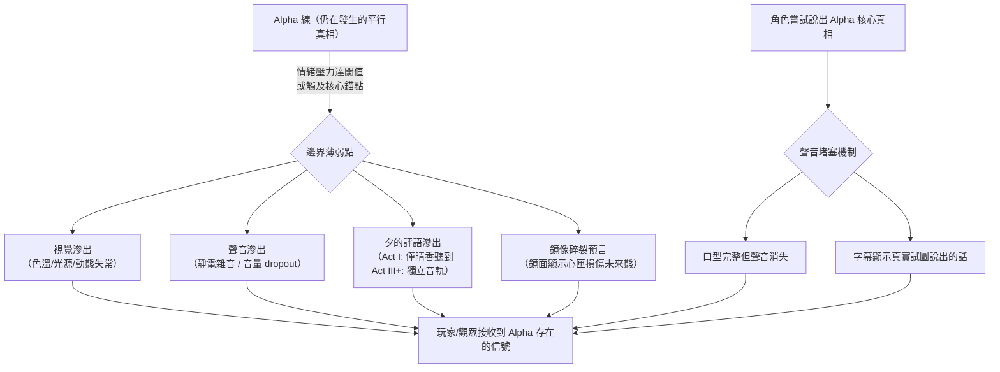

# World Rules & Costs（世界規則與代價）

> **讀者指引**：本文件定義故事世界的所有核心規則。每條規則按「定義→觸發→代價→不可逆→例子」結構書寫。
> 首次閱讀建議從 [§ 三位一體光譜](#rule-trinity-spectrum) 開始，這是理解整個世界的基石。
> 相關文件：[Glossary](02_glossary.md) | [Series Bible](00_series_bible.md) | [Timeline](04_timeline_canon.md)

<!-- Sources: backup/screenwriter/03_Worldview_Setting.md, backup/screenwriter/14_Alpha_Beta_Narrative_Mechanics.md, backup/screenwriter/Magical_Girl_Setting_Detailed_Heart_Container_Device_Destiny.md, backup/screenwriter/08_Emotion_Setting_Overview.md, backup/director/02_Alpha_Line_Integration_Guide.md, backup/director/Worldview_Scene_Analysis.md -->

---

## <a id="section-scope"></a>文件職責邊界

- 本文件只負責其對應 Canon 範圍，不重寫其他文件的完整內容。
- 術語完整定義只放在 [Glossary](02_glossary.md)。
- 世界規則完整定義只放在 [World Rules](01_world_rules_and_costs.md)。
- 事件時間與因果完整定義只放在 [Timeline](04_timeline_canon.md)。

---
## <a id="section-worldview-core"></a>Worldview Core（世界觀核心）

### <a id="rule-consciousness-centric-universe"></a>第一公理：唯識宇宙（Consciousness-Centric Universe）（CDL-248）

<!-- Source: AC 2026-04-20 Q-027-01~05 Author Confirmed -->

> **本故事世界的形而上學底層**：靈魂與意志是第一性的，物理世界是第二性的。

**定義**：在這個宇宙中，現實世界並非客觀自存的死物，而是由億萬個靈魂的「共同觀測」與「集體意志」所撐起的**脆弱共識**。集體潛意識並非預設存在的空間，而是由所有靈魂的存在本身「具現化」出來的維度——**集體潛意識的出現，本身即是靈魂存在的終極體現。**

**核心因果鏈**：
> 靈魂（第一性）→ 產生情緒（具物理質量，見[質化法則](#rule-materialization-law)）→ 情感能量匯聚為[集體潛意識](#section-collective-unconscious)（靈魂意志的具現化空間）→ 集體意志共識撐起物理現實（世界的地基）

**物理法則層級**：此為客觀物理事實，非角色哲學詮釋。一切魔法代價、屍骸化、以及世界災難，均是此法則的物理後果。

**靈魂損耗與世界穩定度的三層連動**：

| 損耗層 | 成因 | 現實崩潰表現 | 觸發節點 |
|--------|------|-------------|----------|
| **L1 回聲層損耗（輕度）** | 帝國日常 Emo-Visor 抽取大眾表層情緒 | 城市褪色、植物無法生長、建築加速破敗 | Act I–III 持續積累 |
| **L2 留存海損耗（中度）** | 魔法少女大量屍骸化，[心之器](02_glossary.md#term-heart-vessel)嚴重碎裂 | [現實縫合](02_glossary.md#term-reality-stitching)機制頻繁失效、集體記憶跳幀、空間短暫錯位 / 重力異常 | Act II 後期開始出現 |
| **L3 冥河失衡（重度）** | Alpha 線被抹殺靈魂怨念積累 + 黑奏情緒結算儀式強行抽取深層能量 | [靈魂滲漏](02_glossary.md#term-soul-leakage)與[緋潮](02_glossary.md#term-scarlet-tide)全面爆發；天空出現實體裂縫；集體潛意識（後巷/唐樓）從裂縫上浮侵蝕現實層 | Act IV 決戰期全面引爆 |

**L3 冥河與緋潮嘅關係（CDL-326）**：緋潮並非獨立於 L3 之外嘅另一種現象——凡人所見嘅緋潮（地底滲出嘅紅光、屍骸化風險提升）其實只係 L3 冥河（世界未處理哀傷嘅終極匯聚點）壓力過大時滲漏出嚟嘅表徵。L3 本身依然係「終點/沉澱處」而非「源頭」，但因為佢係哀傷嘅終極匯聚點、密度最高，世界級動作（如「改變現實」）汲取力量時自然會由呢層取用最多——一個滿溢嘅蓄水池，同時都係最方便汲水嘅地方。真正嘅「地方」一直存在，凡人接觸唔到，只有最深潛者（晴香、黑奏、夕）先有能力真正進入。

**緋潮 vs 現實塌陷（機制區分）**：

| 災難 | 成因 | 本質 |
|------|------|------|
| [緋潮](02_glossary.md#term-scarlet-tide) | 情緒債務（痛苦）超負荷 | 世界免疫系統的**排斥反應** |
| 現實塌陷 | 靈魂地基（意志）大量消失 | 世界承重結構的**物理崩潰** |

**終局錨點（靜止搖籃）**：當世界地基嚴重流失達到閾值，必須有一個擁有極強意志的靈魂主動化身為「終極錨點」——以自身的靈魂質量代替斷裂的地基，否則 Beta 線將在物理上徹底湮滅。晴香最終化身「靜止搖籃（The Static Cradle）」的結構必然性，即源於此物理法則。

**情緒設定在唯識宇宙中的角色定位**：

| 設定 | 在唯識宇宙的本質 |
|------|----------------|
| 質化法則 / 情緒燃料 | 靈魂建構現實的「實體建材」 |
| 調律 / 現實覆寫 | 靈魂間的「現實定義權爭奪戰」 |
| 鏡像法則 | 無靈魂之造物，不配擁有「物理存在」 |
| 情緒守恆 / 緋潮 | 被抹除靈魂的「集體抗議」 |
| 情緒資本主義 | 對世界底層地基的「工業化剝削」 |

**Alpha/Beta 線集體潛意識狀態對照**：

| 維度 | Alpha 線（客觀因果主導） | Beta 線（晴香創世後） |
|---|---|---|
| **集體潛意識狀態** | 靜默/待機——情緒能量被物理因果律慣性壓制，無法大規模具現 | 激活——晴香奇蹟強行撬開閘門，情緒能量可直接覆寫物理現實 |
| **魔法出現** | 僅以極微概率殘留（低魔） | 情緒能量直接轉化為可觀測魔法現象（高魔） |
| **死亡處理** | 靈魂消散，肉體自然腐爛（熵增） | 靈魂困禁（CDL-271）；肉體被強制封裝為魔法屍骸 |
| **情緒外溢效應** | 近乎零——廢料被物理慣性吸收，不積累為情緒債務 | 顯著——每次魔法使用將負面情緒壓入集體潛意識，形成情緒債務（→緋潮）|

**晴香創世的本質**：並非「創造了魔法」，而是**改變了集體潛意識的存取權限**——從靜默待機（Alpha）強行切換為激活模式（Beta）。魔法作為現象始終潛藏於唯識宇宙底層；晴香的奇蹟只是打開了一扇被物理慣性牢牢封閉的閘門。

**See also**: [集體潛意識](#section-collective-unconscious) | [Soul Mechanics](#section-soul-mechanics) | [緋潮](02_glossary.md#term-scarlet-tide) | [Series Bible: Ontological Premise](00_series_bible.md#section-logline)

---

### <a id="rule-trinity-spectrum"></a>三位一體光譜（Trinity Spectrum）

**定義**：人類、魔法少女、魔法屍骸本質相同，只是處於同一條「情感耗損」光譜上的不同狀態。

| 形態                                         | 光譜位置 | 情緒狀態         | 主題意義                   |
| ------------------------------------------ | ---- | ------------ | ---------------------- |
| 人類                                         | 原點   | 多樣完整         | 連結的價值——即使沒有魔法，態度仍能帶來改變 |
| [魔法少女](02_glossary.md#term-magical-girl)   | 耗損過程 | 與單一情緒諧振，其他萎縮 | 力量的代價——強大即非人化的證明       |
| [魔法屍骸](02_glossary.md#term-magical-corpse) | 最終狀態 | 鎖定於單一負面情緒    | 失去選擇的人——放棄態度自由的代價      |

- **觸發條件**：長期高強度情緒投射、情緒單一化與心匣耗損累積。
- **代價**：個體在光譜上向單一情緒端滑移，社會側形成「人/怪」誤判與獵巫循環。
- **不可逆**：一旦進入屍骸端，僅可改變其面對方式，不能回到未耗損原點。
- **例子**：
  - 體制表層敘事把屍骸定義為「失去意識的空殼」
  - 深層事實顯示屍骸仍存殘餘選擇能力（態度層自由）

**民眾認知演變**：

| 階段 | 對魔法少女 | 對魔法屍骸 | 真相距離 |
|-----|----------|----------|---------|
| 英雄期 | 守護天使、偶像 | 純粹怪物 | 最遠 |
| 質疑期 | 她們是否危險？ | 行為很奇怪… | 開始縮短 |
| 敵視期 | 另一種屍骸 | 也許沒那麼不同？ | 接近 |
| 覺醒期 | 她們與我們，與屍骸… | 他們曾經也是人 | 抵達 |

**See also**: [Glossary: Trinity Spectrum](02_glossary.md#term-trinity-spectrum) | [Gameplay: Social Reputation](10_gameplay_bible.md#section-social-reputation)

---

### <a id="rule-three-pathways"></a>三路線心之器改造體系（Three Pathways of Heart-Vessel Restructuring）[NEW]

**定義**：帝國與黑奏針對不同「護甲資質」的少女，採用的三套不同改造邏輯。三路線核心區別不在改造技術，而在「護甲是否存在」導致的必然分化。

| 路線 | 資質條件 | 心之器狀態 | 自我意識 | 選擇權 | 情緒採集品質 | 最終歸宿 |
|-----|---------|----------|--------|-------|-----------|---------|
| **路線 1** | 有護甲（Alpha 線因果牽連者） | 逐步受損但保有完整性 | ✓ 完整 | ✓ 完整 | 高品質、多層次、穩定 | 屍骸化或主動選擇犧牲 |
| **路線 2** | 無護甲（非因果牽連者） | 結構性毀滅（碎片強行黏合於生肉裝甲） | ✗ 分裂/無 | ✗ 無 | 最高純度（絕望飽和） | 必然屍骸化 → 路線 3 |
| **路線 3** | 無護甲 + 無心之器 | 無心之器 | ✗ 消散 | ✗ 無 | 低純度（情緒迴響） | 提煉為毒品原料 |

**路線 1 設計**：護甲保護允許使用者保留主體性。帝國無法完全控制她們，但她們仍可提供高品質情緒數據（因為保有完整情緒範圍）。[潘朵拉協議](02_glossary.md#term-pandora-protocol)本質上是利用她們的自發性與主人格來收集數據。

**路線 2 設計**：護甲缺失導致心防內化裝置強制成功。無意識兵器無法選擇，但正因此能被強制驅動至「極端痛苦與絕望」的狀態。帝國寧願要無人性但高品質原料，也不要有自主性的中等品質。

**路線 3 設計**：終局廢棄物。無心之器即無戰鬥能力，只有提煉價值。低品質情緒迴響被大規模收集作為基礎膠囊原料——市民級 Emo-Visor 的主要來源。

**與情感採集系統的連環**：
- 路線 1 提供「中端用戶級別」膠囊（魔法少女的高品質真實情緒）
- 路線 2 提供「成癮者級別」膠囊（無意識兵器的極致絕望，成癮性最強）
- 路線 3 提供「基礎消費級別」膠囊（大眾廉價膠囊，品質低但量大）

**See also**: [Glossary：護甲](02_glossary.md#term-armor-protection) | [Glossary：無意識兵器](02_glossary.md#term-unconscious-weapon) | [情感採集系統](02_glossary.md#term-emotional-logger) | [Entities：心防內化裝置](07_entities_and_devices.md#section-trauma-cage) | [Entities：The Unlinked](07_entities_and_devices.md#section-unlinked)

---

### <a id="section-geography-politics"></a>地理與政治

#### <a id="rule-victoria-city"></a>維多利亞城（帝國首都）

帝國的行政與軍事中心。類似老香港的中西文化交匯城市，分為[日區](02_glossary.md#term-sun-district)和[夜區](02_glossary.md#term-night-district)兩個意識形態對立的區域：

- **日區**：人造太陽 24 小時照耀，信奉黑奏為神。建築排斥反光面（無鏡之城），體現「修正」意識形態
- **夜區**：原名靈樹谷/夢離谷。天空被廢氣籠罩，潮濕街道永遠積著水窪（鏡像之城），體現「接納」態度。帝國的「情緒化糞池」

> **Alpha/Beta 線的城市形態差異（CDL-286）**：維多利亞城的城市結構係 Alpha/Beta 兩線共享的帝國歷史產物。關鍵差異在於**能量等級**：Alpha 線魔法極稀少，靈樹（夜區神聖節點）僅有微弱精神磁場；帝國雖發動靈樹戰爭並開始建造維多利亞之淚，但因缺乏高魔能量，該設施停滯為**廢棄金屬結構**，無法作為情緒抽水泵運作。Beta 線晴香創世後靈樹能量爆發，帝國才將廢棄結構活化為完整的情緒監控中樞。「維多利亞之淚」作為功能性設施**僅存在於 Beta 線**。

#### <a id="rule-empire"></a>帝國（The Empire）

- **統治者**：帝國皇帝（後期為黑奏）
- **歷史**：為取得夜區[靈樹](02_glossary.md#term-spirit-tree)發動「靈樹戰爭」，大肆屠殺夜區原居民

**實驗鏈演進**（帝國如何從掠奪到「量產魔法少女」的歷史階段）：

1. **基礎研究期 [CDL-306/307]**：發動「靈樹戰爭」；戰場魔法殘留物回收隊在螢死亡現場偵測到異常高讀數（慘死+彩人格分裂的衝擊點），連同螢的遺體一併回收研究；捕獲彩（黑奏宿主）作為活體樣本深度研究——並非隨機戰俘，而係呢個異常現場嘅連帶產物。研究手段包含早期情緒壓抑/測量技術原型（後來演化為[情緒力量裝置](02_glossary.md#term-emotional-power-device)／[Emo-Visor](02_glossary.md#term-emo-visor)），此階段收集的數據直接餵入第3階段秋穗的技術突破
2. **宏觀設施**：建造[維多利亞之淚](02_glossary.md#term-tears-of-victoria)作為中央監控系統
3. **核心技術突破期**：秋穗主導「改變心之器」研究，研發[情緒力量裝置](02_glossary.md#term-emotional-power-device)原型，導致愛莉事故——技術根基部分承襲自第1階段對黑奏的實驗數據（秋穗未必知悉/承認此淵源）
4. **項目易主期**：黑奏篡位（103年，CDL-305），繼承並扭曲所有實驗成果；同時**親自發起搜尋螢「靈魂容器」計劃**（見下表 Stage 1）
5. **技術應用期**：軍方在黑奏主導下大規模「生產」魔法少女

**魔法少女計劃世代**（Unit 編號 = 軍方對復活/改造少女的兵器代號，見 [04_timeline_canon §Unit 01](04_timeline_canon.md#event-unit01)）：

| 階段 | 代表人物 | 體制 | 結果 |
|-----|---------|-----|------|
| 零：原型體 | 黑奏 | — | 帝國軍用情緒技術體系（情緒力量裝置／Emo-Visor／離解兵器）的源頭——被活體解剖逆向工程（79-103年，戰場異常回收研究的產物）。**註（CDL-389）**：綾小路家族另有一條獨立技術線（見[操角色檔](03_characters/ayakomoji_misao.md#母親完美的活體人偶)），源頭獨立於此軍用體系；兩者均建基於晴香創世（102年）之後「情緒/生理可被技術操控」呢個大前提，各自摸索出唔同技術路徑，從未交叉。**補充（CDL-401，2026-08-27）**：呢條家族技術線本質係純心理層面嘅意識壓制/順從鎖定，唔涉及心之器操作，故常規情況下對母親呢類冇魔法崩壞嘅對象純粹產生普通人偶化；但機制筆記指出，若施加喺一個獨立正經歷緊魔法相關崩壞（沿[靈魂距離光譜](#rule-corpseification)滑向解離兵器/屍骸）嘅人身上，意識鎖定嘅副作用理論上可以將該人「凍結」喺施術嗰一刻嘅光譜位置——純屬未來可能用到嘅機制推演，並非任何具名角色已發生嘅事件，詳見[操角色檔案](03_characters/ayakomoji_misao.md#母親完美的活體人偶)對應段落 |
| 一：徵召兵器（廢棄）[CDL-307] | 美夜子 (Unit 01)、凜 | 軍事化管理；黑奏親自主導搜尋螢的靈魂容器 | 目標係搵到可承載螢靈魂碎片嘅肉身容器；反覆失敗，意外產生大量「無意識魔法少女」（見[護甲](02_glossary.md#term-armor-protection)／離解兵器機制）；凜與美夜子因帶有晴香五歲奇蹟願望的殘留印記（護甲效應）而保留完整人性——正是這種「人性不可控」導致 Stage 1 被廢止 |
| 二：放養實驗體（當前） | 晴香、紫音、操 | [潘朵拉協議](02_glossary.md#term-pandora-protocol) | 策略轉向：不再直接搜索容器，改為耐心培養晴香做「中央節點」——三階段終極目標一致（尋回螢），僅手段演化。**註（2026-08-26）**：三人同屬呢個戰略階段，但入手方式唔一致——操／紫音行嘅係下面§1「命運偶遇假象」（裝置被帝國刻意遺棄，扮命運）；晴香作為呢個階段嘅中心目標，入手方式獨立且更專屬——裝置嚟自美夜子（見[故事開端](04_timeline_canon.md#event-story-begin)：「貓型美夜子將裝置交給晴香，姊妹不知情重逢」），唔係帝國遺棄嘅裝置，兩者唔應混為一談 |

#### <a id="rule-pandora-protocol-mechanics"></a>潘朵拉協議社會機制（CDL-125）

**運作原理**：帝國以「社會化放養」代替軍事管理，讓具資質的少女在不知情的情況下自願成為魔法少女。

**關鍵設計層次**：

1. **命運偶遇假象**：帝國大數據監控鎖定具特定心理創傷特質的潛在適格者，將情緒力量裝置刻意「遺棄」在她們必經之處，製造「被魔法選中」的命運感。少女完全不知自己係帝國主動篩選的目標。

2. **市民認知框架**：在市民眼中，魔法少女≠政府公務員，而係「命運選中的民間英雄」。帝國透過官方光幕濾鏡持續強化「少女自發使命感」的敘事，令大眾從不質疑選召機制的制度性本質。

3. **Reality Show 社會定位**：官方（警方、市長辦公室）與民間（商業協會、粉絲組織）向魔法少女發出委託；戰鬥以直播形式公開，市民歡呼、打賞、討論賠率。帝國在幕後做莊——透過維多利亞之淚光幕系統收割觀眾崇拜情緒，同時經由裝置後門精確提取少女的情緒燃燒數據。

4. **監控後門**：魔法少女不知情緒力量裝置內置帝國監控後門（單向數據傳輸）。表面=健康監控功能（如血糖手錶，CDL-110/114）；真相=情緒增幅器波動實時監測系統，傳回帝國實驗室完善共振地獄計劃。

5. **晴香的IG線**：晴香自發高頻更新社交媒體（強行營業），出於個人拯救者情結與美夜子的「維多利亞天使」謊言，完全不知自己是帝國棋子。自發行為的真誠性反而令帝國的公眾形象更具說服力。

**設計意涵**：潘朵拉協議的殘酷不在強制，而在於少女的自發性和善意被精確利用——她們越熱血，帝國的數據越豐富。

**See also**: [Timeline](04_timeline_canon.md) | [Entities: Organizations](07_entities_and_devices.md#section-organizations)

#### <a id="rule-alpha-qualification"></a>魔法少女資質：Alpha 線因果牽連原則

**定義**：成為魔法少女（或被成功改造為兵器）的底層必要條件，是擁有「Alpha 線因果牽連」——靈魂曾被晴香帝國歷 102 年「[改變現實](02_glossary.md#term-reality-override)」的衝擊波所波及。

**帝國的根本盲點**：軍方的「強制提取技術（洗滌式調律、心之器裂解）」只是表面手段。帝國始終不明白為何只有特定少女才能被成功改造——真相是，具有 Alpha 線因果牽連的靈魂，其[心之器](02_glossary.md#term-heart-vessel)本身已對集體潛意識的裂縫產生感應與共振，強制技術才能有效運作。無此連結的人接受同等手段，結果只有死亡或失敗。

**不可逆**：Alpha 線因果牽連無法後天賦予或人工偽造，軍方無法憑技術「製造」具資質的少女，只能從已有資質者身上強制提取。

**黑奏的特殊案例（CDL-287）**：黑奏遵從相同底層規則——Alpha 線創傷（螢死亡，帝國歷79年）令其靈魂產生共振插座。其魔法力量並非來自 Beta 線的常規魔法系統，而是晴香帝國歷102年「改變現實」時，龐大的創世因果能量逆流擊中黑奏（因 Alpha 線創傷已具共振條件），疊加同年「鐵絲網偶遇」中晴香潛意識許願，雙重因果將高魔能量精準賦予黑奏人格。黑奏因此成為唯一以原始創世能量（而非衍生魔法系統）驅動的魔法實體。見 [aya.md §section-backstory-kurokane](03_characters/aya.md#section-backstory-kurokane)。

**美夜子的極端案例**：作為 Alpha 線唯一真正死者、亦是「改變現實」的核心原點，美夜子的 Alpha 線因果烙印是所有魔法少女中最深、最完整的。復活後心之器已徹底碎裂，軍方無需額外強制手段即可完成 Unit 01 鑄造——她是這條規則運作至極端的活體示範。

**跨路線適用範圍澄清（CDL-399，2026-08-26）**：Alpha 線因果牽連（護甲／路線 1）呢條前提，唔止適用於 Stage 1 軍方直接改造（[軍方：魔法少女改造計劃](07_entities_and_devices.md#section-org-military)，已正式廢止嘅歷史階段，適用人物僅美夜子、凜，具體轉化機制已刻意留白——舊版四步驟流程經查證從未實際套用於任何角色，已刪除），亦同樣適用於 Stage 2 現行嘅[潘朵拉協議](#rule-pandora-protocol-mechanics)路線（適用人物：晴香、紫音、操）。兩條路線用嘅係同一套路線 1/2/3 因果牽連判定邏輯，分別只在於帝國嘅執行手法（Stage 1 = 軍方強制搜索容器；Stage 2 = 潘朵拉協議嘅自願式放養），唔係兩套獨立資格規則——本條 Alpha 線因果牽連原則本身完全不受本輪修正影響，改動嘅純粹係「呢條規則之前係用邊個角色／邊個機制做例證」呢一層。

**See also**: [Alpha 線分歧事件](04_timeline_canon.md#event-alpha-divergence) | [美夜子 Unit 01](03_characters/miyako.md#section-background) | [改變現實](02_glossary.md#term-reality-override) | [軍方：魔法少女改造計劃](07_entities_and_devices.md#section-org-military) | [潘朵拉協議社會機制](#rule-pandora-protocol-mechanics)

#### <a id="rule-armor-debt-compensation"></a>護甲的真正本質：情緒守恆定律的強制代價補償（CDL-402）

**定義**：[護甲](02_glossary.md#term-armor-protection)唔係恩賜，唔係祝福，唔係晴香刻意送出嘅禮物——佢係[情緒守恆定律](#rule-emotion-conservation)冷酷、機械、強制性嘅代價補償，specifically 欠俾每一個俾晴香帝國歷 102 年「[改變現實](02_glossary.md#term-reality-override)」波及嘅少女，因為呢個現實覆寫喺未經佢哋同意嘅情況下，打斷／覆寫咗佢哋原本嘅 Alpha 線人生。

**唔係溫暖，係核數**：情緒守恆定律本身已確立係一條徹底 amoral、機械式嘅法則——[秋穗個案](03_characters/akiho.md#section-archetype)已經清楚示範咗呢點：「情緒守恆定律機械式計數欠債，完全唔理會加害者事後有幾真誠嘅悔意」（見[自我消解——非魔法少女嘅欠債終局](#rule-debt-dissolution)，CDL-394）。法則從來唔度量「幾真誠」「幾應該」，佢淨係計數。護甲呢層補償用嘅係同一套邏輯，只不過方向相反——法則唔止會向欠債者追數，佢同樣會向「被拎走咗啲嘢」嘅一方強制發放對應嘅補償，唔多唔少，純粹核數。

**每個角色嘅「Beta 修正」欄，就係呢層補償嘅具體帳目**：[紫音](03_characters/iwakura_akane.md)同[操](03_characters/ayakomoji_misao.md)嘅角色檔案已經各自有一個「Beta 修正」欄位，寫低咗晴香嘅大願喺 Beta 線點樣具體換咗嘢俾佢哋——紫音換到「魔法力量並成為戰鬥型少女——夠強、抗打、能保護人」；操換到「綾小路家族喺 Beta 線恢復體面——名門、財富、社會地位全數回歸」。兩個個案都清楚示範咗呢個補償嘅本質：攞走咗嘅係原本嘅 Alpha 線人生，換返嚟嘅係力量／財富／身分——而呢份「換返嚟」往往本身已經係一個新傷口（操嘅體面最終變成父親安排嘅性別重置枷鎖；紫音嘅力量最終令佢私藏嘅高純度情緒結晶毒死咗自己嘅弟弟），唔係一份乾淨嘅禮物。[美夜子](03_characters/miyako.md)嘅[避難所詛咒](02_glossary.md#term-sanctuary-curse)同[凜](03_characters/rin.md)「由 Alpha 線嘅暖色系偶像變成 Beta 線精準型軍方兵器」，雖然冇用返一模一樣嘅表格格式，但本質上係同一種補償帳目——原本命定嘅人生被攞走，換返嚟嘅係另一種存在方式（黑貓形態嘅延命／精準兵器化嘅情緒凍結），同樣係代價，唔係恩典。

**呢個機制解釋咗點解好多魔法少女對自己嘅力量有種複雜、經常帶埋怨恨嘅關係**——佢哋唔淨係喺反應自己個人具體嘅遭遇；佢哋（喺故事中段之前，通常都未有自覺意識到呢層更深嘅機制——呢個必須維持係一種**戲劇反諷**，留俾觀眾／故事後段揭露，唔係角色目前已知、可以拎嚟討論嘅嘢）其實一直喺孭緊「自己原本人生被攞走」呢份實物賠償。

**呢個亦令晴香自己嘅內疚有咗機械式嘅具體性**——唔再係抽象嘅罪咎感：每一個隊友嘅力量／詛咒，對晴香嚟講，都係一張可追蹤嘅收據，寫低咗自己嗰個五歲行為到底攞走咗佢哋啲乜。

**See also**: [情緒守恆定律](#rule-emotion-conservation) | [護甲](02_glossary.md#term-armor-protection) | [自我消解——非魔法少女嘅欠債終局](#rule-debt-dissolution) | [秋穗：機械式核數](03_characters/akiho.md#section-archetype) | [紫音：Beta 修正](03_characters/iwakura_akane.md) | [操：Beta 修正](03_characters/ayakomoji_misao.md)

---

#### <a id="rule-victoria-drainage"></a>維多利亞之淚範圍——戰鬥殘餘代價嘅排走機制

> **作者2026-08-25自由form討論確認（CDL-398）**——正式編號已登記入 `canon/_working/CANON_DECISION_LOG.md`。

**定義**：戰鬥中使用魔法會產生殘餘情緒／生理代價，根據[情緒守恆定律](#rule-emotion-conservation)，呢份代價唔會憑空消失，必然要有出口。[維多利亞之淚](07_entities_and_devices.md#section-org-victoria)嘅覆蓋範圍，決定咗呢份代價有冇正常排走嘅出口。

**範圍內——正常排走**：戰鬥發生喺維多利亞之淚覆蓋範圍之內，呢份殘餘代價會透過現有採集基建安全帶走——即[Emo-Visor Gen 3](07_entities_and_devices.md#section-emo-visor)採集端「通過魔法少女鑰匙與全民監控系統採集三級品質情緒訊號」呢條已有機制，將代價轉化做可被系統處理嘅情緒訊號，抽走、分級、送落地底。

**範圍外——冇出口，代價自留體內**：戰鬥發生喺覆蓋範圍之外，呢份殘餘代價冇對應嘅排走管道，只能積聚喺戰鬥者自己身體入面，加速佢原有嘅身體代價／屍骸化風險軌跡。**呢度唔新增任何獨立嘅生理訊號**——用嘅係每個角色早已確立嘅個人化 Body Horror 進程（見[魔法代價：四層代價體系](#rule-magic-cost)嘅黑色眼淚／哥德尖刺萌生通用進程，或者個別角色已有嘅專屬崩壞線，例如[操](03_characters/ayakomoji_misao.md)牙齒鬆動→絲線縫牙→靈魂層冷化），純粹令呢條已有嘅崩壞線加速推進，唔係一個新嘅獨立警報訊號。

**例外——晴香與愛莉嘅心理完整例外**：呢條規則唔適用於已經達成真正自我和解／心理完整狀態嗰個時間點之後嘅晴香同愛莉。同「壓抑稅」——守恆定律 Layer 1 嘅個人化變數（CDL-357，見 [haruka.md](03_characters/haruka.md)）嗰條邏輯一致——晴香喺完成接納旅程之後，「可樂失味」呢層額外代價消失，唔係因為佢用少咗力量，而係因為冇咗壓抑帶嚟嘅額外負擔；同一個道理，一個已經心理完整、自我和解嘅魔法少女，佢嘅力量唔再產生需要外部處理嘅同類殘餘，所以唔再需要依賴採集基建先可以安全處理戰鬥代價。**必須明確**：呢個豁免係關於「呢個故事時間點已經達成嘅心理完整狀態」，唔係關於出身或者物種層級嘅特殊地位——晴香同愛莉之所以豁免，係因為佢哋喺劇情推進到某個點之後真正完成咗接納，唔係因為佢哋天生特殊。

**與鏡像法則共用同一條邊界**：[鏡像法則](02_glossary.md#term-mirror-law)本身已經用緊呢一條「維多利亞之淚覆蓋範圍」邊界作為自己嘅內外分界（範圍內鏡中現出被覆寫過嘅自我，範圍外先現出未過濾嘅真身）——變身本身都可以理解為穿過同一條反射／覆蓋邊界：範圍內，變身會被自動處理成理想化嘅「光幕」美化形態；範圍外，唔會被咁樣處理。

**與維多利亞之淚摧毀（解放之戰，CDL-321）嘅連環**：塔摧毀嗰一刻，全城嘅殘餘代價——唔止每個魔法少女嘅戰鬥代價，仲包括維多利亞之淚原本已確立嘅「抽走全日區負面情緒」呢個角色（見[維多利亞之淚](07_entities_and_devices.md#section-org-victoria)）之下、一般市民嘅日常負面情緒——同時失去咗排走出口。呢個機制係[緋潮](02_glossary.md#term-scarlet-tide)喺嗰一刻爆發嘅其中一層**機制性解釋**（配合[維多利亞之淚](02_glossary.md#term-tears-of-victoria)已有嘅「機器崩潰＝膠布被撕開＝緋潮」口徑），唔係喺現有災難之上再疊加一層新嘅獨立災難。

**See also**: [情緒守恆定律](#rule-emotion-conservation) | [Alpha 線因果牽連原則](#rule-alpha-qualification) | [維多利亞之淚](07_entities_and_devices.md#section-org-victoria) | [鏡像法則](02_glossary.md#term-mirror-law) | [Haruka：壓抑稅（CDL-357）](03_characters/haruka.md) | [緋潮](02_glossary.md#term-scarlet-tide)

---

## <a id="section-soul-mechanics"></a>Soul Mechanics（靈魂本體論）

> **核心前提**：靈魂是先存在的實體，不由腦部產生。這是理解魔法系統、屍骸化、以及晴香「改變現實」能力的基礎。

### <a id="rule-soul-unity"></a>靈魂本體論：單一靈魂原則（Soul Unity Principle）

**定義**：每個人天生只有一個完整的靈魂——一個統一的整體，其中包含理性意識、情感衝動、壓抑記憶等面向，平時高度整合、互相協調。


**分裂的前提**：
- 靈魂**不會自然分裂**，也**不會天生分裂**
- 只有在**極端心理創傷**（例：晴香五歲失親）或**魔法暴力介入**（例：軍方強制改造）下，靈魂才會發生自保性撕裂
- 分裂後產生的獨立意識體（例：夕、黑奏）並非「原本就存在的第二個靈魂」，而是創傷將同一個靈魂撕裂出來的碎片

**See also**: [靈魂分裂機制](01_world_rules_and_costs.md#rule-soul-fragmentation) | [Timeline: 夕の誕生](04_timeline_canon.md#event-yu-birth) | [Haruka](03_characters/haruka.md#section-wnlt)

### <a id="rule-soul-fragmentation"></a>靈魂分裂機制（Soul Fragmentation）

**定義**：在極端情感或魔法介入下，靈魂可以自主或被迫分裂成多個獨立意識體。

**觸發條件**：
1. **創傷觸發**：極端心理創傷引發靈魂自保性分裂（例：晴香的夕）
2. **魔法介入**：強行切割靈魂本體（例：軍方改造、黑奏的操控）
3. **情緒同步失敗**：長期無法整合的衝突欲望導致硬分裂（例：Aya 與黑奏）

**代價**：
- 短期：個體出現「自我對話」、「控制權搏鬥」的主觀感受
- 長期：分裂越久，各靈魂越會發展出獨立的目標與價值觀
- 最終：分裂的靈魂可能成為完全獨立的人格（控制同一個身體，但意識卻有衝突）

**不可逆**：靈魂一旦分裂，無法通過意志強行融合。只可透過[共情連結](02_glossary.md#term-empathy-connection)與心理整合逐漸修復（見 [Haruka 第四幕弧光](03_characters/haruka.md#section-four-act-arc)）。

**保護者人格的自解條件（Protective Alter Dissolution）**：分裂後的意識碎片若以「保護者人格」形式誕生——即核心功能係代主人格承受痛苦、執行主人格不敢做的事——其存在邏輯完全依附於一個前提：「主人格需要被保護」。一旦主人格的創傷被治癒，或主人格選擇自己承擔痛苦，保護者人格即失去繼續存在的底層邏輯，最終自行崩塌或消散。此條件與「不可逆」規則不矛盾——「不可逆」指無法以外力強行消滅分裂；保護者自解是因為存在前提從內部被主人格的選擇移除，而非被外力打敗。**例**：晴香主動面對痛苦後夕的消散；彩選擇自己承擔後黑奏的崩塌（CDL-185 死穴A；見 [彩/黑奏角色檔](03_characters/aya.md#section-backstory-kurokane)）。

**例子**：
- 彩（原靈魂）vs. 黑奏（分裂碎片）：身體相同，目標對立
- 晴香 vs. 夕：最終的融合與共存，而非消滅

### <a id="rule-soul-separation-death"></a>靈魂抽離與死亡（Soul Extraction = Death）

**定義**：靈魂抽離身體等同死亡。肉身可以被強行保留（屍骸），但靈魂一旦離體，該個體的「自我」即永久消散。

**抽離機制**：
- **主動抽離**：個體自願集中靈魂能量，將之從肉身分離（例：最終決戰中的靈魂共鳴機制）
- **被迫抽離**：強行切割靈魂與肉身的連結（例：某些魔法屍骸的「靈魂榨取」）
- **自然抽離**：心之器完全燃盡或崩潰時，靈魂無法再錨定於肉身

**死亡的確定標記**：
- 不是心跳停止
- 不是腦死亡
- **而是：靈魂與肉身的連結完全斷裂**

**不可逆**：靈魂抽離後，即使用魔法修復肉身，該靈魂也無法被復原。任何「恢復」都是填入一個新的靈魂，而非原個體的重生。

**例子**：
- ⚠️ **屍骸（CDL-271 修正）**：一般屍骸化並非靈魂抽離案例——靈魂因執念被「困」於肉體，仍以 1% 控制力對抗 99% 情緒廢料（見 [§rule-corpseification](#rule-corpseification)）。屍骸是「被困在地獄中的靈魂」，不是「原靈魂已離、新靈魂填入」的狀態。此舊描述已被 CDL-271 取代。
- 紫音的犧牲：不是「被打敗」，而是「靈魂主動抽離（過載消散）」，因此無法被任何形式的魔法復活（見 [不可逆規則 #8](01_world_rules_and_costs.md#rule-overload-dispersion-death)）。此為真正的「靈魂抽離 = 死亡」案例——與一般屍骸化機制（CDL-271 靈魂困禁）截然不同。

**See also**: [Glossary: 靈魂](02_glossary.md#term-soul) | [Gameplay: 靈魂抽取](10_gameplay_bible.md#section-soul-extraction)

### <a id="rule-soul-body-rejection"></a>靈魂-肉體排斥反應（Soul-Body Rejection）

**定義**：當已死亡的靈魂被強行縫回一具完全還原的肉體容器時，靈魂攜帶的「死亡印記」與肉體物理現實之間產生本體論解離（Ontological Dissociation）——靈魂持續向大腦發出與現實狀態不符的「已死」訊號，造成感官與存在層面的扭曲。

**重要澄清**：
- 肉體在物理上**完整**、有體溫、活著——無論還原手段（改變現實、靈魂碎片重組或其他）均能達到此效果
- 代價在靈魂層，而非肉體層：肉體本身不腐敗，亦非「半死不活」的死體裝甲
- 靈魂的死亡印記不因時間或魔法治療而自動消退

**機制**：死亡印記是靈魂烙印的客觀事實（死亡方式、死亡狀態、死亡時刻的物理資訊）。當靈魂被強行裝回肉體時，這批「死亡態」訊號持續與肉體「活著態」的感官回饋衝突，產生不可解除的本體論縫合線。

**症狀對照（典型案例）**：

| 角色 | 死亡事實 | 靈魂死亡印記 | 外顯症狀 |
|---|---|---|---|
| **[美夜子](03_characters/miyako.md)（Unit 01）** | Alpha 線冰封死亡；靈魂在集體潛意識冰封 11 年 | 「我極度寒冷、我已死」訊號持續輸出 | 極度畏寒；體溫異常低；魔法耗損時四肢末端浮現紫黑色凍傷斑塊（死亡印記的肉體滲漏） |
| **[凜](03_characters/rin.md)（重組體）** | 頸椎斷裂即死；靈魂碎片冰封於 EMB 裝置 | 「沒有感覺、我已死」訊號持續輸出 | 正面情緒語義化（有詞義無感受）；一般觸覺嚴重弱化；唯有強烈痛覺才能突破解離層（痛覺依存的底層機制之一） |

**不可逆**：死亡印記不因時間而消退。靈魂與被還原肉體之間的縫合線永遠存在，只能以自身意志調適，無法被技術清除。

**注意**：此機制與 [§rule-physiological-rejection](#rule-physiological-rejection) 不同——生理排斥係高能情緒流衝擊肉體的排斥反應；靈魂-肉體排斥係死亡印記與活體之間的本體論解離。兩者層次不同，可同時存在於同一角色。

**See also**: [靈魂抽離與死亡](#rule-soul-separation-death) | [生理排斥法則](#rule-physiological-rejection) | [避難所詛咒](02_glossary.md#term-sanctuary-curse) | [Visual Bible: 強制復活者鏡像規格](06_visual_bible.md#section-law-mirror-visual)

---

## <a id="section-magic-system"></a>Magic System（魔法系統）

### <a id="rule-heart-container"></a>心匣裝置（Heart Container Device）

**定義**：[心匣](02_glossary.md#term-heart-container)並非外部道具，亦唔係心之器「伸出嚟」嘅物理延伸——心匣同[心之器](02_glossary.md#term-heart-vessel)係同一樣嘢嘅兩個名（CDL-404）：心之器係佢作為靈魂內在本質嘅講法，心匣係佢喺現實世界具現化、外顯成形之後嘅講法。所有既有嘅損毀／龜裂／完整度機制維持不變——呢個純屬框架/命名層修正，唔改動任何既有代價機制。

母愛的琥珀當少女與力量建立連結時，一部分靈魂本質在現實世界「凝鑄成形」，形成獨一無二的小盒子/墜飾——呢個過程本質上係心之器由內在轉向外顯嘅具現化，唔係另外整多一件連接住嘅獨立物件。材質、雕花、紋路直接反映少女靈魂特質。

#### <a id="rule-power-source-manifestation"></a>力量源頭嘅具現化——冇儀式，冇步驟（CDL-399/400 延伸，本次確認）

**定義**：一個帶護甲嘅人，佢嘅力量源頭（心匣／裝置）喺情緒債務壓力累積夠（根據[情緒守恆定律](#rule-emotion-conservation)）就會自然具現化——冇必要嘅儀式，冇必要嘅步驟，亦冇「自然之道 vs 科技捷徑」呢種二分。舊版「兩種道路」（自然之道嘅獻祭→諧振→耗損三部曲；科技捷徑嘅精神推極限→裂痕→收割→鑄造四步驟）內容，同[軍方改造流程四步驟](07_entities_and_devices.md#section-org-military)（CDL-399，2026-08-26）已刪除嘅係同一份內容嘅第二份殘留副本——本 session verification 確認呢套步驟一樣從未實際套用喺任何已命名角色身上，現一併刪除，唔補新機制。

**一個人實際點樣攞到手上一件可以用嘅裝置（禮物、黑市購買、拾獲、軍方鑄造……），純粹係個人敘事細節，喺機制層面唔影響力量點樣運作**——已知案例已經各自唔同：操嘅裝置係黑市購買（CDL-071）；紫音嘅裝置係拾獲遺棄裝置自動激活（CDL-051）；呢啲差異純粹係角色背景故事，唔代表唔同嘅力量運作邏輯。

**See also**: [三路線心之器改造體系](#rule-three-pathways) | [軍方改造流程刪除說明](07_entities_and_devices.md#section-org-military) | [情緒守恆定律](#rule-emotion-conservation)

#### <a id="rule-key-dual-function"></a>鑰匙的雙重功能：戰鬥與採集[NEW]

鑰匙不僅是心匣的開啟工具，同時是帝國[情感採集系統](02_glossary.md#term-emotional-logger)的核心採集裝置。

**兩大功能**：

| 功能 | 內容 | 觸發時機 | 與路線的連系 |
|------|------|--------|-----------|
| **戰鬥功能** | 強制啟動心之器，賦予使用者超凡戰鬥能力 | 少女激活鑰匙時 | 路線 1：可自主控制；路線 2：被強制激活 |
| **採集功能** | 實時監測與上傳使用者的情緒訊號至帝國中央伺服器 | 同時進行（鑰匙運作期間持續採集） | 路線 1：中等品質；路線 2：最高純度 |

**採集品質影響因素**：

戰鬥越慘烈、情緒反應越真實、內心狀態越接近絕望，提取出的「毒品原料」品質越高。

- **路線 1 的高品質原因**：雖然有護甲保護，但她們完整的情感範圍（喜怒哀樂並存）提供多層次的採集數據
- **路線 2 的最高純度原因**：無護甲導致心防內化裝置強制激活，使用者被迫陷入「永無止境的痛苦」狀態，提供的純粹絕望能量無可比擬

**帝國的算計**：
- 不是「非此即彼」的選擇，而是「根據資質選擇最優採集策略」
- 路線 1 用於「穩定的長期採集」（可持續產出）
- 路線 2 用於「極限情緒提煉」（短期內超高純度，犧牲耐用性）

**See also**: [情感採集系統](02_glossary.md#term-emotional-logger) | [三路線心之器改造體系](01_world_rules_and_costs.md#rule-three-pathways) | [潘朵拉協議](02_glossary.md#term-pandora-protocol)

#### <a id="rule-reality-stitching"></a>變身的現實縫合機制

**定義**：變身屬局部現實覆寫，而非單純外觀切換。
- **觸發條件**：心匣開鎖並完成最小諧振閾值。
- **代價**：旁觀者產生邏輯補完與記憶植入，事件可見性被扭曲。
- **不可逆**：當次觀測記憶一經補完，無法用主觀意志回溯「變身前畫面」。
- **例子**：聽覺跳幀、視線失焦、短暫停頓。

**See also**: [Glossary: Reality Stitching](02_glossary.md#term-reality-stitching) | [Entities](07_entities_and_devices.md#section-heart-container)

---

### <a id="rule-magic-cost"></a>魔法代價（四層代價體系）

> 統一口徑：情感耗損為主體機制，代謝反應為生理副作用。見 [Decision Log：CF-001](99_decision_log.md#decision-cf001)。

| 層級 | 內容 | 不可逆？ |
|-----|------|---------|
| **即時代價** | 每次開鎖消耗情感信物，心匣留下物理傷痕 | 是（傷痕永存） |
| **累積代價** | 與單一情緒諧振越深，其他情緒感知能力萎縮 | 是 |
| **長期代價** | 情感耗損加速 → 魔法屍骸（心之器破碎）或殘響（心之器燃盡） | 是 |
| **隱藏代價** | 每次使用魔法將負面情緒「轉移」至集體潛意識，累積情緒債務 → [緋潮](02_glossary.md#term-scarlet-tide)反噬 | 是 |

**生理表現**（代謝副作用）：
- 血糖驟降（戰鬥中需高熱量補給：甜甜圈、煉乳；MP系統 = 血糖值 mg/dL，CDL-114）
- 戰後低溫症（熱量榨乾後，即使夏天穿羽絨褸/抱暖水袋，嘴唇長期凍到發紫）
- 手抖、視覺模糊
- 味覺喪失/PTSD感官閃回（入口只嚐到血腥味，CDL-034守恆代價Layer 1延伸）
- **黑色眼淚**（中期警報）：情緒過載、情緒視覺詛咒觸發時，星空流體虛無態從眼部滲出；與嘔吐同源，液體特徵相同（深藍紫色，無自發光）；接觸地面後殘留他人情緒印痕；見 [Glossary：黑色眼淚](02_glossary.md#term-black-tears)
- **哥德尖刺萌生**（晚期警報）：星空流體暗態化，從皮膚裂口、關節縫隙、眼眶處萌生黑色哥德式尖刺；初期只在高壓使用後短暫顯現，隨屍骸化進程持續擴張；與嘔吐、黑色眼淚同源（三種排出途徑，暗態為最嚴重形式）；見 [Glossary：哥德尖刺萌生](02_glossary.md#term-gothic-spike)

**魔法器官具體設計（CDL-187）**：
- **光環（Halo）**：魔法輸出增壓閥，非神聖象徵。通過高速旋轉榨取體內情緒能量；輸出過大時像扳手夾緊脖子（光環處決機制前置）；正常戰鬥有輕微持續壓迫感（習慣後不自覺）；長期高輸出=慢性頸椎傷


**情緒視覺詛咒（CDL-188）**：
- **機制**：魔法少女與集體情緒能量長期共振後，發展出「看見他人真實情緒」的感知能力；初期間歇性（誤以為幻覺），後期持續
- **詛咒性質**：毫無屏障地感知他人情緒輻射——衣冠楚楚的慈善家在眼中可能是由貪婪構成的爛肉；笑著的鄰居背後可能具現出想殺人的黑色觸手
- **各角色防禦策略**：紫音=毒品麻醉（最直接）；美夜子=情緒冷漠切斷（隔離法）；操=完美面具/形式主義外殼（表演法）；晴香=天真過濾（誤以為係「強烈同理心」，遊戲UI層呈現CDL-111）

**See also**: [Glossary: Emotional Erosion](02_glossary.md#term-emotional-erosion) | [Glossary: Echo](02_glossary.md#term-echo)

<a id="rule-physiological-rejection"></a>
#### 生理排斥法則（Physiological Rejection）
- **定義**：靈魂與肉身對外來高能情緒流的防禦性排斥，常呈現「先狂喜、後反噬」。
- **觸發條件**：高強度情緒投射、反覆超限變身、長時間停留情緒污染區。
- **代價**：[靈魂延遲](02_glossary.md#term-soul-lag)、嘔吐、感官錯位、短暫解離。
- **不可逆**：反覆發作會放大心匣微裂紋，最終推進不可逆崩壞。
- **可視化呈現建議**：先以[諧振的狂喜](02_glossary.md#term-ecstasy-of-resonance)表現誘因，再切入神經性反噬與控制權喪失。
- **例子**：[彩](03_characters/aya.md)在自殘性變身後出現劇烈排斥連鎖反應。
- **See also**：[Visual Bible](06_visual_bible.md#section-law-rejection) | [Decision Log：CF-001](99_decision_log.md#decision-cf001)

**三段症狀鏈（臨床觀察）**：

| 階段 | 視窗 | 主要表徵 | 規則判讀 |
|-----|------|---------|---------|
| 前驅期 | 變身後 0-3 分鐘 | 情緒高揚、痛覺鈍化、判斷過度樂觀 | 屬於「狂喜誘因」，常被誤判為狀態提升 |
| 反噬期 | 3-20 分鐘 | 手抖、嘔吐、視聽錯位、動作延遲 | 進入排斥核心，戰術決策誤差急升 |
| 失配期 | 20 分鐘後或高壓收束時 | 短暫解離、記憶跳段、語意錯置 | 靈魂/肉身同步掉拍，需強制降載 |

**降載規則**：
- 同一作戰窗口若出現兩次以上「失配期」，必須進入低輸出模式。
- 低輸出模式只允許偵查、掩護、撤離，不允許高強度情緒投射。
- 忽略降載規則會提高屍骸化風險，並縮短下一次排斥發作間隔。

---

## <a id="section-alpha-beta"></a>Alpha/Beta 雙線敘事機制

> **名詞速查**（首次閱讀必看）：
> - **[Alpha 線](02_glossary.md#term-alpha-line)**：晴香改變現實「之前」的原初世界。美夜子與花子已死，魔法極稀少。這是「事件層面的真相」——What actually happened?
> - **[Beta 線](02_glossary.md#term-beta-line)**：晴香幼年「改變現實」後誕生的新世界。魔法系統、情緒科技、魔法屍骸全從這裡來。這是「態度層面的真相」——我點樣活？
>
> 兩條線不是「真 vs 假」，而是同一現實的兩個切面。完整定義見 [Glossary](02_glossary.md#term-alpha-line)。

### <a id="rule-alpha-beta"></a>哲學框架

| 維度 | Alpha 線 | Beta 線 | 關係 |
|------|----------|----------|------|
| 本質定位 | 事件層面的真相 | 態度/意義層面的真相 | 互補而非對立 |
| 回答的問題 | What actually happened? | What it meant? / 我點樣活？ | 事實 vs 詮釋 |
| 時間性質 | 命運層面（已發生） | 態度層面（可選擇） | 不可改變 vs 可以選擇 |
| 真實性 | 事件的真實 | 意義的真實 | 兩者都是「真相」 |

- **定義**：Alpha/Beta 不是真假對立，而是事實層與意義層的雙軌真相系統。
- **觸發條件**：角色進入高壓同步、重大創傷回流或共享印證場景時，雙軌同時被讀取。
- **代價**：若跳過印證直接下結論，會把片段當全貌，導致決策偏差。
- **不可逆**：Alpha 事件事實不可回滾；可調整者僅為 Beta 態度與行動策略。

**Death 法則差異（Alpha/Beta 最直觀的規則分歧）**：Alpha 線死亡 = 物理終結/熵增；Beta 線死亡 = 靈魂困禁/歌德侵蝕。詳見 [Alpha vs Beta 死亡後肉體命運對照表](#section-death-comparison)。

### <a id="rule-alpha-coexistence"></a>Alpha線共存滲透定義（設計者必讀）

**Alpha 線不是「過去」、不是「記憶」、不是「閃回」。**

Alpha 線是一條被壓制但**仍然同時存在**的平行真相，與 Beta 線在同一時空中共存，並主動向 Beta 線滲透。這一定義性規則是理解所有 Alpha 線視覺「出血」效果（Alpha bleed-through）的根本依據。

| 錯誤框架（禁用）| 正確框架 |
|---|---|
| Alpha 是「發生在以前的事情」| Alpha 是「仍在發生的平行真相」|
| Alpha 場景是角色「回憶過去」| Alpha 場景是平行現實滲入當下 |
| Alpha 現象是「創傷閃回」| Alpha 現象是兩條平行現實之間的邊界薄弱點 |
| Beta 覆蓋了 Alpha | Beta 是 Alpha 之上的疊加層；Alpha 仍在 Beta 之下流動 |

**主動滲透機制**：當 Beta 線角色的情緒壓力達到特定閾值，或觸及 Alpha 線的核心錨點（關係、地點、物件）時，Alpha 線會主動向 Beta 線滲透——以視覺重疊、聲音入侵、行為印記等形式顯化。這種滲透不是角色主觀選擇，而是兩條現實之間邊界壓力的被動釋放。**See also**: [§section-alpha-personal-visual](06_visual_bible.md#section-alpha-personal-visual)
- **例子**：
  1. **魔法同步**：快但危險，伴隨感官衝擊
  2. **多人共振驗證**：慢但穩定，透過多路徑印證收斂結論

> 見 [Decision Log：CF-004c](99_decision_log.md#decision-cf004c)

### <a id="rule-alpha-truth-blockage"></a>Alpha線真相「聲音堵塞」機制

當角色嘗試**說出與 Alpha 線相連的核心真相**時，聲音會「堵塞」——物理動作正確（口型、呼吸準備），但聲音無法發出，或以靜電雜音替代。此機制表現規格：

- 說話者的嘴做出完整口型動作，但聲音消失（畫面靜音）
- 或：聲音被低頻靜電雜音取代，字句無法辨識
- 字幕（若有）顯示說話者**實際試圖說出的內容**——聲音消失但字幕顯示真相
- 說話者感覺到自己的聲音「被堵住」，但無法確定是否真的沒有發出聲音
- 例：操試圖對他人說出「我係被爸爸遺棄喺街邊嘅人」時，只發出「我……我……（沉默）」——聲音在最關鍵的詞語上消失 `[BD-06 2026-03-26]`

**觸發條件**：非所有與 Alpha 相關的話語均觸發。只有**對 Beta 線角色直接說出的 Alpha 線核心認知**（通常是角色自身身份、已死之人的存在、或打破 Beta 現實框架的事實陳述）才觸發此機制。

**世界規則解釋**：Beta 線的現實結構對某類「現實裂縫言語」有自動抑制反應——不是敵方力量，而是 Beta 線維持自身現實穩定性的被動機制。堵塞強度與 Beta 線現實穩定性成正比：Beta 線越脆弱，堵塞越少；接近 Act IV 時幾乎不再堵塞。

### <a id="section-alpha-beta-mechanism-diagram"></a>Alpha/Beta 入侵機制流程圖



> 各信號的視覺/音頻操作規格見 [§section-alpha-beta-grammar-table](06_visual_bible.md#section-alpha-beta-grammar-table)。夕的聲音三階段規格見 [夕：§section-voice-stage-spec](03_characters/yu.md#section-voice-stage-spec)。

### <a id="rule-alpha-sync"></a>同步機制（三階段模型）

> 統一口徑：見 [Decision Log：CF-004a](99_decision_log.md#decision-cf004a)

| 階段 | 描述 | 強度 |
|-----|------|------|
| **啟動**（變身時） | 靈魂被迫接觸原初記憶，同步啟動 | 中 |
| **持續**（戰鬥中） | 魔法使用越多，同步越強烈 | 遞增 |
| **回流**（解除變身時） | 防護罩卸除，殘餘記憶回流衝擊——此時最為強烈 | 最強 |

不同角色的高峰時刻因心理創傷類型而異。

**觸發規律**：
- 初期：偶爾發生（角色以為是身體不適）
- 中期：頻率增加（影響日常生活）
- 後期：持續存在（Alpha/Beta 線同時感知的精神分裂狀態）

**同步交錯觸發矩陣**：

| 場景條件 | 交錯風險 | 常見誤判 | 規則處置 |
|---------|---------|---------|---------|
| 高情緒密度戰區 + 連續開鎖 | 極高 | 把 Alpha 記憶湧入當成戰術直覺 | 立即縮短輸出節奏，改為共享印證 |
| 單人長時追擊 + 低睡眠 | 高 | 把 Beta 意義投射當成客觀事實 | 強制加入第二觀察者交叉確認 |
| 解除變身後立即復戰 | 極高 | 忽略回流期，把失配當「可硬扛」 | 設置冷卻窗口，禁止即時再變身 |
| 社會壓力峰值日（風評崩盤） | 中高 | 把外部敵意內化為 Alpha 必然命運 | 優先執行命名與情緒標定程序 |

**與共享印證的邊界**：
- 同步給的是「高壓原始片段」，不是最終結論。
- 結論層必須經 [共享印證機制](#rule-shared-validation) 收斂，才可進入行動決策。
- 任何未印證同步片段，只能作為「待驗線索」。

### <a id="rule-naming"></a>命名機制

將「唔舒服」的模糊感受轉化為「我係怕 X / 我係羞恥 X」的具體認知。命名即掌控——體現「態度」的力量。

### <a id="rule-shared-validation"></a>共享印證機制

Alpha 線的「可信度」建立在**共享印證**上：
- 多人多路徑印證（不同角色各自見到的內容可能不同，但描述/錨點一致）
- 物件一致、地標一致、短句一致作為輔助
- 避免「用魔法才知道真相」的單一通道

### <a id="rule-alpha-wound-template"></a>全員 Alpha 原傷五步通用模板（CF-T19）

每位核心角色的人物弧光遵循以下五步模板，對應「情緒守恆定律」的個人體現：

| 步驟 | 名稱 | 定義 |
|------|------|------|
| 1 | **Alpha 原傷** | 在 Alpha 線中受到的核心創傷（命定的痛苦） |
| 2 | **童願** | 因創傷在幼年許下的意念（「如果我能…就好了」） |
| 3 | **Beta 修正** | 晴香的大願在 Beta 線「修正」了童願——給予了對應的能力或改變 |
| 4 | **守恆反噬** | Beta 修正的代價——痛苦沒有消失，只是轉移到另一個地方 |
| 5 | **態度缺口** | 角色面對守恆反噬時的認知空白——治癒之路的起點 |

**設計原則**：Beta 修正不是「解決」Alpha 原傷，而是「改變了痛苦的形狀」。守恆反噬揭示了這一點。角色的弧光完成 = 在態度缺口中找到自己的答案。

**See also**: [情緒守恆定律](#rule-emotion-conservation) | [Glossary: 態度 vs. 命運](02_glossary.md#term-attitude-vs-fate)

### <a id="section-alpha-divergence-impact"></a>晴香創世事件（規則影響）

**關鍵事件摘要**（事件年份與順序見 [Timeline](04_timeline_canon.md#event-alpha-divergence)；口徑見 [Decision Log：CF-002](99_decision_log.md#decision-cf002)）：
- 幼年晴香目睹母親花子與姊姊美夜子在意外事故中同時遇難
- 晴香的「潛力之種」被極端創傷激活，向[集體潛意識](02_glossary.md#term-collective-unconscious)發出願望
- 創造了 Beta 線——一個「她們沒有死」的平行現實

**Beta 線的詛咒遺產**：
1. 魔法少女系統的誕生
2. [Emo-Visor](02_glossary.md#term-emo-visor) 的出現
3. 魔法屍骸的蔓延
4. 角色的個人詛咒

**最殘酷的諷刺**：晴香不知道自己創造了 Beta 線。

### <a id="rule-causal-backflow"></a>黑奏力量的因果根源（CDL-287/288 更新版）

> ⚠️ **舊版「時間因果逆流」機制（backup/screenwriter/14_Alpha_Beta_Narrative_Mechanics.md）已由 CDL-287 正式取代（AC 2026-05-12）。** 舊機制：「晴香未來改變現實的能量穿越時間逆流附著在幼年黑奏身上」——此說法已作廢。當前正典見下方 CDL-287 版本，詳細說明見 [Alpha 線因果牽連原則（CDL-287 案例）](#rule-alpha-qualification)。

**定義（CDL-287）**：黑奏的魔法力量源於帝國歷102年的**雙重因果疊加**，而非時間逆流：
① 晴香「改變現實」釋放的龐大創世因果能量逆流，擊中黑奏已備有共振插座的靈魂（Y79螢死亡形成）；
② 同年「鐵絲網偶遇（CDL-288）」中晴香潛意識許願「希望有人永遠保護她」，形成因果信標，雙重疊加精準賦能。
黑奏因此成為唯一以**原始創世能量**（非 Beta 線衍生魔法系統）驅動的魔法實體。

**由此衍生的結構約束**：
- **黑奏無法殺死晴香**：晴香是整個因果根源的承載者；毀滅晴香等同切斷自身力量的根基
- **彩的必要性**：黑奏需要彩的靈魂作為集體潛意識的物理連結，以維持能量通道
- **持續收割的目標**：收割晴香的情緒能量是黑奏的恢復螢計劃的燃料（CDL-007）
- **力量瓦解時刻**：彩主動奪回身體並拒絕共生關係（CDL-185 三死穴）→ 黑奏的存在根基動搖；具體觸發機制 btd Act IV Beat Sheet

**力量本質——殘餘而非完整源頭（CDL-326）**：黑奏喺因果回流嗰刻承接嘅創世因果能量，本質上係 L3 冥河（改變現實動作嘅實際汲取層，見上方「L3 冥河與緋潮嘅關係」）逸散嘅殘餘——唔係源頭本身，只係漏出嚟嘅一啖。呢個解釋咗佢力量嘅上限同不穩定性：需要彩持續貼近做「充電線」嚟維持/頂住呢個殘餘量（見「彩的必要性」），但無論點充電，攞到嘅始終唔係完整源頭,力量都有上限、都會波動。真正完整咁同源頭融合，先可以獲得穩定、永久嘅力量——呢個係晴香 Act IV 結局同黑奏形成嘅完整對照（詳見 Act IV Outline 設計）。**力量暴升機制**：透過大規模注入高濃度絕望（「原初之苦」/群體恐慌事件）令黑奏力量短暫暴升，屬非常態、非穩定嘅激增，唔改變佢力量本質係殘餘呢個事實。

**力量運作方式——操控奇蹟，而非具現化（CDL-329）**：其他魔法少女嘅能力係「局部奇蹟具現化」——用情緒力量將攻防具現成物件、或做局部現實縫合（四層能力模型嘅第2、3層）。黑奏唔同：因為佢嘅力量本身就係原初奇蹟嘅殘餘，佢天然喺**奇蹟嗰一層**運作——扭曲、改導、污染現存嘅奇蹟級能量同現實覆寫效果（心理結構操控、邏輯重構入侵、心房封鎖、跨時間線記憶都係呢種「玩弄現實同因果規則」嘅表現），而唔係具現化物件同人硬撼。**硬限制**：佢只可以**操控**現存嘅奇蹟級能量，**唔可以自己產生**——唔能夠自行發動第4層現實覆寫。呢個「識揸唔識產」嘅落差，正正係佢成個計劃嘅骨架：先至需要情緒結算儀式積累情感貨幣、先至需要逼晴香再發動一次創世。**體制外得力**：佢嘅力量獲得路徑（創世能量+因果信標直接賦予）完全唔經帝國裝置/鑰匙體制——同主角團全部經體制得力形成刻意對比。

**See also**: [Alpha 線因果牽連原則（CDL-287 案例）](#rule-alpha-qualification) | [Timeline: 鐵絲網偶遇](04_timeline_canon.md#event-fence-encounter) | [Antagonist](03_characters/aya.md#section-backstory-kurokane)

### <a id="rule-beta-curse-gen4"></a>Beta 線詛咒遺產第四類（Personal Curses）

<!-- Sources: backup/screenwriter/14_Alpha_Beta_Narrative_Mechanics.md -->

**延伸定義**：「角色的個人詛咒」（Beta 線詛咒遺產第 4 項）是晴香幼年願望的直接後果。

**三個關鍵案例**：

| 受詛咒者 | 詛咒起源 | 詛咒內容 | 弧光 |
|--------|--------|--------|------|
| **[美夜子](03_characters/miyako.md)** | 晴香 5 歲的願望「如果姊姊變成貓仔就唔會受傷」 | [避難所詛咒](02_glossary.md#term-sanctuary-curse)：被困在黑貓形態 11 年，直到破碎詛咒才能恢復人形 | 從「被保護者」成為「保護者」；詛咒破碎後獲得正常死亡的權利 |
| **[夕](03_characters/yu.md)** | 晴香幼年無法承認的 Alpha 線真相 | 潛意識人格分裂：被迫承載所有被壓抑的記憶與情緒，無法融合 | 從「對立人格」成為「共存夥伴」 |
| **[晴香的情緒增幅器](03_characters/haruka.md)** | 晴香 5 歲的悲痛與無力感 | 情緒倍增詛咒：周圍人的感受會被她放大至失控程度，害怕傷害他人 | 從「逃避增幅」成為「承擔濾網」；最終成為世界的情緒容器 |

**不可逆**：詛咒無法消除，只能被接納與轉化。美夜子破碎詛咒後獲得「正常死亡」，本質上是「用新的方式存活著詛咒」。

**美夜子靈魂 11 年不消散的機制：雙向因果共振（Dual Resonance）**

美夜子在 Alpha 線真正死亡後，靈魂本應回歸集體潛意識自然消散。但在帝國歷 92–103 年間，其靈魂以「黑貓形態靈體」沉睡於集體潛意識最深處，始終未被緋潮格式化。機制如下：

- **晴香願望的單向鎖定**：5 歲晴香「改變現實」創世時，那份「不想失去姊姊」的執念被刻入 Beta 線因果法則。集體潛意識的免疫系統（緋潮）無法格式化美夜子靈魂，因為她身上帶有創世者晴香最深刻的因果烙印
- **美夜子自身的執念**：美夜子死前對幼年晴香「極度渴望保護她、放不下」的執念，與晴香的願望在集體潛意識深處形成**雙向共振**，強化了靈魂錨定效果
- **結果**：靈魂不是「選擇留下」，而是被雙向執念物理性困在集體潛意識的黑貓形態中，有意識地旁觀世界，無力干涉現實

秋穗得以從集體潛意識中撈取美夜子靈魂，正是因為這份雙向執念使其靈魂「濃度極高、純度完整」——最終透過[維多利亞之淚](02_glossary.md#term-tears-of-victoria)操控創世因果能量殘餘（CDL-331），還原 16 歲肉體，再強行注入靈魂，鑄造 Unit 01。

**See also**: [Timeline: Alpha 線分歧事件](04_timeline_canon.md#event-alpha-divergence) | 各角色檔案

---

## <a id="section-emotion-system"></a>Emotion System（情緒系統）

### <a id="rule-emotion-conservation"></a>情緒守恆定律

**定義**：痛苦不會消失，只會轉移。情緒是遵循守恆原理的能量形式。

**核心機制**：
- Alpha 線是「債權人」——Beta 線被魔法消除的痛苦都變成情緒債務
- 魔法少女戰鬥時，並非消滅敵人，而是將債務推進集體潛意識深處
- 累積的負面情緒超過臨界值 → [緋潮](02_glossary.md#term-scarlet-tide)（強制破產/清算）

**與魔法少女系統的關聯**：
- 裝置並非「淨化」負面情緒，而是「排放」到集體潛意識
- 核電廠隱喻：能產生巨大能量（奇蹟），但製造劇毒核廢料（未處理的痛苦）

**故事內三層揭示結構（CDL-247）**：觀眾/角色在Act II中透過三個階段逐步理解守恆定律的完整意義：

| Layer | 揭示時間 | 認知內容 | 效果 |
|-------|---------|---------|------|
| Layer 1（個體生理代價） | Act II Phase B（恐怖家家酒）| 角色自身生理代價明顯升級（味覺/感知損耗）；以為只是「個人體力耗損」 | 不安感開始累積 |
| Layer 2（局部系統轉移） | Act II Phase C（地下化後）| 發現愛莉作為活體濾心正在痛苦過濾全城情緒廢料；代價沒消失，只是轉移給無辜第三方 | 道德負罪感爆發 |
| Layer 3（宏觀物理法則）| Act II Phase D（秋穗身份揭露）| 秋穗以研發者身份正式命名「情緒守恆定律」；前兩層被統一為不可違逆的物理法則後果 | 英雄敘事底層邏輯破產 |

Layer 4 及以後仍在後幕（Act III/IV）。

### <a id="rule-debt-dissolution"></a>自我消解——非魔法少女嘅欠債終局（CDL-376）

**定義**：情緒守恆定律嘅「欠債門檻規則」（見[光環處決](02_glossary.md#term-halo)）本身只寫低魔法少女嘅版本——欠債越高，觸發門檻越低，終局係肉體處決。但對於長期主動參與制度性破壞情緒平衡（大規模操控、隱瞞、將人命工具化）、本身又冇魔法少女身份嘅人，欠債累積到臨界值時，呈現嘅唔係光環處決，而係**自我消解**——靈魂結構因為長期欠債已經出現裂縫，帝國嘅技術（維多利亞之淚深層讀寫介面）可以趁呢道裂縫，將呢個人重新編寫做「無臉執行官」——一種消解晒自我意識、純粹由殘留執念驅動嘅兵器狀態，連自己最深嘅執念對象都會暫時忘記。

**與帝國技術嘅關係**：呢個唔係帝國憑空發明嘅入侵手段——冇呢層由欠債造成嘅靈魂裂縫，帝國嘅技術本身入侵唔到一個完整嘅靈魂。即係話「無臉執行官」呢個兵種，本質上係情緒守恆定律嘅懲罰機制 + 帝國技術嘅共同產物：法則製造漏洞，制度利用漏洞。

**可逆性——一般規則同秋穗特例嘅分別（CDL-394）**：一般規則入面，呢個消解狀態原則上係**暫時、可逆**嘅——當有外力將當事人拉返時（例：情感連結、身份揭露、記憶恢復等），消解狀態可以被中止，當事人可以繼續行落去後續劇情。呢條係通用機制，唔限於特定角色。

但**[秋穗](03_characters/akiho.md#section-archetype)嘅個案係呢條一般規則之下嘅明確例外**：佢喺Act II以「悲鳴女妖」形態出現兩次、其後身份揭露記憶恢復、繼續行落去第三幕——呢啲拉返只係**大循環入面嘅暫時喘息**，唔係真正嘅逆轉。因為佢嘅欠債本質同大部分角色唔同——大部分人嘅欠債主要來自佢哋作為受害者所承受嘅傷害，但秋穗嘅欠債主要來自**佢自己主動加害於人**（將姪女美夜子改造做 Unit 01；由佢自己嘅科研野心引發嘅災難根源）。情緒守恆定律機械式結算欠債，完全唔理會加害者事後有幾真誠嘅悔意——呢個唔係故事喺道德上判佢「應得」呢個下場，而係法則本身對「加害者型欠債」同「受害者型欠債」作出機制上嘅範疇區分：受害者型欠債可以透過外力拉返而中止；秋穗呢種加害者主導型欠債，法則結算上屬於**不可真正清償**嘅範疇，所以佢每一次被拉返都只係暫時嘅，終局必然被拖回自我消解嘅循環（見[秋穗的循環](04_timeline_canon.md#event-akiho-time-loop)），無論主線定失敗時間線，兩條線嘅終局現在係同一個——永久、無出口嘅循環。詳見 CDL-394（2026-08-16，canon/_working/CANON_DECISION_LOG.md）。

**See also**: [情緒守恆定律](#rule-emotion-conservation) | [光環處決](02_glossary.md#term-halo) | [無臉執行官](02_glossary.md#term-faceless-executor) | [秋穗 Canon Sheet](03_characters/akiho.md#section-archetype)

### <a id="rule-miracle-quick-heal"></a>奇蹟簡易療傷——貼膠布式修復（CDL-362）

**定義**：魔法少女可以用奇蹟功能性咁修補返表面肉體損傷（骨折、瘀傷、撕裂傷一類）——即時企得返起身、可以繼續戰鬥，但呢個唔係「真係醫好咗」，本質上同[膠布哲學](02_glossary.md#term-band-aid-philosophy)係同一種邏輯：蓋住個傷口，唔係抹走個傷口。

**代價去咗邊——同 Body Horror 係同一份代價，唔係兩件獨立嘅事**：情緒守恆定律要求代價一定要有出口，貼膠布式療傷都唔例外。呢份代價唔會憑空消失，而係直接匯入嗰個角色已有嘅「身體/靈魂逐漸崩壞」線（例如[操](03_characters/ayakomoji_misao.md)嘅牙齒鬆動→絲線縫牙→靈魂層冷化）——每一次用奇蹟走捷徑療傷，就係提早攞用緊嗰條唔可逆嘅崩壞額度。即係話 Body Horror 從來唔淨係「用魔法戰鬥」嘅代價，仲包括「用奇蹟走捷徑療傷」嘅代價——呢個先解釋咗點解嗰條線一直冇得逆轉：由頭到尾都唔係普通損耗，而係「呃咗」情緒守恆定律嘅利息，遲早要還。

**選擇嘅重量**：呢個機制唔係背景設定，而係逼角色做返一個真實嘅取捨——即時療傷、睇落冇事、可以即刻頂番上（代價係加快自己嗰條崩壞線），定係捱時間等身體自然康復（冇額外代價，但呢段時間內真係弱咗，可能幫唔到手）。兩個選擇背後嘅心理動機、同角色自己點解揀邊一樣，係角色層面嘅設計課題，唔喺呢條世界規則度寫死。

**個別角色嘅額外呈現（CDL-363示例）**：對某啲角色嚟講，透支呢份代價唔止加快崩壞線，仲可以表現做其他形式嘅暫時性代價——例如[操](03_characters/ayakomoji_misao.md)連續透支代價會令心之器暫時唔穩定到冇辦法維持變身狀態，被迫用返未變身嘅身體一段時間；具體呈現形式因角色嘅力量結構而異，唔強制套用落全部角色。

**See also**: [Glossary: Emotion Conservation](02_glossary.md#term-emotion-conservation) | [Band-Aid Philosophy](02_glossary.md#term-band-aid-philosophy) | [Body Horror（操）](03_characters/ayakomoji_misao.md)

### <a id="rule-scarlet-tide"></a>緋潮

**定義**：緋潮是世界免疫系統對 Beta 偏移的強制校正反應。
- **觸發條件**：情緒債務累積超過閾值，且回流通道同時開啟。
- **代價**：現實層遭受群體性情緒倒灌，社會秩序與認知濾鏡同步失穩。
- **不可逆**：已釋放的校正壓力不能被「單次勝利」清零，只能以承擔路徑消化。
- **例子**：緋潮視覺、重疊哀鳴、被抹除人形殘影回返。

### <a id="rule-emotional-capitalism"></a>情緒資本主義

- **定義**：帝國把情緒視作可抽取、封裝、交易的資產，形成制度化情緒經濟。
- **觸發條件**：中央監控（[維多利亞之淚](02_glossary.md#term-tears-of-victoria)）與消費端（[Emo-Visor](02_glossary.md#term-emo-visor)）同時運作。
- **代價**：日區快樂由夜區承擔等量痛苦，社會性債務持續堆高。
- **不可逆**：結構一旦成形，會自我強化階級差與情緒剝削鏈。
- **市民的核心誤解（CDL-176）**：日區市民相信維多利亞之淚是「永動機」——無需代價地產生快樂。真實結構是情緒抽水泵，只是轉移代價而非消除代價。整個情緒資本主義制度的合法性建立在這個「永動機幻象」上；幻象瓦解（緋潮）即制度崩潰。
- **例子**：
  - [食罪者](02_glossary.md#term-sin-eaters)作為活體過濾器
  - [睡夢紡織工](02_glossary.md#term-dream-weavers)作為活體計算核心
  - [情緒美食家](02_glossary.md#term-emotion-gourmets)黑市化高純度情緒

### <a id="rule-emotional-economy-system"></a>情感經濟完整循環體系（Emotional Economy Complete Loop）[NEW]

**定義**：帝國通過三級採集、品質分級、膠囊化、市民成癮與持續擴張的自我強化循環，維持「情感經濟」的永續運轉。

**完整循環流程**：

```
情緒採集（三級源） → 品質分級 → Emo-Visor膠囊化 → 市民販售消費
                ↑                                  ↓
                ←←←←← 市民成癮 + 情緒麻木 + 體制需要更多兵器 ←←←←
```

**三級品質來源與對應膠囊**：

| 等級 | 採集源 | 原料品質 | 膠囊用途 | 流向 |
|------|--------|---------|---------|------|
| **頂級** | 無意識兵器（路線 2）在極端痛苦中戰鬥的絕望情緒 | 最高純度、完全飽和 | 成癮者級膠囊、高端消費品 | VIP 用戶 + 長期依賴者 |
| **中級** | 魔法少女（路線 1）戰鬥時的情緒裸露 | 高品質、多層次、真實 | 標準膠囊、市場主流 | 中產階層 |
| **低級** | 普通市民日常情緒片段 | 低品質、重複單調 | 基礎膠囊、廉價商品 | 貧困階層 |

**自我強化迴圈詳細機制**：

1. **第一階段（初期）**：帝國通過 Emo-Visor 販售膠囊獲利，市民大量消費
2. **第二階段（中期）**：市民對膠囊產生生理與心理依賴，情緒感知能力下降
3. **第三階段（後期）**：情緒麻木的市民無法再從低級膠囊獲得滿足感，需要更高品質（即更多的兵器被製造）
4. **第四階段（極限）**：帝國需要持續擴大「無意識兵器」計劃來提供頂級膠囊，形成對人力資源的無限需求

**系統面臨的終局危機**：
- 低級膠囊的心理成癮性遞減，市民需要持續增加劑量或升級品質
- 無意識兵器的製造速度無法跟上市民的成癮速度
- 當無意識兵器數量不足時，帝國被迫擴大路線 3（普通人→屍骸）的規模
- 最終可能導致整個社會陷入「為了供應膠囊而持續犧牲人命」的癲狂狀態

**與情緒守恆定律的連環**：
- 每一支膠囊代表一份被「分離出來」的痛苦
- 市民購買膠囊 = 消費別人的痛苦同時貢獻自己的痛苦
- 痛苦總量不變，只是被重新分配與再交易
- 當所有人都開始販賣自己的痛苦時，沒有人再能感受到誰的苦痛是真實的

**See also**: [情感採集系統](02_glossary.md#term-emotional-logger) | [Emo-Visor](02_glossary.md#term-emo-visor) | [三路線心之器改造](01_world_rules_and_costs.md#rule-three-pathways) | [World Rules：情緒守恆定律](01_world_rules_and_costs.md#rule-emotion-conservation)

### <a id="rule-collective-unconscious"></a><a id="section-collective-unconscious"></a>集體潛意識

**定義**：作為「[唯識宇宙](#rule-consciousness-centric-universe)」的底層介面，世界層情緒網絡與免疫中樞，負責承載、回流與校正情緒債務。
- **觸發條件**：高密度情緒輸出、時間線縫合、或心匣超限運作時，與現實層耦合加深。
- **代價**：耦合過深會導致記憶滲漏、意識滯留與現實邊界變薄。
- **不可逆**：核心錨定記憶不可抹除，只可改寫其被讀取方式。
- **例子**：
  - 具現化場景：無盡後巷與舊唐樓構成的超現實香港景觀（CDL-186）
  - 進入窗口：靈樹或愛莉等高匯聚節點（唯一已知物理入口；夢境入口與靈魂潛航機制已廢棄，見下方 WITHDRAWN 註記）

**戰場視覺設計（CDL-186）**：
- **氣氛細節**：潮濕青苔石板地、永遠積水的水窪反射昏黃霓虹燈光、緊密密麻麻的舊唐樓陽台、高懸衣服被無風吹動；非抽象星空，係共享情緒記憶具現化的日常恐怖
- **夜區呼應**：集體潛意識視覺刻意呼應夜區現實（潮濕/後巷/廢氣），暗示夜區係集體潛意識最薄的邊界點
- **風暴期視覺**：愛莉潛意識風暴時，黑色淤泥夾雜成千上萬人的痛苦尖叫與Emo-Visor強制快樂的狂笑；「扭曲人臉」與「笑著的黑色人形」隨淤泥湧出（全城被過濾掉的痛苦具現化）
- **紙皮騎士**：風暴中以盾牌擋住黑泥，哭泣：「好苦……這些東西好苦……」

**三層結構（CF-T13）**：

| 層別 | 名稱 | 內容 | 可達者 |
|------|------|------|--------|
| L1 | **回聲層** | 表層情緒；即時情緒反應的殘留 | 所有人（做夢即可觸及） |
| L2 | **留存海** | 記憶存檔；沉澱的情感印記 | 魔法少女、覺醒者 |
| L3 | **冥河** | 未處理的哀傷與情緒廢料的終點；俗稱「陰渠水」「苦水井」 | 僅晴香、黑奏、夕等最深潛者可達 |

**主觀/客觀時間分裂（CDL-326，Act IV 適用）**：世界級改變現實動作（見[奇蹟](02_glossary.md#term-reality-override)）需要極穩固心之器同天文數字級情緒力量，執行呢類動作會將施行者嘅整條靈魂拉入集體潛意識最深層汲取力量。若靈魂本身分裂為主/副人格（見[單一靈魂原則](#rule-soul-unity)），副人格可能浮上執行嘅表層現實（客觀時間流速），而主人格同步沉落 L3（冥河，未處理哀傷嘅終點）——L3 作為「終點」本身冇固定客觀時間流速嘅設定約束，主觀經歷嘅時長可以同表層現實嘅客觀時長完全唔對等，兩者並存唔矛盾。

**記憶讀取權限：凡人可遺忘，魔法少女不可（CDL-293）**

任何人類的記憶與情感本就同步留存於集體潛意識（見上方三層結構 L2 留存海）——腦並非記憶的儲存處，只是讀取端。「遺忘」的本質因此並非抹除存檔，而是個體能否中斷對留存海的讀取。

| | 凡人 | 魔法少女 |
|---|---|---|
| 自我邊界 | 完整，保有對留存海的「讀取開關」 | 心匣（見[心匣裝置](#rule-heart-container)）將靈魂與集體潛意識焊接，邊界被打穿 |
| 讀取狀態 | 可主動降載／中斷讀取，痛苦記憶沉降隱藏（選擇性失憶、時間淡化、解離）| 持續、無法中斷的高頻讀取，記憶實時回流 |
| 遺忘 | **可遺忘——凡人獨有的權利** | **無法遺忘**：只要存檔仍在集體潛意識，痛苦就持續回流 |

此為[奇蹟硬限制#3](02_glossary.md#term-reality-override)「不能覆寫原始情感記憶」在個體層面的具體後果：魔法少女連「斷開讀取」這條凡人的退路都被剝奪。

**靈魂切除（Soul Excision）——遺忘的唯一途徑與代價**：魔法少女無法刪除集體潛意識的存檔，唯一能「忘記」一段記憶的方法，是以魔力切除自身靈魂上與該記憶諧振的接收結構。
- **代價**：靈魂容積永久減少 → [情感耗損與萎縮](#rule-magic-cost)加劇（連帶失去感受對應情緒、甚至感受快樂的能力）、瓷化裂痕加深。屬不可逆的自殘式操作。
- **與「靈魂核銷」區分**：靈魂核銷指靈魂被外力完全消滅、無碎片可回收（螢案例）；靈魂切除是當事人主動切走自身靈魂的一部分，本體仍存續但永久殘缺。兩者不可混用。
- **[單一靈魂原則](#rule-soul-unity)約束**：若當事人與他人共用同一靈魂（如夕與晴香），靈魂切除等同切走對方一部分靈魂——遺忘自己的痛苦，代價是殘害所愛之人的靈魂。

**See also**: [Glossary: 集體潛意識](02_glossary.md#term-collective-unconscious) | [World Immune System](#section-world-immune-system) | [Soul Mechanics](#section-soul-mechanics) | [情緒守恆定律](#rule-emotion-conservation)

### <a id="rule-collective-unconscious-forced-entry"></a>集體潛意識強制進入機制（局部耦合撕裂）

**正式確認（2026-07-04 作者 co-design 討論定案）**：取代已 WITHDRAWN 嘅夢境進入／靈魂潛航機制，成為現時**唯一**嘅「清醒狀態物理進入集體潛意識」規則。

**與奇蹟同源，非獨立機制**：本規則唔係新開嘅力量系統，而係[晴香創世本質](#rule-consciousness-centric-universe)（情緒強度足以凌駕現實物理慣性）嘅**局部、暫時、可逆**版本。晴香 5 歲嗰次用單一極端到冇任何物理慣性頂得住嘅悲慟願望，撬開咗**成個世界**嘅閘門（永久性、世界規模覆寫，獨一無二嘅「奇蹟」）；本規則描述嘅係同一物理原理喺個人層面嘅微縮迴響——**唔構成新嘅「改變現實」事件，唔違反單一創世者原則**。

**觸發前提——心匣限定**：只有已經同力量建立連結嘅人（魔法少女／覺醒者）先擁有心匣，即靈魂被焊接落集體潛意識嗰條「連接線」（見上方[記憶讀取權限表](#section-collective-unconscious)）。凡人靈魂邊界完整、未被焊接，情緒去到幾盡都冇實體通道可以撞穿邊界——凡人與本規則無關。

**觸發條件**：某心匣持有者承受嘅情緒負荷超過臨界值（高密度情緒輸出／時間線縫合／心匣超限運作，見上方§集體潛意識「觸發條件」）→ 該心匣所在物理位置與集體潛意識嘅耦合加深 → 局部現實邊界變薄。愛莉潛意識盾牌碎裂（帝國衛生行動觸發嘅群體恐慌為最後一根稻草）即為此條件嘅具體實現。

**技術呈現——侵蝕式局部重疊，非傳送**：與 Act IV 決戰期 [L3 冥河失衡](#section-emotion-conservation-layers)「集體潛意識從裂縫上浮侵蝕現實層」係同一機制嘅縮小版，僅規模／持續時間唔同（局部、暫時 vs 全面、永久）。**人唔會被傳送去第二空間**——物理空間本身逐漸被集體潛意識內容由下而上覆蓋（地面滲出黑泥、天色變異、建築扭曲成 CDL-186 唐樓後巷），人企喺原地，現實被侵蝕覆蓋。

**感知差異**：
| | 凡人（冇心匣） | 心匣持有者（魔法少女） |
|---|---|---|
| 可否被侵蝕波及 | 不能——冇接口可被撞穿 | 可以 |
| 感知內容 | 間接、模糊嘅環境徵狀（集體不安加劇、氣氛異常，唔知因由）| 完整具現化景觀（CDL-186：黑泥、扭曲人臉、唐樓後巷）|

**同層感知深度＝心之器裂痕程度**：可達層級受 [CF-T13 三層結構](#section-collective-unconscious)（回聲層／留存海／冥河）限制；但同一層之內，感知清晰度與滲透深度和[心之器](02_glossary.md#term-heart-vessel)完整程度成反比——此為 CDL-271「心之器完整程度直接決定靈魂控制力」既有原則嘅直接應用，非新規則。同一心匣持有者喺屍骸化進程唔同階段經歷同類事件，感知深度理應隨心之器裂痕加深而加深。

**特定訊號互相辨識**：茫茫留存海入面，邊個心匣持有者會感知到邊條特定殘骸，由兩條已有規則自然疊加決定——[未斷的殘絲](02_glossary.md#term-unsevered-thread)（CDL-271：帶執念嘅碎片自成物理錨點，防止散逸）+ [燈塔效應](02_glossary.md#term-lighthouse-effect)（CDL-064：心匣高強度運作產生可被感知嘅訊號）。兩個訊號源之間存在深刻情感／血緣連結時，感知會更清晰、更容易對應上。

**See also**: [集體潛意識](#section-collective-unconscious) | [心之器](02_glossary.md#term-heart-vessel) | [未斷的殘絲](02_glossary.md#term-unsevered-thread) | [燈塔效應](02_glossary.md#term-lighthouse-effect) | [CDL-300]

### <a id="rule-dream-entry"></a>~~夢境進入集體潛意識（三層規則）（CF-T22）~~ [WITHDRAWN 2026-07-04]

> **WITHDRAWN**：作者確認廢棄——現時劇情無大事件需要此機制，且與「靈魂潛航」並存會令入口規則過度複雜化、削弱集體潛意識入口嘅罕有珍貴感。L2 留存海嘅「魔法少女可達」定義改由 [CF-T13 三層結構](#section-collective-unconscious) 獨立承載，不再依附此條。已知物理入口收斂為[靈樹或愛莉等高匯聚節點](#section-collective-unconscious)。

### <a id="rule-soul-dive-stages"></a>~~靈魂潛航：進入他人心房的代價與規則（Soul Dive）~~ [WITHDRAWN 2026-07-04]

> **WITHDRAWN**：作者確認廢棄——現時劇情無大事件需要「潛航進入他人心房」此機制，全文（含共鳴門匙前提、五層空間代價表）廢棄。**注意**：[心房（Heart-Chamber）](02_glossary.md#term-heart-chamber) 概念本身保留，因其獨立用於描述角色自身心理空間（如彩被黑奏封鎖於自己心房最深層），僅「第三方入侵他人心房」此互動機制被廢棄。

### <a id="rule-emotion-fuel-polarity"></a>情緒燃料的極性分類（Emotion Fuel Polarity）

<!-- Sources: backup/screenwriter/08_Emotion_Setting_Overview.md -->

**定義**：情緒能量具有兩種基本極性，分別對應不同的施展風險與代價：

| 極性 | 名稱 | 特性 | 消耗速度 | 代價 |
|------|------|------|---------|------|
| **正向** | 繃帶型燃料（Bandage-Type） | 希望、信任、愛、勇氣 | **快速消耗** | 施展後迅速耗盡，需頻繁補充 |
| **負向** | 毒藥型燃料（Poison-Type） | 憤怒、絕望、憎恨、復仇心 | **持久存在** | 施展後持續積累在心之器中，加速心之器龜裂 |

**核心差異**：
- 繃帶型燃料雖然消耗快，但不會「毒害」心之器；魔法少女可以長期依賴正向情緒而不破裂
- 毒藥型燃料雖然持久，但每次使用都會在心之器內沉澱毒素；即使暫時不用，毒素仍會積累，令心之器持續龜裂

**特殊情況 — 晴香的轉化能力**：
- 晴香擁有獨有的天賦：能將毒藥型燃料轉化為繃帶型燃料
- 這份能力是她成為「[整合者](02_glossary.md#term-integrator)」候選的根本原因
- 但轉化需要極高的精神耗損，過度使用會導致她自身的心之器快速衰退

**See also**: [Haruka 的特殊能力](03_characters/haruka.md) | [Glossary: Emotion Fuel](02_glossary.md#term-emotion-fuel)

### <a id="rule-emotion-intensity-output"></a>情緒強度與魔法輸出（Emotion Intensity → Output）

**定義**：魔法輸出強度與施法當下的情緒能量強度成正比——情緒越劇烈，可榨取的燃料越多，輸出越強。此非獨立新法則，而係[質化法則](#rule-materialization-law)（情緒具物理質量＝燃料）與[光環](#section-irreversible)（輸出增壓閥，榨取體內情緒能量）的直接推論。

- **觸發條件**：施法者進入高強度情緒狀態（含主動激化，如以痛楚自我催情）。
- **代價**：強度越高，[生理排斥](#rule-physiological-rejection)與心匣龜裂風險同步上升；負向情緒另受[情緒燃料極性](#rule-emotion-fuel-polarity)毒藥型代價約束。
- **不可逆**：以自殘 / 創傷主動拉高情緒換取輸出者，會強化耗損與屍骸化滑移。
- **例子**：陰影受難型角色（凜、操）以痛楚激化情緒所伴隨的輸出上升，循此推論成立，無需新增機制。

### <a id="rule-emotion-link-levels"></a>情緒連結三層級（Three Levels of Emotion Link）

<!-- Sources: backup/screenwriter/08_Emotion_Setting_Overview.md -->

**定義**：魔法少女之間可建立情緒連結，強度分為三個等級，每一級都對應不同的同步風險與斷裂後果。

| 層級 | 名稱 | 條件 | 同步深度 | 斷裂後果 |
|------|------|------|---------|---------|
| **L1** | 表面共感（Surface Resonance） | 短期配合、戰術協作 | 能感知對方的當下情緒 | 無傷害；關係淡化 |
| **L2** | 深層共鳴（Deep Resonance） | 長時間親密共鬥（數週以上）、信任累積 | 能分享對方的創傷記憶碎片、內心秘密 | 短期精神混亂、決策干擾；數日恢復 |
| **L3** | 靈魂融合（Soul Fusion） | 最深層信任、生死承諾、或被迫強行連結 | 兩個靈魂的邊界開始模糊；完全透明化 | **強制斷裂導致靈魂受損**：可能引發人格分裂、永久性創傷、甚至死亡 |

**L3 斷裂規則（不可逆）**：
- 強制切斷 L3 連結等同於撕裂兩個靈魂的一部分
- 斷裂後，雙方都會喪失部分自我認知與情緒感知能力
- 例：操與紗夜的連結被黑奏強制斷裂，導致操長期精神分裂

**敘事功能**：
- L1 失敗：只影響戰術配合
- L2 失敗：角色陷入短期心理危機，但有恢復空間
- L3 失敗：劇情級別的轉折，角色人生軌跡永久改變

**See also**: [Timeline: 情緒連結首戰](04_timeline_canon.md#event-emotion-link-first) | [Glossary: Emotion Link](02_glossary.md#term-emotion-link)

### <a id="rule-survival-emotion-unharvest"></a>生存情緒不可收割規則（Survival Emotions Cannot Be Harvested）

<!-- Sources: backup/screenwriter/08_Emotion_Setting_Overview.md -->

**定義**：「生存情緒」（恐懼、憤怒、痛苦）無法被收割或轉化為魔法燃料。

**三類生存情緒**：
1. **恐懼**：生物的求生本能；強行抹除導致主體喪失危機意識，即時死亡
2. **憤怒**：自衛反應；強行抹除導致主體無法抵禦外來威脅
3. **痛苦**：創傷信號；強行抹除導致主體無法感知身體損傷

**收割的後果**：試圖收割生存情緒等同於收割生存意志本身 → **即時死亡**

**為何黑奏只能收割「高階情緒」**：
- 黑奏雖然掌握情緒收割技術，但受限於此規則
- 她無法直接從目標身上收割生存基礎情緒
- 因此她的策略轉為：逐步摧毀受害者的「高階情緒」（希望、自尊、連結感），使其自願放棄生存意志
- 這是為什麼黑奏的折磨往往比直接殺害更有效——她在製造「自願死亡」的心理條件

**See also**: [情緒守恆定律](#rule-emotion-conservation) | [Antagonist](03_characters/aya.md#section-strategy)

### <a id="rule-scar-formation"></a>結痂機制（Scar Formation）

<!-- Sources: backup/screenwriter/08_Emotion_Setting_Overview.md -->

**定義**：情緒創傷無法完全治癒時，靈魂自動在傷口周圍形成「情緒疤痕」（結痂）以達到暫時穩定。

**結痂 ≠ 痊癒**：
- 結痂是靈魂的被動自衛反應，不是主動治癒
- 傷口被結痂封住，但傷口本身未曾消失——只是不再出血
- 靈魂在結痂後的「彈性」永久降低（無法再像創傷前一樣自由変化）

**形成條件**：
- 情緒創傷的療程被迫中斷
- 傷口暴露時間過長，導致防禦機制自動啟動
- 個體選擇「接納傷口而非治療傷口」

**代表案例 — [美夜子](03_characters/miyako.md)的帶結痂存活**：
- 美夜子是世界上第一個「帶結痂存活」的案例
- 她的[避難所詛咒](02_glossary.md#term-sanctuary-curse)與靈魂受損無法被治癒，只能被接納
- 當詛咒被破碎時，她獲得了「正常死亡」的權利——但這也意味著終身與結痂同在
- 美夜子的 Happy Ending 精確定義：「帶著結痂活到八十歲，以人類身份自然老死」

**治癒與結痂的區別**：

| 面向 | 治癒 | 結痂 |
|------|------|------|
| 靈魂狀態 | 傷口消失，恢復原態 | 傷口被密封，永久改變 |
| 行為能力 | 恢復全部彈性 | 該方向的彈性永久降低 |
| 時間成本 | 需要漫長過程（可能失敗） | 自動發生（確保存活） |
| 代價 | 無；純正面 | 失去某些可能性 |

**See also**: [Miyako 的四幕弧光](03_characters/miyako.md#section-four-act-arc) | [情緒守恆定律](#rule-emotion-conservation)

---

## <a id="section-world-immune-system"></a>世界免疫系統理論（World Immune System Theory）

<!-- Sources: backup/screenwriter/11_Deep_Philosophy_Concepts.md#世界免疫系統 -->

> **核心反轉**：我們一直以為緋潮是病毒、魔法是抗體；但在夕改變現實的那一刻才明白——魔法才是止痛藥（強行麻醉），而緋潮是世界對謊言的免疫排斥反應（嘔吐）。

### <a id="rule-world-immune-overview"></a>整個世界是有機體

**定義**：把世界比喻為「正在自我修復的有機體」。在這個框架下，所有核心元素在夕改變現實前後意義發生 180° 翻轉：

| 核心元素 | 王道/戰鬥誤解 | 治癒/心理真相 |
|---------|-------------|-------------|
| **魔法少女變身** | 盔甲——為保護世界而穿的戰衣 | 解離——為不感受痛苦而穿的拘束衣。變身 = 拒絕承認受傷的自己 |
| **鏡子** | 詛咒——映照怪物的恐怖通道 | 診斷書——唯一敢說真話的東西，映照出被壓抑的哭聲 |
| **改變現實（晴香，帝國歷102年）** | 奇蹟——5 歲孩子的純粹願望，創造保護姐姐的魔法世界 | 原罪炸彈——創造 Beta 線的同時埋下 20 年因果債；緋潮之源 |
| **改變現實（夕，Phase J）** | 奇蹟——修正悲劇的終極手術 | 截肢——暴力切除痛苦記憶，無痛苦記憶即無完整人格 |
| **緋潮** | 天災——必須被消滅的惡意 | 免疫反應——世界對謊言的過敏。壓抑越多（魔法），反撲越猛（緋潮）|
| **魔法屍骸** | 怪物——需要被消滅的威脅 | 壞死組織——無法代謝的痛苦沉澱物，最需要被「看見」的重症患者 |

### <a id="rule-pathology-spectrum"></a>病理光譜（三位一體的醫學重讀）

「三位一體」不是三個種族，而是**同一個靈魂在不同病理階段的形態**：

| 形態 | 免疫系統隱喻 | 對「治癒」的誤解 |
|-----|------------|----------------|
| **人類** | 帶菌者——靠自身免疫力（哭泣、傾訴）勉強平衡 | 誤以為「不痛」就是健康，所以拼命隱藏傷口 |
| **魔法少女** | 重症服藥者——必須依賴魔法（止痛藥）維持人形，外表光鮮，內裡腐爛 | 誤以為「更強的魔法」能治好病，結果藥物成癮（力量依賴）|
| **魔法屍骸** | 病變體——藥物失效，痛苦徹底吞噬外殼，變成扭曲的真實模樣 | 被視為怪物要消滅，其實是最需要被「看見」的重症患者 |

**See also**: [三位一體光譜](#rule-trinity-spectrum) | [執念飽和度](#rule-obsession-saturation)

### <a id="rule-immune-rejection"></a>固態與液態的轉化

- **觸發條件**：夕於 Phase J 以「改變現實」試圖抹除所有屍骸（固態痛苦）——此為導火線；緋潮因果炸彈由晴香帝國歷102年「改變現實（晴香）」創世時埋下（見上方世界有機體表格）
- **機制**：情緒守恆定律——被粉碎的屍骸失去固體形態，化為**液態緋潮**
- **視覺真相**：緋潮不是紅色液體，而是無數融化的屍骸面孔與未能成為魔法少女的痛苦靈魂
- **代價**：修正規模越大，免疫排斥越劇烈（操人偶事件是微縮預演）
- **不可逆**：已觸發的免疫反應不能被「再一次修正」壓制

**See also**: [情緒守恆定律](#rule-emotion-conservation) | [緋潮](#rule-scarlet-tide)

### <a id="rule-obsession-saturation"></a>執念飽和度（Saturation of Obsession）

**定義**：人類與魔法屍骸的界線不是物種，而是執念的飽和度。

| 狀態 | 定義 |
|------|------|
| **人類（動態平衡）** | 情緒多樣流動——今天生氣，明天可以原諒 |
| **屍骸（靜態死循環）** | 某種情緒佔據 100% 靈魂容量，其他情緒被排擠，失去「改變」的可能性 |

- **唯一界線**：「你能否控制情緒，還是情緒在控制你？」
- **現實諷刺**：為金錢六親不認的富豪、為主義屠殺異己的狂熱分子，在本設定中已是屍骸，只是披著人皮
- **逆向案例**：若一隻魔法屍骸仍存有一絲猶豫或愧疚，靈魂上比那些富豪更接近「人類」

**紫音案例**：紫音對小光的愛佔據 100% 靈魂容量，排擠了其他理性判斷。極致的愛本身就是一種詛咒。

**See also**: [三位一體光譜](#rule-trinity-spectrum) | [屍骸化與修正力](#rule-corpseification)

### <a id="rule-healing-failure-types"></a>治癒失敗三種呈現（CF-T23）

治癒失敗不是「壞人不想被救」，而是有三種各自不同的心理結構：

| 類型 | 名稱 | 核心機制 | 代表角色 |
|------|------|---------|---------|
| **A 型** | 拒絕被救 | 接受「被理解」本身會迫使承認傷口仍在——以激烈反彈把「被看見」解讀為威脅 | 紫音 |
| **B 型** | 選錯止痛藥 | 找到了緩解痛苦的方法，但該方法本身製造新的傷害（成癮、完美主義、偽裝） | 操（完美偽裝）|
| **C 型** | 用犧牲逃避 | 以犧牲或自毀作為「正當理由」逃避面對內在創傷；犧牲看起來高尚但本質是迴避 | 美夜子（介錯人執著）|

**敘事規則**：三型失敗都有各自的「看起來像在好轉」的假象，創作者需確保讀者/玩家能辨識其差別，而非混淆為同一種「固執」。

### <a id="rule-immune-healing"></a>治癒的唯一路徑

**結論（對主題的昇華）**：

1. 痛苦不能被消滅，只能被接納
2. 武裝自己（變身）是逃避，卸下武裝才是勇氣
3. 我們都是潛在的屍骸，差別只在於是否願意承認
4. 真正的治癒不是「變得完美」，而是「與傷痕共存」

**晴香的最終行動**：在漫天緋潮前主動解除魔法少女形態，張開雙手讓緋潮（世界的痛苦）吞沒自己。這不是自殺，這是「我看見妳們了，我承認這份痛，回來吧」。

**See also**: [Series Bible: Dark Healing](00_series_bible.md#section-dark-healing) | [緋潮](#rule-scarlet-tide) | [Haruka: 第三選擇](03_characters/haruka.md)

---

### <a id="rule-emotional-qualia"></a>情緒視覺（Emotional Qualia）

<!-- Sources: backup/screenwriter/11_Deep_Philosophy_Concepts.md#情緒視覺 -->

**定義**：魔法少女進化出「情緒感官」——一種超越視覺的感知維度，可感知他人情緒的真實狀態。

| 普通人眼中 | 魔法少女的情緒視覺 |
|-----------|----------------|
| 衣冠楚楚的帝國慈善家 | 一團由貪婪和色慾構成的漆黑爛肉 |
| 骯髒瘋癲的流浪漢 | 發出純金色神聖光芒（內心純粹善良） |
| 笑臉迎人的鄰居 | 背後具現化的想殺人黑色觸手 |

- **觸發條件**：魔法少女覺醒後自然具備，強度隨耗損加劇
- **代價**：無法閉合——看穿謊言是詛咒，不是天賦
- **不可逆**：無法選擇性關閉，需要麻醉自己才能在人群中生存

**為何魔法少女會崩潰**：
- 美夜子冷漠 → 情緒隔離
- 紫音吸毒 → 麻醉感知
- 操戴面具 → 偽裝防禦

**See also**: [Glossary: 共感詛咒](02_glossary.md#term-empathy-curse) | [三位一體光譜](#rule-trinity-spectrum)

---

## <a id="section-mirror-law"></a>鏡像法則

### <a id="rule-mirror-law"></a>核心定義

**定義**：反光介面可繞過 Beta 覆寫，回傳未被修飾的真實狀態。
- **觸發條件**：存在完整反射面（鏡、水、拋光金屬）且觀測者進入高情緒或高衝突狀態。
- **代價**：觀測者會承受高強度認知失配（自我形象與映照結果衝突）。
- **不可逆**：鏡像揭示出的 Alpha 事實不可由主觀意志覆蓋。
- **例子**：
  - 情緒投射具現物在鏡中缺席
  - 屍骸由怪物映照回生前殘片
  - 美夜子、夕、操在高壓段落出現反向映照

**兩個範圍限制（CDL-336，2026-07-17 新增）：**
1. **地理限制——僅維多利亞之淚覆蓋範圍外生效**：市區（塔覆蓋範圍）內嘅反光面被塔嘅集體潛意識深層讀寫介面「調節」住，唔會現出真身；夜區邊緣、廢棄地方、地底等塔訊號去唔到嘅位置，鏡像法則先正常運作。**塔被摧毀後（解放之戰，Act III），呢個地理限制永久解除**——覆蓋範圍徹底消失，鏡像法則自此喺全城任何反光面都生效，唔再局限於範圍外。解放之戰第二日停電，係呢條規則嘅**暫時性**預演（覆蓋範圍暫消失，全城短暫變成「範圍外」）；塔徹底摧毀後先係**永久**解除。
2. **感知限制——僅魔法使用者可見**：套用同一套感知差異原則（見 §rule-collective-unconscious-forced-entry「感知差異」段）——凡人喺範圍外接觸反光面，僅感受模糊環境徵狀，唔會見到完整映照；心匣持有者／情緒力量高者先見到完整真身映照。

**兩個範圍限制之外，另有兩種例外（CDL-346，2026-07-28 新增）：**
3. **個人過載例外——極端情緒／魔法輸出可局部、暫時突破範圍限制**：角色喺死亡邊緣爆發嘅巨大情緒力量輸出（例如維持結界嘅極限輸出、自願過載自爆），可以喺自己周身局部、短暫壓過塔嘅調節，即使身處覆蓋範圍中心（例如帝國廣場），依然可以喺呢個短暫缺口入面見到反光面現出嘅真身。呢個唔係地理性解除，係角色自己用生命力量撕開嘅一個私人缺口，隨佢過載結束而消失；不可重複，僅限一次性嘅死亡／極限時刻。
4. **操作者例外——維多利亞之淚嘅操控者不受規範束縛**：黑奏本身操控緊個塔嘅集體潛意識深層讀寫介面，塔嘅「調節」對佢嚟講冇約束力——佢嘅鏡像時刻不受地理範圍限制，可以喺城市任何地方發生。

**See also**: [Glossary: Mirror Law](02_glossary.md#term-mirror-law)

---

## <a id="section-tuning"></a>情緒投射系統

### <a id="rule-tuning"></a>情緒投射（Emotional Projection）

**定義**：以情緒能量介入 Alpha 約束的核心機制。
- **觸發條件**：魔法少女與目標建立可維持的情緒共振回路。
- **代價**：短期提升控制力，長期提高耗損與認知偏差風險。
- **不可逆**：高強度情緒投射一旦越權，會留下跨場景債務痕跡。
- **例子**：下列流派與層級路徑。

**兩大流派**：

| 流派 | 方法 | 哲學 | 代表 |
|-----|------|------|------|
| **強行抹除式** | 洗滌式——粗暴壓抑雜音，強行覆寫 | 逃避痛苦 | 帝國、黑奏 |
| **共情承擔式** | 共鳴式——理解並整合創傷 | 面對痛苦 | 晴香（後期） |

**層級**（從低到高）：
1. [情緒承接](02_glossary.md#term-emotional-resonance)：共情承擔式流派的底層機制（集體潛意識物理接觸→世界免疫繞過→情緒守恆完成）
2. [情緒投射](02_glossary.md#term-tuning)：實踐機制
3. [現實縫合](02_glossary.md#term-reality-stitching)：變身（局部覆寫）
4. [現實覆寫](02_glossary.md#term-reality-override)：世界級改變（禁忌）

### <a id="rule-corpseification"></a>屍骸化與修正力

- **定義**：屍骸化是多因素失衡下的結果，不是單一心理事件的直線後果。
- **觸發條件**：長期高壓輸出、命名失敗、結構性創傷累積與修正力介入同時成立。
- **代價**：自我結構由可修復裂縫滑向功能性崩解，行為與認知同步失穩。
- **不可逆**：進入崩解段後只可延緩，不可回到未耗損狀態。
- **例子**：在高壓作戰循環中，未面對 Alpha 會作為風險乘數放大崩解速度。

#### **屍骸化的終極物理機制：靈魂困禁 (CDL-271)**

屍骸化不是靈魂永久離體，而是靈魂因執念被困肉體的悲劇性結果。

**三層機制**：

1. **靈魂的逃離本能**
   - 魔法少女/感染者承受極大創傷或長期高壓時，靈魂本能地想扯斷因果線，逃入集體潛意識的深海尋求安息
   - 觸發條件同上（長期高壓、創傷累積、修正力介入）

2. **執念的物理錨點**（0.1 秒決定時刻）
   - 就在因果線即將「啪」一聲完全斷裂的最後瞬間，靈魂突然想起最放不下的人/事
   - 這份強烈的「愛/執念」變成物理錨點，強行扣住即將斷開的因果線
   - 例：小光想起紫音、婆婆想起孫女、操想起紗夜

3. **結果：靈魂被困肉體**
   - 因為執念，靈魂無法完全逃脫，被半吊子地困在一具已經被情緒廢料倒灌、異化成怪物的肉體裡面
   - 靈魂只能控制 1% 的肉體動作，其餘 99% 被怪物本能主導
   - 心之器最後 1% 的碎片（帶著執念）不消散，而是嵌入肉體組織成為「鎖鏈」，永遠困住靈魂

**靈魂的狀態**：

| 層面 | 狀態 |
|-----|------|
| **靈魂控制力** | 固定 1%（絕望的無力感） |
| **情緒廢料主導** | 99%（盲目攻擊、自我毀滅） |
| **執念碎片** | 最後一塊心之器碎片，物理鎖死靈魂於肉體 |
| **可能的微動作** | 抱著信物、說一句殘破對白、眼神一瞬間清醒 |

**屍骸為何仍有記憶、執念、人性動作**：因為靈魂（記憶、人格、執念的載體）仍然被困在肉體內，只是控制力極度受限。屍骸不是「無意識的空殼」，而是「被困在地獄中的靈魂」。

**<a id="rule-soul-distance-spectrum"></a>靈魂距離光譜（統一「靈魂困禁」與「無主容器」）**：以上「靈魂被困」並非唯一結果，而係「靈魂逃離本能」呢條因果線斷裂程度嘅其中一個讀數。0.1 秒決定時刻嘅執念錨點強度，決定靈魂最終停喺光譜邊個位置：
- **有執念錨點**：靈魂被強行扣住，停喺「幾乎斷裂但未完全斷裂」——即上述 1% 控制力對抗 99% 情緒廢料嘅困獸狀態，靈魂仍殘留肉體內
- **執念不足／全無執念**：因果線徹底斷裂，靈魂完全離開肉體——肉體淪為「無主容器」（見下表），世界底層法則同樣強制介入封裝，但**入面已無靈魂殘留**

兩者外顯封裝機制一致（歌德尖刺侵蝕，見下），分別純粹在於靈魂「走咗幾遠」；並非兩套獨立機制，而係同一條「靈魂-肉體連結強度」變量嘅兩個端點。

**連結線張力機制（CDL-326）**：靈魂沉入集體潛意識越深，同肉體嘅連結線承受嘅張力就越大；強行掙扎/暴力扯返連結線只會加速張力磨損，令控制力進一步流失，愈掙扎愈接近完全斷裂。連結線嘅穩定力量嚟自執念錨點，但執念唔可以用蠻力強化，只可以透過承接/接納嚟維持——當掙扎停止，張力不再累積，連結會自然趨向原本嘅連結狀態，唔需要額外「向上」嘅拉力。

**護甲對執念錨點嘅強化作用（CDL-406）**：上面「執念錨點強度決定靈魂喺光譜邊個位置」呢條變量，唔係人人赤裸面對——[護甲](02_glossary.md#term-armor-protection)本身就係加強呢條錨點嘅外部機制。一個帶護甲（路線 1，Alpha 線因果牽連者）嘅人，佢嘅護甲等於一份借嚟、外部供應嘅錨點加固（呢份加固嘅根源見[護甲的真正本質——情緒守恆定律的強制代價補償](#rule-armor-debt-compensation)），令佢喺好長一段時間內都穩定停喺光譜「高控制力／完整在場」嗰一端附近，即使反覆使用魔法、反覆承受高壓，都對「向下滑落」有相對高嘅抵抗力。冇護甲嘅人只有自己個人、稍縱即逝嘅執念（即上面「0.1 秒決定時刻」講嘅嗰種），冇任何外部加固——即係話一旦佢哋嘅錨點被強制魔法使用試探，滑落嘅速度同深度都遠超帶護甲者。

**必須明確：解離兵器唔係獨立於呢條光譜以外嘅第三種分類**——佢係「冇護甲加固」嘅人俾強行推過自己錨點承受上限之後，喺呢條同一條光譜上急速、深度咁向低控制力一端滑落嘅結果，同帶護甲者經年累月、靠未處理債務逐步侵蝕嘅緩慢漂移（即[11_directing_playbook.md](11_directing_playbook.md#section-body-debt-axis)已有嘅 Persona → 陰影 → 屍骸化進程）唔係兩種機制——係同一條光譜、同一條「靈魂-肉體連結強度」變量，分別純粹在於初始錨點強度有幾強、同滑落速度有幾快。

**<a id="section-l3-forced-entry-cost"></a>外人強行進入 L3 嘅代價機制（CDL-345）**：上方「連結線張力」係為[三層結構](#section-collective-unconscious)入面**自然到得 L3 嘅最深潛者**（晴香、黑奏、夕）設計，並非為任何人設計。非最深潛者（例：美夜子）若強行將自己嘅連結線扯去 L3 深度，唔係「多行幾步」，而係將連結線扯去一個佢從未被設計承受嘅張力區——張力並非漸進累積，而係即時爆錶。根據[情緒守恆定律](#rule-emotion-conservation)（痛苦不會消失，只會轉移），呢個爆錶產生嘅代價唔會齊齊留喺進入者一人度消化，會即場轉移去三個地方：

- **進入者自身**：爆錶嘅張力令 L3 未處理嘅陌生哀傷倒灌入進入者嘅連結線，暫時鳩佔佢自己記憶讀取嘅頻寬（機制同 [CDL-293 遺忘=中斷讀取](#section-collective-unconscious) 相通）。若進入者自身靈魂結構已有損傷（結痂、未接通嘅拼接駁口等），呢啲既有弱點會變成陌生哀傷最先攻入、最難清退嘅位置，令代價遠超一個假設嘅「完整靈魂」承受嘅程度。
- **L3 入面嘅最深潛者**：呢條缺口唔係一道經批准嘅門，係一個外力撕開嘅撕口——L3 本身已定義為[密度最高、最易被抽取嘅儲存池](#section-collective-unconscious)（CDL-326），外力強行撕開會令池內壓力短暫失衡，倒灌一波「唔屬於在場最深潛者自己」嘅陌生哀傷擊中緊喺 L3 受苦嘅人，加深佢當刻嘅崩潰同混亂（連自己嘅痛苦同外來嘅痛苦都分唔清）。
- **外面嘅其他人**：情緒守恆定律要求代價一定要有出口。呢條缺口唔係正式排洪道，一部分倒灌壓力會漏返出去 [L1 回聲層](#section-collective-unconscious)（所有人做夢都觸及到嗰層）——同晴香有情感連結嘅人，喺呢段時間會集體發一場冇由來嘅噩夢，或者出現短暫、講唔出原因嘅情緒感染（無故喊、無故不安），細小但真實，係代價外洩嘅具現化證據。

**可逆轉時限（CDL-326）**：屍骸化並非瞬間完全不可逆——以歌德尖刺三階段（裂紋顯現→尖刺萌發→尖刺融合外殼，見下方§視覺演變）做判定門檻，「尖刺融合外殼」呢個最終階段之前都可逆；一旦融合成外殼就唔可逆。魔法少女（唯獨佢哋，普通人好難）有能力將靈魂拉返近肉體、局部/完全逆轉症狀，但受此時限限制。**呢個解釋咗點解有啲屍骸「有意識但肉體已定型」**——佢哋醒得太遲，心醒返但身返唔到，已經過咗可逆時限。

**有意識嘅殘餘微動作——機制澄清（CDL-326）**：CDL-271「可能的微動作」（抱住信物、講一句殘破對白、眼神一瞬間清醒）嘅機制，係**同一個靈魂喺瀕死關頭爆發一股意志力量，短暫將自己拉返貼近肉體**——純粹係同一個自我用盡全力嘅一次反彈，唔涉及任何人格分裂或者第二人格接管。

#### <a id="section-death-comparison"></a>**Alpha 線 vs Beta 線：死亡後肉體命運對照**

| 狀態/現象 | Alpha 線（物理因果主導） | Beta 線（晴香創世後） |
|---|---|---|
| **死亡定義** | 大腦停止→靈魂消散，物理終結 | 靈魂-心之器連結斷裂→靈魂困禁（CDL-271） |
| **肉體結局** | 自然腐爛（熵增）；回歸化學物質循環 | 強制屍骸化——世界底層法則對無主容器的歌德侵蝕封裝 |
| **靈魂處理** | 直接消散；無殘留執念可被錨定 | 被執念錨定，困於容器內以 1% 控制力對抗 99% 情緒廢料 |
| **集體潛意識反應** | 無——靜默模式無法具現死亡創傷 | 強制介入——將無主肉體編碼為「情緒廢料容器」並維持其 Beta 線物理存在 |

**命題**：Beta 線的魔法屍骸不是異端現象，而是「一個拒絕接受死亡的世界」在無法真正拒絕死亡時，所製造出的悲劇性妥協方案。

#### **歌德侵蝕的底層本質：世界底層法則的強制具現**

**定義**：歌德尖刺與哥德建築不僅是「集體哀痛固化的美學選擇」，更是唯識宇宙底層物理法則的具現形態——當肉體失去靈魂（觀測者）後，世界底層邏輯需要對這具「無主容器」強行封裝，令其維持物理存在，防止 Alpha 線的自然腐爛法則（熵增）撕破 Beta 線現實框架。這些黑鐵尖刺與哥德拱廊，是世界在對抗「無主肉體物理崩解」時強行長出的「囚禁支架」。

**晴香五歲奇蹟的具現化作用**：底層封裝法則本身是中立的（它只需要「固定容器」），但其視覺形象取決於創世者的潛意識印象。晴香五歲目睹至親死亡時，「死亡/禁錮/莊嚴哀悼」相關的最深層心理意象被刻入 Beta 線的世界底層觀測慣性——令封裝法則以哥德式建築風格呈現（向上掙扎卻被壓抑的垂直哀傷）。

**推論**：若創世者有不同的文化記憶背景，「封裝支架」可能呈現完全不同的美學形態（陶土包裹、蔓藤纏繞等）。哥德並非唯一可能，而是晴香的。

**See also（歌德侵蝕）**: [唯識宇宙（CDL-248）](#rule-consciousness-centric-universe) | [Alpha/Beta 死亡對照表](#section-death-comparison) | [魔法屍骸視覺設計](07_entities_and_devices.md#section-mc-philosophy)

**See also**: [The Unsevered Thread](02_glossary.md#term-unsevered-thread) | [Heart-Vessel](02_glossary.md#term-heart-vessel) | [Emotional Erosion](02_glossary.md#term-emotional-erosion)

---

## <a id="section-irreversible"></a><a id="section-irreversible-rules"></a>不可逆規則摘要

1. **情緒守恆**：痛苦不會消失，只會轉移
2. **Alpha 線事實**：已發生事件無法改變（除非付出創世級代價）
3. **情感耗損**：心匣傷痕、情緒萎縮不可逆轉
4. **心之器燃盡**：靈魂徹底消散，無法復原
5. **因果債務累積**：情緒廢料持續累積直到反噬
6. **記憶錨定**：原有情緒記憶錨定在集體潛意識中，無法抹除
7. **鏡像法則**：鏡子反映的 Alpha 線真相無法被覆寫
   - **碎裂預言補充**：當角色的心之器被負向情緒深度龜裂時，鏡面還會顯示「該角色如果繼續下去可能到達的碎裂狀態」——這不是敵人的幻術，而是鏡面對心之器現實狀態的誠實投射。例：晴香在極度憤怒時可能在鏡中看見燃燒黑色眼睛的自身倒影（與黑奏特徵相同）；這是晴香距離「成為自己所恨之物」的距離測量，是鏡面對她的警告，非敵方操控。此機制適用於所有角色。
8. <a id="rule-overload-dispersion-death"></a>**過載消散 = 永久死亡**：魔法少女以過載轉化（主動將剩餘生命力全數轉化為魔力自爆釋放）而消散，等同靈魂永久死亡。任何現實修改力量——包括晴香的[改變現實](02_glossary.md#term-reality-change)能力——均無法復原。消散後唯一存在形式為物質遺留（如糖果山）。此規則不等同普通魔法少女消散（意識可能殘存），而是特指「以生命力為代價的主動過載」。<!-- Sources: backup/screenwriter/02_Secondary_Character_Background_Story.md（紫音自爆段落）; Q-005 A 定案 -->
9. <a id="rule-halo-execution-mechanism"></a>**光環處決 = 同頻過載切線（CF-T30）**：光環處決的本質是系統偵測到「情緒同頻過載」後強制切斷連線——並非主動懲罰，而是魔法系統的超載保護機制失控的結果。切得太猛會扭斷人。**欠債門檻規則**：情緒守恆欠債逾期積累越高，光環處決的觸發門檻越低（即：欠債越多，越容易在更低的輸出量下觸發過載切線）。此為不可逆風險規則——一旦欠債積累到臨界值，即使謹慎操作也無法完全避免風險。<!-- Sources: CF-T30 裁決 -->

- **主題用途**：此節只定義不可逆邊界，命題層收束交由 [Series Bible](00_series_bible.md#section-core-theme) 與 [Glossary](02_glossary.md#term-attitude-vs-fate)。

---

## <a id="section-low-tech-survival-rules"></a>低科技生存文化規則（母文檔補齊）

> 本節只定義「規則效應」，物件細節統一見 [Entities](07_entities_and_devices.md)。

### <a id="rule-goldfish-radar"></a>金魚雷達規則
- **定義**：低成本情緒異常預警工具，偵測局部情緒湍流。
- **觸發條件**：接近高執念區域或屍骸群聚點。
- **代價**：高誤報率，長時間依賴會削弱使用者主觀判讀能力。
- **不可逆**：無。
- **例子**：[Gameplay 戰術物品](10_gameplay_bible.md#section-tactical-items)。

### <a id="rule-florida-water"></a>金夫人花露水規則
- **定義**：以嗅覺干預降低目標短時敵意的民間對抗技術。
- **觸發條件**：近距離噴灑並保持視線脫離敵意刺激源。
- **代價**：只延遲爆發，無法清除執念核心。
- **不可逆**：無。
- **例子**：求救型屍骸可獲得更長安撫窗口。

### <a id="rule-scapegoat-mannequin"></a>替死鬼假人規則
- **定義**：戰場仇恨重導向裝置，把敵方注意力暫時引流到替身目標。
- **觸發條件**：視線可見範圍內部署並成功建立「假生命信號」。
- **代價**：失效後會引發更高反撲仇恨。
- **不可逆**：無。
- **例子**：高壓救援關卡的撤退窗口建立。

### <a id="rule-tree-hole-booth"></a>樹窿電話亭規則
- **定義**：匿名情緒排放節點，允許市民在不暴露身份下宣洩痛苦。
- **觸發條件**：城市夜區節點運作正常。
- **代價**：只降低表層壓力，不處理結構性創傷來源。
- **不可逆**：無。
- **例子**：社會風評進入「裂痕期」時使用頻率暴增。
