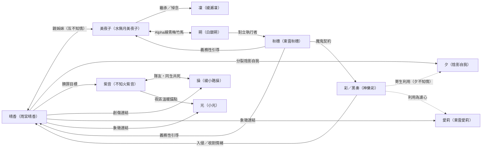

# Character Index（角色總覽）

> **讀者指引**：本文件作為角色系統入口 hub。12 位主要角色各有獨立 Canon Sheet（見下表連結），5 位次要角色的精簡條目收錄在本頁底部。
> 首次閱讀建議先瀏覽 [§ 角色總覽表](#section-overview-table)，再按興趣進入個別角色頁。
> 相關文件：[Series Bible](00_series_bible.md) | [Story Outline](05_story_outline_canon.md) | [Timeline](04_timeline_canon.md)

<!-- Sources: backup/screenwriter/01_Character_Background_Story.md, backup/screenwriter/02_Secondary_Character_Background_Story.md, backup/screenwriter/06_Character_Psychology_Analysis.md, backup/director/Core_Characters_Symbolism_Analysis.md, backup/director/Story_Structure_Character_Archetype_Analysis.md -->

---

## 文件職責邊界

- 本文件只作角色導航與關係總覽。
- 角色完整設定以各角色 Sheet 為準。
- 不重寫術語與規則全文，統一連結至 Canon 對應檔。

## 角色 Sheet 共通契約

> 統一 12 份角色檔的共通規格，避免重覆散落。

### 角色功能（Narrative Function）

- 劇情功能：在至少一個四幕轉折節點推進衝突或揭示代價。
- 主題功能：對主題「[態度 vs. 命運](02_glossary.md#term-attitude-vs-fate)」提供該角色獨特答案。
- 情緒功能：與晴香路徑形成互補或對照，擴大觀眾理解面。

### 禁忌（不可改設定）

- 不可與 [Decision Log](99_decision_log.md) 已裁決口徑衝突。
- 不可刪除本角色創傷來源與代價鏈，避免無代價改寫。
- 不可改動本角色在 [Alpha/Beta 結構](01_world_rules_and_costs.md#rule-alpha-beta) 的責任定位。

---
## 角色總覽表

### 主角團（魔法少女 + 核心同盟）

| 角色 | 定位 | Archetype 變遷 | 存活狀態 | Canon Sheet |
|------|------|----------------|----------|-------------|
| [雨宮晴香](03_characters/haruka.md) | 創世者 / 偶像 / 情緒增幅器 | 拯救者→殉道者→承擔者 | 存活（失去記憶） | [haruka.md](03_characters/haruka.md) |
| [水無月美夜子](03_characters/miyako.md) | 介錯人 / 借來的生命 / 黑貓 | 介錯人→送行者→守護者 | 存活（貓形態） | [miyako.md](03_characters/miyako.md) |
| [不知火紫音](03_characters/iwakura_akane.md) | 戰鬥成癮者 / 屍骸首領 | 成癮者→墮落母親→燃燒的贖罪者 | 死亡（帝國廣場） | [iwakura_akane.md](03_characters/iwakura_akane.md) |
| [綾小路操](03_characters/ayakomoji_misao.md) | 傀儡師 / 破碎的瓷娃娃 | 瓷娃娃→完美主義者→真實的自我 | 死亡（Day 13 鋼鐵獨舞） | [ayakomoji_misao.md](03_characters/ayakomoji_misao.md) |

### 核心非戰鬥角色

| 角色 | 定位 | Archetype 變遷 | 存活狀態 | Canon Sheet |
|------|------|----------------|----------|-------------|
| [白銀朔](03_characters/saku.md) | 屍骸獵人 / 雙面特工 | 復仇者→守護者→解放者 | 存活 | [saku.md](03_characters/saku.md) |
| [東雲秋穗](03_characters/akiho.md) | 瘋狂科學家 / 罪孽的母親 | 瘋狂科學家→悔恨的母親→永劫懺悔者 | 存活 | [akiho.md](03_characters/akiho.md) |
| [東雲愛莉](03_characters/aeri.md) | 紙皮騎士 / 精神守門人 | 受難聖徒→無名守門人→紙皮騎士 | 石像（精神存活） | [aeri.md](03_characters/aeri.md) |

### 反派與特殊存在

| 角色 | 定位 | Archetype 變遷 | 存活狀態 | Canon Sheet |
|------|------|----------------|----------|-------------|
| [神樂彩](03_characters/aya.md) | 被囚禁的主人格 / 轉校生偽裝 | 囚徒→見證者→救贖者 | 死亡（永恆輪迴） | [aya.md](03_characters/aya.md) |
| [黑奏](03_characters/aya.md#section-kurokane) | 保護者人格 / 帝國皇帝 | 保護者→修正者→獨裁者 | 消散 | [aya.md#section-kurokane](03_characters/aya.md#section-kurokane) |
| [夕](03_characters/yu.md) | 晴香的暗面人格 / 陰影自我 | 陰影自我→內在聲音→整合碎片 | 與晴香整合 | [yu.md](03_characters/yu.md) |
| [綾瀨凜](03_characters/rin.md) | 痛覺信徒 / 被重組的軀殼 | 完美主義者→痛覺信徒→自願的兵器 | 死亡（自願兵器化） | [rin.md](03_characters/rin.md) |
| [小光](03_characters/ko_hikaru.md) | 純真的錨點 / 屍骸化的孩子 | 純真者→犧牲者→墮落的起因 | 屍骸化 | [ko_hikaru.md](03_characters/ko_hikaru.md) |

---

## 核心關係網

### 血緣與家族

- **雨宮家**：花子（母，已逝）→ 美夜子（長女）+ 晴香（次女）。秋穗是花子的雙胞胎姊姊，愛莉是秋穗的女兒（晴香的表姊）
- **神樂家**：彩（主人格）= 黑奏（保護者人格），共享一具身體。螢是彩無血緣的姊姊
- **綾小路家**：操的父親拒絕接納她，以 EMB 供應商身份秘密掌握其魔法少女身份（CDL-298）；母親被父親以家族禁忌科學改造為活體人偶（CDL-297）；管家紗夜是真正的守護者

### 戰友與羈絆

- **晴香 ↔ 美夜子**：親姊妹（互不知情）。晴香以為美夜子是「夥伴和大姐姐」，美夜子以貓形態暗中守護
- **美夜子 ↔ 凜**：軍方戰友，最深的羈絆。凜犧牲後美夜子終身 PTSD；重組後的凜不記得美夜子
- **美夜子 ↔ 朔**：Alpha 線青梅竹馬戀人。朔親手埋葬美夜子後遇到 Unit 01（長著美夜子臉的兵器）
- **紫音 ↔ 小光**：夜區的溫暖錨點。小光屍骸化後，紫音墮落為屍骸首領
- **紫音 ↔ 操**：隊友。據點洩露事件後紫音原諒了操；操 Day 13 鋼鐵獨舞犧牲、紫音 Day 14 帝國廣場犧牲——連續錯位雙殺

### 對立與利用

- **晴香 ↔ 黑奏**：黑奏偽裝成「彩」潛伏在晴香身邊，收割情緒能量
- **晴香 ↔ 夕**：本體與陰影，最終整合
- **秋穗 ↔ 黑奏**：魔鬼契約——黑奏提供救活愛莉的方法，秋穗為黑奏培養晴香
- **夕 ↔ 黑奏**：夕以為自己在反叛，實際上是黑奏的無意識能量農場
- **愛莉 ↔ 黑奏**：愛莉被黑奏利用為情緒廢料的[濾心](02_glossary.md#term-filter-heart)

### 關係網絡圖

> 實線 = 主要情感關係，虛線 = 單向利用或非自願連結。完整關係細節以各角色 Canon Sheet 為準。

---

## 主題分組

### 子主題 A：力量的代價

本主題重點不是「有冇力量」，而是「用力量時會失去咩」。代表：[紫音](03_characters/iwakura_akane.md)（戰鬥成癮）、[操](03_characters/ayakomoji_misao.md)（完美偽裝的代價）、[凜](03_characters/rin.md)（理性凍結→痛覺信徒）

### 子主題 B：完美的幻象

本主題聚焦「完美外觀」點樣反過來吞噬人。代表：[操](03_characters/ayakomoji_misao.md)（「沒有痛覺的完美比地獄更可怕」）、[黑奏](03_characters/aya.md#section-kurokane)（[共振地獄](02_glossary.md#term-resonance-hell)——強制消滅選擇）

### 子主題 C：身份的本質

本主題關心「由邊個命名你」：制度、外觀，定你自己。代表：[紫音](03_characters/iwakura_akane.md)（「治癒失敗不代表無法選擇如何燃燒」）、[美夜子](03_characters/miyako.md)（借來的生命也值得活）

### 子主題 D：連結的價值

共情、信賴與守望是抵抗絕望的最終力量。代表：[晴香](03_characters/haruka.md)（承擔所有人的痛苦）、[朔](03_characters/saku.md)（解放被囚禁的靈魂）

---

## 次要角色精簡條目

### 雨宮花子（Amemiya Hanako）

秋穗的雙胞胎妹妹、晴香與美夜子的母親。此條目只保留關係定位；事件事實與死因版本以 Timeline 為準。

**See also**: [秋穗](03_characters/akiho.md) | [Timeline](04_timeline_canon.md#event-alpha-divergence)

---

### 螢（Hotaru）

彩無血緣的姊姊，夜區戰爭孤兒。此條目只保留角色功能（創傷觸發者與情感錨點）；完整事件敘述以 Timeline 與彩/黑奏角色檔為準。

**See also**: [彩](03_characters/aya.md) | [黑奏](03_characters/aya.md#section-kurokane) | [Timeline](04_timeline_canon.md#event-hotaru-death)

---

### 紗夜（Sayo）

操的管家，真正的守護者。此條目只保留關係與主題功能；臨終揭露與崩潰事件細節以 Timeline 與操角色檔為準。

**See also**: [操](03_characters/ayakomoji_misao.md)

---

### 帝國皇帝（The Emperor）

黑奏的養父。此條目只保留權力關係定位；篡位事件與轉折敘述以 Timeline 與黑奏角色檔為準。

**See also**: [黑奏](03_characters/aya.md#section-kurokane) | [Timeline](04_timeline_canon.md#event-kurokana-usurp)

---

### 紫音的弟弟

紫音的弟弟，紫音創傷鏈的起點人物。此條目只保留角色功能；事故經過與心理後果以紫音角色檔為準。

**See also**: [紫音](03_characters/iwakura_akane.md)

---

### 桐生健（Kiryū Ken）

Act I 校霸，晴香「痛係證據」膠布哲學第一層嘅對象（CDL-087/088）；三位一體光譜「人類」端點嘅具體示範者（凡人態度亦能引發奇蹟）。Act I 後以 1-2 個 [NC] 輕量出場（CDL-092）；Phase D 地下絕境期深化為「中介組織跑腿」（Fallen Angel 分銷網絡底層，填 CDL-244 缺口），目擊操主動幫陌生人而推翻通緝令官方敘事，並涉入 USB 截糧伏線（秋穗暗中完成入侵，CDL-323）；解放之戰做「三位一體光譜」市民覺醒轉向嘅細規模引信（QQ-132）；Act IV 附錄摸退色膠布令夕幻象崩解（CDL-093）。此條目只保留角色功能；具體場景設計以 ACT_I/II_OUTLINE.md 同 QUESTION_QUEUE.md（QQ-132）為準。

**See also**: [晴香](03_characters/haruka.md) | [ACT_I_OUTLINE](_working/story_construction/ACT_I_OUTLINE.md) | [ACT_II_OUTLINE](_working/story_construction/ACT_II_OUTLINE.md)

---

### 晴香的經理人（The Manager）

**定位**：投機賭徒 / 帝國情緒農場外判監工 / 「凡人之惡」的具現

帝國資助的魔法少女戰鬥直播舉辦人，同時是晴香的偶像經理人。他在暗中追蹤晴香時意外拍到變身畫面，隨即被帝國納入潘朵拉協議，成為情緒數據採集前線。他的存在是「沒有魔法的普通人類，因貪婪所做的事比任何魔法屍骸更冷血」的主題具現。（CDL-159/160/161）

**Pre-Act I 起源（CDL-372）**：於[歌手身份起源](04_timeline_canon.md#event-singer-origin)期間，經理人正處於因自己賭徒性格輸清光嘅低潮期——晴香喺呢個時候主動揀咗佢做經理人，畀咗一個冇人再肯用佢嘅人一個機會（晴香拯救者本能第一次落喺一個成年人身上嘅示範，扣連CDL-355/356誘惑弧線嘅自利核心）。呢個背景令佢之後嘅背叛唔止係「被利用」，仲係「被幫助者嘅反骨」——佢跌落嚟嘅原因同背叛晴香嘅原因係同一種賭徒性格，晴香畀嘅第二次機會從未真正改變過佢，詳見`haruka.md`§經理人起源。

**四幕軌跡**：
- **Act I**：以「收視率指導」逼晴香展現極端情緒（實為帝國情緒數據採集）；晴香對他充滿信任與內疚
- **Act II**：社會性死亡後割席，出賣晴香完整情緒數據 → 市場推出限量版「Fallen Angel」安普膠囊
- **Act III**：加入情緒管理局為「首席宣傳顧問」；親手關閉光幕濾鏡、操縱直播鏡頭策劃晴香社死
- **Act IV**：體制棄子，賭徒滿盤皆輸

**時序錨點**：他的背叛（113年6-7月）早於秋穗的終極背叛（114年4月），兩者遞進而非同時（CDL-162）。

**See also**: [晴香](03_characters/haruka.md) | [Timeline — 經理人背叛](04_timeline_canon.md#event-manager-betrayal) | [CDL-159/160/161/162]

<!-- Sources: backup/screenwriter/02_Secondary_Character_Background_Story.md §晴香的經理人；CDL-159/160/161/162 作者確認 2026-04-09 -->
