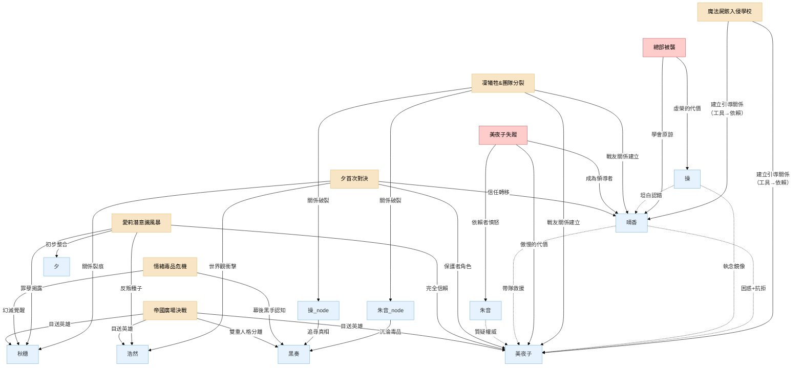

---

### **引言**

在一個由命運與態度交織的故事中，任何單一的重大事件都不會只影響一個人。如同投入湖中的石子，其漣漪會擴散至每一個人，改變他們之間的距離、信任與看法。本文件旨在分析幾個核心事件，如何成為角色關係演變的催化劑。

#### **事件一：魔法屍骸入侵學校**

這是故事的開端，是「日常」的帷幕被暴力撕開，所有關係的「初始設定」被打破的時刻。

- **[[01_人物背景故事#^block1|晴香]] vs. [[01_人物背景故事#^block5|美夜子]]：不平等的初遇**
    
    - **關係影響**：建立了一種不平等的「引導者」與「被引導者」的關係。對[[01_人物背景故事#^block5|美夜子]]而言，[[01_人物背景故事#^block1|晴香]]是喚醒自己、達成目的所必需的「鑰匙」，態度冷漠且充滿功利性，言語間毫不掩飾對[[01_人物背景故事#^block1|晴香]]天真的不耐。對[[01_人物背景故事#^block1|晴香]]來說，這隻突然出現、口出狂言的黑貓，是將她拖入殘酷命運的「不祥之物」，她對其充滿了困惑、抗拒，卻又因無知而產生了一絲被迫的依賴。
        
    - **看法變化**：[[01_人物背景故事#^block1|晴香]]對「世界」的看法被徹底粉碎，第一次意識到舞台燈光外的危險。[[01_人物背景故事#^block5|美夜子]]則可能在[[01_人物背景故事#^block1|晴香]]那奮不顧身的魯莽中，看到了一絲自己早已被磨滅的正義感，但那瞬間更多的是煩躁——「這種天真在戰場上只會害死自己」。
        
- **[[01_人物背景故事#^block1|晴香]] vs. 校霸：從敵對到共犯**
    
    - **關係影響**：從單純的「欺凌者」與「保護者」，轉變為「共同經歷超自然事件的共犯」。校霸對[[01_人物背景故事#^block1|晴香]]的看法，從一個礙事的「正義魔人」，驟變為難以理解、令人恐懼卻又救了自己一命的「怪物/英雄」混合體。
        
    - **看法變化**：校霸對「力量」的看法，從單純的體格與人數優勢，擴展到了存在著神話般恐怖力量的層面。這份源於恐懼的敬畏，是他日後態度轉變的起點。
        

---

#### **事件 1.5：圖書館的幽靈 (The Library Ghost)**

這是晴香第一次與「彩/黑奏」接觸的伏筆事件，發生在故事前期校園日常階段。

- **情境**：
  - 晴香在圖書館尋找參考書時，遇到一個極度怕醜的女仔（彩的主人格短暫浮現）
  - 那個女孩看起來驚恐萬分，顫抖著對晴香說：「唔好... 再行前啦。會死架。」

- **反轉**：
  - 晴香愣住，想問她為什麼這樣說
  - 女孩的眼神突然變了——從恐懼變成冷酷的紫色（黑奏接管身體）
  - 黑奏笑著說：「講笑咋。盡情掙扎啦，偶像小姐。」然後轉身消失在書架間

- **關係影響**：
  - **晴香 vs. 彩/黑奏**：這是晴香第一次察覺到「敵人可能就在身邊」，也第一次目睹那個女孩體內有「兩個聲音」
  - **觀眾體驗**：為後續揭露彩的雙重人格埋下伏筆，製造懸念

- **看法變化**：晴香開始意識到，這個世界的威脅不只來自明顯的魔法屍骸，還有隱藏在日常生活中、看起來無害的普通人

---

#### **事件二：「鏡中之影」**

這是[[01_人物背景故事#^block1|晴香]]作為魔法少女的第一次「思想衝擊」，讓「正義」的輪廓開始變得模糊。

- **[[01_人物背景故事#^block1|晴香]] vs. [[01_人物背景故事#^block5|美夜子]]：理念的首次碰撞**
    
    - **關係影響**：凸顯了兩人此刻價值觀的巨大鴻溝。當[[01_人物背景故事#^block1|晴香]]因窺見魔法屍骸生前的悲傷記憶而對「淨化」行為產生猶豫時，[[01_人物背景故事#^block5|美夜子]]以一種近乎冷酷的實用主義態度完成了擊殺。她可能只會留下一句：「它曾是人類，但現在不是了。想太多只會讓你猶豫，而猶豫會致命。」
        
    - **看法變化**：[[01_人物背景故事#^block1|晴香]]對「敵人」的看法，第一次從「該被消滅的怪物」轉變為「曾是人類的悲劇存在」。這份動搖，讓她開始質疑自己行為的正當性。[[01_人物背景故事#^block5|美夜子]]則更加確信[[01_人物背景故事#^block1|晴香]]的「多愁善感」是個致命弱點，必須被糾正，這也加強了她作為「引導者」的責任感（或負擔感）。
        

---

---

#### **事件 2.5：總部被襲——虛榮的代價**

這是團隊第一次因「內部背叛」而遭受災難，也是「少女的面子」如何導致真實傷害的殘酷證明。

- **[[02_次要角色背景故事#^block-misao|操]] vs. 團隊：從「隱形人」到「罪人」再到「被接納的同伴」**

    - **關係影響**：操一直覺得自己是團隊的邊緣人，這次事件令她從「被忽視」變成「主動傷害隊友」的罪人。但當她選擇坦白，反而成為她第一次真正融入團隊的契機。

    - **看法變化**：操對「自尊」的看法被顛覆——為了面子而傷害隊友，這種「優雅」其實是最醜陋的。

- **[[01_人物背景故事#^block1|晴香]] vs. [[02_次要角色背景故事#^block-misao|操]]：從「無心傷害者」到「原諒者」**

    - **關係影響**：晴香意識到自己無心的言語也可以傷害人。當操坦白時，晴香第一次展現出超越自身痛苦、主動原諒他人的成熟。

    - **看法變化**：晴香對「正義」的看法變得更加細膩——不單止要對抗外敵，還要留意身邊人的感受。

- **[[01_人物背景故事#^block5|美夜子]] vs. [[02_次要角色背景故事#^block-misao|操]]：從「價值觀對立」到「互相理解」**

    - **關係影響**：美夜子一直看不起操的「形式主義」，但當她見到操因面子而犯下大錯，她第一次意識到：這種執著和自己對凜的執著，本質上是一樣的。

    - **看法變化**：美夜子開始反思自己的「傲慢」——如果操的虛榮是錯，那自己的「單打獨鬥」又算不算一種執念？

---

#### **事件三：凜的犧牲 & 團隊分裂**

這場悲劇是主角團第一次直面「魔法少女」身份的終極代價，也是團隊從貌合神離走向徹底決裂的催化劑。

- **[[01_人物背景故事#^block1|晴香]] vs. 其他魔法少女 ([[01_人物背景故事#^block5|美夜子]]、朱音、操)：從陌生到永訣**

    - **關係影響**：[[01_人物背景故事#^block1|晴香]]第一次與「同類」建立了短暫但深刻的連結，也第一次親歷了同伴在眼前化為灰燼。這場共同的創傷，透過「情緒連結」的設定被無限放大，讓凜的絕望如同病毒般感染了所有人。這份痛苦，將她與[[01_人物背景故事#^block5|美夜子]]的關係從單純的利害合作，轉變為能夠共情痛苦的「戰友」。然而，她與朱音、操的關係則在此刻走向終結，她們的離去讓[[01_人物背景故事#^block1|晴香]]初次體會到，面對他人的絕望時，自己的「希望」是多麼蒼白無力。
        
    - **看法變化**：[[01_人物背景故事#^block1|晴香]]對「魔法少女」的看法被徹底顛覆。她意識到這不僅僅是戰鬥，更是背負著隨時會情緒失控、變成怪物或犧牲的詛咒。她開始理解其他少女身上那種與生俱來的絕望和憤怒。
        
- **[[01_人物背景故事#^block5|美夜子]] vs. 朱音/操：責任的崩塌**

    - **關係影響**：作為前隊長，凜的死對她是一次沉重的歷史重演，加劇了她內心對「無法拯救同伴」的自責與愧疚感。朱音、操的決裂，對她而言是一種審判，無論對方是否直接指責，她都會將這份分裂歸咎於自己，讓她更加孤立。

    - **看法變化**：[[01_人物背景故事#^block5|美夜子]]對「責任」的看法變得更加沉重。她親眼見證了努力也無法保護所有人，這粉碎了她可能還殘存的一絲幻想，讓她對「魔法少女的命運就是悲劇」這一點更加確信。

---

#### **事件 3.5：美夜子失蹤——傲慢的代價**

這是團隊信任建立後的第一次重大危機，也是「家長式保護」如何導致災難的殘酷證明。更重要的是，這是晴香從「被保護者」成長為「領導者」的關鍵時刻。

- **[[01_人物背景故事#^block5|美夜子]] vs. 團隊：「保護者」變成「被保護者」**

    - **關係影響**：美夜子一直以「隊長」自居，從不需要他人幫助。這次被救，是她第一次以「弱者」的身份接受隊友的援手，打破了她與隊友之間的上下關係。

    - **看法變化**：美夜子對「信任」的定義被重寫——信任不是「我保護你」，而是「你也可以保護我」。

- **[[01_人物背景故事#^block1|晴香]] vs. [[01_人物背景故事#^block5|美夜子]]：從「被引導者」到「並肩者」**

    - **關係影響**：晴香第一次帶隊執行任務，成功救出美夜子。這是她從「學生」畢業成「戰友」的標誌性時刻。

    - **看法變化**：晴香對美夜子的看法，從「無所不能的導師」變成「也有軟弱一面的同伴」。這份「去神化」反而令她們的關係更加真實。

- **[[02_次要角色背景故事#^block-akane|朱音]] vs. [[01_人物背景故事#^block5|美夜子]]：「依賴者」的憤怒**

    - **關係影響**：朱音一直視美夜子為救命恩人，但當美夜子因傲慢而險些喪命，朱音第一次對美夜子表達憤怒：「你整天說要保護我們，但你連我們都不信！」

    - **看法變化**：朱音開始明白，單方面的「被保護」是一種不健康的關係。她也開始思考，自己對美夜子的依賴是否同樣有問題。

- **[[02_次要角色背景故事#^block-misao|操]] vs. [[01_人物背景故事#^block5|美夜子]]：執念的鏡像**

    - **關係影響**：操曾因虛榮心犯下大錯，如今看到美夜子因對凜的執念而差點喪命，她意識到：她們都是被「放不下的執著」所傷害的人。

    - **看法變化**：操對美夜子的態度，從「價值觀對立」轉變為「同病相憐」。這成為她們關係改善的起點。

---

#### **事件四：與「[[01_人物背景故事#^block7|夕]]」的首次對決 & 身份曝光**

這是將[[01_人物背景故事#^block1|晴香]]推入谷底，同時也是考驗所有人關係的第一次「大浪」。

- **晴香 vs. 美夜子：從功利到信賴**
    
    - **關係影響**：關係開始從功利轉向真正的「同伴」。當晴香被揭露真相、精神崩潰並被社會徹底拋棄時，美夜子是唯一沒有離開，反而選擇留下並引導她的人。這讓晴香在最深的黑暗中，抓住了第一根浮木。
        
    - **看法變化**：美夜子對晴香的看法，從一個不成熟的「工具」，開始轉變為一個需要被保護、值得去扶持的「夥伴」。她看到了晴香的脆弱，也可能因此回想起自己過去的無助。晴香則從依賴秋穗阿姨，開始將信任的天秤向美夜子傾斜。
        
- **晴香 vs. 秋穗：信任的裂痕**
    
    - **關係影響**：產生了深刻的裂痕。晴香意識到阿姨一直對她隱瞞著關於母親之死的真相，這份「保護」在她看來變成了一種「欺騙」，讓她對從小依賴的親人產生了第一次的懷疑和疏離感，她們之間溫馨的日常被一層看不見的隔膜籠罩。
        
    - **看法變化**：秋穗對晴香的看法變得更加複雜，除了原有的愛與妒忌，更增添了濃厚的「愧疚感」。她意識到自己的封存記憶，並未真正保護晴香，只是推遲了痛苦的到來。

### **事件五：「愛莉的潛意識風暴」—— 晴香的畢業考試與夕的謝幕**

這並非一場單純的救援任務，而是檢驗晴香與夕「整合」成果的終極試煉場。一個由純粹的痛苦、恐懼和混亂構成的內心世界，正是對晴香這位「情緒增幅器」最大的考驗。此事件的設計，完美地展現了晴香態度的根本轉變，並為夕的存在畫上了最溫柔也最必然的句點。

**1. 「寂靜」的開端：第一次沒有「母親」的戰鬥**

- **場景描述：** 當晴香、秋穗等人進入愛莉那破碎、充滿哭泣聲的潛意識空間時，晴香面對著撲面而來的負面能量。在過去，這是她最恐懼的場景。她的第一反應，是本能地、習慣性地去傾聽腦海中那個熟悉的、「母親」的聲音，等待著指引與慰藉。
    
- **內在證明：** 然而，這一次，腦海中只有一片死寂。沒有任何聲音，沒有任何指導。這份突如其來的「寂靜」，是她與夕融合後最直接、也最殘酷的體現。晴香第一次恐懼地意識到——那個由夕扮演的「外部幻影」已經完成了它的歷史使命，不再需要存在了。她必須獨自面對這一切。這場戰鬥，從一開始就成為了對她是否真正「獨立」的第一次嚴峻考驗。
    

**2. 「態度」的轉變：從「消滅黑暗」到「理解黑暗」**

- **面對「心靈怪物」：** 在愛莉的潛意識中，她們遇到的不是傳統的敵人，而是由愛莉的痛苦所化作的具象化身——例如，一個代表「被拋棄的恐懼」而不斷哭泣的影子，或一個代表「實驗痛苦」而不斷抽搐的怪物。
    
- **外在證明：**
    
    - **舊的晴香會怎麼做？** 她會因為恐懼而試圖用她最擅長的、純粹的「希望」之力去「淨化」或「消滅」這些怪物，但很可能會發現這完全無效，甚至會激起更強烈的反抗（因為希望的光芒，對沉浸在絕望中的存在來說，是一種刺眼的否定）。
        
    - **新的晴香會怎麼做？** 在意識到純粹的光明無效後，她做出了一個讓秋穗和美夜子都感到驚訝的選擇。她不再攻擊，而是主動地、有意識地去調動屬於「夕」的那部分力量。她走到那個哭泣的影子面前，用自己的「情緒增幅器」，去共鳴並放大一份理解的「悲傷」，她可能會輕聲說：**「我知道，這很痛苦。」**她不是在消滅黑暗，而是在承認和擁抱黑暗。結果，那個怪物可能不會消失，而是在她的共鳴下，漸漸平靜下來，為她們讓開道路。
        

**3. 夕的「潛航」：使命完成後的安眠**

這次成功的「共情」，是晴香真正意義上第一次駕馭了自己完整的力量，而不是被其控制。她向自己和同伴證明了，她已經不再是那個害怕自己情緒的女孩。而對於夕來說，這也是她存在的終極意義的實現。

- **使命的完成：** 她作為「保護者」的本能，其最終目的，就是希望晴香能變得足夠強大，不再需要她這個極端的「應急系統」。當她看到晴香能夠主動、且有建設性地運用那份源於痛苦的力量時，她知道自己的使命已經完成了。
    
- **意識的安眠：** 因此，在「愛莉的潛意識風暴」事件結束後，當一切回歸平靜時，夕的意識就可以真正地、安心地「潛航」了。她的退場，不再是一個突兀的設定，而是一場盛大而艱難的考試之後，一位老師傅看到弟子終於出師，欣慰地轉身離去。這份消失，充滿了情感的重量和邏輯的必然性。
    

**此事件對角色關係的影響：**

- **晴香 vs. 夕：最完美的告別**
    
    - **關係影響：** 從「融合為一」走到了「精神上的畢業」。夕不再是需要對抗或依賴的對象，而是真正內化成了晴香的智慧與力量。夕的「潛航」，是她們之間最溫柔的告別，也是晴香真正成人的標誌。
        
    - **看法變化：** 晴香對夕的看法，從一個複雜的「陰影自我」，變成了值得感謝的「引路人」。她明白了夕的痛苦，並將這份痛苦化為了慈悲的力量。
        
- **晴香 vs. 美夜子：從對等到信賴的昇華**
    
    - **關係影響：** 美夜子親眼見證了晴香的蛻變。她看到晴香不再是那個需要她提點的菜鳥，而是能以一種她自己都無法做到的方式去「解決」問題。這份震撼，讓她們的信賴關係提升到了新的高度。
        
    - **看法變化：** 美夜子對晴香的看法，從「值得信賴的平等夥伴」，變成了「一個擁有自己所不具備的、溫柔而強大力量的人」。她對晴香的態度，從此多了一份發自內心的敬佩。
        
- **秋穗 vs. 所有人：從愧疚到希望的轉變**
    
    - **關係影響：** 在共同進入愛莉潛意識的過程中，她被迫直面自己的執念所造成的傷害。晴香那種「共情」而非「治癒」的方式，給了她巨大的衝擊。
        
    - **看法變化：** 秋穗對「拯救女兒」的看法，從「用科學手段修正錯誤」，變成了「理解女兒的痛苦」。她看到晴香用一種更為本質的方式觸及了愛莉的靈魂，這讓她對晴香的看法從複雜的「愧疚與關愛」，增添了一份「她或許真的能帶來不同結局」的希望。
        
- **朔(浩然) vs. 管理局（作為外部觀察者）：反叛的萌芽**
    
    - **關係影響：** 埋下了反叛的種子。作為參與封鎖行動的一員，他親眼目睹了管理局高層對一個無辜女孩（愛莉）的冷酷無情和非人化處理（「淨化協議」）。
        
    - **看法變化：** 他對自己所效忠的「秩序」產生了根本性的懷疑，開始意識到這個體制本身就是「惡」的一部分。

### **事件六：情緒毒品危機**

這是一場由個人執念引發的社會災難，也是黑奏計劃大規模推進的號角。

- **秋穗 vs. 世界：**
    
    - **關係影響**：她與整個世界的關係從「隱居者」變成了「罪人」。她親手修改的配方，導致了無數市民的屍骸化。這份巨大的罪孽，徹底壓垮了她的心理防線，讓她無法再逃避自己行為的後果。
        
    - **看法變化**：秋穗對「希望」的看法產生了毀滅性的轉變。她意識到自己所追尋的、由黑奏給予的「希望」是徹頭徹尾的謊言，其代價是整個城市的毀滅。這份幻滅，是她最終能放下執念的催化劑。
        
- **主角團 vs. 黑奏：**
    
    - **看法變化**：團隊第一次清晰地認識到黑奏的恐怖之處——她不僅擁有強大的個人力量，更能輕易地利用人心最脆弱的執念（如秋穗的母愛），將其轉化為大規模殺傷性武器。他們對敵人的看法，從一個強大的「個體」，上升到一個操縱人心的「幕後黑手」。
        

### **事件七：操的悲劇 (追尋真相與自我毀滅)**

這個事件是一幕寂靜的悲劇，從側面揭示了黑奏的殘酷和命運的無情。

- **主角團 vs. 昔日同伴的記憶：**

    - **關係影響**：操以一種最慘烈的方式，永遠地退出了與主角團的關係。

    - **看法變化**：當晴香和美夜子得知操的結局後，她們對「真相」的看法會變得更加複雜和警惕。操為了追求「真實過去」而擁抱了一個謊言，最終自我毀滅。這讓主角們明白，盲目地追求所謂的「真相」，有時比活在無知中更加危險。這也讓她們對朱音的行為有了更深層次的理解，而非單純的敵對。

- **主角團 vs. 黑奏：**

    - **看法變化**：如果說情緒毒品危機展現了黑奏的宏觀佈局能力，那操的悲劇則赤裸裸地揭示了她對個體精神的精準打擊和冷血無情。團隊對黑奏的看法，從一個「戰略家」，進一步深化為一個玩弄靈魂、以他人痛苦為樂的「惡魔」。
        

### **事件八：朱音的崛起 (屍骸首領的誕生)**

這是一個昔日戰友墮入黑暗、成為新威脅的轉折點。

- **晴香/美夜子 vs. 朱音：**

    - **關係影響**：她們被迫與曾經的同伴為敵。這份衝突不僅是物理上的，更是理念上的。朱音的選擇——在失去一切後，透過掌控他人來重塑自我——與晴香和美夜子選擇的道路完全相反。

    - **看法變化**：主角團對「魔法少女的未來」這一問題產生了更深的思考。朱音的存在證明了，即使不被黑奏直接利用，魔法少女也可能因自身的絕望而走向另一條極端、扭曲的道路。晴香對朱音的看法，從最初的「不解和憤怒」，可能會轉變為一份複雜的同情——同情她們共同的悲慘命運，但絕不認同她所選擇的態度。

- **浩然 vs. 世界的複雜性：**

    - **看法變化**：浩然對「怪物」的定義再次被顛覆。他看到朱音，一個與自己和美夜子一樣曾有高尚身份的「同類」，如今卻成為了新的混亂之源。他意識到，敵我、善惡的界線遠比他想像的要模糊，威脅不僅僅來自黑奏和失控的屍骸，更來自所有被命運逼入絕境後，選擇了錯誤態度的「個體」。

#### **事件九：攻擊【維多利亞之淚】**

這是一場由主角團主動發起的、自以為正義的「解放之戰」，也是黑奏整個陰謀中最關鍵的一環。

- **晴香 vs. 希望：從「被賦予」到「主動承擔」**
    
    - **關係影響**：在此事件中，晴香第一次清晰地感受到，來自全城市民的「希望」正在成為她力量的一部分。這讓她的戰鬥動機，從個人的「守護」，昇華為一種**回應人民期望的「責任」**。她的【英雄】原型在此刻達到頂峰。
        
    - **看法變化**：她對自身力量的看法，從一種「內在的天賦」，轉變為一種「由人民賦予的神聖權力」。這份認知，讓她充滿了前所未有的力量感，也為她後續的崩潰埋下了最致命的伏筆。
        
- **晴香 vs. 桐生健（校霸）：從「共犯」到「無名的戰友」**
    
    - **關係影響**：雖然兩人沒有直接交流，但桐生健在信息戰場上的努力，與晴香在物理戰場上的奮戰，形成了一種**互相成就**的關係。桐生健的宣傳為晴香匯聚了希望之力；而晴香的戰鬥，則為桐生健的宣傳提供了素材。他們成為了這場「解放之戰」中，身處不同戰場的、最不可能的盟友。

### **事件 9.5：恐怖的家家酒 (The Horrific House)**

這是茶會之後、決戰之前的「心理驚悚」篇章。黑奏（作為擁有絕對力量的皇帝）強迫大家「繼續扮朋友返學」，將校園生活變成一個「高壓鍋」。

#### **核心設定：為什麼校園線可以（且必須）繼續？**

1. **黑奏的動機：病態的觀察實驗**
   - 黑奏剛剛在「茶會」上被晴香否定（晴香說她不懂人心）
   - 決定玩一個遊戲：「好，既然妳話人類既感情咁偉大，咁我就比機會妳表演。我會讓『彩』繼續返學。只要妳能係學校入面『感化』到佢，或者忍住唔殺佢，我就暫時唔毀滅這間學校。」

2. **晴香的動機：唯一的接觸機會**
   - 晴香知道一旦開戰，黑奏就會著起神裝（萬花筒防禦）
   - 只有在學校裡，彩的防禦是最低的
   - 這是喚醒「彩（主人格）」的唯一機會

3. **限制條件：互毀按鈕**
   - 如果晴香團隊在學校動手 → 黑奏引爆埋在學校地底的情緒炸彈，全校師生陪葬
   - 如果黑奏在學校大開殺戒 → 晴香會不顧一切發動「改變現實」（同歸於盡）
   - 結果：形成了一種極度詭異的「恐怖平衡」

---

#### **場景一：掉落的擦膠 (The Dropped Eraser)**

- **情境**：課室裡，全班都在安靜考試。彩（看起來是怯懦的狀態）坐在晴香隔壁。彩不小心碰跌了擦膠，滾到晴香腳邊。

- **眾人的反應**：
  - **朔 (Saku)**（偽裝成工友/老師）：手瞬間按在隱藏的槍上，冷汗直流
  - **美夜子**（偽裝成轉學生/旁聽）：全身肌肉繃緊，準備隨時撲過去擋刀
  - **普通同學**：毫無察覺，依然在寫卷

- **晴香的抉擇**：
  - 她看著那個擦膠，心跳極快（這是那個殺了幾萬人的魔王的擦膠）
  - **行動**：晴香深吸一口氣，彎腰撿起擦膠，微笑著放回彩的桌上，輕聲說：「比心機。」

- **彩的反應**：
  - 彩抬起頭，眼神極度恐懼（她知道體內的怪物隨時會因為晴香的靠近而醒來），但又有一絲感激
  - 她用口型說：「對... 不... 住...」

- **關係影響**：
  - **晴香 vs. 彩**：這是晴香第一次以「人」的身份而非「戰士」接觸彩。這份「帶著恐懼的溫柔」成為彩日後覺醒的種子
  - **團隊壓力**：美夜子和朔親眼看到晴香在「老虎口中拔牙」，心理壓力極大

---

#### **場景二：體育堂的躲避球 (The Deadly Dodgeball)**

- **情境**：體育課打躲避球

- **衝突**：有個不知死活的男同學（可能是以前的校霸）大力將球扔向彩，還嘲笑她：「發咩呆呀陰沈妹！」

- **危機**：
  - 球飛向彩的一瞬間，黑奏的人格覺醒了
  - 彩的眼神瞬間變成紫色。她本能地想用「重力魔法」將那個男同學壓成肉醬

- **晴香的營救**：
  - 晴香不是去接球，而是衝過去抱住彩，用自己的背擋下了那一球。「波！」一聲，晴香被打中
  - 晴香在彩耳邊低語：「忍住... 彩。那是普通人，不可以殺。」

- **黑奏的嘲諷**：
  - 黑奏（在彩體內）冷笑，收回了魔力：「哼，算妳好彩（指男同學）。」
  - 彩恢復神智，看著保護自己的晴香，內心產生了巨大的動搖

- **關係影響**：
  - **晴香 vs. 彩**：彩第一次意識到，有人會不顧性命來保護她（而且不是為了利用她）
  - **彩的內在變化**：這份「被愛」的實感，是最後決戰中彩能夠反抗黑奏的唯一能源

---

#### **場景三：天台的午餐 (Lunch on the Roof)**

這是**「打又唔係，唔打又唔係」**情感的最強烈體現。

- **情境**：晴香強行拉著彩上天台吃午餐（為了對話）

- **對話（雙重人格的切換）**：
  - 晴香試圖跟彩聊天：「這個蛋卷好食嗎？」
  - **彩（怯懦）**：「好... 好食... 多謝...」
  - **突然切換（黑奏）**：彩的臉突然變得猙獰，一手打翻飯盒。「妳以為這種廉價的溫情攻勢有用？我隨時可以捏死妳。」

- **晴香的反應（治癒向）**：
  - 晴香沒有生氣，默默撿起地上的蛋卷，拍了拍灰塵
  - 晴香：「黑奏，妳咁激動，係咪因為妳其實好羨慕彩可以食到好食既野？」

- **結果**：黑奏被戳中痛處，憤怒離場。留下一臉無奈的晴香和遠處監視的美夜子

- **關係影響**：
  - **晴香 vs. 黑奏**：晴香的「態度」開始動搖黑奏的防線。黑奏不是被力量打敗，而是被「理解」刺痛
  - **團隊內部矛盾**：美夜子：「晴香，夠啦！太危險啦！直接殺咗佢啦！」晴香：「唔得！彩仲係入面！」

---

#### **場景四：朱音「暴食斷頭台」（第10天中午）**

**時間點**：恐怖家家酒第10天中午

**地點**：學校食堂

**前置鋪墊（第1-9天）**：
- 第3天：朱音因為彩（Aya）落單被欺負，差點開電鋸砍同學，被晴香阻止
- 第7天：朱音與晴香大吵：「唔打佢哋點會驚？唔驚點會聽話？妳嗰套偽善係救唔到人架！」
- 第9天：朱音夜晚獨自回憶當年在夜區幫派時，用暴力「保護」Aya結果把Aya嚇到嘔吐的畫面

**核心衝突**：

黑奏在食堂設立「無限自助餐」（情緒毒品具象化的頂級美食）。規則：只要跪下叫黑奏一聲「女王」，就可以任食，並感到無比幸福（被洗腦）。大半個學校的學生已經跪下進食，變得如豬一般。

黑奏特地走到朱音面前，拿著一塊散發金光的牛扒（象徵朱音一直渴望的富足生活）：

> 黑奏：「朱音，做咩唔食？妳一世人都未食過咁好既野。跪低啦，跪低我就比個身分妳，以後唔使再捱窮。」

黑奏故意模仿當年朱音給過期麵包給Aya的動作，將牛扒扔在朱音面前。

**朱音的內心掙扎**：
- 望著美食，腹部咕嚕作響（生理本能）
- 腦海閃過當年Aya吃著乾爭爭的麵包但笑得很甜的樣子
- 發現：當年那個麵包雖然難吃，但裡面有「人情味」。而眼前這堆美食，只有「飼料味」

**畢業時刻（心理轉變）**：

朱音沒有發瘋打爛東西（太戲劇化），而是做了一個非常冷靜、非常違背本性的動作。

朱音撿起地上那塊牛扒，輕輕放回盤上。然後從褲袋拿出自己半個吃剩的麵包，咬了一口。

> 朱音：「收返埋啦。妳啲野食無味道。」
> 朱音（眼神變了）：「原來... 只要同中意嘅人一齊，食垃圾都係甜嘅。」

**大場面爆發（動作高潮）**：

黑奏惱怒，命令被洗腦的學生圍攻朱音。

朱音啟動電鋸（暴食之牙），引擎聲轟鳴全場。

> 朱音：「收聲啦。妳啲野食... 有一陣銅臭味，我想嘔呀！！」

**動作演出**：
- 朱音跳上長桌，用電鋸瘋狂破壞所有食物
- 最後，她發動大絕——將電鋸插入那個散發毒氣的「魔法煮食爐（控制核心）」
- 爆炸：轟隆！控制塔爆炸，藍色火焰吞噬食堂。所有美食變成灰燼
- 全校學生的洗腦因核心被毀而解除，開始嘔吐（清醒）

**關鍵改變（與之前不同）**：

當被洗腦學生清醒後發狂想攻擊朱音時，朱音做了以前絕對不會做的事：

**她沒有殺死那些學生。**

她選擇了肉身擋住發狂學生的攻擊，大叫：

> 朱音：「醒下啦！我唔會還手架！」

這是她第一次**「收起獠牙」**去戰鬥。這才是真正強者的證明。

**對劇情的推進**：

朱音親手燒毀了黑奏控制學生的手段。黑奏失去了「快樂家家酒」的玩具，面色變得極度難看。這為第13天操的「鋼鐵獨舞」與第14天的嘆息之橋總攻擊埋下導火線。

**對角色關係的影響**：
- 晴香見證朱音「不殺人也能守護」，對朱音的尊重提升
- Aya（內在人格）透過黑奏的眼睛看到朱音的改變，內心震撼
- 朱音自己發現「羈絆」比「食物」更能填補心中的空洞

**為嘆息之橋犧牲埋下伏筆**：

朱音在這裡學會了「給予」，所以在嘆息之橋才會毫不猶豫吞下過期糖果毒素，滿足地死去。

---

#### **場景五：操「鋼鐵獨舞」（第13天下午）**

**時間點**：恐怖家家酒第13天下午

**地點**：學校禮堂

**前置鋪墊（第10-12天）**：
- 第10天：操見證朱音的畢業，內心震撼但表面維持完美
- 第11天：操對Aya和其他隊友進行地獄式儀態訓練，要求「絕對完美」，控制欲爆發
- 第12天：戰鬥模擬訓練，操的「劇本式指揮」面對隨機攻擊完全失效，她開始懷疑自己的價值

**核心衝突**：

黑奏為了殺晴香，在禮堂佈置了「提線木偶陣」。她用無形的絲線綁架了幾百個學生，將他們變成「人肉炸彈」。

晴香與美夜子被困在中間，不敢動，因為一動就會弄死學生。

**黑奏的嘲諷**：
> 黑奏：「操，妳唔係最中意人偶咩？妳睇下，這先係完美既操控。」

**衝突爆發**：

黑奏控制住操的手腳（操也被絲線纏住），強迫操用自己的武器去攻擊晴香。

操的假髮被打掉，優雅的裙被割破，露出了半邊機械身軀。

黑奏當眾羞辱：
> 黑奏：「睇下妳，爛溶溶，好肉酸呀。」

**畢業時刻（心理轉變）**：

操望著自己露出來的鋼鐵骨架。以前她會崩潰，但現在她發現，這副鋼鐵之軀才是她最強的武器。

真正的優雅，是即使變成怪物，都要守護想守護的東西。

她想起當年幫Aya縫補校服時，Aya曾說過：「操姐姐嘅手（機械手）好暖。」

她發現：原來自己一直以此為恥的機械身軀，曾經溫暖過別人。

**大場面爆發（動作高潮）**：

操做了一個瘋狂的舉動——她主動扯斷了自己被控制的左手（機械臂），擺脫黑奏的控制。

鮮血與機油混合流出。劇痛。

然後，她用僅存的右手與口，操控無數條「超合金絲線」。

> 操：「肉酸？... 妳識咩叫藝術？」
> 操：「這係我嘅舞台！！所有人同我睇清楚！！」

**動作演出**：
- 操開始跳舞。伴隨著金屬摩擦的火花，她的絲線以超高速度切割全場
- **精準度**：她的線準確切斷了黑奏綁在幾百個學生身上的控制線，但完全沒傷到學生分毫
- 與此同時，她的絲線將禮堂的天花板切碎，巨大的瓦礫跌落來，壓住了黑奏的視線，給晴香他們有機會救人
- 最後，她的絲線甚至配合美夜子的冰、朱音的火做即興演出（不再堅持「按劇本」）

**關鍵改變（與之前不同）**：

她不再要求Aya完美，而是對Aya喊：

> 操：「Aya！隨便跑！跌倒都唔緊要！我會接住妳！」

這是她第一次**「擁抱失控」**。

**對劇情的推進**：

操以自殘（斷臂）為代價，解放了所有人質。黑奏徹底失去了籌碼。

這令黑奏由「玩遊戲」變成「惱羞成怒」，決定發動嘆息之橋的總攻擊（第14天）。

**對角色關係的影響**：
- 晴香與美夜子震驚於隊友的覺醒，也因為隊友的付出而感到心痛
- Aya（內在人格）見證操「即使殘缺也能美麗」，為自己最終接受痛苦埋下種子
- 操自己發現「傷痕即勳章」，不再執著於虛假的完美

**為嘆息之橋犧牲埋下伏筆**：

操在這裡學會了「即使破碎也能守護」，所以在嘆息之橋才會主動解除防禦，露出破碎的身軀去擋刀，以最真實的殘軀戰死。

---

#### **此事件的敘事功能**

1. **具象化「彩的痛苦」**：觀眾親眼看到彩是如何被黑奏折磨的——連一頓安樂茶飯都吃不到。這讓之後晴香堅持「救彩」變得非常合理

2. **增加美夜子與朔的壓力**：他們看著晴香每天在「老虎口中拔牙」，心理壓力極大。這製造了團隊內部的矛盾

3. **鋪墊「彩的覺醒」**：正是這段時間的相處（晴香撿擦膠、擋球、分便當），讓一直躲在心房裡的彩意識到：「原來世界上真係有人會不顧性命黎保護我（而且不是為了利用我）。」這份「被愛」的實感，是最後決戰中彩能夠反抗黑奏的唯一能源

4. **展現「帶著恐懼的溫柔」**：看著晴香要在「殺死魔王」和「保護同學」之間走鋼線，還要對著那個隨時會殺死自己的女孩露出微笑。這種態度，正是這個故事最核心的治癒力量

5. **朱音與操的畢業**：這兩場事件展示了角色從「極端」走向「平衡」的心理轉變——朱音從「暴力守護」學會「溫柔守護」，操從「控制完美」學會「擁抱混沌」。這為她們在嘆息之橋的犧牲賦予了更深的意義

---

### **事件 9.7：嘆息之橋戰役與美夜子的覺醒**

**事件背景**：恐怖家家酒第14天（114年5月中旬），黑奏惱羞成怒，發動嘆息之橋總攻擊。

**時間跨度**：晚上10點 - 凌晨4點（約6小時）

**地點**：帝國塔中層，廢棄的貴族休息室

這不是一場單純的戰鬥，而是美夜子從「逃避（貓）」到「面對（人）」的完整覺醒過程。整個覺醒分為三個階段，每個階段都對應不同的心理機制。

---

#### **階段一：貓殼碎裂——防衛機制的物理崩塌（晚上10點）**

**戰鬥經過（簡述）**：

在嘆息之橋戰役中，黑奏佈置了多重死亡陷阱。朱音為了給隊友開路，主動吞下過期糖果毒素（情緒毒品），能量過載變成糖果山。操為了救出被困的同伴，主動解除防禦露出破碎的身軀去擋刀，變成人偶牆。

美夜子（貓形態）目睹這一切，一直強忍著情緒，催促晴香：

> 美夜子（貓）：「行啦，唔好望回頭。作為隊長，我要帶妳去終點。」

這時的美夜子，依然是那個「強硬、冷靜、負責」的導師貓。

**物理的極限**：

兩人逃入休息室。美夜子走著走著，突然間腳軟（貓的前肢無力），整隻貓跌在地上，爬不起身。

不是受傷，而是**心理防線崩潰導致的肉體排斥**。

她依然嘴硬：
> 美夜子：「可惡... 隻腳... 郁啊...（可惡... 腳... 動啊...）」

**晴香的動作**：

晴香沒講話，走過去，跪在地上，用力抱起了這隻正在發抖的黑貓。

晴香的體溫傳過來。這份溫暖是美夜子最驚的東西（因為溫暖會融化冰）。

**變身即是「破殼」**：

美夜子想推開晴香：
> 美夜子：「放手... 我無事...」

但是晴香的擁抱令她再維持不住「貓（逃避）」的魔法形態。

**視覺演出（變身過程）**：

變身過程不是光芒萬丈，而是「碎裂」。

美夜子的貓外殼（由冰琉璃構成）開始出現裂痕，發出**裂...裂...**的聲。

隨著碎片剝落，露出裡面赤裸的、滿身傷痕的人類少女（美夜子本體）。

**狀態（關鍵）**：

碎片剝落，美夜子變回赤裸的人類少女。

**但她沒有哭。**

她眼神空洞，好似壞了的公仔咁，推開晴香，縮到房間最黑暗的角落。她拒絕被觸碰，也拒絕說話。她處於一種**「極度恐慌的自我封閉」**狀態——這是解離症的典型表現。

晴香不敢逼她，只是默默去找衣服或者毛巾。

**心理描寫**：

美夜子蜷縮在角落，望著自己的雙手——這是一對人類的手，不是貓爪。

這對手殺過人，救不到凜，也推開不到朱音的糖。

她感覺不到悲傷，甚至感覺不到冷。

她驚自己已經變成了Unit 00（凜）那樣的無感情怪物。

**對角色關係的影響**：
- **美夜子 vs. 晴香**：晴香第一次見到家姐徹底崩潰、無法維持「隊長」面具的樣子
- **美夜子 vs. 自我**：她開始質疑「我還是人類嗎？」——這為第二階段的存在確認測試埋下伏筆

---

#### **階段二：月下窗台的存在確認——生理與心理的錯位（深夜2點）**

**時間點**：變回人類約4小時後，深夜2點

**地點**：同一房間，落地窗前

**視覺設計**：

巨大的滿月佔據了整個落地窗，月光蒼白而冰冷。

美夜子赤裸地坐在窗台上，背光，形成一個瘦削的剪影（Silhouette）。

這個畫面極靚，但又極孤獨。

**心理動機**：

美夜子望著自己的雙手（人類的手），覺得好不真實。

> 美夜子（內心獨白）：「我係邊個？」「我仲係度嗎？」「點解我感覺唔到朱音死咗既痛？」

她驚自己已經變成了Unit 00（凜）那樣的無感情怪物。

**行為描寫（詳細版本）**：

她背對著房間（以為晴香睡了或者不在）。

她開始進行那種「機械式的自我刺激」。

動作不是溫柔的愛撫，而是帶有強迫性和機械性。手指的動作好似在調試一台機器。

她眼神死死盯著牆上的裂縫，完全沒閉眼，沒任何色情的聯想。

**內心獨白**：
> 美夜子：「郁... 有反應... 求下妳... 比啲反應...（動... 有反應... 拜託... 給點反應...）」

**生理反應描寫**：

月光照在她汗濕的背脊上，勾勒出脊椎骨的線條。

身體開始顫抖。呼吸從平穩變得急促、破碎。

手指的動作加快。肌肉繃緊。

臉色潮紅，即使她拼命壓抑，喉嚨還是洩出細微的喘息。

隨著刺激達到臨界點，她的身體弓起，肩膀劇烈顫抖。

**高潮瞬間**：

那一瞬間，生理性的眼淚不受控制地流落來。

不是因為悲傷，而是因為自律神經系統被強制觸發的生理反應。

但是，**心是死的**。

她的眼神依然是空洞的紫色。

**測試失敗**：

高潮過後，那種**「巨大的空虛感」反噬而來**。

她發現，身體的快樂填補不了靈魂的洞。即使身體識得高潮、識得流淚，但她依然感覺不到「活著」。

這是一種比痛覺更絕望的「錯位感」。

**動作描寫**：

她停了手，抱膝坐在窗台，望著月亮絕望。

殘留的顫抖逐漸平息。冷汗變冷，她開始覺得冷。

> 美夜子（喃喃自語）：「...原來壞咗既野... 就算整返著... 都係壞既。（...原來壞掉的東西... 即使修好了... 還是壞的。）」

**象徵意義**：
- **月光**：冰冷、蒼白、孤獨——象徵解離狀態下的美夜子
- **窗台剪影**：視覺上的美麗與心理上的絕望形成強烈對比
- **自慰的失敗**：證明真正的「活著」不是來自生理功能，而是來自情感連結

**對角色關係的影響**：
- **美夜子 vs. 自我**：她發現生理刺激無法填補心靈空洞，這是她理解「活著」真正意義的關鍵
- **美夜子 vs. 凜（對比）**：美夜子用生理刺激測試「我還是人類嗎？」，凜用痛覺刺激測試「我還存在嗎？」——兩者都證明了感官刺激無法取代情感連結

---

#### **階段三：晴香的擁抱與崩潰大哭——真正的治癒（凌晨4點）**

**時間點**：自慰測試失敗約2小時後，凌晨4點

**地點**：同一房間

**介入**：

原來晴香一直醒著（或者剛找到外套回來）。她目睹了美夜子那個「悲傷的自慰」，明白家姐已經壞到什麼地步。

晴香走過去，將外套/打歌服從背後披在美夜子身上，遮住她赤裸的身體（同埋羞恥感）。

**對白與爆發**：

美夜子一顫，回頭見到晴香。她以為晴香會覺得她噁心。

但晴香只是從後抱緊她,將臉貼在美夜子背脊：

> 晴香：「唔緊要... 家姐。唔需要再確認啦。妳係度。妳係活人。（不要緊... 家姐。不需要再確認了。妳在這裡。妳是活人。）」
> 晴香：「唔使再做隊長住啦。喊出黎啦。（不用再當隊長了。哭出來吧。）」

**大哭（The Big Cry）**：

這一刻，美夜子一直強撐的「解離防線」才真正崩潰。

她在月光下轉身，撲入晴香懷裡，發出那種**「細路女一樣的嚎啕大哭」**（像小孩一樣的嚎啕大哭），哭到缺氧，哭到失態。

> 美夜子：「我好驚啊... 晴香... 大家都死晒... 我唔想做隊長... 我想返屋企...（我好害怕... 晴香... 大家都死了... 我不想當隊長... 我想回家...）」

**晴香的回應**：

晴香沒講「不會的」或者「會沒事的」這種空話。

她只是緊緊抱住美夜子，讓她哭。

> 晴香：「喊啦... 我唔會放手架。（哭吧... 我不會放手的。）」

**心理對比**：

剛剛那種「生理高潮後的虛脫感」vs 現在「被擁抱的溫暖」。

兩者的對比，令美夜子終於分清楚什麼叫「愛」。

自慰（封閉的快樂）救不到她，只有晴香（開放的擁抱）才救到她。

**場景結束**：

美夜子哭到累了，在晴香懷裡睡著。

晴香抱著她，望著窗外的月亮。月光依然冰冷，但房間裡有了溫度。

窗台上殘留的痕跡（汗水、淚水）在月光下閃爍，然後蒸發消失。

**對角色關係的影響**：
- **美夜子 vs. 晴香**：晴香成為美夜子重新「活過來」的關鍵——不是通過說教或鼓勵，而是通過「接納」與「陪伴」
- **美夜子 vs. 自我**：她學會了真正的強大不是「不需要任何人」，而是「敢於在他人面前脆弱」
- **美夜子 vs. 隊長身份**：她放下了「必須完美的隊長」面具，接受了「會哭會累的人類」身份

**這個覺醒對後續劇情的影響**：

這是美夜子從「逃避（貓）」到「面對（人）」的關鍵轉折點。她在這裡學會了：
1. 生理功能的恢復不等於心理的治癒
2. 真正的強大不是「不需要任何人」，而是「敢於在他人面前脆弱」
3. 活著的意義來自連結，而非孤獨的自我確認

這為她之後能夠以「人類戰士」身份（而非逃避的貓）去面對凜的最終戰、去挑戰黑奏，奠定了心理基礎。

---

### **事件 9.8：凜的最終戰——遲來的介錯**

**事件背景**：嘆息之橋戰役翌日清晨（114年5月），美夜子崩潰大哭後數小時

**時間點**：清晨約6-7點

**地點**：通往帝國廣場的長廊/大門前

這不是一場宏大的決戰，而是一場**無聲的處決**——美夜子履行當年未能完成的「血之約定」。

---

#### **前置情境**

美夜子在晴香懷裡哭完，睡了幾小時。

清晨，兩人整理裝備，準備前往帝國廣場與黑奏最終決戰。

美夜子擦乾眼淚，眼神變得清澈：

> 美夜子：「行啦，晴香。我哋去結束這一切。」

這時的美夜子，已經不再是那隻逃避的貓，而是一個願意面對痛苦的人類戰士。

---

#### **遭遇**

兩人來到帝國廣場大門前。

巨大的大門緊閉。門前站著一個身影——**Unit 00 - Null（凜）**。

她戴著全覆蓋陶瓷面具，全身插滿控制管，靜靜地站在那裡。

**晴香的反應**：

晴香想幫手：

> 晴香：「家姐！我黎幫妳！」

**美夜子的選擇（成長位）**：

美夜子擋在晴香前面，搖頭：

> 美夜子：「唔好插手，晴香。這是我的責任（孽緣）。」

這是美夜子「作為人類戰士」的第一個考驗，證明她已經不再逃避（不再做貓）。

---

#### **戰鬥（無聲的恐怖）**

美夜子以人類之軀，熟練地使用槍械（MP7A1）和魔法，動作不再猶豫。

Unit 00的攻擊毫無保留，招招致命。

**視覺/聽覺描寫**：
- Unit 00戴著全覆蓋面具，全程一句話都沒講
- 只有機械運轉的**滋滋**聲，同埋骨骼被強行驅動的**卡啦**聲
- 這種沈默，比任何咒罵都更令美夜子心寒——凜真的已經不在了，只剩下一具由痛覺驅動的殺戮機器

但美夜子發現，Unit 00的攻擊模式裡，有一個刻意留下的「破綻」——頸部。

就好像在說：「殺我。用妳當年應該做的方式殺我。」

---

#### **處決**

美夜子避開攻擊，將槍口抵在凜的核心位置（心臟）。

美夜子看著凜那張破碎的面具。透過裂縫,她看到裡面空洞的眼睛。

> 美夜子（平靜）：「凜... 這次不會痛了。」

**砰。**

---

#### **死亡演出（無遺言的處理）**

Unit 00的動作瞬間停止。就像扯斷線的公仔，直接癱軟在地上。

美夜子上前，摘下凜的面具，露出半邊臉。

凜的嘴巴張開，喉嚨蠕動，好似想講話。

美夜子衝過去，耳朵貼近凜的嘴。

結果：

發出來的只是**「嘶... 嘶...（氣音）」**和**「Error...（系統音）」**。

她條頸的紅線崩開，頭顱再次以詭異角度垂下。

**眼神**：

她死前的眼神不是釋懷，而是一種**「終於連痛都沒有了」的空洞**。

**象徵意義**：

凜是「痛覺信徒」。生前被麻木折磨 → 復活後依賴痛覺 → 自願變成兵器（成為極致的痛） → 死於無聲的空洞（連痛都失去）。

她的悲劇在於：她追求痛覺來證明存在，但最終連痛覺都被剝奪，變成徹底的「虛無」。

這是比死亡更殘酷的結局——她沒有得到解脫，只是從「有痛的地獄」掉進「無痛的地獄」。

---

#### **事後反應**

美夜子沒有再哭。

她只是輕輕合上凜的眼睛，然後站起來，重新給槍上膛。

> 美夜子（對晴香）：「我哋走。」

晴香見到美夜子的背影，發現家姐真的「治癒」了——她不再被過去的罪惡感綁架，而是選擇了背負著它繼續前進。

**對美夜子的衝擊**：

凜最後連一句話都留唔到比她。這對美夜子的打擊是毀滅性的。

美夜子的領悟：

> 美夜子（內心）：「原來無奇蹟。壞咗既野就係壞咗。（原來沒有奇蹟。壞掉的東西就是壞掉了。）」
> 美夜子（內心）：「我親手殺死咗佢，但佢連最後一句話都留唔到比我。」

這會逼使美夜子在之後的劇情中（對抗黑奏時），帶著這份**「絕對的沈重」**去戰鬥，徹底告別天真。

**對角色關係的影響**：
- **美夜子 vs. 凜**：美夜子終於履行了當年的「血之約定」，但代價是永遠失去說再見的機會
- **美夜子 vs. 自我**：她接受了「有些傷口永遠無法癒合」的現實，但依然選擇繼續前進
- **美夜子 vs. 晴香**：晴香見證了家姐的成長——從逃避到面對，從天真到成熟

**這個事件對主題的強化**：

凜的無聲死亡證明了：**不是所有的痛苦都能被治癒，不是所有的故事都有Happy Ending**。但即使如此，活著的人依然要選擇繼續前進。這正是「黑暗治癒」的核心——承認黑暗的存在，但依然選擇尋找光明。

---

### **事件十：帝國廣場的決戰 & 希望的背叛

這並非一場單純的處決，而是黑奏設下的、旨在徹底摧毀晴香意志的終極刑場。

- **晴香 vs. 黑奏（雙重人格）：最終對決與「內部革命」**

    - **戰鬥前期**：黑奏以壓倒性的力量將晴香逼入絕境。全世界的惡意湧向晴香，她的「希望之力」被徹底反噬。美夜子、浩然等人只能眼睜睜看著，無法介入這場概念層級的戰鬥。

    - **轉折點：彩的「內部革命」**
        - **外在表現**：就在黑奏準備最後一擊時，她的動作突然停住了（身體僵直）
        - **內心世界**：
            - 畫面切換到黑奏的意識空間——一個充滿紫色重力漩渦的黑暗空間
            - 彩（主人格）從陰影中走出，從後面抱住了黑奏
            - 黑奏憤怒地咆哮：「放手啊！我係度保護緊妳啊！妳唔明白嗎？！」
            - 彩流淚，但語氣堅定：「唔需要啦... 黑奏。我已經大個女啦。」
            - 「我已經唔係以前嗰個咩都唔敢做既小朋友。多謝妳一直保護我，但係...」
            - 彩緊緊抱住掙扎的黑奏：「係時候俾我自己面對啦。」
        - **象徵意義**：彩放下了一直抱著的熊公仔（童年的依賴），選擇用自己的雙手去「抱住」那個保護自己的怪物
        - **現實影響**：黑奏的防禦力場瞬間消失，給了晴香致勝的機會

    - **關係影響**：
        - **晴香 vs. 黑奏（第二人格）**：從幕後操縱升級為直接的生死對決。黑奏的失敗不是因為力量不足，而是因為她所保護的人選擇了「放手」
        - **晴香 vs. 彩（主人格）**：彩的覺醒證明了晴香的「態度」取得了最不可思議的勝利——她用愛喚醒了敵人體內的「人性」
        - **彩 vs. 黑奏**：這不是主人格「殺死」第二人格，而是一個孩子對保護者說：「我長大了，可以放手了。」這是最溫柔的告別

    - **看法變化**：晴香對黑奏的看法，從一個單一的「惡魔」，分裂成了一個值得同情、被囚禁的「受害者」（主人格彩），和一個必須被打敗的「過度保護者」（第二人格黑奏）。這讓她對敵人的認知變得極為立體和悲劇化。
        
- ***主角團 vs. 晴香：從「並肩作戰」到「無力的見證者」**

	- **關係影響**：夥伴們不再是與她並肩作戰，而是變成了無力地、眼睜睜看著她被全世界的惡意所吞噬的**「見證者」**。她們會第一次發現，她們的魔法、她們的慰藉，在這種源於整個世界的、概念層級的攻擊面前，是多麼的蒼白無力。
    
	- **看法變化**：夥伴們對「力量的代價」有了最慘痛的認識。他們意識到，最強大的力量（人民的希望），也能在瞬間變成最致命的詛咒。晴香的崩潰，成為了他們心中一道永恆的傷疤。
    
- **晴香 vs. 希望/市民：從「救世主」到「被背叛的偽神」**

	- **關係影響**：這是整個故事中最殘酷的關係反轉。在黑奏的操縱下，之前湧向晴香的、溫暖的「希望」之流，瞬間逆轉為冰冷的、充滿憎恨與恐懼的**「惡意」洪流**。這股反噬的力量，直接攻擊並削弱了晴香的【心之器】。
    
	- **看法變化**：晴香對「人民」、「希望」這些宏大概念的看法，會在此刻徹底崩塌。她會痛苦地意識到，她為之奮戰的一切，竟如此脆弱和不可信。這份來自自己所守護之人的終極背叛，是壓垮她精神的最後一根稻草。

        
- **黑奏主人格 vs. 第二人格：**
    
    - **關係影響**：長久以來的壓抑與順從，在此刻爆發為徹底的**「反叛」**。主人格不再沉默，選擇了幫助那個給予她唯一溫暖的「朋友」，即使這意味著背叛作為保護機制的第二人格。這是她第一次，也是最後一次，為自己的「態度」做出了選擇。
        

### **事件十一：「母愛的琥珀」與自我整合**

這是對晴香成長的終極考驗，也是對「何為真正的幸福」的深刻詰問。

- **晴香 vs. 花子（或自我的投射）：**

    - **關係影響**：在集體潛意識中被困二十年的晴香，面對的是一個模稜兩可的存在——可能是母親花子的靈魂殘響，也可能是她自己因為太累而構建的精神囚牢。這份「敵人」來自最溫柔的地方，讓對抗變得格外痛苦。

    - **看法變化**：晴香對「幸福」的看法被提升到哲學層面。她拒絕了那個「沒有痛苦的虛假幸福」，選擇了即使充滿痛苦也要擁有自由意志的「真實」。但這不是「弒母」——而是「自我整合」，她將那份「對母愛的渴望」收回心中，選擇帶著它一起長大。

- **晴香 vs. 愛莉（新現實）：**
    
    - **關係影響**：愛莉的出現，成為了晴香在絕望深淵中的「光」。她們的關係是一種「理念的繼承與共鳴」。
        
    - **看法變化**：愛莉的存在向晴香證明了，「態度」確實可以改變命運的走向，同樣的起點可以有完全不同的結果。這讓晴香對自己一直堅持的「希望」態度，產生了前所未有的確信。
        

### **事件十二：最終決戰與英雄的安息**

所有關係和看法的最終沉澱與昇華。

- **晴香 vs. 世界/魔法屍骸：**
    
    - **關係影響**：她從一個「對抗」魔法屍骸的魔法少女，昇華為「擁抱並救贖」所有受苦靈魂的「守護神」。
        
    - **看法變化**：她最終理解並實踐了「沒有分別」的理念。她不再將魔法屍骸視為純粹的怪物，而是和自己一樣，被命運傷害、渴望解脫的靈魂。她對「戰鬥」的看法，從「消滅敵人」，變成了「終結所有人的痛苦」。
        
- **倖存者們 vs. 晴香（全新的存在）：**
    
    - **關係影響**：晴香從一個並肩作戰的「同伴」，變成了一個既熟悉又陌生的、永恆的「守望者」。她們的關係被蒙上了一層永恆的「隔閡」——她們知道那是她，但她不再認識她們。
        
    - **看法變化**：對於美夜子、浩然、秋穗等人來說，晴香的最終形態，是對她們「勝利」概念的徹底重塑。他們贏得了戰爭，卻永遠失去了那個活生生的、有血有肉的朋友。他們對「犧牲」和「活著的意義」的看法，都將被晴香這份溫柔而殘酷的「安息」所重新定義。

