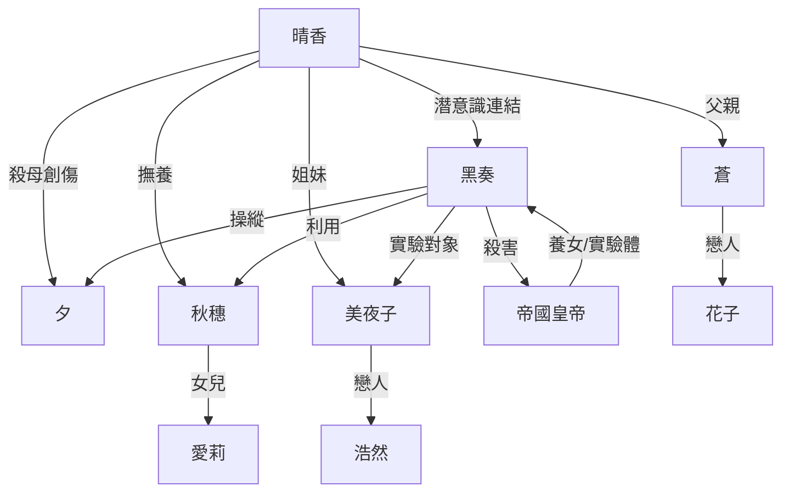
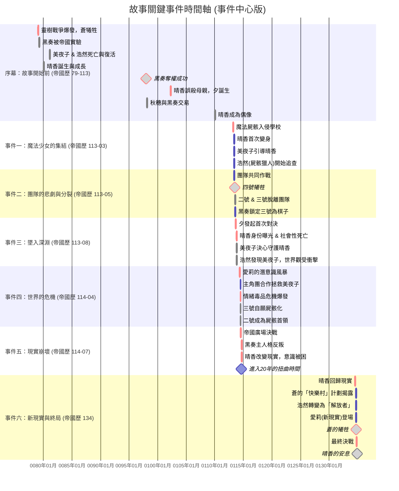

### 角色關係圖 

```mermaid
graph TD
    %% 核心角色
    晴香 -->|殺母創傷| 夕
    晴香 -->|撫養| 秋穗
    晴香 -->|姐妹| 美夜子
    晴香 -->|父親| 蒼
    晴香 -->|潛意識連結| 黑奏
    
    %% 反派線
    黑奏 -->|操縱| 夕
    黑奏 -->|利用| 秋穗
    黑奏 -->|實驗對象| 美夜子
    黑奏 -->|殺害| 帝國皇帝
    
    %% 愛情線
    美夜子 -->|戀人| 浩然
    蒼 -->|戀人| 花子

    %% 悲劇線
    秋穗 -->|女兒| 愛莉
    帝國皇帝 -->|養女/實驗體| 黑奏
    

```

---

### 故事關鍵事件時間軸

```mermaid
gantt
    title 故事關鍵事件時間軸 (事件中心版)
    dateFormat 帝國歷-MM
    axisFormat %Y年%m月
    
    section 序幕：故事開始前 (帝國歷 79-113)
    靈樹戰爭爆發，蒼犧牲              :crit, done, 0079-01, 2M
    黑奏被帝國實驗                    :done, 0079-03, 2M
    美夜子 & 浩然死亡與復活           :done, 0081-01, 2M
    晴香誕生與成長                    :done, 0080-01, 2M
    黑奏奪權成功                      :milestone, crit, done, 0098-01, 0d
    晴香誤殺母親，夕誕生              :crit, done, 0102-03, 2M
    秋穗與黑奏交易                    :done, 0098-02, 2M
    晴香成為偶像                      :done, 0110-01, 2M

    section 事件一：魔法少女的集結 (帝國歷 113-03)
    魔法屍骸入侵學校                  :crit, school_invasion, 0113-03, 2M
    晴香首次變身                      :active, after school_invasion, 2M
    美夜子引導晴香                    :active, after school_invasion, 2M
    浩然(屍骸獵人)開始追查            :active, after school_invasion, 2M

    section 事件二：團隊的悲劇與分裂 (帝國歷 113-05)
    團隊共同作戰                      :team_mission, 0113-05, 2M
    四號犧牲                          :milestone, crit, done, s4_death, after team_mission, 0d
    二號 & 三號脫離團隊               :done, after s4_death, 2M
    黑奏鎖定三號為棋子                :after s4_death, 2M

    section 事件三：墜入深淵 (帝國歷 113-08)
    夕發起首次對決                    :crit, active, yu_fight, 0113-08, 2M
    晴香身份曝光 & 社會性死亡         :crit, done, after yu_fight, 2M
    美夜子決心守護晴香                :done, after yu_fight, 2M
    浩然發現美夜子，世界觀受衝擊      :done, after yu_fight, 2M
    
    section 事件四：世界的危機 (帝國歷 114-04)
    愛莉的潛意識風暴                  :crit, aeri_storm, 0114-04, 2M
    主角團合作拯救美夜子              :active, after aeri_storm, 2M
    情緒毒品危機爆發                  :crit, after aeri_storm, 2M
    三號自願屍骸化                    :done, after aeri_storm, 2M
    二號成為屍骸首領                  :done, after aeri_storm, 2M
    
    section 事件五：現實崩壞 (帝國歷 114-07)
    帝國廣場決戰                      :crit, active, plaza_fight, 0114-07, 2M
    黑奏主人格反叛                    :crit, done, after plaza_fight, 2M
    晴香改變現實，意識被困            :crit, done, after plaza_fight, 2M
    進入20年的扭曲時間                :milestone, long_wait, after plaza_fight, 0d

    section 事件六：新現實與終局 (帝國歷 134)
    晴香回歸現實                      :crit, haruka_returns, 0134-07, 2M
    蒼的「快樂村」計劃揭露            :active, after haruka_returns, 2M
    浩然轉變為「解放者」              :active, after haruka_returns, 2M
    愛莉(新現實)登場                  :active, after haruka_returns, 2M
    蒼的犧牲                          :milestone, crit, done, sou_death, 0134-10, 0d
    最終決戰                          :crit, final_battle, after sou_death, 2M
    晴香的安息                        :milestone, done, after final_battle, 0d

```
