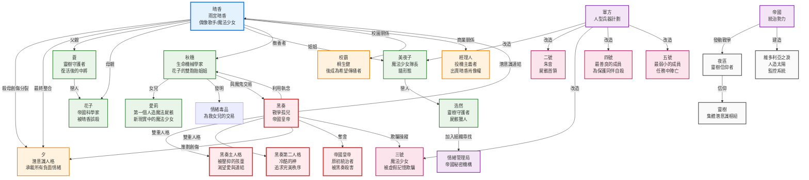
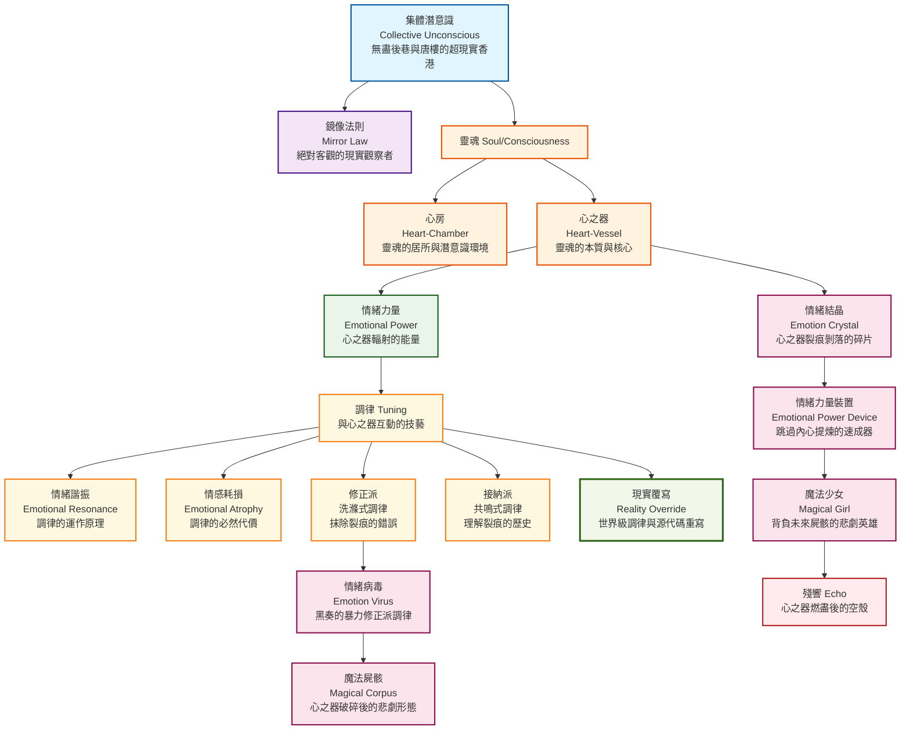
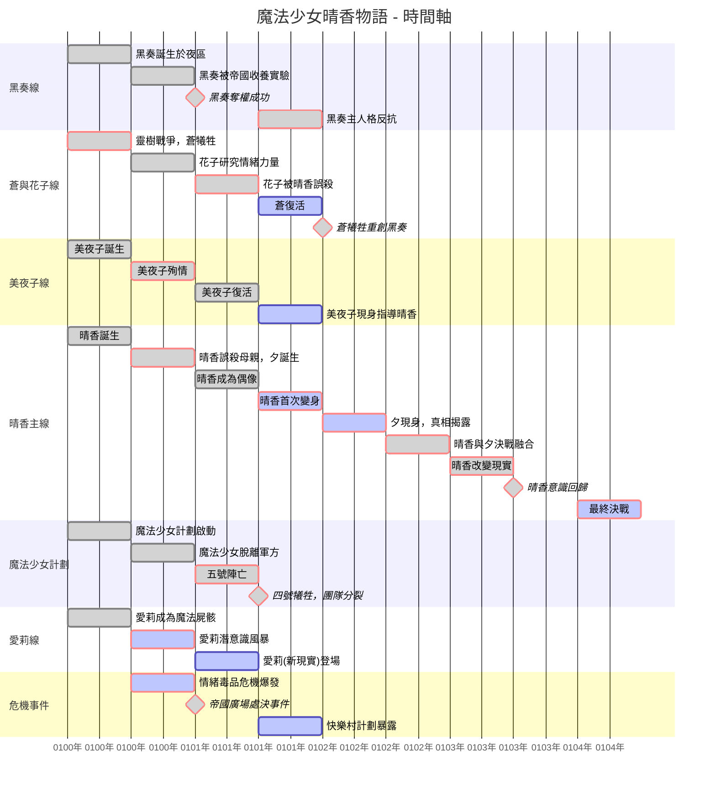
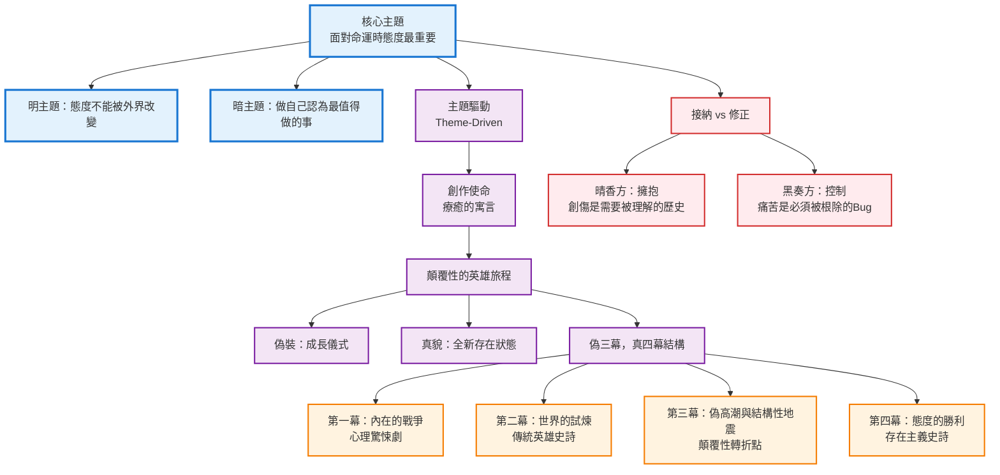
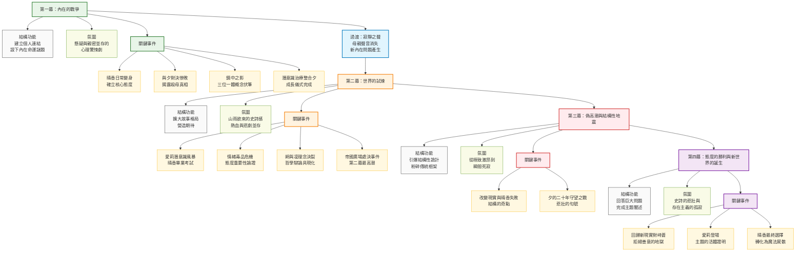
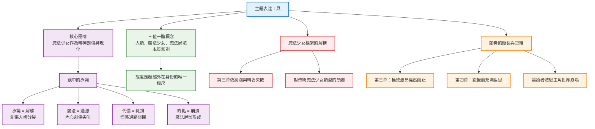
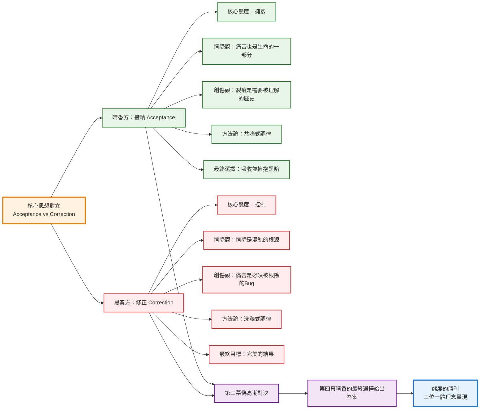

### 角色關係圖 

```mermaid
graph TD
    %% 核心主角
    晴香["晴香<br/>雨宮晴香<br/>偶像歌手/魔法少女"] 
    
    %% 晴香的內在世界
    晴香 -->|殺母創傷分裂| 夕["夕<br/>潛意識人格<br/>承載所有負面情緒"]
    晴香 -->|最終整合| 夕
    
    %% 晴香的家庭
    晴香 -->|父親| 蒼["蒼<br/>靈樹守護者<br/>復活後的中將"]
    晴香 -->|母親| 花子["花子<br/>帝國科學家<br/>被晴香誤殺"]
    晴香 -->|姐姐| 美夜子["美夜子<br/>魔法少女隊長<br/>貓形態"]
    晴香 -->|撫養者| 秋穗["秋穗<br/>生命機械學家<br/>花子的雙胞胎姐姐"]
    
    %% 反派核心
    黑奏["黑奏<br/>戰爭孤兒<br/>帝國皇帝"] 
    黑奏 -->|雙重人格| 黑奏主人格["黑奏主人格<br/>被壓抑的孩童<br/>渴望愛與連結"]
    黑奏 -->|雙重人格| 黑奏第二人格["黑奏第二人格<br/>冷酷的神<br/>追求完美秩序"]
    
    %% 黑奏的操縱網絡
    黑奏 -->|策劃創傷| 夕
    黑奏 -->|利用執念| 秋穗
    黑奏 -->|潛意識連結| 晴香
    黑奏 -->|奪舍| 帝國皇帝["帝國皇帝<br/>原初統治者<br/>被黑奏殺害"]
    黑奏 -->|欺騙操縱| 三號["三號<br/>魔法少女<br/>被虛假記憶欺騙"]
    
    %% 愛情悲劇線
    美夜子 -->|戀人| 浩然["浩然<br/>靈樹守護者<br/>屍骸獵人"]
    蒼 -->|戀人| 花子
    浩然 -->|加入組織尋找| 情緒管理局["情緒管理局<br/>帝國秘密機構"]
    
    %% 秋穗的悲劇
    秋穗 -->|女兒| 愛莉["愛莉<br/>第一個人造魔法屍骸<br/>新現實中的魔法少女"]
    秋穗 -->|發明| 情緒毒品["情緒毒品<br/>為救女兒的交易"]
    秋穗 -->|與魔鬼交易| 黑奏
    
    %% 魔法少女人型兵器
    軍方["軍方<br/>人型兵器計劃"] -->|改造| 美夜子
    軍方 -->|改造| 二號["二號<br/>朱音<br/>屍骸首領"]
    軍方 -->|改造| 三號
    軍方 -->|改造| 四號["四號<br/>最善良的成員<br/>為保護同伴自殺"]
    軍方 -->|改造| 五號["五號<br/>最弱小的成員<br/>任務中陣亡"]
    
    %% 其他重要角色
    晴香 -->|校園關係| 校霸["校霸<br/>桐生健<br/>後成為希望傳播者"]
    晴香 -->|商業關係| 經理人["經理人<br/>投機主義者<br/>出賣晴香肖像權"]
    
    %% 世界觀背景
    帝國["帝國<br/>統治勢力"] -->|發動戰爭| 夜區["夜區<br/>靈樹信仰者"]
    帝國 -->|建造| 維多利亞之淚["維多利亞之淚<br/>人造太陽<br/>監控系統"]
    夜區 -->|信仰| 靈樹["靈樹<br/>集體潛意識樞紐"]
    
    %% 樣式定義
    classDef protagonist fill:#e3f2fd,stroke:#1976d2,stroke-width:3px
    classDef antagonist fill:#ffebee,stroke:#d32f2f,stroke-width:3px
    classDef family fill:#e8f5e8,stroke:#2e7d32,stroke-width:2px
    classDef tragic fill:#fff3e0,stroke:#f57c00,stroke-width:2px
    classDef organization fill:#f3e5f5,stroke:#7b1fa2,stroke-width:2px
    classDef world fill:#fafafa,stroke:#424242,stroke-width:2px
    classDef magical_girl fill:#fce4ec,stroke:#c2185b,stroke-width:2px
    
    class 晴香 protagonist
    class 黑奏,黑奏主人格,黑奏第二人格,帝國皇帝 antagonist
    class 蒼,花子,美夜子,秋穗,愛莉,浩然 family
    class 夕,校霸,經理人 tragic
    class 軍方,情緒管理局,帝國 organization
    class 夜區,靈樹,維多利亞之淚 world
    class 二號,三號,四號,五號 magical_girl
```

---

### 08_情緒設定總綱 - 情緒系統架構圖

```mermaid
graph TD
    %% 基礎環境層
    A[集體潛意識<br/>Collective Unconscious<br/>無盡後巷與唐樓的超現實香港] --> B[鏡像法則<br/>Mirror Law<br/>絕對客觀的現實觀察者]
    
    %% 核心本體層
    A --> C[靈魂 Soul/Consciousness]
    C --> D[心房<br/>Heart-Chamber<br/>靈魂的居所與潛意識環境]
    C --> E[心之器<br/>Heart-Vessel<br/>靈魂的本質與核心]
    
    %% 核心技藝層
    E --> F[情緒力量<br/>Emotional Power<br/>心之器輻射的能量]
    F --> G[調律 Tuning<br/>與心之器互動的技藝]
    G --> H[情緒諧振<br/>Emotional Resonance<br/>調律的運作原理]
    G --> I[情感耗損<br/>Emotional Atrophy<br/>調律的必然代價]
    
    %% 調律流派
    G --> J[修正派<br/>洗滌式調律<br/>抹除裂痕的錯誤]
    G --> K[接納派<br/>共鳴式調律<br/>理解裂痕的歷史]
    
    %% 衍生物層
    J --> L[情緒病毒<br/>Emotion Virus<br/>黑奏的暴力修正派調律]
    E --> M[情緒結晶<br/>Emotion Crystal<br/>心之器裂痕剝落的碎片]
    M --> N[情緒力量裝置<br/>Emotional Power Device<br/>跳過內心提煉的速成器]
    N --> O[魔法少女<br/>Magical Girl<br/>背負未來屍骸的悲劇英雄]
    L --> P[魔法屍骸<br/>Magical Corpus<br/>心之器破碎後的悲劇形態]
    
    %% 終極現象
    G --> Q[現實覆寫<br/>Reality Override<br/>世界級調律與源代碼重寫]
    
    %% 特殊狀態
    O --> R[殘響 Echo<br/>心之器燃盡後的空殼]
    
    %% 樣式定義
    classDef environment fill:#e1f5fe,stroke:#01579b,stroke-width:2px
    classDef law fill:#f3e5f5,stroke:#4a148c,stroke-width:2px
    classDef core fill:#fff3e0,stroke:#e65100,stroke-width:2px
    classDef power fill:#e8f5e8,stroke:#1b5e20,stroke-width:2px
    classDef technique fill:#fff8e1,stroke:#f57f17,stroke-width:2px
    classDef derivative fill:#fce4ec,stroke:#880e4f,stroke-width:2px
    classDef ultimate fill:#f1f8e9,stroke:#33691e,stroke-width:3px
    classDef tragic fill:#ffebee,stroke:#b71c1c,stroke-width:2px
    
    class A environment
    class B law
    class C,D,E core
    class F power
    class G,H,I,J,K technique
    class L,M,N,O,P derivative
    class Q ultimate
    class R tragic
```

---

### 故事關鍵事件時間軸

```mermaid
gantt
    title 魔法少女晴香物語 - 時間軸
    dateFormat YYYY-MM-DD
    axisFormat %Y年
    
    section 黑奏線
    黑奏誕生於夜區                    :done, 0100-01-01, 180d
    黑奏被帝國收養實驗                :done, 0100-07-01, 180d
    黑奏奪權成功                      :milestone, crit, done, 0101-01-01, 0d
    黑奏主人格反抗                    :crit, done, 0101-07-01, 180d
    
    section 蒼與花子線
    靈樹戰爭，蒼犧牲                  :crit, done, 0100-01-01, 180d
    花子研究情緒力量                  :done, 0100-07-01, 180d
    花子被晴香誤殺                    :crit, done, 0101-01-01, 180d
    蒼復活                            :active, 0101-07-01, 180d
    蒼犧牲重創黑奏                    :milestone, crit, done, 0102-01-01, 0d
    
    section 美夜子線
    美夜子誕生                        :done, 0100-01-01, 180d
    美夜子殉情                        :crit, done, 0100-07-01, 180d
    美夜子復活                        :done, 0101-01-01, 180d
    美夜子現身指導晴香                :active, 0101-07-01, 180d
    
    section 晴香主線
    晴香誕生                          :done, 0100-01-01, 180d
    晴香誤殺母親，夕誕生              :crit, done, 0100-07-01, 180d
    晴香成為偶像                      :done, 0101-01-01, 180d
    晴香首次變身                      :crit, active, 0101-07-01, 180d
    夕現身，真相揭露                  :crit, active, 0102-01-01, 180d
    晴香與夕決戰融合                  :crit, done, 0102-07-01, 180d
    晴香改變現實                      :crit, done, 0103-01-01, 180d
    晴香意識回歸                      :milestone, crit, done, 0103-07-01, 0d
    最終決戰                          :crit, active, 0104-01-01, 180d
    
    section 魔法少女計劃
    魔法少女計劃啟動                  :done, 0100-01-01, 180d
    魔法少女脫離軍方                  :done, 0100-07-01, 180d
    五號陣亡                          :crit, done, 0101-01-01, 180d
    四號犧牲，團隊分裂                :milestone, crit, done, 0101-07-01, 0d
    
    section 愛莉線
    愛莉成為魔法屍骸                  :done, 0100-01-01, 180d
    愛莉潛意識風暴                    :crit, active, 0100-07-01, 180d
    愛莉(新現實)登場                  :active, 0101-01-01, 180d
    
    section 危機事件
    情緒毒品危機爆發                  :crit, active, 0100-07-01, 180d
    帝國廣場處決事件                  :milestone, crit, done, 0101-01-01, 0d
    快樂村計劃暴露                    :active, 0101-07-01, 180d

```

---

### 04_故事結構、氛圍與事件服務性深度解析 - 故事結構圖

```mermaid
graph TD
    %% 核心主題
    A[核心主題<br/>面對命運時態度最重要] --> B[明主題：態度不能被外界改變]
    A --> C[暗主題：做自己認為最值得做的事]
    
    %% 故事驅動力
    A --> D[主題驅動<br/>Theme-Driven]
    D --> E[創作使命<br/>療癒的寓言]
    
    %% 核心框架
    E --> F[顛覆性的英雄旅程]
    F --> G[偽裝：成長儀式]
    F --> H[真貌：全新存在狀態]
    
    %% 結構詭計
    F --> I[偽三幕，真四幕結構]
    I --> J[第一幕：內在的戰爭<br/>心理驚悚劇]
    I --> K[第二幕：世界的試煉<br/>傳統英雄史詩]
    I --> L[第三幕：偽高潮與結構性地震<br/>顛覆性轉折點]
    I --> M[第四幕：態度的勝利<br/>存在主義史詩]
    
    %% 核心對立
    A --> N[接納 vs 修正]
    N --> O[晴香方：擁抱<br/>創傷是需要被理解的歷史]
    N --> P[黑奏方：控制<br/>痛苦是必須被根除的Bug]
    
    %% 樣式定義
    classDef theme fill:#e3f2fd,stroke:#1976d2,stroke-width:3px
    classDef structure fill:#f3e5f5,stroke:#7b1fa2,stroke-width:2px
    classDef act fill:#fff3e0,stroke:#f57c00,stroke-width:2px
    classDef conflict fill:#ffebee,stroke:#d32f2f,stroke-width:2px
    
    class A,B,C theme
    class D,E,F,G,H,I structure
    class J,K,L,M act
    class N,O,P conflict
```

---

### 04_故事結構 - 四幕結構詳細分析圖

```mermaid
graph TD
    %% 第一幕
    A[第一幕：內在的戰爭] --> A1[結構功能<br/>建立個人連結<br/>設下內在命運謎題]
    A --> A2[氛圍<br/>懸疑與親密並存的<br/>心理驚悚劇]
    A --> A3[關鍵事件]
    A3 --> A3a[晴香日常變身<br/>確立核心態度]
    A3 --> A3b[與夕對決慘敗<br/>揭露殺母真相]
    A3 --> A3c[鏡中之影<br/>三位一體概念伏筆]
    A3 --> A3d[潛意識治療整合夕<br/>成長儀式完成]
    
    %% 過渡
    A --> T1[過渡：寂靜之聲<br/>母親聲音消失<br/>新內在問題產生]
    
    %% 第二幕
    T1 --> B[第二幕：世界的試煉]
    B --> B1[結構功能<br/>擴大故事格局<br/>營造期待]
    B --> B2[氛圍<br/>山雨欲來的史詩感<br/>熱血與悲劇並存]
    B --> B3[關鍵事件]
    B3 --> B3a[愛莉潛意識風暴<br/>晴香畢業考試]
    B3 --> B3b[情緒毒品危機<br/>態度重要性論證]
    B3 --> B3c[朔與凜理念決裂<br/>哲學辯論具現化]
    B3 --> B3d[帝國廣場處決事件<br/>第二幕最高潮]
    
    %% 第三幕
    B --> C[第三幕：偽高潮與結構性地震]
    C --> C1[結構功能<br/>引爆結構性詭計<br/>粉碎傳統框架]
    C --> C2[氛圍<br/>從極致激昂到<br/>瞬間死寂]
    C --> C3[關鍵事件]
    C3 --> C3a[改變現實與晴香失敗<br/>結構的奇點]
    C3 --> C3b[夕的二十年守望之戰<br/>悲壯的句號]
    
    %% 第四幕
    C --> D[第四幕：態度的勝利與新世界的誕生]
    D --> D1[結構功能<br/>回答巨大問題<br/>完成主題闡述]
    D --> D2[氛圍<br/>史詩的悲壯與<br/>存在主義的孤寂]
    D --> D3[關鍵事件]
    D3 --> D3a[回歸新現實對峙蒼<br/>拒絕善意的地獄]
    D3 --> D3b[愛莉登場<br/>主題的活體證明]
    D3 --> D3c[晴香最終選擇<br/>轉化為魔法屍骸]
    
    %% 樣式定義
    classDef act1 fill:#e8f5e8,stroke:#2e7d32,stroke-width:2px
    classDef act2 fill:#fff3e0,stroke:#f57c00,stroke-width:2px
    classDef act3 fill:#ffebee,stroke:#d32f2f,stroke-width:2px
    classDef act4 fill:#f3e5f5,stroke:#7b1fa2,stroke-width:2px
    classDef transition fill:#e1f5fe,stroke:#0277bd,stroke-width:2px
    classDef function fill:#fafafa,stroke:#424242,stroke-width:1px
    classDef atmosphere fill:#f9fbe7,stroke:#689f38,stroke-width:1px
    classDef event fill:#fff8e1,stroke:#fbc02d,stroke-width:1px
    
    class A,A1,A2,A3,A3a,A3b,A3c,A3d act1
    class B,B1,B2,B3,B3a,B3b,B3c,B3d act2
    class C,C1,C2,C3,C3a,C3b act3
    class D,D1,D2,D3,D3a,D3b,D3c act4
    class T1 transition
    class A1,B1,C1,D1 function
    class A2,B2,C2,D2 atmosphere
    class A3a,A3b,A3c,A3d,B3a,B3b,B3c,B3d,C3a,C3b,D3a,D3b,D3c event
```

---

### 04_故事結構 - 主題表達工具圖

```mermaid
graph TD
    %% 核心隱喻
    A[主題表達工具] --> B[核心隱喻<br/>魔法少女作為精神創傷具現化]
    B --> B1[鏡中的承諾]
    B1 --> B1a[承諾 = 解離<br/>創傷人格分裂]
    B1 --> B1b[魔法 = 過激<br/>內心創傷尖叫]
    B1 --> B1c[代價 = 耗損<br/>情感通路關閉]
    B1 --> B1d[終點 = 崩潰<br/>魔法屍骸形成]
    
    %% 三位一體概念
    A --> C[三位一體概念<br/>人類、魔法少女、魔法屍骸本質無別]
    C --> C1[態度是超越外在身份的唯一標尺]
    
    %% 框架解構
    A --> D[魔法少女框架的解構]
    D --> D1[第三幕偽高潮與晴香失敗]
    D --> D2[對傳統魔法少女類型的顛覆]
    
    %% 節奏控制
    A --> E[節奏的斷裂與重組]
    E --> E1[第三幕：極致激昂戛然而止]
    E --> E2[第四幕：緩慢而充滿哲思]
    E --> E3[讓讀者體驗主角世界崩塌]
    
    %% 樣式定義
    classDef tool fill:#e3f2fd,stroke:#1976d2,stroke-width:2px
    classDef metaphor fill:#f3e5f5,stroke:#7b1fa2,stroke-width:2px
    classDef concept fill:#e8f5e8,stroke:#2e7d32,stroke-width:2px
    classDef deconstruct fill:#ffebee,stroke:#d32f2f,stroke-width:2px
    classDef rhythm fill:#fff3e0,stroke:#f57c00,stroke-width:2px
    
    class A tool
    class B,B1,B1a,B1b,B1c,B1d metaphor
    class C,C1 concept
    class D,D1,D2 deconstruct
    class E,E1,E2,E3 rhythm
```

---

### 04_故事結構 - 核心思想對立圖

```mermaid
graph LR
    %% 中心衝突
    A[核心思想對立<br/>Acceptance vs Correction] 
    
    %% 晴香方
    A --> B[晴香方：接納 Acceptance]
    B --> B1[核心態度：擁抱]
    B --> B2[情感觀：痛苦也是生命的一部分]
    B --> B3[創傷觀：裂痕是需要被理解的歷史]
    B --> B4[方法論：共鳴式調律]
    B --> B5[最終選擇：吸收並擁抱黑暗]
    
    %% 黑奏方
    A --> C[黑奏方：修正 Correction]
    C --> C1[核心態度：控制]
    C --> C2[情感觀：情感是混亂的根源]
    C --> C3[創傷觀：痛苦是必須被根除的Bug]
    C --> C4[方法論：洗滌式調律]
    C --> C5[最終目標：完美的結果]
    
    %% 對決結果
    B --> D[第三幕偽高潮對決]
    C --> D
    D --> E[第四幕晴香的最終選擇給出答案]
    E --> F[態度的勝利<br/>三位一體理念實現]
    
    %% 樣式定義
    classDef center fill:#fff3e0,stroke:#f57c00,stroke-width:3px
    classDef acceptance fill:#e8f5e8,stroke:#2e7d32,stroke-width:2px
    classDef correction fill:#ffebee,stroke:#d32f2f,stroke-width:2px
    classDef battle fill:#f3e5f5,stroke:#7b1fa2,stroke-width:2px
    classDef victory fill:#e3f2fd,stroke:#1976d2,stroke-width:3px
    
    class A center
    class B,B1,B2,B3,B4,B5 acceptance
    class C,C1,C2,C3,C4,C5 correction
    class D,E battle
    class F victory
```