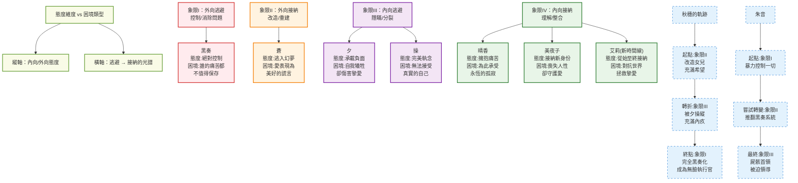

### 角色關係圖 

---

### 08_情緒設定總綱 - 情緒系統架構圖

---

### 故事關鍵事件時間軸

---

### 04_故事結構、氛圍與事件服務性深度解析 - 故事結構圖

---

### 04_故事結構 - 四幕結構詳細分析圖

---

### 04_故事結構 - 主題表達工具圖

---

### 記憶碎片化地圖 - 晴香的記憶重構

---

### 時間迴圈因果悖論 - 黑奏力量來源圖

---

### 魔法少女的力量腐蝕週期

---

### 角色態度與困境矩陣

---

### 四幕心理狀態進度圖

---

### 無限迴圈比較圖 - 三種困境的輪迴

---

### 04_故事結構 - 核心思想對立圖

