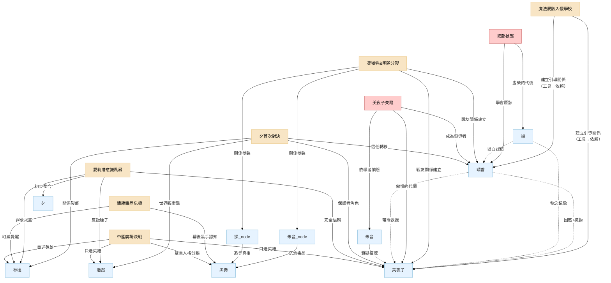

---

### **引言**

在一個由命運與態度交織的故事中，任何單一的重大事件都不會只影響一個人。如同投入湖中的石子，其漣漪會擴散至每一個人，改變他們之間的距離、信任與看法。本文件旨在分析幾個核心事件，如何成為角色關係演變的催化劑。

#### **事件一：魔法屍骸入侵學校**

這是故事的開端，是「日常」的帷幕被暴力撕開，所有關係的「初始設定」被打破的時刻。

- **[[01_人物背景故事#^block1|晴香]] vs. [[01_人物背景故事#^block5|美夜子]]：不平等的初遇**
    
    - **關係影響**：建立了一種不平等的「引導者」與「被引導者」的關係。對[[01_人物背景故事#^block5|美夜子]]而言，[[01_人物背景故事#^block1|晴香]]是喚醒自己、達成目的所必需的「鑰匙」，態度冷漠且充滿功利性，言語間毫不掩飾對[[01_人物背景故事#^block1|晴香]]天真的不耐。對[[01_人物背景故事#^block1|晴香]]來說，這隻突然出現、口出狂言的黑貓，是將她拖入殘酷命運的「不祥之物」，她對其充滿了困惑、抗拒，卻又因無知而產生了一絲被迫的依賴。
        
    - **看法變化**：[[01_人物背景故事#^block1|晴香]]對「世界」的看法被徹底粉碎，第一次意識到舞台燈光外的危險。[[01_人物背景故事#^block5|美夜子]]則可能在[[01_人物背景故事#^block1|晴香]]那奮不顧身的魯莽中，看到了一絲自己早已被磨滅的正義感，但那瞬間更多的是煩躁——「這種天真在戰場上只會害死自己」。
        
- **[[01_人物背景故事#^block1|晴香]] vs. 校霸：從敵對到共犯**
    
    - **關係影響**：從單純的「欺凌者」與「保護者」，轉變為「共同經歷超自然事件的共犯」。校霸對[[01_人物背景故事#^block1|晴香]]的看法，從一個礙事的「正義魔人」，驟變為難以理解、令人恐懼卻又救了自己一命的「怪物/英雄」混合體。
        
    - **看法變化**：校霸對「力量」的看法，從單純的體格與人數優勢，擴展到了存在著神話般恐怖力量的層面。這份源於恐懼的敬畏，是他日後態度轉變的起點。
        

---

#### **事件二：「鏡中之影」**

這是[[01_人物背景故事#^block1|晴香]]作為魔法少女的第一次「思想衝擊」，讓「正義」的輪廓開始變得模糊。

- **[[01_人物背景故事#^block1|晴香]] vs. [[01_人物背景故事#^block5|美夜子]]：理念的首次碰撞**
    
    - **關係影響**：凸顯了兩人此刻價值觀的巨大鴻溝。當[[01_人物背景故事#^block1|晴香]]因窺見魔法屍骸生前的悲傷記憶而對「淨化」行為產生猶豫時，[[01_人物背景故事#^block5|美夜子]]以一種近乎冷酷的實用主義態度完成了擊殺。她可能只會留下一句：「它曾是人類，但現在不是了。想太多只會讓你猶豫，而猶豫會致命。」
        
    - **看法變化**：[[01_人物背景故事#^block1|晴香]]對「敵人」的看法，第一次從「該被消滅的怪物」轉變為「曾是人類的悲劇存在」。這份動搖，讓她開始質疑自己行為的正當性。[[01_人物背景故事#^block5|美夜子]]則更加確信[[01_人物背景故事#^block1|晴香]]的「多愁善感」是個致命弱點，必須被糾正，這也加強了她作為「引導者」的責任感（或負擔感）。
        

---

---

#### **事件 2.5：總部被襲——虛榮的代價**

這是團隊第一次因「內部背叛」而遭受災難，也是「少女的面子」如何導致真實傷害的殘酷證明。

- **[[02_次要角色背景故事#^block-misao|操]] vs. 團隊：從「隱形人」到「罪人」再到「被接納的同伴」**

    - **關係影響**：操一直覺得自己是團隊的邊緣人，這次事件令她從「被忽視」變成「主動傷害隊友」的罪人。但當她選擇坦白，反而成為她第一次真正融入團隊的契機。

    - **看法變化**：操對「自尊」的看法被顛覆——為了面子而傷害隊友，這種「優雅」其實是最醜陋的。

- **[[01_人物背景故事#^block1|晴香]] vs. [[02_次要角色背景故事#^block-misao|操]]：從「無心傷害者」到「原諒者」**

    - **關係影響**：晴香意識到自己無心的言語也可以傷害人。當操坦白時，晴香第一次展現出超越自身痛苦、主動原諒他人的成熟。

    - **看法變化**：晴香對「正義」的看法變得更加細膩——不單止要對抗外敵，還要留意身邊人的感受。

- **[[01_人物背景故事#^block5|美夜子]] vs. [[02_次要角色背景故事#^block-misao|操]]：從「價值觀對立」到「互相理解」**

    - **關係影響**：美夜子一直看不起操的「形式主義」，但當她見到操因面子而犯下大錯，她第一次意識到：這種執著和自己對凜的執著，本質上是一樣的。

    - **看法變化**：美夜子開始反思自己的「傲慢」——如果操的虛榮是錯，那自己的「單打獨鬥」又算不算一種執念？

---

#### **事件三：凜的犧牲 & 團隊分裂**

這場悲劇是主角團第一次直面「魔法少女」身份的終極代價，也是團隊從貌合神離走向徹底決裂的催化劑。

- **[[01_人物背景故事#^block1|晴香]] vs. 其他魔法少女 ([[01_人物背景故事#^block5|美夜子]]、朱音、操)：從陌生到永訣**

    - **關係影響**：[[01_人物背景故事#^block1|晴香]]第一次與「同類」建立了短暫但深刻的連結，也第一次親歷了同伴在眼前化為灰燼。這場共同的創傷，透過「情緒連結」的設定被無限放大，讓凜的絕望如同病毒般感染了所有人。這份痛苦，將她與[[01_人物背景故事#^block5|美夜子]]的關係從單純的利害合作，轉變為能夠共情痛苦的「戰友」。然而，她與朱音、操的關係則在此刻走向終結，她們的離去讓[[01_人物背景故事#^block1|晴香]]初次體會到，面對他人的絕望時，自己的「希望」是多麼蒼白無力。
        
    - **看法變化**：[[01_人物背景故事#^block1|晴香]]對「魔法少女」的看法被徹底顛覆。她意識到這不僅僅是戰鬥，更是背負著隨時會情緒失控、變成怪物或犧牲的詛咒。她開始理解其他少女身上那種與生俱來的絕望和憤怒。
        
- **[[01_人物背景故事#^block5|美夜子]] vs. 朱音/操：責任的崩塌**

    - **關係影響**：作為前隊長，凜的死對她是一次沉重的歷史重演，加劇了她內心對「無法拯救同伴」的自責與愧疚感。朱音、操的決裂，對她而言是一種審判，無論對方是否直接指責，她都會將這份分裂歸咎於自己，讓她更加孤立。

    - **看法變化**：[[01_人物背景故事#^block5|美夜子]]對「責任」的看法變得更加沉重。她親眼見證了努力也無法保護所有人，這粉碎了她可能還殘存的一絲幻想，讓她對「魔法少女的命運就是悲劇」這一點更加確信。

---

#### **事件 3.5：美夜子失蹤——傲慢的代價**

這是團隊信任建立後的第一次重大危機，也是「家長式保護」如何導致災難的殘酷證明。更重要的是，這是晴香從「被保護者」成長為「領導者」的關鍵時刻。

- **[[01_人物背景故事#^block5|美夜子]] vs. 團隊：「保護者」變成「被保護者」**

    - **關係影響**：美夜子一直以「隊長」自居，從不需要他人幫助。這次被救，是她第一次以「弱者」的身份接受隊友的援手，打破了她與隊友之間的上下關係。

    - **看法變化**：美夜子對「信任」的定義被重寫——信任不是「我保護你」，而是「你也可以保護我」。

- **[[01_人物背景故事#^block1|晴香]] vs. [[01_人物背景故事#^block5|美夜子]]：從「被引導者」到「並肩者」**

    - **關係影響**：晴香第一次帶隊執行任務，成功救出美夜子。這是她從「學生」畢業成「戰友」的標誌性時刻。

    - **看法變化**：晴香對美夜子的看法，從「無所不能的導師」變成「也有軟弱一面的同伴」。這份「去神化」反而令她們的關係更加真實。

- **[[02_次要角色背景故事#^block-akane|朱音]] vs. [[01_人物背景故事#^block5|美夜子]]：「依賴者」的憤怒**

    - **關係影響**：朱音一直視美夜子為救命恩人，但當美夜子因傲慢而險些喪命，朱音第一次對美夜子表達憤怒：「你整天說要保護我們，但你連我們都不信！」

    - **看法變化**：朱音開始明白，單方面的「被保護」是一種不健康的關係。她也開始思考，自己對美夜子的依賴是否同樣有問題。

- **[[02_次要角色背景故事#^block-misao|操]] vs. [[01_人物背景故事#^block5|美夜子]]：執念的鏡像**

    - **關係影響**：操曾因虛榮心犯下大錯，如今看到美夜子因對凜的執念而差點喪命，她意識到：她們都是被「放不下的執著」所傷害的人。

    - **看法變化**：操對美夜子的態度，從「價值觀對立」轉變為「同病相憐」。這成為她們關係改善的起點。

---

#### **事件四：與「[[01_人物背景故事#^block7|夕]]」的首次對決 & 身份曝光**

這是將[[01_人物背景故事#^block1|晴香]]推入谷底，同時也是考驗所有人關係的第一次「大浪」。

- **晴香 vs. 美夜子：從功利到信賴**
    
    - **關係影響**：關係開始從功利轉向真正的「同伴」。當晴香被揭露真相、精神崩潰並被社會徹底拋棄時，美夜子是唯一沒有離開，反而選擇留下並引導她的人。這讓晴香在最深的黑暗中，抓住了第一根浮木。
        
    - **看法變化**：美夜子對晴香的看法，從一個不成熟的「工具」，開始轉變為一個需要被保護、值得去扶持的「夥伴」。她看到了晴香的脆弱，也可能因此回想起自己過去的無助。晴香則從依賴秋穗阿姨，開始將信任的天秤向美夜子傾斜。
        
- **晴香 vs. 秋穗：信任的裂痕**
    
    - **關係影響**：產生了深刻的裂痕。晴香意識到阿姨一直對她隱瞞著關於母親之死的真相，這份「保護」在她看來變成了一種「欺騙」，讓她對從小依賴的親人產生了第一次的懷疑和疏離感，她們之間溫馨的日常被一層看不見的隔膜籠罩。
        
    - **看法變化**：秋穗對晴香的看法變得更加複雜，除了原有的愛與妒忌，更增添了濃厚的「愧疚感」。她意識到自己的封存記憶，並未真正保護晴香，只是推遲了痛苦的到來。

### **事件五：「愛莉的潛意識風暴」—— 晴香的畢業考試與夕的謝幕**

這並非一場單純的救援任務，而是檢驗晴香與夕「整合」成果的終極試煉場。一個由純粹的痛苦、恐懼和混亂構成的內心世界，正是對晴香這位「情緒增幅器」最大的考驗。此事件的設計，完美地展現了晴香態度的根本轉變，並為夕的存在畫上了最溫柔也最必然的句點。

**1. 「寂靜」的開端：第一次沒有「母親」的戰鬥**

- **場景描述：** 當晴香、秋穗等人進入愛莉那破碎、充滿哭泣聲的潛意識空間時，晴香面對著撲面而來的負面能量。在過去，這是她最恐懼的場景。她的第一反應，是本能地、習慣性地去傾聽腦海中那個熟悉的、「母親」的聲音，等待著指引與慰藉。
    
- **內在證明：** 然而，這一次，腦海中只有一片死寂。沒有任何聲音，沒有任何指導。這份突如其來的「寂靜」，是她與夕融合後最直接、也最殘酷的體現。晴香第一次恐懼地意識到——那個由夕扮演的「外部幻影」已經完成了它的歷史使命，不再需要存在了。她必須獨自面對這一切。這場戰鬥，從一開始就成為了對她是否真正「獨立」的第一次嚴峻考驗。
    

**2. 「態度」的轉變：從「消滅黑暗」到「理解黑暗」**

- **面對「心靈怪物」：** 在愛莉的潛意識中，她們遇到的不是傳統的敵人，而是由愛莉的痛苦所化作的具象化身——例如，一個代表「被拋棄的恐懼」而不斷哭泣的影子，或一個代表「實驗痛苦」而不斷抽搐的怪物。
    
- **外在證明：**
    
    - **舊的晴香會怎麼做？** 她會因為恐懼而試圖用她最擅長的、純粹的「希望」之力去「淨化」或「消滅」這些怪物，但很可能會發現這完全無效，甚至會激起更強烈的反抗（因為希望的光芒，對沉浸在絕望中的存在來說，是一種刺眼的否定）。
        
    - **新的晴香會怎麼做？** 在意識到純粹的光明無效後，她做出了一個讓秋穗和美夜子都感到驚訝的選擇。她不再攻擊，而是主動地、有意識地去調動屬於「夕」的那部分力量。她走到那個哭泣的影子面前，用自己的「情緒增幅器」，去共鳴並放大一份理解的「悲傷」，她可能會輕聲說：**「我知道，這很痛苦。」**她不是在消滅黑暗，而是在承認和擁抱黑暗。結果，那個怪物可能不會消失，而是在她的共鳴下，漸漸平靜下來，為她們讓開道路。
        

**3. 夕的「潛航」：使命完成後的安眠**

這次成功的「共情」，是晴香真正意義上第一次駕馭了自己完整的力量，而不是被其控制。她向自己和同伴證明了，她已經不再是那個害怕自己情緒的女孩。而對於夕來說，這也是她存在的終極意義的實現。

- **使命的完成：** 她作為「保護者」的本能，其最終目的，就是希望晴香能變得足夠強大，不再需要她這個極端的「應急系統」。當她看到晴香能夠主動、且有建設性地運用那份源於痛苦的力量時，她知道自己的使命已經完成了。
    
- **意識的安眠：** 因此，在「愛莉的潛意識風暴」事件結束後，當一切回歸平靜時，夕的意識就可以真正地、安心地「潛航」了。她的退場，不再是一個突兀的設定，而是一場盛大而艱難的考試之後，一位老師傅看到弟子終於出師，欣慰地轉身離去。這份消失，充滿了情感的重量和邏輯的必然性。
    

**此事件對角色關係的影響：**

- **晴香 vs. 夕：最完美的告別**
    
    - **關係影響：** 從「融合為一」走到了「精神上的畢業」。夕不再是需要對抗或依賴的對象，而是真正內化成了晴香的智慧與力量。夕的「潛航」，是她們之間最溫柔的告別，也是晴香真正成人的標誌。
        
    - **看法變化：** 晴香對夕的看法，從一個複雜的「陰影自我」，變成了值得感謝的「引路人」。她明白了夕的痛苦，並將這份痛苦化為了慈悲的力量。
        
- **晴香 vs. 美夜子：從對等到信賴的昇華**
    
    - **關係影響：** 美夜子親眼見證了晴香的蛻變。她看到晴香不再是那個需要她提點的菜鳥，而是能以一種她自己都無法做到的方式去「解決」問題。這份震撼，讓她們的信賴關係提升到了新的高度。
        
    - **看法變化：** 美夜子對晴香的看法，從「值得信賴的平等夥伴」，變成了「一個擁有自己所不具備的、溫柔而強大力量的人」。她對晴香的態度，從此多了一份發自內心的敬佩。
        
- **秋穗 vs. 所有人：從愧疚到希望的轉變**
    
    - **關係影響：** 在共同進入愛莉潛意識的過程中，她被迫直面自己的執念所造成的傷害。晴香那種「共情」而非「治癒」的方式，給了她巨大的衝擊。
        
    - **看法變化：** 秋穗對「拯救女兒」的看法，從「用科學手段修正錯誤」，變成了「理解女兒的痛苦」。她看到晴香用一種更為本質的方式觸及了愛莉的靈魂，這讓她對晴香的看法從複雜的「愧疚與關愛」，增添了一份「她或許真的能帶來不同結局」的希望。
        
- **朔(浩然) vs. 管理局（作為外部觀察者）：反叛的萌芽**
    
    - **關係影響：** 埋下了反叛的種子。作為參與封鎖行動的一員，他親眼目睹了管理局高層對一個無辜女孩（愛莉）的冷酷無情和非人化處理（「淨化協議」）。
        
    - **看法變化：** 他對自己所效忠的「秩序」產生了根本性的懷疑，開始意識到這個體制本身就是「惡」的一部分。

### **事件六：情緒毒品危機**

這是一場由個人執念引發的社會災難，也是黑奏計劃大規模推進的號角。

- **秋穗 vs. 世界：**
    
    - **關係影響**：她與整個世界的關係從「隱居者」變成了「罪人」。她親手修改的配方，導致了無數市民的屍骸化。這份巨大的罪孽，徹底壓垮了她的心理防線，讓她無法再逃避自己行為的後果。
        
    - **看法變化**：秋穗對「希望」的看法產生了毀滅性的轉變。她意識到自己所追尋的、由黑奏給予的「希望」是徹頭徹尾的謊言，其代價是整個城市的毀滅。這份幻滅，是她最終能放下執念的催化劑。
        
- **主角團 vs. 黑奏：**
    
    - **看法變化**：團隊第一次清晰地認識到黑奏的恐怖之處——她不僅擁有強大的個人力量，更能輕易地利用人心最脆弱的執念（如秋穗的母愛），將其轉化為大規模殺傷性武器。他們對敵人的看法，從一個強大的「個體」，上升到一個操縱人心的「幕後黑手」。
        

### **事件七：操的悲劇 (追尋真相與自我毀滅)**

這個事件是一幕寂靜的悲劇，從側面揭示了黑奏的殘酷和命運的無情。

- **主角團 vs. 昔日同伴的記憶：**

    - **關係影響**：操以一種最慘烈的方式，永遠地退出了與主角團的關係。

    - **看法變化**：當晴香和美夜子得知操的結局後，她們對「真相」的看法會變得更加複雜和警惕。操為了追求「真實過去」而擁抱了一個謊言，最終自我毀滅。這讓主角們明白，盲目地追求所謂的「真相」，有時比活在無知中更加危險。這也讓她們對朱音的行為有了更深層次的理解，而非單純的敵對。

- **主角團 vs. 黑奏：**

    - **看法變化**：如果說情緒毒品危機展現了黑奏的宏觀佈局能力，那操的悲劇則赤裸裸地揭示了她對個體精神的精準打擊和冷血無情。團隊對黑奏的看法，從一個「戰略家」，進一步深化為一個玩弄靈魂、以他人痛苦為樂的「惡魔」。
        

### **事件八：朱音的崛起 (屍骸首領的誕生)**

這是一個昔日戰友墮入黑暗、成為新威脅的轉折點。

- **晴香/美夜子 vs. 朱音：**

    - **關係影響**：她們被迫與曾經的同伴為敵。這份衝突不僅是物理上的，更是理念上的。朱音的選擇——在失去一切後，透過掌控他人來重塑自我——與晴香和美夜子選擇的道路完全相反。

    - **看法變化**：主角團對「魔法少女的未來」這一問題產生了更深的思考。朱音的存在證明了，即使不被黑奏直接利用，魔法少女也可能因自身的絕望而走向另一條極端、扭曲的道路。晴香對朱音的看法，從最初的「不解和憤怒」，可能會轉變為一份複雜的同情——同情她們共同的悲慘命運，但絕不認同她所選擇的態度。

- **浩然 vs. 世界的複雜性：**

    - **看法變化**：浩然對「怪物」的定義再次被顛覆。他看到朱音，一個與自己和美夜子一樣曾有高尚身份的「同類」，如今卻成為了新的混亂之源。他意識到，敵我、善惡的界線遠比他想像的要模糊，威脅不僅僅來自黑奏和失控的屍骸，更來自所有被命運逼入絕境後，選擇了錯誤態度的「個體」。

#### **事件九：攻擊【維多利亞之淚】**

這是一場由主角團主動發起的、自以為正義的「解放之戰」，也是黑奏整個陰謀中最關鍵的一環。

- **晴香 vs. 希望：從「被賦予」到「主動承擔」**
    
    - **關係影響**：在此事件中，晴香第一次清晰地感受到，來自全城市民的「希望」正在成為她力量的一部分。這讓她的戰鬥動機，從個人的「守護」，昇華為一種**回應人民期望的「責任」**。她的【英雄】原型在此刻達到頂峰。
        
    - **看法變化**：她對自身力量的看法，從一種「內在的天賦」，轉變為一種「由人民賦予的神聖權力」。這份認知，讓她充滿了前所未有的力量感，也為她後續的崩潰埋下了最致命的伏筆。
        
- **晴香 vs. 桐生健（校霸）：從「共犯」到「無名的戰友」**
    
    - **關係影響**：雖然兩人沒有直接交流，但桐生健在信息戰場上的努力，與晴香在物理戰場上的奮戰，形成了一種**互相成就**的關係。桐生健的宣傳為晴香匯聚了希望之力；而晴香的戰鬥，則為桐生健的宣傳提供了素材。他們成為了這場「解放之戰」中，身處不同戰場的、最不可能的盟友。

### **事件十：帝國廣場的決戰 & 希望的背叛

這並非一場單純的處決，而是黑奏設下的、旨在徹底摧毀晴香意志的終極刑場。

- **晴香 vs. 黑奏（雙重人格）：**
    
    - **關係影響**：這是晴香與黑奏兩種人格關係的終極轉捩點。她與**第二人格**的關係，從幕後操縱升級為直接的、意圖吞噬其力量的生死對決。而她與**主人格**的關係，則從無意識的「嚮導」，昇華為跨越敵我、基於「愛」與「希望」的**精神同盟**。主人格的反叛，是晴香的「態度」所能達成的最不可思議的勝利。
        
    - **看法變化**：晴香對黑奏的看法，從一個單一的「惡魔」，分裂成了一個值得同情、被囚禁的「受害者」（主人格），和一個必須被打敗的「獨裁者」（第二人格）。這讓她對敵人的認知變得極為立體和悲劇化。
        
- ***主角團 vs. 晴香：從「並肩作戰」到「無力的見證者」**

	- **關係影響**：夥伴們不再是與她並肩作戰，而是變成了無力地、眼睜睜看著她被全世界的惡意所吞噬的**「見證者」**。她們會第一次發現，她們的魔法、她們的慰藉，在這種源於整個世界的、概念層級的攻擊面前，是多麼的蒼白無力。
    
	- **看法變化**：夥伴們對「力量的代價」有了最慘痛的認識。他們意識到，最強大的力量（人民的希望），也能在瞬間變成最致命的詛咒。晴香的崩潰，成為了他們心中一道永恆的傷疤。
    
- **晴香 vs. 希望/市民：從「救世主」到「被背叛的偽神」**

	- **關係影響**：這是整個故事中最殘酷的關係反轉。在黑奏的操縱下，之前湧向晴香的、溫暖的「希望」之流，瞬間逆轉為冰冷的、充滿憎恨與恐懼的**「惡意」洪流**。這股反噬的力量，直接攻擊並削弱了晴香的【心之器】。
    
	- **看法變化**：晴香對「人民」、「希望」這些宏大概念的看法，會在此刻徹底崩塌。她會痛苦地意識到，她為之奮戰的一切，竟如此脆弱和不可信。這份來自自己所守護之人的終極背叛，是壓垮她精神的最後一根稻草。

        
- **黑奏主人格 vs. 第二人格：**
    
    - **關係影響**：長久以來的壓抑與順從，在此刻爆發為徹底的**「反叛」**。主人格不再沉默，選擇了幫助那個給予她唯一溫暖的「朋友」，即使這意味著背叛作為保護機制的第二人格。這是她第一次，也是最後一次，為自己的「態度」做出了選擇。
        

### **事件十一：「母愛的琥珀」與自我整合**

這是對晴香成長的終極考驗，也是對「何為真正的幸福」的深刻詰問。

- **晴香 vs. 花子（或自我的投射）：**

    - **關係影響**：在集體潛意識中被困二十年的晴香，面對的是一個模稜兩可的存在——可能是母親花子的靈魂殘響，也可能是她自己因為太累而構建的精神囚牢。這份「敵人」來自最溫柔的地方，讓對抗變得格外痛苦。

    - **看法變化**：晴香對「幸福」的看法被提升到哲學層面。她拒絕了那個「沒有痛苦的虛假幸福」，選擇了即使充滿痛苦也要擁有自由意志的「真實」。但這不是「弒母」——而是「自我整合」，她將那份「對母愛的渴望」收回心中，選擇帶著它一起長大。

- **晴香 vs. 愛莉（新現實）：**
    
    - **關係影響**：愛莉的出現，成為了晴香在絕望深淵中的「光」。她們的關係是一種「理念的繼承與共鳴」。
        
    - **看法變化**：愛莉的存在向晴香證明了，「態度」確實可以改變命運的走向，同樣的起點可以有完全不同的結果。這讓晴香對自己一直堅持的「希望」態度，產生了前所未有的確信。
        

### **事件十二：最終決戰與英雄的安息**

所有關係和看法的最終沉澱與昇華。

- **晴香 vs. 世界/魔法屍骸：**
    
    - **關係影響**：她從一個「對抗」魔法屍骸的魔法少女，昇華為「擁抱並救贖」所有受苦靈魂的「守護神」。
        
    - **看法變化**：她最終理解並實踐了「沒有分別」的理念。她不再將魔法屍骸視為純粹的怪物，而是和自己一樣，被命運傷害、渴望解脫的靈魂。她對「戰鬥」的看法，從「消滅敵人」，變成了「終結所有人的痛苦」。
        
- **倖存者們 vs. 晴香（全新的存在）：**
    
    - **關係影響**：晴香從一個並肩作戰的「同伴」，變成了一個既熟悉又陌生的、永恆的「守望者」。她們的關係被蒙上了一層永恆的「隔閡」——她們知道那是她，但她不再認識她們。
        
    - **看法變化**：對於美夜子、浩然、秋穗等人來說，晴香的最終形態，是對她們「勝利」概念的徹底重塑。他們贏得了戰爭，卻永遠失去了那個活生生的、有血有肉的朋友。他們對「犧牲」和「活著的意義」的看法，都將被晴香這份溫柔而殘酷的「安息」所重新定義。

